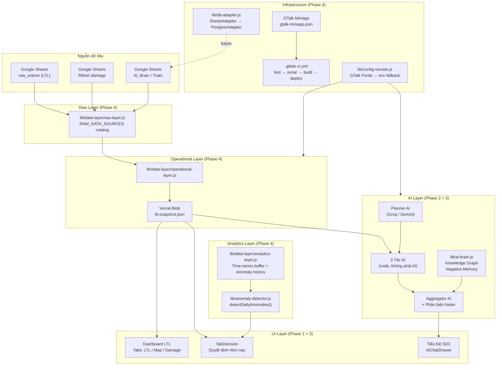

# SD3 Operations Intelligence System — Tổng kết 4 Phase Chuyển đổi

**Từ:** Dashboard báo cáo tĩnh (Google Sheets → Vercel)  
**Đến:** SD3 Control Tower — Hệ thống Vận hành Thông minh với AI, Anomaly Detection & GTalk Miniapp

---

## Kiến trúc tổng quan



---

## Phase 1 — LTL Dashboard Foundation

**Thời điểm:** Trước tháng 8/2026  
**Mục tiêu:** Xây dựng nền tảng dashboard theo dõi đơn hàng LTL Điện Máy khu vực SD3.

### Deliverables
| Component | Mô tả |
|---|---|
| `lib/ltl-snapshot.js` | Pipeline cào Google Sheets → Vercel Blob (~3x/ngày) |
| `lib/ltl-dashboard.js` | Transform + compute KPIs (on-time, damage, routes) |
| `lib/auth.js` | GHN SSO authentication với role-based access (manager/sd3/cs/client) |
| `pages/dashboard.js` | Dashboard đa tab: LTL, Map tỉnh thành, Hư hỏng & rủi ro |
| `components/FilterBar.js` | Bộ lọc dự án / tháng / chế độ |
| `lib/audit-log.js` | Ghi lịch sử hành động manager |

### Kết quả
- Dashboard báo cáo LTL real-time thay thế hoàn toàn báo cáo Excel tay
- Phân quyền 4 role: Manager (toàn bộ) / SD3 (đọc) / CS (đơn hàng) / Client (dự án riêng)
- Snapshot rebuild ~8 phút, cache 8h

---

## Phase 2 — Tiểu Đệ SD3 AI Multi-Agent

**Thời điểm:** Tháng 9/2026 (commit Kế hoạch F · F2, 02/10/2026)  
**Mục tiêu:** Thêm trợ lý AI Tiểu Đệ SD3 cho Manager và SD3.

### Kiến trúc Multi-Agent Pipeline
```
Câu hỏi
  → Planner AI (Groq fast, ~1s)       — phân loại intent, chọn tác tử
  → 3 Tác tử song song (code, ~0ms):
      Tác tử Số liệu   → đơn/tấn/on-time/routes từ snapshot
      Tác tử Hư hỏng   → ca Rillnet, chặng nghi vấn, tiền đền
      Tác tử Giải pháp → Sổ tay A/B trials (Manager/SD3 only)
  → Aggregator AI (chép số tác tử, KHÔNG tự tính)
  → Câu trả lời + Thẻ nguồn (system-generated)
```

### Deliverables
| Component | Mô tả |
|---|---|
| `lib/ai-agents/index.js` | Orchestrator pipeline (Planner → Agents → Aggregator) |
| `lib/ai-agents/planner.js` | Phân loại intent, xác định tác tử cần gọi |
| `lib/ai-agents/aggregator.js` | Viết câu trả lời — chống bịa số (7 quy tắc) |
| `lib/ai-agents/agent-numbers.js` | Tác tử Số liệu |
| `lib/ai-agents/agent-damage.js` | Tác tử Hư hỏng & rủi ro |
| `lib/ai-agents/agent-solutions.js` | Tác tử Giải pháp & mở rộng |
| `lib/ai-brain.js` | Bộ Não — học từ Q&A, Manager duyệt / bỏ |
| `lib/ai-providers.js` | Multi-provider fallback: Groq → Gemini 2.5 Flash → Groq lite → Gemini Lite |
| `components/AIChatDrawer.js` | Chat UI — "Gọi Tiểu Đệ SD3" |

### Kết quả
- 2 lần gọi AI/câu hỏi (fixed), thời gian trả lời ~5–12s
- Chống bịa số: 7 quy tắc cứng trong SYSTEM_PROMPT
- Fallback 4 provider — không bao giờ im lặng khi 1 provider lỗi
- Bộ Não: học từ cuộc hội thoại, Manager duyệt từng mục

---

## Phase 3 — Decision Intelligence Center + Knowledge Graph

**Thời điểm:** Tháng 10/2026  
**Mục tiêu:** Chuyển từ "báo cáo bị động" sang "quyết định chủ động" và nâng cấp AI với bộ nhớ có cấu trúc.

### Decision Intelligence Center
| Component | Mô tả |
|---|---|
| `components/TabDecision.js` | Tab "Quyết định hôm nay" — first tab cho Manager/SD3 |
| `lib/anomaly-detector.js` | Phát hiện 3 loại bất thường: Risk / SLA / Cost |
| `lib/data-sanitizer.js` | Làm sạch dữ liệu trước khi inject vào AI |
| `pages/api/data.js` (part=decision) | Endpoint trả anomalies + health summary |

**Cơ chế Anomaly Detection:**
- So sánh 7 ngày gần nhất (current) vs. 28 ngày trước (baseline)
- Risk: tỷ lệ hư hỏng tăng đột biến theo tỉnh (ngưỡng +30%)
- SLA: on-time sụt giảm theo khách hàng (ngưỡng -3 điểm %)
- Cost: chi phí đền bù tăng đột biến theo khách (ngưỡng +50%)
- Kết quả: top-3 anomalies, kèm "Đề xuất hành động" + tạo Trial

### Knowledge Graph & Negative Memory
| Thêm vào `lib/ai-brain.js` | Mô tả |
|---|---|
| `BRAIN_TYPES.NEGATIVE` | Type mới: điều AI tuyệt đối không làm |
| `KNOWLEDGE_OUTCOME` | Constants: CONFIRMED_SUCCESS / REJECTED |
| `parseKnowledgeObject()` | Map brain row → Knowledge Object schema |
| `getNegativeMemories()` | Trả về corrections/negatives đã duyệt (Knowledge Objects) |
| `getConfirmedKnowledge()` | Entries đã duyệt confidence ≥ 0.8 |
| `loadBrain()` mới | Tách "BỘ NHỚ TIÊU CỰC" ra block riêng trong system prompt |

**Structured Aggregator Output (Aggregator v2):**
> Sau câu trả lời: `📎 **Phản biện:** [hạn chế cụ thể] · **Độ tin cậy:** X%`
> Ngưỡng: ≥90% mẫu lớn + fresh; 70–89% trung bình; <70% nhỏ/xung đột

---

## Phase 4 — Data Layer Decoupling & GTalk Miniapp Framework

**Thời điểm:** Tháng 10/2026 (commit hiện tại)  
**Mục tiêu:** Chuẩn hóa kiến trúc dữ liệu, sẵn sàng đưa lên GitLab nội bộ và phát hành GTalk Miniapp.

### Data Layer Abstraction
| File | Mô tả |
|---|---|
| `lib/data-layer/raw-layer.js` | Catalog nguồn dữ liệu thô, migration candidates |
| `lib/data-layer/operational-layer.js` | Re-export ltl-snapshot với layer context |
| `lib/data-layer/analytics-layer.js` | Time-series buffer (in-memory → PostgreSQL future) |
| `lib/data-layer/index.js` | Public API: `raw`, `operational`, `analytics` |
| `lib/db-adapter.js` | DAO interface: SheetsAdapter (hiện) + PostgresAdapter (stub) |

**Design constraint:** Không sửa bất kỳ `pages/api/*.js` nào. Migration path rõ ràng từng bảng.

**Bảng ưu tiên migrate ra khỏi Google Sheets:**
| Bảng | Lý do | Target |
|---|---|---|
| Users/Sessions | Lookup mỗi request | PostgreSQL/Supabase |
| AuditLog | Append-only, không cần đọc lại nhiều | PostgreSQL |
| ActionTrials | Update thường xuyên khi trial chạy | PostgreSQL |
| AI_Brain | Write mỗi chat session | PostgreSQL |

### CI/CD & SonarQube
| File | Mô tả |
|---|---|
| `.gitlab-ci.yml` | Pipeline 4 stages: test → sonar-scan → build → deploy |
| `.sonar-project.properties` | SonarQube project config (projectKey: miniapp-sd3-control-tower) |

**Pipeline flow:**
```
Push / MR → lint + unit-test → sonar-scan (allow_failure) → build → deploy-preview
           main branch only → build → deploy-production (manual approval)
```

### GTalk Miniapp Framework
| File | Mô tả |
|---|---|
| `gtalk-miniapp.json` | Manifest: appId, category, platforms, auth, features, secrets |
| `lib/config-secrets.js` | Secret Manager: GTalk Portal (stub) → process.env |

**Secret priority chain:**
```
1. GTalk Secret Portal (khi GTALK_SECRET_PORTAL_URL có sẵn)
   → fetch /api/secrets/{KEY} với Bearer token
2. process.env (Vercel Environment Variables) — fallback hiện tại
```

---

## Tổng kết — Trạng thái hệ thống sau 4 Phase

### Files & Code
| Hạng mục | Số lượng |
|---|---|
| Files tạo mới (Phase 4) | 10 |
| Files sửa đổi (Phase 4) | 0 (đúng design constraint) |
| Tổng lib/ files | ~55 |
| API routes | ~25 |
| Components | ~30 |

### Chất lượng
- `npm run build`: 0 errors · 0 warnings (verified)
- Anti-hallucination rules: 7 quy tắc cứng trong Aggregator
- Negative Memory: tách biệt khỏi approved knowledge, inject cuối system prompt
- Security: `Cache-Control: private, no-store` trên data API (sự cố CDN leak 26/09 đã fix)

### Hạn chế đã biết (planned cho Phase 5)
1. **Time-series analytics**: in-memory buffer reset khi cold start → cần PostgreSQL
2. **Google Sheets write latency**: AI_Brain/Trials append ~500ms/write → cần migrate
3. **GTalk Secret Portal**: stub chưa có real integration → cần Portal API spec từ GHN
4. **SonarQube**: `allow_failure: true` — chưa chạy trên CI thật → cần SONAR_HOST_URL thật
5. **PostgresAdapter**: class rỗng → cần cài `@supabase/supabase-js` và SUPABASE_URL

---

## Roadmap Phase 5 (đề xuất)

- Migrate AI_Brain + ActionTrials sang Supabase (dùng `PostgresAdapter`)
- Kết nối GTalk Secret Portal thật (thay stub trong `config-secrets.js`)
- Bật GTalk Miniapp trên Tab Vận Hành SD3
- Thêm time-series persistence cho `analytics-layer.js` (anomaly trend charts)
- Native mobile UI optimization (viewport mobile-first cho GTalk in-app browser)
