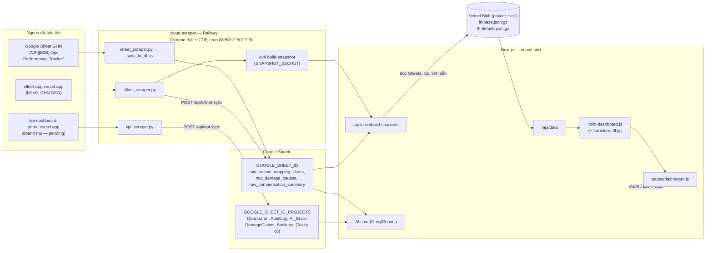

# SD3 Dashboard Điện Máy — Đặc tả toàn hệ thống

> **Mục đích của file này**: đây là TÀI LIỆU DUY NHẤT cần đọc để hiểu dự án đang làm gì, đang ở trạng thái nào, và tái tạo lại toàn bộ hệ thống từ đầu — không cần đọc code trước. Viết cho 3 đối tượng: (1) quản lý muốn nắm tiến độ, (2) người mới join team, (3) 1 AI coding agent được giao tiếp quản/build lại hệ thống. Mọi con số, tên sheet, công thức, ngưỡng nghiệp vụ lấy TRỰC TIẾP từ code thật đang chạy production — không suy đoán. Nếu code thay đổi mà file này chưa cập nhật, tin code, không tin file.
>
> - Tạo lần đầu: 2026-09-21. Cập nhật lớn: 2026-09-26 (sáng — bổ sung trạng thái/lịch sử/runbook).
> - **Cập nhật lần cuối: 2026-09-27** — bể vỡ: bấm xem mã đơn/tuyến/ngày tạo, mẫu số GTC, gợi ý insight tự viết (mục 8.0b); chốt tạm W38–W39 + lịch tự chốt 09:15 28/09; kỳ 2 tuần chỉ kết thúc ở tuần lẻ, báo cáo ở tuần chẵn (W40 = W38–W39); kỳ 2 tuần mang tên cả 2 tuần ("W38–W39 (14/09–27/09)", mục 8.0b); chốt lại W37 + tháng 08 lúc 14:22 (bảng "Các kỳ đã chốt", mục 8.0b); tab "Báo cáo công ty" + chọn khách key account (mục 8.0b); sự cố #33 (sheet tự đảo ngày/tháng `case_date` → ghi `RAW`), ghi chú cách gán tuần trong báo cáo Excel, chốt lại W37.
> - Cập nhật 2026-09-26 (chiều) — sau đợt tái cấu trúc "chỉ còn LTL": xoá FTL / Vận hành SD3 / Tách chuyến, dữ liệu chạy qua snapshot Vercel Blob, máy chủ chuyển sang Singapore, giao diện phẳng màu cam GHN, vá lỗ hổng CDN. Sửa lại chỗ ghi sai trước đây về nguồn `raw_ontime` (mục 4).

---

## Mục lục

1. [Hệ thống này là gì](#1-hệ-thống-này-là-gì)
2. [Trạng thái hiện tại](#2-trạng-thái-hiện-tại-26092026)
3. [Kiến trúc tổng thể](#3-kiến-trúc-tổng-thể)
4. [Google Sheets](#4-google-sheets)
5. [Snapshot LTL trên Vercel Blob](#5-snapshot-ltl-trên-vercel-blob)
6. [cloud-scraper (Railway)](#6-cloud-scraper-railway)
7. [Auth & phân quyền](#7-auth--phân-quyền)
8. [Tính năng](#8-tính-năng)
9. [AI Assistant "Tiểu Đệ SD3"](#9-ai-assistant--tiểu-đệ-sd3)
10. [Danh sách API](#10-danh-sách-api)
11. [Cấu trúc thư mục](#11-cấu-trúc-thư-mục)
12. [Luật nghiệp vụ & công thức](#12-luật-nghiệp-vụ--công-thức)
13. [Cache & hiệu năng](#13-cache--hiệu-năng)
14. [Biến môi trường](#14-biến-môi-trường)
15. [Triển khai](#15-triển-khai)
16. [Runbook vận hành](#16-runbook-vận-hành)
17. [Sự cố thật đã gặp](#17-sự-cố-thật-đã-gặp)
18. [Lịch sử dự án](#18-lịch-sử-dự-án)
19. [Việc đang mở](#19-việc-đang-mở)
20. [Dự án anh em: booking-ftl-tool](#20-dự-án-anh-em-booking-ftl-tool)
21. [Nếu build lại từ đầu](#21-nếu-build-lại-từ-đầu)

---

## 1. Hệ thống này là gì

**Tên**: "SD3 - Dashboard Điện Máy" — Vercel project `logicore-app`, production `https://logicore-app.vercel.app`. Tagline trang login: *"Your loads. Our roads." / "Giao Hàng Nặng — Kênh Bán Lẻ Toàn Quốc."*

**Cho ai**: đội **SD3 (Solution Điện Máy) của GHN** — theo dõi vận hành **LTL** (giao hàng lẻ / last-mile) cho các khách bán lẻ điện máy (Samsung, LG, Aqua, Casper, Hisense, PSD, Nguyễn Kim, AUX, DigiWorld...). Chủ dự án: Nguyễn Thành Tân (manager SD3).

**Phạm vi (từ 26/09/2026): CHỈ vận hành LTL.** Các phân hệ FTL, "Vận hành SD3" (pipeline dự án + task) và "Tách chuyến" đã bị xoá theo yêu cầu user; code cũ còn trong git (commit trước `f5cc3a1`). Phần booking/điều xe FTL được phát triển ở dự án riêng (mục 20).

**Giải quyết:**
1. KPI on-time / late / hư hỏng theo dự án, tỉnh, kho, tháng — dữ liệu thô từ Google Sheets.
2. Truy vết hư hỏng/bể vỡ (Rillnet) và workflow khiếu nại.
3. Trợ lý AI chat trả lời câu hỏi vận hành LTL dựa trên số liệu thật, cấm tự suy đoán.

**Stack**: Next.js 16 (Pages Router, Turbopack) + React 19 + Tailwind 4 + Chart.js 4. **Không có SQL** — Google Sheets là nguồn thật; **Vercel Blob (private, `sin1`)** giữ snapshot đã lọc/tính sẵn để phục vụ nhanh. Sidecar `cloud-scraper/` trên Railway (Python + Node 20 + Chrome thật qua CDP) đồng bộ dữ liệu nguồn.

**Quy mô code**: ~10.500 dòng JS (lib + components + pages), 210 commit. File chính: `lib/transform-ltl.js` (1.203 — "bộ não" KPI), `components/ltl/LTLDashboard.js` (573), `pages/dashboard.js` (591), `lib/ltl-dashboard.js` (393), `lib/ltl-snapshot.js` (186).

> ⚠️ `AGENTS.md`: *"This is NOT the Next.js you know"* — đọc `node_modules/next/dist/docs/` trước khi viết code mới.

---

## 2. Trạng thái hiện tại (26/09/2026)

| Thành phần | Trạng thái | Chi tiết |
|---|---|---|
| Web app | 🟢 | Chạy ở **Singapore (`sin1`)**. `/api/data` trả ~80KB (nén), TTFB 0,3–0,6s khi ấm (đường mạng từ VN tới Vercel đã chiếm 0,2–0,4s), ~1,5s khi instance nguội. |
| Snapshot Blob | 🟢 | Dựng lại sau mỗi lần scraper sync (đã test), cron dự phòng 09:00/13:00/18:00, nút "Đồng bộ". ~13s/lần dựng; 686KB gzip. |
| Pipeline `raw_ontime` | 🟢 | Cron 3 lần/ngày chạy đều từ 17/09. |
| Nguồn GHN của `raw_ontime` | 🟠 Theo dõi | 24–25/09 có lúc số dòng nguồn đứng yên; 26/09 dữ liệu tháng 9 đã có 9.722 đơn — cần tiếp tục để ý. |
| Rillnet (bể vỡ) | 🟢 | Đăng nhập lại qua noVNC 26/09 16:10 (hết phiên từ 24/09 12:50); đồng bộ ok, 344 ca. Phiên GHN SSO ~7 ngày → theo dõi tab Trạng thái hệ thống. |
| KPI portal | ⏸️ PENDING | `kpi_scraper.py` lỗi từ 17/09; user yêu cầu để pending. Từ 26/09 không còn phần nào của dashboard dùng dữ liệu KPI/doanh thu (AI chat cũng đã bỏ). |
| Giám sát nguồn dữ liệu | 🟢 | Tab **"Trạng thái hệ thống"** (manager) + heartbeat scraper sau mỗi lần chạy (mục 8.4, 16.1). Test thật 26/09 15:36: raw_ontime ok, Rillnet + KPI `session_expired`. |
| Git | 🟢 | Đã commit và push lên GitHub (`main`); push tự kích hoạt Vercel deploy. |

**Số liệu mốc (26/09, sau khi sửa Hồng Đạt / FRT Digital / nhãn ngành DM):** Tổng đơn "Tất cả" = **33.474** = đúng tổng T7 (9.679) + T8 (13.731) + T9 (10.064), 28 dự án. **1.126 đơn chờ lấy** (1.044 `ready_to_pick` + 81 `picking`, không có ngày lấy) hiển thị riêng, đơn treo lâu nhất từ 06/08.

---

## 3. Kiến trúc tổng thể



**Luồng 1 request LTL:** `dashboard.js` → `GET /api/data?...` → check session (401 nếu không có) → nếu là **bộ lọc mặc định** và bản tính sẵn còn hợp lệ → trả ngay (chỉ gắn thông tin role) → ngược lại đọc snapshot BASE (bộ nhớ instance, kiểm tra ETag Blob mỗi 60s) → cache theo bộ lọc → `computeDashboard()` (join hư hỏng → lọc role/viewAs → lọc ngày → `transformLTL` → AI insights → delta KPI) → JSON.

**Backup**: `/api/cron/backup` (08:00 VN) snapshot `Data dự án`/`Users`/`Tasks` thành JSON vào tab `Backups` (giữ 30 ngày).

---

## 4. Google Sheets

(Chỉ tên biến môi trường. **Không tin ID trong file `.env*` ở máy local — đã lệch so với production.** Biến production là loại *Sensitive*, `vercel env pull` không đọc được giá trị — đúng thiết kế.)

| Biến | Vai trò | Tab |
|---|---|---|
| `GOOGLE_SHEET_ID` | Sheet chính, cũng là mặc định của `fetchSheet()` | **`raw_ontime`**, `mapping`, `Users`, `raw_damage_causes`, `raw_compensation_summary` (+ các tab FTL cũ không còn dùng: `raw_ftl_orders`, `FTLBookings`, `ftl_vehicle_caps`...) |
| `GOOGLE_SHEET_ID_PROJECTS` (fallback `SHEET_ID_PROJECTS` → `GOOGLE_SHEET_ID`) | Sheet nội bộ SD3 | `Data dự án` (AI chat đọc doanh thu), `AuditLog`, `AI_Brain`, `DamageClaims`, `Backups`, `Tasks` (không còn ghi) |
| `SHEET_ID_LTL` | **KHÔNG được set trên production** (xác nhận 26/09) | Code vẫn đọc `process.env.SHEET_ID_LTL` cho `raw_ontime`/`mapping`, nhưng vì trống nên rơi về `GOOGLE_SHEET_ID`. Bản spec cũ ghi `raw_ontime` nằm ở `SHEET_ID_LTL` là sai. |

- Trên Railway, `sync_to_db.js` ghi `raw_ontime` vào `GOOGLE_SHEET_ID` **của container Railway** — phải là cùng sheet với `GOOGLE_SHEET_ID` bên Vercel.
- `GOOGLE_SHEET_ID_FTL`, `NEXTAUTH_*`, `USERS_JSON` còn trong env nhưng code không dùng.

---

## 5. Snapshot LTL trên Vercel Blob

`lib/ltl-snapshot.js` + `pages/api/cron/build-snapshot.js`. Store: **`logicore-ltl-snapshot` (`store_iA2UA6agXztJbFo0`), private, region `sin1`**, token `BLOB_READ_WRITE_TOKEN` (tự gắn khi tạo store).

| Blob | Nội dung |
|---|---|
| `snapshots/ltl-base.json.gz` | Các dòng `raw_ontime` đã qua bộ lọc gốc (khách Điện Máy + từ 07/2026 + chỉ LTL — y hệt điều kiện `/api/data` luôn dùng), **chỉ giữ 17 cột mà công thức đọc** (`LTL_COLUMNS`), dạng cột; kèm `mapping`, `raw_damage_causes`, `raw_compensation_summary`, `builtAt`, `sourceRowCount`. ~33.6k dòng, ~686KB gzip. |
| `snapshots/ltl-default.json.gz` | Response đầy đủ của bộ lọc mặc định (Tất cả / ngày lấy / MTD / không viewAs), ~117KB gzip, gắn `__deployment` = mã deploy đã tính nó. |

**Dựng lại** (`buildLtlSnapshot`): xoá cache → đọc Sheets mới → lọc → tính bản mặc định bằng CHÍNH `computeDashboard` → ghi 2 blob. Kích hoạt bởi: scraper Railway sau mỗi lần sync (header `x-snapshot-secret`), Vercel Cron (Bearer `CRON_SECRET`), nút "Đồng bộ Google Sheet" (`/api/data?force=true`).

**Đọc**: mỗi instance giữ snapshot trong bộ nhớ, mỗi 60s kiểm tra lại bằng ETag (304 = không tải lại). Bản mặc định bị bỏ qua (tính trực tiếp) nếu: dựng từ ngày hôm trước (giờ VN — vì so sánh cùng kỳ tính theo "hôm nay") hoặc dựng bởi deploy khác (code có thể đã đổi dạng response).

**Chịu lỗi**: Blob không đọc/ghi được → vẫn phục vụ từ bộ nhớ hoặc tính từ Sheets (chậm nhưng không sập).

**Đã kiểm chứng (26/09)**: kết quả từ snapshot khớp tuyệt đối với đọc thẳng Sheets đủ cột trên 11 tổ hợp bộ lọc; so với bản code cũ, mọi trường `ltl`/`overview` giống hệt ở các bộ lọc tháng/ngày/ngày giao.

> Thêm cột mới vào công thức? **Phải thêm vào `LTL_COLUMNS`** (lib/ltl-snapshot.js), nếu không cột đó sẽ luôn rỗng.

---

## 6. cloud-scraper (Railway)

- Project `sd3-cloud-scraper`, service `sd3-cloud-scraper`, region `sfo`, volume `/data` (Chrome profile + log). Deploy bằng `railway up` trong `cloud-scraper/` (không theo git push).
- Container: Ubuntu 22.04, Google Chrome thật (`--remote-debugging-port=9222`, profile `/data/chrome-profile`), Xvfb + x11vnc + **noVNC** (`https://sd3-cloud-scraper-production.up.railway.app/vnc_auto.html`, mật khẩu = biến `VNC_PASSWORD`), Python 3 điều khiển Chrome qua **CDP websocket** (không Puppeteer), Node 20 cho script ghi Sheet.
- `crontab`: 08:50 / 12:50 / 17:50 → `run_scrapers.sh` chạy tuần tự `kpi_scraper.py` → `sheet_scraper.py` (+`sync_to_db.js`, merge theo `order_code` qua tab staging rồi swap nguyên tử) → `rillnet_scraper.py` → **gọi dựng snapshot** (`curl ... /api/cron/build-snapshot`, nếu có `SNAPSHOT_SECRET`). Mỗi bước `timeout 600`, chung lock `flock -w 1500`.
- Log: `/data/scraper_log.txt` (không hiện trong `railway logs`). Ping Telegram khi lỗi chỉ khi đã set `TELEGRAM_BOT_TOKEN` + `TELEGRAM_CHAT_ID`.
- Bước raw_ontime mất 4–6 phút là bình thường.
- **Đã tắt từ 27/08** (bị team tech GHN nhắc nhở): mọi script cào `portal.ghn.vn` (`ftl_scraper.py`, `ftl_enrich_vehicle.py`, `check_and_run_sync.sh`). Không bật lại, không tự vào portal nội bộ GHN bằng browser automation.
- **Điểm yếu cố hữu**: phiên đăng nhập trong Chrome tự hết hạn (Google, GHN SSO Rillnet ~7 ngày, KPI portal). Script không crash mà âm thầm không lấy được dữ liệu → cần người đăng nhập lại qua noVNC.

---

## 7. Auth & phân quyền

**Đăng nhập**: GHN SSO v2 (OIDC), tự viết bằng `iron-session` + `jose` (không dùng `next-auth`). `sso-login` → GHN → `sso-callback` (verify ID token qua JWKS, **cố ý không check `aud`** vì token GHN luôn `aud` rỗng; chống replay bằng `nonce`). Session: cookie `logi_session`, 8 giờ, mã hoá `SESSION_SECRET`.

**Vai trò** (tab `Users`, định danh theo `EmployeeId` = claim `sub`; manager có thể cấp quyền trước theo họ tên): `pending`, `manager`, `sd3`, `cs`. (`data.js` còn nhánh `client` — tàn dư.)

**Quyền tab**: `ALL_TABS = ["ltl"]` — 1 quyền duy nhất cho cả 3 góc nhìn LTL. Giá trị cũ trong ô `Tabs` (`operations`, `tachtrip`, `ftl`) được **tự quy đổi thành `ltl`** (`lib/users.js::normalizeTabs` + `LEGACY_TABS` trong `dashboard.js`) để tài khoản trước chỉ có tab FTL không bị khoá. `pending` → không vào được.
- Manager-only: Quản lý người dùng, Nhật ký hoạt động, Trạng thái hệ thống, Bộ não Tiểu Đệ, bộ chuyển góc nhìn (viewAs nhân sự/khách).
- `cs`: không AI chat (chặn cả server), không doanh thu.
- `/api/admin-users` (manager): gán role/tab/PIC, ghi Audit Log.

---

## 8. Tính năng

Thanh điều hướng: **Tổng quan LTL · Bản đồ tỉnh thành · Hư hỏng & Rủi ro** (dùng chung 1 lần tải `/api/data`, chuyển tab không gọi lại API) + Quản lý người dùng · Nhật ký · Trạng thái hệ thống · Bộ não Tiểu Đệ (manager). Bộ lọc chung: Ngày lấy / Ngày giao, tháng, dự án, điểm lấy (khi chọn 1 dự án), nhanh (Hôm nay / 3 / 7 ngày / Tháng này / Tất cả), khoảng ngày; nút "Đồng bộ Google Sheet".

### 8.0 Thanh công cụ chung (cả 3 góc nhìn LTL)
- **Lọc nhanh** (chốt 26/09): **⏰ Đến hạn hôm nay** (đơn đã lấy, chưa giao, hạn giao = hôm nay → mở danh sách `/api/data?dueToday=1`); **⚠ Tuyến rủi ro cao** (chuyển sang tab Hư hỏng, bật "chỉ tuyến rủi ro cao"); **📉 Dự án On-time < 90%** (tự chọn các dự án < 90% với ≥ 20 đơn đã đánh giá trong kỳ đang xem; bấm lần nữa để bỏ).
- **📄 Tạo báo cáo tóm tắt** (`components/ExecutiveReport.js`): trang nền trắng gồm 4 KPI + thay đổi, xu hướng theo tháng, "Điểm cần chú ý" (on-time giảm mạnh, đơn treo, đến hạn hôm nay, chờ lấy, tuyến bể vỡ cao, kho), top 10 dự án. Nút **In / Lưu PDF** (`window.print()`, CSS `@media print` chỉ in `.exec-report`, A4) và **Copy nội dung** (văn bản gạch đầu dòng để dán slide). Theo bộ lọc đang chọn, không gọi thêm API.

### 8.0b Báo cáo chất lượng cho công ty (Excel, 27/09)
**Tab "Báo cáo công ty"** (sidebar, Manager + SD3 — `components/TabCompanyReport.js`, thêm 27/09; nút cũ "📊 Xuất báo cáo" trong Tổng quan LTL giờ chỉ là lối tắt "📊 Báo cáo công ty" sang tab): chọn **loại** + **kỳ** + **khách**, xem trước 3 bảng (Ontime · Bể vỡ · Hàng hoàn) đúng như file Excel, tải Excel, chốt số, chuyển "Số mới nhất / Bản đã chốt", mục **"Số đã đổi kể từ lúc chốt"** (so bản chốt với số mới nhất cùng bộ khách, liệt kê từng ô), danh sách các kỳ đã chốt.
- **Chọn khách key account** (user chốt 27/09: công ty chỉ xem 1 hoặc vài khách, không xem tổng ngành): `&clients=LG LTL|Aqua B2C` → **cả 3 bảng** chỉ hiện các khách đó (B2B trước, B2C sau), bỏ "Khác" và tổng B2B/B2C; dòng cuối **"Tổng khách đã chọn"** chỉ cộng họ — bể vỡ = Σ ca / Σ GTC của chính các khách đó (% từng khách luôn = ca của khách / GTC của chính khách). Không truyền `clients` = **Mẫu đầy đủ** (bố cục báo cáo gốc; dòng tổng bể vỡ cũng mang tên "Tổng khách đã chọn" vì chỉ cộng 7 khách của bảng). Báo cáo trả thêm `selection` + `clientOptions` (mọi khách Điện máy có đơn trong các cột, xếp theo số đơn). **1 kỳ = 1 bản chốt**, lưu kèm bộ khách; chốt lại với bộ khác = ghi đè. Excel ghi "Khách: …" ở phụ đề + ghi chú dòng tổng; sheet Chi tiết lọc theo khách.
- **Bể vỡ — xem sâu + gợi ý insight** (user duyệt 27/09, trả lời 4 câu: "đơn tạo tuần nào? tuyến/kho nào? bấm xem mã đơn? 1 ca 3% thì GTC bao nhiêu?"):
  - **Bấm số ca** trong bảng Bể vỡ của tab (1 ô khách × cột, tên khách = mọi cột, dòng tổng = mọi khách) → khung danh sách ca: mã đơn, ngày/tuần phát hiện, **ngày + tuần tạo** (`created_time`), tuần giao, trạng thái, **kho lấy (tỉnh) → kho giao (tỉnh)**, chặng nghi vấn, kho phát hiện, kg, đền bù/truy thu; dòng tóm tắt (đơn tạo tuần nào · kho lấy chính · chặng · số đơn hoàn) + nút copy mã đơn. Số ca liệt kê luôn = số trong ô (đã kiểm 212/212 ô trên 6 loại/kỳ). Ô tháng dùng `details.damageCasesMonthOnly` (ca chỉ thuộc cột tháng trước). Bản chốt cũ (chưa có `monday`/tuyến) vẫn tra theo ngày phát hiện, báo rõ khi thiếu danh sách ca.
  - **Mẫu số GTC**: mỗi ô % trên tab hiện kèm `ca/GTC`; GTC < 50 tô xám (có ca thì ⚠). Excel: bảng Bể vỡ thêm khối **"# GTC (đơn giao thành công — mẫu số)"** bên phải (sau khối %, không đổi vị trí các cột cũ).
  - **Gợi ý insight** (`report.insights.damage`, hàm `damageInsights` trong `lib/biweekly-report.js`): **viết theo mẫu câu cố định từ số đã tính, KHÔNG dùng AI** (tránh bịa số — sự cố #9, #30). Kỳ trọng tâm: 2 tuần (2 tuần cuối vs 2 tuần trước), tuần (tuần cuối vs tuần trước), tháng (tháng chọn vs tháng trước). Mỗi khách có ca: số ca + % trên GTC, so kỳ trước, đơn tạo tuần nào (đánh dấu đơn tạo trước kỳ = phát hiện muộn), kho lấy, tuyến lặp lại (≥ 2 ca), kho phát hiện, chặng nghi vấn, số đơn đã hoàn, đền bù/truy thu, cảnh báo mẫu số nhỏ (GTC < 50). Hiện trên tab (nút copy) và **điền sẵn vào sheet Insight** mục "Bể vỡ và đền bù" với dòng "Gợi ý của hệ thống … kiểm tra, sửa hoặc xoá trước khi gửi"; ô trống "Nhận định của bạn" vẫn giữ.
  - **Excel sheet Chi tiết**: 19 cột — thêm Ngày tạo, Tuần tạo, Kho lấy, Tỉnh lấy, Kho giao, Tỉnh giao, Kg; xếp theo khách rồi tuần.
  - Lưu ý code (lỗi bắt được khi tự test 27/09, trước khi deploy): ô đang chọn gắn với đúng báo cáo lúc bấm (`pickState.report === shown`). Không lưu chỉ số dòng/cột trơn — đổi Tháng (7 cột) → 2 tuần (4 cột) sẽ trỏ vào cột không tồn tại và làm treo tab.
  - Đợt này chỉ làm Bể vỡ; Ontime (khách/tuyến trễ) và Hàng hoàn chưa có xem sâu/gợi ý (để đợt sau nếu user cần).
- API: `/api/report/biweekly?type=week|biweekly|month&period=2026-W38|2026-08` trả `.xlsx` (`&format=json` để xem/đối chiếu).
- **Tuần**: 4 tuần ISO gần nhất (tuần chọn là cuối) + cột **±** so tuần trước (số đơn: % thay đổi; tỷ lệ: điểm, xanh = tốt / đỏ = xấu).
- **2 tuần**: tháng trước + 3 tuần (Ontime, Hàng hoàn), 4 tuần (Bể vỡ) — đúng bố cục báo cáo gốc. Kỳ mang tên **cả 2 tuần** nó báo cáo (đổi 27/09 theo user): kỳ `2026-W39` = "Kỳ 2 tuần W38–W39 (14/09–27/09)" ở ô chọn kỳ, phụ đề Excel và sheet Insight. Bản chốt W37 tạo trước đó vẫn giữ tên cũ "Kỳ 2 tuần đến W37". **Lịch kỳ (user chốt 27/09): báo cáo 2 tuần gửi ở TUẦN CHẴN, gồm số 2 tuần liền trước → kỳ luôn kết thúc ở tuần LẺ** (báo cáo W30 = W28–W29, …, báo cáo W40 = W38–W39). Ô chọn kỳ chỉ liệt kê kỳ tuần lẻ, dạng "Báo cáo W40 · W38–W39 (14/09 – 27/09)", bỏ kỳ trước 07/2026; kỳ mới xuất hiện từ 00:00 thứ 2 (giờ VN) của tuần báo cáo. API trả 400 nếu kỳ 2 tuần kết thúc ở tuần chẵn (`isBiweeklyEnd`); kỳ mặc định = kỳ lẻ gần nhất đã hết. Tên kỳ trong Excel: "Kỳ 2 tuần W38–W39 (14/09–27/09) · báo cáo W40". Loại Tuần/Tháng không bị giới hạn. ⚠️ Cuối năm 2026 có W53 (lẻ) và 2027-W01 cũng lẻ → hai kỳ liền nhau chồng 1 tuần; cần user chốt cách xử lý trước kỳ báo cáo cuối 12/2026. Chỉ đổi chữ hiển thị — mã kỳ (`period=2026-W39`), các cột và số không đổi; loại Tuần/Tháng giữ tên cũ. Code: `plan()` trong `lib/biweekly-report.js` (`periodLabel`) + `twoWeekName()` trong `components/TabCompanyReport.js` (ô chọn kỳ, dòng trạng thái, danh sách kỳ đã chốt). Đã kiểm tra cả kỳ vắt năm (W53–W1).
- **Tháng**: 3 tháng gần nhất (bỏ tháng trước 07/2026 — ngoài phạm vi dữ liệu) + các tuần của tháng chọn + cột ± so tháng trước. Mặc định = tháng gần nhất đã hết tuần.
- **Chốt số** (`POST` cùng tham số, `lib/report-locks.js`): lưu nguyên báo cáo vào Blob private `reports/{type}/{period}.json` (kèm người chốt, giờ chốt, ghi Nhật ký). Tải lại bằng `&version=locked` — file ghi "SỐ ĐÃ CHỐT lúc …", tên file có hậu tố `-da-chot`. Chốt lại = ghi đè (có xác nhận). `?list=1` liệt kê kỳ đã chốt. Lý do: số tuần gần nhất còn đổi (đơn giao/hoàn muộn, ca bể vỡ nhập muộn) — đối chiếu 27/09: W36 khớp gần hết báo cáo cũ, W37 lệch ở ontime/FD/bể vỡ vì báo cáo cũ chốt 14/09. Code: `lib/biweekly-report.js` (tính) + `lib/biweekly-xlsx.js` (exceljs). 6 sheet: **Ontime LTL** (tháng + 3 tuần) · **Bể vỡ** (4 tuần, kèm mục ghi chú **"CÁCH GÁN TUẦN"** — thêm 27/09 theo yêu cầu user: # đơn LTC theo ngày lấy, GTC theo ngày giao, ca bể theo ngày phát hiện; ví dụ "lấy W37, giao W38, phát hiện W38 → ca tính W38"; % bể là tỷ lệ tham chiếu theo tuần, không phải tỷ lệ bể của đúng các đơn giao tuần đó) · **Hàng hoàn** (tháng + 3 tuần) · **FTL** (khung trống, user tự điền — chưa có nguồn có hạn giao) · **Insight** (ô trống) · **Chi tiết** (ca bể vỡ + đơn FD; mỗi ca bể có **Tuần phát hiện · Tuần lấy · Tuần giao · Trạng thái đơn** để đối chiếu khi bị hỏi — W34–W37: 33/68 ca phát hiện ngay tuần lấy, 35 ca muộn 1–5 tuần; 34/68 ca là đơn hoàn, không nằm trong GTC). Tuần < 7 ngày sau khi kết thúc gắn `*` (chưa chốt).
- **Các kỳ đã chốt (tính đến 27/09):**
  | Kỳ | Chốt lúc (giờ VN) | Bộ khách | Ghi chú |
  |---|---|---|---|
  | 2 tuần W37 (07–13/09) | **14:22 27/09** | Mẫu đầy đủ | Lần 3. Lần 1 (13:27) sai Aqua W37 = 5 do lỗi đảo ngày (sự cố #33); lần 2 (13:48) đúng số (tổng bể vỡ W34–W37 = 24/21/8/15) nhưng dòng tổng còn tên cũ "Tổng Điện máy". Lần 3 chỉ đổi tên dòng tổng thành "Tổng khách đã chọn" + thêm ghi chú mới — số giữ nguyên. |
  | Tháng 08/2026 (W32–W36) | **14:22 27/09** | Mẫu đầy đủ | Lần 2. Lần 1 (14:01) đúng số, dòng tổng còn tên cũ. Lần 2 chỉ đổi tên + ghi chú — số giữ nguyên (bể vỡ tháng 07/08 = 30/85). |
  | 2 tuần W38–W39 (14–27/09, báo cáo W40) | 14:54 27/09 (**tạm**) | Mẫu đầy đủ | Chốt tạm theo yêu cầu user (dữ liệu đến 13:58, W39 chưa hết). **Bản cuối: lịch tự chốt 09:15 T2 28/09** (scheduled task `chot-so-w38-w39`, script `D:/Điện Máy/.claude/report-lock/lock_and_verify.cjs`): chờ lần đồng bộ 08:50 xanh → chốt đè bản tạm → tự kiểm tra (bản chốt = số mới nhất, tổng/% tự khớp, tính lại độc lập từ snapshot, đọc lại từng ô Excel) → báo user. Không đè nếu user đã tự chốt sau 08:45 28/09; dữ liệu chưa về thì không chốt. |
  Kiểm tra mỗi lần chốt lại: số Ontime/Bể vỡ/Hàng hoàn + danh sách ca trong Chi tiết giống hệt bản trước, đọc lại file Excel khớp từng ô.

Định nghĩa — dò ngược từ báo cáo W35–W37 của user và đã khớp số thật:
- Tuần = ISO (T2–CN). Cột **"Tháng"** = các tuần ISO có **thứ 2 thuộc tháng** (2026-08 = W32–W36) → khớp tuyệt đối 7 khách. Tháng = tháng trước tháng của tuần kết thúc.
- **# đơn LTC** = đơn theo tuần của `pickup_time` (khớp tuyệt đối LG/Samsung/Aqua/Casper/PSD). **% ontime** = ontime/(ontime+late) **chỉ đơn đã giao**.
- Dòng **Khác** = khách ngoài danh sách, chia B2B/B2C theo `is_B2C` (snapshot có thêm cột `is_B2C`, `deliver_type`). Bảng Hàng hoàn tách riêng **Nguyễn Kim Miền Bắc** ở nhóm B2C (giống báo cáo gốc).
- **FD** = `deliver_type = return` theo tuần lấy; % FD = FD / # đơn LTC.
- **Bể vỡ** = `countedDamage` theo tuần của ngày phát hiện (`case_date`); % = ca / GTC (đơn đã giao theo tuần giao) — thống nhất cho mọi khách (báo cáo cũ có vài ô PSD/Casper/Digiworld không khớp mẫu số nào).
- Nguồn FTL đã xét: `raw_ftl_orders` ngừng từ 27/08; `ftl_order_history` (sheet Booking, Apps Script mỗi 2h) đếm được số đơn khớp báo cáo (bỏ "Hủy đơn", DGW tách cùng tỉnh/khác tỉnh) nhưng **không có hạn giao** → không tính ontime.

### 8.1 Tổng quan LTL (`view="ltl"`) — bố cục gọn lại 26/09 (khuya)
Thứ tự từ trên xuống:
1. **5 thẻ KPI** (`.grid-5`): Tổng đơn · **Khối lượng (tấn)** (mới, kèm kg/đơn) · On-time · Late · Ca hư hỏng. Mỗi thẻ có delta so kỳ trước (luật mục 12, delta KPI giờ có cả `weight`) và **sparkline 7 ngày** (SVG nhẹ; 7 ngày lấy hàng gần nhất, theo dự án/điểm lấy/viewAs, không theo tháng; on-time/late 2 ngày cuối nét đứt; ca hỏng theo `case_date`).
2. **"Cần chú ý"**: 1 hàng 4 ô bấm được — Đến hạn giao hôm nay · Đơn treo quá hạn · Đơn chờ lấy · Dự án on-time giảm mạnh (mở danh sách). Thay cho 3 dải cảnh báo xếp chồng.
3. **Sản lượng & On-time theo tháng/tuần** (`VolumeTrendChart`): cột = **tổng đơn thật** (hoặc khối lượng, nút chuyển), đường = % on-time. Kỳ đang chạy tô nhạt, ghi "đến dd/mm" và **so cùng số ngày kỳ trước** (`periodComparison.overall`), không so với cả kỳ. (Biểu đồ cũ lấy ontime+late làm "số đơn" và so tháng dở dang với cả tháng trước → từng hiện T9 "−28%" trong khi cùng kỳ chỉ −5% đơn, +7% khối lượng.)
4. Bảng tuần theo khách (khi chọn 1 tháng).
5. **Biến động theo khách (so cùng kỳ)**: 4 ô tổng + chọn kỳ + Nhận định AI, rồi **bảng** `ClientChangeTable` với tab Giảm / Tăng / Mới-quay lại / Tất cả: đơn, tấn, kg/đơn, on-time, hư hỏng, ghi chú. Cờ **"🔎 Đơn giảm nhưng KL giữ — kiểm tra gộp đơn"**: đơn ≤ −30%, **kg/đơn tăng ≥ 2 lần**, khách ≥ 50 đơn kỳ trước (chỉ là gợi ý kiểm tra; luật cũ "KL giảm < 15%" bỏ vì sót PSD Miền Nam −16% KL, 28 → 128 kg/đơn). Thay lưới ~20 thẻ và banner khách mới.
6. **Hiệu suất dự án** (`ProjectPerformanceTable`): 1 bảng sắp xếp được (mặc định số đơn giảm dần) — đơn + tỷ trọng, tấn + tỷ trọng, on-time có thanh màu theo ngưỡng và vạch 90%, late, ca hỏng, ca/1.000 đơn. Thay 2 donut và biểu đồ "% Ontime theo dự án".

### 8.2 Bản đồ tỉnh thành (`view="map"`)
`ProvinceMapPanel` + `VietnamMap`: 4 chế độ tô màu (số đơn / tải trọng / ontime / hư hỏng; **không có CBM** vì dữ liệu không có thể tích), **🔥 Top 5 điểm nóng** (27/09, `damageRisk.hotspots`: tỉnh giao có on-time < 85% với ≥ 50 đơn đã đánh giá **hoặc** bể vỡ ≥ 2× TB với ≥ 2 ca; xếp theo số late + số ca hỏng; bấm → viền đỏ trên bản đồ qua lớp `selectedProvince` riêng, không vẽ lại 63 tỉnh), top tỉnh, bảng soi chi tiết khi rê chuột, tuyến lấy→giao khi lọc 1 dự án. Bấm tỉnh → modal danh sách đơn **tải riêng** qua `/api/data?province=`.

### 8.3 Hư hỏng & Rủi ro (`view="damage"`)
Nâng cấp 26/09 (`lib/damage-risk.js`, `components/ltl/damage/RouteRiskMatrix.js`):
- **Ma trận bể vỡ Kho lấy × Miền giao**: mỗi ô = số đơn có ca bể vỡ / số đơn lấy hàng trong kỳ, tô màu theo mức so với trung bình; ⚠ viền đỏ khi **≥ 2× trung bình và ≥ 20 đơn**. Hiện 15 kho nhiều ca nhất. Bấm ô → danh sách **tuyến Kho lấy → Tỉnh giao** (đơn, ca, tỷ lệ, chặng nghi vấn chính); nút "Chỉ tuyến rủi ro cao".
- **Rủi ro theo dự án**: ca bể vỡ / 1.000 đơn, thanh so sánh, ⚠ khi ≥ 2× trung bình và ≥ 20 đơn. **Widget tiền đền bù tự ẩn** khi mọi ca có số tiền = 0 (tình trạng hiện tại — user chốt "tạm ẩn").
- Đầu tab: **"Tổng quan bể vỡ"** — 4 ô (ca kỳ đang lọc + cùng kỳ, tỷ lệ TB, tuyến rủi ro, dự án rủi ro) + Nhận định AI + nguyên nhân theo chặng. Đã **bỏ** biểu đồ "Top 10 kho" (trộn late, không có mẫu số) và danh sách tuyến cũ của "Cảnh báo bể vỡ theo tuyến" (ngưỡng ≥ 5 đơn quá nhiễu).
- Ma trận có 3 chế độ: **Kho lấy × Miền giao / Kho giao × Miền lấy** (tỷ lệ %) và **Kho phát hiện × Miền giao** (27/09, chỉ **số ca** — kho phát hiện của Rillnet chỉ có ở đơn hỏng nên không có mẫu số); danh sách tuyến có cột **Gợi ý** (> 5% → "Cân nhắc FTL riêng", còn lại → "Kiểm tra đóng gói", chỉ với tuyến rủi ro cao). Tuyến rủi ro cao cần **≥ 2 ca** (`RISK_MIN_CASES = 2`, user chốt 26/09), tính theo bộ lọc đang chọn.
- **Chi tiết ca hư hỏng + pipeline khiếu nại**: dải 4 bước **Mới phát sinh → Đang xác minh lỗi → Đã chốt đền bù → Đã đóng** có đếm, bấm để lọc. Bấm dòng → **khung chi tiết** (tuyến, tỉnh, ngày lấy, trạng thái đơn, chặng nghi vấn, ngày ghi nhận, nguồn báo, trạng thái Rillnet, người phụ trách, **nhật ký ghi chú**). Lưu ghi thẳng vào tab `DamageClaims` (`/api/damage-claims`, ghi `RAW` để ghi chú không thành công thức). **Chỉ Manager + SD3 được sửa** (chặn ở server), vai trò khác chỉ xem.

### 8.4 Quản trị
Users (`TabUsers`), Audit log (`TabAuditLog`, append-only), AI Brain (`TabBrain`), **Trạng thái hệ thống** (`TabSystemHealth`, manager):
- Nguồn: `/api/system-health` = **heartbeat** (scraper `report_health.py` gửi kết quả từng bước sau mỗi lần chạy → `/api/scraper-heartbeat` → Blob private `health/scraper-status.json`, giữ 30 lần gần nhất) + **độ tươi dữ liệu** (snapshot `builtAt`, ngày lấy hàng mới nhất, `synced_at`/`case_date` Rillnet mới nhất).
- Thẻ: Scraper (đỏ nếu > 16 giờ không báo cáo), raw_ontime (đỏ nếu bước cuối hết phiên/lỗi hoặc lần ok cuối > 24 giờ; **vàng** nếu sheet nguồn GHN đứng yên số dòng ≥ 3 lần chạy trong 24 giờ), Rillnet (đỏ khi hết phiên, kèm "lỗi từ lúc nào"), KPI (hiện "Tạm dừng"), Snapshot (đỏ nếu > 24 giờ). Mỗi thẻ đỏ/vàng có hướng xử lý (link noVNC, nút "Đồng bộ ngay"). Bảng 10 lần chạy gần nhất.
- Phân loại bước trong `report_health.py` dựa trên dòng log thật: ok = `Successfully synced N rows` / `Da dong bo N ca be vo` / `Da khop va cap nhat N du an`; hết phiên = `ERROR:Failed to fetch`, `co the chua dang nhap`, `Parse duoc 0 khach hang`...; exit 124 = timeout 600s.

### 8.5 Giao diện
Phẳng, nền đặc, **màu nhấn cam GHN** (tối: `#f97316`; sáng: `#c2410c`; biến CSS vẫn tên `--cyan` vì lý do lịch sử), `--amber` đẩy về vàng để không lẫn với cam. Không `backdrop-filter`. Lần tải đầu: skeleton; đổi bộ lọc: giữ nội dung + thanh tiến trình mảnh; bỏ qua response cũ khi bấm nhanh. Chart.js tắt animation, cập nhật tại chỗ. Watchdog tự reload 1 lần nếu trang kẹt 8 giây.

---

## 9. AI Assistant — "Tiểu Đệ SD3"

Persona xưng "Tiểu Đệ", gọi user "Đại Ca". UI: `components/AIChatDrawer.js` (ẩn với `cs`) — chỉ còn khung chat, gợi ý câu hỏi về LTL.

- **Provider fallback** (`lib/ai-providers.js`): Groq `openai/gpt-oss-120b` → Gemini `gemini-2.5-flash` → Groq `openai/gpt-oss-20b` → Gemini `gemini-3.5-flash-lite`. `generateFast()` cho phân loại.
- **`/api/ai-chat` — 100% LTL (viết lại 26/09)**: đọc **cùng snapshot** với dashboard (`loadLtlBase` + bản mặc định tính sẵn / `computeDashboard`), không đọc Sheets trên đường chính. Router phân loại `ORDER_LOOKUP | ROUTE_COMPARE | DAMAGE_QUERY | DATA_QUERY | UNSUPPORTED | CHITCHAT`; công cụ còn tự bật theo tín hiệu cứng (có mã đơn, có tên tỉnh + "tuyến", từ khoá bể vỡ, "tuần"). Synthesizer nhận JSON nén: phạm vi dữ liệu + giờ cập nhật, tổng quan, theo tháng, so sánh cùng kỳ (**kèm `thayDoiDaTinhSan`** để AI không tự tính %), on-time giảm mạnh, đơn treo, đơn chờ lấy, theo dự án, top tuyến, kho cảnh báo; khi câu hỏi nêu tháng/dự án → `computeDashboard(kpiOnly)` đúng bộ lọc đó.
- **`UNSUPPORTED`** (FTL/chuyến xe, doanh thu/NSR/KPI doanh thu, dự báo, tạo/giao task) → câu trả lời cố định, **không gọi LLM**. Đã bỏ `Data dự án`, `PREDICTION`, danh sách PIC, log đăng nhập khỏi AI.
- **Tools** (`lib/ai-agent-tools.js`): `lookupOrders` (tra mã: trạng thái, hạn giao, SLA, số ngày treo, tuyến, kho, ca bể vỡ; không có → `timThay:false`), `compareRoutes` (tuyến giữa các tỉnh nêu trong câu: số đơn, tấn, on-time, late, bể vỡ, khách chính), `damageReport` (nguyên nhân Rillnet theo chặng/khách/kho), cùng `extractMonths`, `matchProjects`, `matchProvinces`. Role `client` bị khoá vào dự án của mình (kể cả tra mã).
- **Luật chống bịa số** (system prompt): chỉ dùng số trong JSON; không tự cộng/trừ/tính %; nêu rõ phạm vi; mã không có → nói không tìm thấy; thiếu → "chưa có số liệu". Hậu xử lý đổi "tôi" → "Tiểu Đệ" (model dự phòng hay lệch vai).
- **`lib/ai-brain.js`**: bộ nhớ tab `AI_Brain`, trích ≤3 insight/lượt, nạp top 30 (confidence ≥ 0,5).
- **`/api/ai-narrative`**: narrative từ JSON tính sẵn, chỉ chạy khi bấm; luật "CHỈ nhắc số liệu có trong JSON".
- **Đã gỡ**: `/api/ai-alert` (cảnh báo doanh thu dự án) và tab "So sánh tháng" trong khung chat.

---

## 10. Danh sách API

| Endpoint | Quyền | Chức năng |
|---|---|---|
| `/api/auth/sso-login`, `/api/auth/sso-callback`, `/api/logout` | — | GHN SSO |
| `/api/data` | session | Dữ liệu 3 góc nhìn LTL (kèm `stuck`, `anomalies`). `?province=X` → `{ok, provinceOrders}`; `?pendingPickup=1` → `{ok, pendingOrders}`; `?stuck=1` → `{ok, stuckOrders}`; `?force=true` → dựng lại snapshot trước. Header `Cache-Control: private, no-store` (BẮT BUỘC). |
| `/api/system-health` | manager | Trạng thái từng nguồn dữ liệu (mục 8.4) |
| `/api/report/biweekly` | **manager, sd3** | Báo cáo công ty (mục 8.0b): GET `?type&period[&clients=A|B][&version=locked][&format=json]` → xlsx/JSON; `?list=1`; POST = chốt số (lưu kèm bộ khách) |
| `/api/scraper-heartbeat` | `SNAPSHOT_SECRET` (`x-snapshot-secret`), POST | Nhận kết quả từng bước của scraper |
| `/api/cron/build-snapshot` | `CRON_SECRET` (Bearer) hoặc `SNAPSHOT_SECRET` (`x-snapshot-secret`) | Dựng lại snapshot Blob |
| `/api/cron/backup` | `CRON_SECRET` | Backup hằng ngày |
| `/api/ontime-by-project` | session | Ontime theo dự án (đọc Sheets trực tiếp) |
| `/api/damage-claims` | GET: session có tab LTL; POST: **manager, sd3** | Workflow khiếu nại: `{orderCode, status, assignee, note}` — `note` được **nối thêm** vào nhật ký (`[dd/mm hh:mm · Tên] ...`), đổi trạng thái tự ghi 1 dòng. Trạng thái cũ (Mới/Đang xử lý/Chờ đền bù/Hoàn tất) tự đổi 1-1 khi đọc. |
| `/api/kpi-sync`, `/api/kpi-sync-status` | `KPI_SYNC_SECRET` / session | Nhận & xem KPI sync |
| `/api/rillnet-sync` | `RILLNET_SYNC_SECRET` | Nhận dữ liệu Rillnet |
| `/api/admin-users`, `/api/audit-log` | manager | Quản trị |
| `/api/ai-chat`, `/api/ai-narrative`, `/api/ai-memory` | session, chặn `cs` | AI |
| `/api/hello` | public | Stub mặc định — có thể xoá |

---

## 11. Cấu trúc thư mục

```
nextjs-dashboard/
├─ pages/
│  ├─ dashboard.js          # Sidebar 3 view LTL + quản trị, filter, fetch (chống response cũ), skeleton
│  ├─ login.js
│  └─ api/                  # Mục 10
├─ components/
│  ├─ ltl/                  # LTLDashboard (view=ltl|map|damage) + charts/ cards/ tables/
│  ├─ KpiCard.js            # Thẻ KPI phẳng + delta + skeleton
│  ├─ VietnamMap.js         # Bản đồ SVG tối ưu (layer memo + overlay hover)
│  ├─ TabAIInsights.js      # Các section so sánh cùng kỳ / bể vỡ / khách mới
│  ├─ TabUsers.js, TabAuditLog.js, TabBrain.js, AIChatDrawer.js, FilterBar.js, ThemeToggle.js, TruckLoader.js
├─ lib/
│  ├─ sheets.js             # Đọc/ghi Sheets + cache Map 5 phút
│  ├─ ltl-snapshot.js       # Snapshot Blob: build/load/default body
│  ├─ ltl-dashboard.js      # computeDashboard (logic /api/data), đơn chờ lấy, delta KPI
│  ├─ transform-ltl.js      # Công thức KPI LTL
│  ├─ transform-ai-insights.js, dm-clients.js, vn-regions.js, csv-export.js
│  ├─ auth.js, sso.js, users.js, audit-log.js, backup.js, damage-claims.js
│  ├─ ai-*.js, kpi-sync.js, rillnet-sync.js
│  └─ prov-paths.json (37KB, 1 chữ số thập phân), centroids.json, backup-data.json (cũ)
├─ cloud-scraper/           # Mục 6 (còn script FTL cũ đã tắt cron)
├─ styles/globals.css       # Token sáng/tối, KPI, skeleton, progress
├─ vercel.json              # regions ["sin1"] + 4 cron
└─ SYSTEM_SPEC.md
```

---

## 12. Luật nghiệp vụ & công thức

**On-time** (`transform-ltl.js` §3.2): *"filter status='delivered' FIRST, then use odr_success flag / % Ontime = count(ontime) / count(odr_success IN ['ontime','late'])"*. Đơn chưa giao chỉ vào mẫu số nếu đã bị đánh `late`.

**Số đơn / khối lượng**: `COUNT(order_code)` theo `month(pickup_time)`; khối lượng lưu **gram**, chia 1000 ra kg khi hiển thị.

**Đơn chờ lấy (chưa chốt kỳ)** (chốt 26/09): đơn có `pickup_time` rỗng (thực tế `ready_to_pick`/`picking`). **Không tính** vào Tổng đơn, bản đồ, biểu đồ, danh sách tỉnh → "Tất cả" = tổng các tháng. Nhóm này lọc theo dự án/điểm lấy/viewAs, **không** theo tháng/ngày. **AI Insights vẫn nhận bộ đơn cũ (có cả nhóm này)** để tỉ lệ bể vỡ theo tuyến và logic "hàng chờ gần đầy xe" không đổi — vì vậy ở "Tất cả", tổng đơn trong khối bể vỡ (33.649) lớn hơn Tổng đơn KPI (32.524).

**Đơn treo / cần chú ý** (chốt 26/09, `stuckOverdueDays` trong `lib/ltl-dashboard.js`): có `pickup_time`, `status` ∉ {`delivered`, `returned`, `cancel`, `lost`, `damage`}, và **ngày hôm nay (giờ VN) > ngày `deadline_plus`**. `deadline_plus` chỉ là ngày (`"2026-08-18 0:00:00"`): giao **trong** ngày hạn vẫn là ontime — đã đối chiếu 31.450/31.450 đơn đã giao khớp `odr_success`. Vì vậy đây cũng chính là luật "late" GHN dùng cho đơn chưa giao, nhưng tính theo hôm nay chứ không theo lúc xuất sheet (cột `deadline` luôn trống, không dùng). `lost`/`damage` bị loại (user chốt 26/09: đã có kết cục, xử lý qua khiếu nại — 26 đơn); các trạng thái đang hoàn (`return`, `returning`, `waiting_to_return`...) **vẫn tính** là treo.

**Tuyến / dự án rủi ro bể vỡ** (chốt 26/09, `lib/damage-risk.js`): tỷ lệ = đơn có ca Rillnet (ghép theo mã đơn) / đơn lấy hàng trong bộ lọc — tính theo **đơn**, nên có thể lệch nhẹ so với thẻ "Ca hư hỏng" (lọc theo ngày ghi nhận ca). Rủi ro cao khi `rate ≥ RISK_RATE_MULTIPLIER (2) × trung bình`, `orders ≥ RISK_MIN_ORDERS (20)` và `damaged ≥ RISK_MIN_CASES (2)` — tính theo bộ lọc đang chọn. (Trước khi thêm ≥ 2 ca: 20 tuyến, đa số chỉ 1 ca; sau: 9.)

**Đến hạn hôm nay** (`isDueToday`): có `pickup_time`, trạng thái chưa kết thúc (cùng tập loại trừ với đơn treo), ngày `deadline_plus` = hôm nay (giờ VN).

**On-time giảm mạnh** (chốt 26/09, `projectDrops`): giảm ≥ `ANOMALY_DROP_POINTS=10` điểm, mỗi kỳ ≥ `ANOMALY_MIN_SAMPLE=5` đơn đã đánh giá; "kỳ trước" dùng chung với delta KPI (không lọc → `periodComparison.clients`; có lọc → `kpiOnly` của kỳ trước trả thêm `ontimeByProject`). Tính 1 lần trong `computeComparisons` cùng delta KPI.

**Delta KPI "so với kỳ trước"** (chốt 26/09 — theo bộ lọc đang chọn, `computeComparisons`):
- Không lọc tháng/ngày → dùng khối **So sánh cùng kỳ** (`periodComparison`, MTD hoặc block 1-3 tuần) — thẻ hiện "khoảng hiện tại: giá trị · so cùng kỳ ...".
- Tháng liền nhau → cùng số tháng ngay trước; nếu có tháng hiện tại thì kỳ trước cắt tới cùng ngày trong tháng.
- Khoảng ngày → khoảng cùng độ dài ngay trước.
- Kỳ trước bắt đầu trước 07/2026 → "ngoài phạm vi dữ liệu", không hiện số. Tháng rời nhau, hoặc "ngày giao" + "Tất cả" → không có delta.
- Đơn vị: số đơn / late / hư hỏng = %, on-time = điểm %. Màu: tăng đơn/tăng on-time = tốt; tăng late/tăng hư hỏng = xấu.

**Ca hư hỏng / đền bù / truy thu** (chốt 27/09 — theo đúng "Báo cáo bể vỡ" của Rillnet, `lib/damage-rules.js`): **ca hư hỏng** = ca có trong danh sách báo cáo (`counted = 1`: CS tick 💰 · đơn cũ bù tay · đã chốt tiền) — phiếu kho chưa thành ca (lưu từ giao diện cũ) vẫn ở sheet nhưng không tính; **đã chốt đền bù cho khách** = `_LB.tt[mã].chap_nhan_denbu === true` HOẶC `den_chot` (đúng hàm `_lbCndbRows` của trang); **truy thu** = `_LB.tt[mã].quyet_dinh` co/khong (chưa có = chờ chốt) + `tong_tien` — là tiền thu hồi từ bên gây lỗi, KHÔNG phải tiền đền cho khách (Rillnet chưa ghi tiền đền cho khách, trang "Tổng hợp" đền bù luôn = 0 nên không dùng nữa). Đối chiếu 27/09 (DM, 01/07–26/09): Rillnet 149 / 67 / 65 ca · 465.933.814đ — dashboard 148 / 67 / 65 · 465.933.814đ (lệch 1 ca Aqua `GYXG63UB` lấy hàng 26/06, ngoài phạm vi). Lưu ý tỷ lệ: Rillnet chia cho đơn đã giao/hoàn đúng những ngày có ca (149/8.754 = 1,70%), dashboard chia cho đơn lấy hàng.

**Lịch kỳ báo cáo 2 tuần** (user chốt 27/09, mục 8.0b): báo cáo gửi công ty ở **tuần chẵn**, gồm số **2 tuần liền trước** → kỳ luôn kết thúc ở **tuần lẻ**. Báo cáo W30 = W28–W29 · W32 = W30–W31 · … · W38 = W36–W37 · **W40 = W38–W39 (14/09–27/09)**. Mã kỳ = tuần cuối (`2026-W39`). Hệ thống chỉ cho chọn/tạo kỳ tuần lẻ (`isBiweeklyEnd` trong `lib/biweekly-report.js`; API trả 400 cho kỳ tuần chẵn). Tuần = ISO (T2–CN), mốc giờ VN.

**Ghi ngày vào Google Sheets** (chốt 27/09, sự cố #33): dữ liệu có ngày dạng chuỗi `dd/mm/yyyy` phải ghi bằng `valueInputOption: "RAW"`. `USER_ENTERED` để sheet (locale Mỹ) tự chuyển → ngày ≤ 12 bị đảo ngày/tháng. Mọi code đọc ngày chấp nhận cả `dd/mm/yyyy` lẫn `yyyy-mm-dd`.

**Hư hỏng (cũ, raw_damage)**: `so_tien_ket_luan > 0` → "Đền bù"; `case_status` "đền bù"/"đã đi tiền" → "Đền bù"; "từ chối" → "Đã xử lý (không đền bù)"; còn lại "Chưa xử lý".

**Cảnh báo kho**: code thật chấm theo số hư hỏng, top 10, `broken > 0`.

**Phạm vi khách Điện Máy** (`isDMRow`, chốt 26/09): đơn thuộc Điện Máy nếu **`nganh_hang = "DM"`** (nhãn ngành trong sheet nguồn — chuẩn chính, khách DM mới tự vào) **HOẶC** tên khách khớp danh sách `DM_LIST`/`DM_KEYWORDS` (dự phòng cho dòng `nganh_hang = #N/A`, ví dụ 225 đơn PSD Miền Nam). Các giá trị `nganh_hang` khác: STTP, NHC, Ecom — không thuộc SD3. Đối chiếu 26/09: 30 khách khớp hoàn toàn; Xiaomi/Honor KHÔNG gắn DM nên không tính.

**LTL vs FTL** (`isLTLRow`, sửa 26/09): luôn loại `FTL_ONLY_CLIENTS = {"Aqua B2B","LG Pantos","Aqua B2B FTL","LG Pantos FTL","Hisense FTL","Thợ ĐMX FTL"}`; `luong_hang = "LTL"` → tính; `"FTL"` → loại; **mọi giá trị khác** (trống, `#N/A`, `"PO"`, nhãn lạ sau này) → tính nếu `service_type = "lastmile"`.

**Cửa sổ dữ liệu**: `pickup_time >= 07/2026` (`isFromJuly2026`; chuỗi rỗng được cho qua — chính là nguồn gốc nhóm đơn chờ lấy).

**So sánh cùng kỳ**: MTD (đầu tháng → hôm nay, so cùng khoảng tháng trước) hoặc block 1-7/8-14/15-21/22-cuối. `PERIOD_MIN_SAMPLE=5`, `PERIOD_ONTIME_WARN_POINTS=5`, `PERIOD_ORDERS_WARN_PCT=20`, ⚠️ thêm nếu `damageCount>=3` hoặc hư hỏng mới.

**Sụt giảm liên tiếp**: đúng 3 tuần lịch giảm liên tục (`DECLINE_WEEKS_REQUIRED=3`, `LOOKBACK=4`), tuần đỉnh ≥5 đơn.

**AI Insights**: `TRUCK_5T_KG=5000`, `SPLIT_THRESHOLD=0.70`; bể vỡ tuyến >5% → "Cân nhắc FTL riêng", else "Kiểm tra đóng gói"; chỉ tuyến `total>=5` và `damaged>0`. **Tôn trọng đầy đủ bộ lọc tháng/ngày/điểm lấy** (sửa 26/09).

**Miền** (`vn-regions.js`): Bắc 25, Trung 20 (gồm Tây Nguyên), Nam 24; không khớp → "Khác".

**Tên khách hư hỏng**: ưu tiên `client_name` của `raw_ontime` khi join `order_code`.

---

## 13. Cache & hiệu năng

| Tầng | TTL / cơ chế |
|---|---|
| CDN | **Tắt** (`private, no-store`) — dữ liệu theo phiên, xem sự cố #23 |
| Bản mặc định tính sẵn (Blob) | Hợp lệ trong ngày VN + cùng deploy |
| Snapshot BASE (bộ nhớ instance) | Kiểm tra ETag Blob mỗi 60s |
| Full response theo bộ lọc | 5 phút, khoá có `builtAt` của snapshot |
| aiInsights / damageCauses / overview | 5 phút, khoá có `builtAt` + bộ lọc |
| `fetchSheet()` | 5 phút (chỉ còn dùng khi dựng snapshot, AI chat, ontime-by-project) |

Nguyên tắc: **không bao giờ gửi dữ liệu thô hàng chục nghìn dòng về trình duyệt**; drill-down dùng endpoint riêng. Bản đồ: 69 nút SVG, rê chuột ~9ms/lần. Chart.js không animation.

---

## 14. Biến môi trường

**Vercel:** `GOOGLE_SHEET_ID`, `GOOGLE_SHEET_ID_PROJECTS`/`SHEET_ID_PROJECTS`, `GOOGLE_SERVICE_ACCOUNT_KEY` (+`_FILE` khi dev), `GOOGLE_CALENDAR_ID` (không còn dùng), `SESSION_SECRET`, `GHN_SSO_ENV`, `GHN_SSO_CLIENT_ID`, `GHN_SSO_CLIENT_SECRET`, `GHN_SSO_REDIRECT_URI`, `GEMINI_API_KEY`, `GROQ_API_KEY`, `KPI_SYNC_SECRET`, `RILLNET_SYNC_SECRET`, `CRON_SECRET`, **`BLOB_READ_WRITE_TOKEN`**, **`SNAPSHOT_SECRET`**. Không set: `SHEET_ID_LTL`. Thừa: `GOOGLE_SHEET_ID_FTL`, `FTL_COST_SYNC_SECRET`, `NEXTAUTH_*`, `USERS_JSON`.

**Railway:** `GOOGLE_SHEET_ID`, `GOOGLE_SERVICE_ACCOUNT_KEY`, `KPI_SYNC_SECRET`, `RILLNET_SYNC_SECRET`, **`SNAPSHOT_SECRET`** (phải trùng Vercel), `VNC_PASSWORD`, `TELEGRAM_BOT_TOKEN`/`TELEGRAM_CHAT_ID` (tuỳ chọn). `CHROME_PROFILE_DIR` đặt sẵn trong Dockerfile.

---

## 15. Triển khai

- **Web**: `vercel --prod --yes` trong `nextjs-dashboard/` (production không phụ thuộc git push). Functions chạy **`sin1`** (`vercel.json → regions`). Sau deploy, bản mặc định tính sẵn tự bị bỏ qua cho tới lần dựng snapshot kế tiếp — muốn nhanh ngay thì bấm "Đồng bộ Google Sheet".
- **`vercel.json` cron** (UTC): backup `0 1 * * *`; build-snapshot `0 2`, `0 6`, `0 11 * * *` (= 09:00/13:00/18:00 VN).
- **Scraper**: `railway up` trong `cloud-scraper/` (~4 phút, volume `/data` giữ phiên đăng nhập).
- Deployment Protection đang bật cho URL deploy riêng; **không có** protection bypass token (đã thu hồi 26/09).

---

## 16. Runbook vận hành

### 16.1 Kiểm tra scraper
```bash
cd "D:\Điện Máy\nextjs-dashboard\cloud-scraper"
railway ssh "tail -n 80 /data/scraper_log.txt"
```
**Cách nhanh nhất:** mở tab **"Trạng thái hệ thống"** trên dashboard (manager). Xem log chi tiết khi cần:

Tốt: `Da khop va cap nhat N du an`, `Successfully synced N rows ... atomic swap`, `Da dong bo N ca be vo`, `{"ok":true,"builtAt":...}` (snapshot). Hết phiên: `Parse duoc 0 khach hang`, `ERROR:Failed to fetch`, `Khong tim thay nut ... chua dang nhap`.

### 16.2 Đăng nhập lại site trong Chrome của scraper
1. `railway variables` → lấy `VNC_PASSWORD`.
2. Mở `https://sd3-cloud-scraper-production.up.railway.app/vnc_auto.html`, nhập mật khẩu.
3. Trong Chrome ảo: raw_ontime → mở sheet nguồn (ID trong `sheet_scraper.py`) và đăng nhập Google; Rillnet → `rillnet-app.vercel.app` → "Đăng nhập bằng GHN SSO"; KPI → `kpi-dashboard-portal.vercel.app`.
4. Người thật tự nhập mật khẩu/OTP (AI không làm thay). Sau đó chạy 16.3.

### 16.3 Chạy thử scraper ngay
```bash
railway ssh "bash /app/run_scrapers.sh"
```
Không in ra terminal, mất ~5-7 phút, cuối cùng tự dựng lại snapshot. Xem kết quả bằng 16.1.

### 16.4 Dựng lại snapshot thủ công
Bấm **"Đồng bộ Google Sheet"** trên dashboard (khoảng 15-30 giây), hoặc từ container Railway:
```bash
railway ssh 'source /app/env.sh && curl -s -H "x-snapshot-secret: ${SNAPSHOT_SECRET}" https://logicore-app.vercel.app/api/cron/build-snapshot'
```

### 16.5 Deploy
```bash
cd "D:\Điện Máy\nextjs-dashboard"
npx next build
vercel --prod --yes
```
Deploy xong nên commit git ngay.

### 16.6 Kiểm tra API khi không đăng nhập SSO được (chỉ người bảo trì)
Tạo cookie `logi_session` bằng `sealData()` (iron-session) với `SESSION_SECRET`, gọi `https://logicore-app.vercel.app/api/*`. Không commit script chứa secret. Nếu dùng trong trình duyệt tích hợp, xoá cookie sau khi xong. Tránh `vercel curl` với URL deploy cũ — nó tự tạo protection bypass token.

---

## 17. Sự cố thật đã gặp

Đọc trước khi "tối ưu lại" bất cứ gì.

1. **Mất dữ liệu `raw_ontime` (fix 16/08)**: pipeline xoá-rồi-ghi → đơn rớt khỏi nguồn là mất vĩnh viễn. Sửa thành merge; cửa sổ dữ liệu khoá từ 07/2026.
2. **"#N/A" phân loại PSD**: loại âm thầm 2.619 đơn PSD. Fallback `service_type === "lastmile"`.
3. **Xoá dòng bằng `clear()` (17/08)**: dòng trắng làm `values.append()` ghi lệch cột.
4. **Lookup-key khi duyệt tài khoản (17/08)**: tách khoá tra và giá trị mới.
5. **`cs` thấy dashboard trống (17/08)**: tab `mapping` chưa cấu hình → `cs` giờ không scope.
6. **Alias email task chưa xác minh (17/08)** — lịch sử (task đã gỡ 26/09).
7. **Groq model bị deprecate (22/08)** + 3 tier Gemini trùng model → sập cả chuỗi AI.
8. **Groq vượt trần token**: JSON pretty-print 9.569 token > 8.000 TPM → dùng JSON nén.
9. **AI tự bịa số liệu** (lệch ~475 đơn) → luật cấm tự tính theo kỳ.
10. **Response 22MB (17/09)**: `/api/data` trả ~23k dòng thô cho 1 modal ít dùng. Tách `?province=`.
11. **2 script tranh 1 cổng Chrome (20-21/08)**: `flock -n` → bỏ qua sync. Dùng `flock -w 1500`.
12. **Nhầm `vehicle_capacity` / `requested_vehicle_type` (26/08)** — lịch sử FTL.
13. **Trạng thái đơn FTL kẹt "Đã tạo"** — lịch sử FTL.
14. **Tên khách FTL phân mảnh (25-26/08)** — lịch sử FTL.
15. **Khoá gom chuyến AQUA (27-29/08)** — lịch sử FTL/booking.
16. **Sync hư hỏng xoá-ghi-đè (22/08)**: sửa merge theo `order_code`.
17. **Log đăng nhập chỉ có từ 16/08.**
18. **Watchdog reload**: script inline reload 1 lần nếu `<main>` kẹt 8s.
19. **Phiên scraper hết hạn âm thầm (29/08 → 17/09, lặp 24/09)**: LTL đứng ~19 ngày, không ai được báo. Chỉ sửa được bằng đăng nhập lại qua noVNC.
20. **Cache nhầm khi tách `?province=` (17/09)**: drill-down bỏ qua cache full response.
21. **"Tất cả" ≠ tổng các tháng (22/09)**: 1.072 → 1.125 đơn không có ngày lấy. **Đã xử lý 26/09** (nhóm "Đơn chờ lấy").
22. **"Tưởng treo" khi chạy tay scraper**: bước raw_ontime mất vài phút là bình thường.
23. **Rò dữ liệu qua CDN (14/08 → 26/09)**: header `s-maxage=180` làm Vercel CDN trả response đã cache TRƯỚC khi kiểm tra đăng nhập — request **không cookie nhận đủ dữ liệu LTL (HTTP 200)**, user `cs` nhận nhầm payload của manager. Vá: `private, no-store`. **Không bao giờ bật cache dùng chung cho API cần đăng nhập.**
24. **Khối bể vỡ không theo bộ lọc tháng (có từ trước, sửa 26/09)**: khoá cache `aiInsights` thiếu tháng/ngày/chế độ lọc/điểm lấy → hiện kết quả của bộ lọc được gọi đầu tiên sau khi instance khởi động (bản cũ tình cờ luôn hiện số tháng 7).
25. **Bản mặc định tính sẵn lỗi thời sau deploy (26/09)**: bản dựng bởi code cũ thiếu trường mới → gắn mã deploy, deploy khác thì bỏ qua.
26. **Hồng Đạt biến mất từ 08/2026 (phát hiện 26/09 nhờ user hỏi)**: nguồn đổi `luong_hang` của Hồng Đạt / Hồng Đạt MXT thành `"PO"`; code cũ loại mọi nhãn lạ → **743 đơn** (T8–T9 = 0 trên dashboard) dù toàn bộ là `lastmile`. Sửa: nhãn lạ xét theo `service_type`. Cùng lúc thêm FRT Digital (182 đơn, nhãn DM 100%, không khớp danh sách tên).
27. **Nhận diện khách bằng tên cứng bỏ sót khách mới (26/09)**: Naduco, Smartlink, Toàn Phát (tháng 9) có `nganh_hang = DM` nhưng không có trong `DM_LIST`. Chuyển sang `isDMRow` (nhãn ngành + tên dự phòng).
28. **`head()` Vercel Blob chậm ~0,5–1s (26/09)**: bản đầu `/api/system-health` gọi `head()` để lấy dung lượng snapshot → 1–4s. Bỏ `head()`, lấy dung lượng từ lần đọc/ghi blob của chính instance (`getBaseBlobBytes`); heartbeat cache 30s → ~0,27s khi ấm.
29. **`case_date` Rillnet đảo ngày/tháng ở dữ liệu cũ (phát hiện 26/09)**: ~17 ca đồng bộ ngày 31/08 lưu dạng ISO với ngày ↔ tháng bị đảo (nguồn "12/08" → `2026-12-08`). **Đã sửa 26/09**: thực tế 14 ca (đồng bộ 31/08, dạng ISO), đảo lại ngày/tháng trực tiếp trên sheet `raw_damage_causes` (khớp mốc giờ ticket trong cột `source`); các dòng ISO đồng bộ 17/08 vốn đúng, không đụng. Trang trạng thái vẫn bỏ qua ngày tương lai để phòng lặp lại. ⚠️ **Sửa tay này không bền — lỗi tái phát, gốc thật ở sự cố #33.**
32. **Đếm sai ca hư hỏng và đền bù (phát hiện 27/09 nhờ user đối chiếu với "Báo cáo bể vỡ")**: dashboard đếm mọi phiếu/ticket trong sheet (203 ca) thay vì ca bể vỡ của Rillnet (149), và lấy "đền bù" từ trang Tổng hợp (luôn 0) thay vì 67 đơn đã chốt. Sửa: scraper đọc thêm cờ từ trạng thái của chính trang (`_lbFilt(_lbAllRows())`, `_LB.tt` — là biến `let` cấp script, KHÔNG có trên `window`, và tải sau bảng nên phải chờ), ghi 6 cột mới `counted, compensated, comp_amount, truy_thu, truy_thu_amount, truy_thu_status`; mỗi lần chạy quét đủ từ 01/07 (`fullScan`) để trạng thái đền bù/truy thu luôn mới và ca rơi khỏi báo cáo bị bỏ `counted`. Nếu không đọc được cờ thì giữ giá trị cũ, không ghi đè bằng 0.
31. **Rillnet đổi giao diện, scraper âm thầm sót ca (~16/09 → phát hiện 27/09 nhờ user hỏi "T9 chỉ có LG?")**: (a) ô mã đơn dính huy hiệu/ngày (`GYYYFF7K16092026`) → không khớp đơn; (b) từ ~22/09 lệch cột → dòng rác (mã đơn = tên kho); (c) **bộ lọc ngày của trang mặc định chỉ HÔM NAY** → mỗi lần chạy chỉ lấy ca của ngày đó, ngày scraper hỏng/hết phiên là mất trắng. Sửa: đọc cột theo **tên tiêu đề**, khách lấy từ dòng nhóm `tr.lb-kgrp`, mã = token đầu ô "MÃ"; đặt khoảng ngày **21 ngày gần nhất** (`#lbFrom/#lbTo`, bộ lọc render chậm 5–12s nên thử tối đa 30s); `rillnet_scraper.py --from YYYY-MM-DD` để chạy bù. Phía app: `normalizeOrderCode` + `isGarbageDamageRow` trong `lib/rillnet-sync.js` tự làm sạch dữ liệu cũ mỗi lần đồng bộ; trang Trạng thái hệ thống báo vàng khi ≥ 2 ca 7 ngày qua sai định dạng. Chạy bù từ 01/07: 344 → **556 dòng**; ca Điện Máy **152 → 203**, T9 **22 → 54** (LG 41, Aqua 6, NK MB 2, PSD MN/MT, Casper, DigiWorld, NK MN mỗi khách 1).
30. **AI tự tính % thay đổi sai (26/09)**: model tự tính "giảm 8,4%" (đúng là −7%). Sửa: đưa sẵn `thayDoiDaTinhSan`, cấm tự tính % trong prompt.
33. **Google Sheet tự đảo ngày/tháng của `case_date` — gốc thật của #29 (phát hiện 27/09 khi soạn Q&A bể vỡ cho báo cáo 2 tuần W37)**: scraper gửi `case_date` dạng chuỗi `dd/mm/yyyy`, nhưng `syncDamageCauses` ghi bằng `valueInputOption: "USER_ENTERED"` → sheet (locale Mỹ) **hiểu mọi ngày ≤ 12 theo kiểu tháng/ngày**: `09/08/2026` (9/8) thành ô ngày 8/9, đọc lại ra `2026-09-08`. Ngày > 12 không đổi được nên giữ nguyên chuỗi → chỉ một phần ca bị lệch, rất khó thấy. Vì sync ghi lại toàn bộ sheet mỗi lần chạy, bản sửa tay ở #29 bị ghi đè ngay lần chạy sau (27/09 còn 15 ca `counted` lệch, vd `GYAMEE7D` ticket 09/08, đơn lấy/giao W32, bị tính vào W37).
    - **Hậu quả:** báo cáo 2 tuần W37 chốt lần đầu (13:27 27/09) có Aqua W37 = 5 (đúng 4), tổng 16 (đúng 15). Dashboard/biểu đồ theo ngày phát hiện cũng lệch ca sang tháng khác.
    - **Sửa (commit `2e4e66d`):** ghi dữ liệu `raw_damage_causes` bằng **`RAW`** (lưu nguyên chuỗi, sheet không tự chuyển kiểu). Chạy lại scraper (quét toàn bộ từ 01/07) → cả 499 ca `counted` về đúng `dd/mm/yyyy`; dựng lại snapshot; **chốt lại W37 lúc 13:48 27/09** (Aqua W37 = 4, khớp báo cáo cũ của user).
    - **Kiểm tra sau sửa:** 0 ca `counted` còn dạng ISO; 0 ca có ngày khớp kiểu đảo so với ngày ticket trong `source`; tính lại độc lập từ sheet gốc + snapshot khớp 100% bảng Bể vỡ (ca + GTC từng khách).
    - **27 dòng ISO còn lại (đã xử lý 27/09):** đều là phiếu "Kho báo" không `counted`, đồng bộ 17/08 bởi scraper đời cũ tự ghi ISO. Kiểm tra: 27 dòng giảm dần liền mạch 16/08 → 08/07 nếu giữ nguyên, còn nếu đảo thì ra ngày sau lần đồng bộ (vd 08/12) hoặc trước 07/2026 → **ngày vốn đúng, chỉ sai định dạng**. Đã đổi sang `dd/mm/yyyy` (ghi `RAW`, chỉ cột `case_date`, các cột khác giữ nguyên) → sheet giờ 556/556 dòng cùng một định dạng. Báo cáo W37, tháng 07, tháng 08 không đổi số.
    - **Không nhầm với:** 24 ca có ngày phát hiện **sau** ngày lập ticket (vd phát hiện 17/08, ticket 26/07) — đó là "ngày phát sinh sự vụ" CS nhập trên Rillnet, không phải lỗi đảo; báo cáo đi theo đúng ngày Rillnet nhóm ca.
    - **Luật rút ra:** ghi ngày/số dạng chuỗi vào Google Sheets **luôn dùng `RAW`**, không dùng `USER_ENTERED` (mục 12).

---

## 18. Lịch sử dự án

| Giai đoạn | Nội dung |
|---|---|
| 30/06 – 02/07 | Khởi tạo: Next.js + Google Sheets, LTL/FTL, Bản đồ & Tách chuyến, AI Insights tầng 1, Google OAuth. |
| 01/08 | Làm lại lớn: `raw_ontime`/`raw_damage`, chỉ khách Điện Máy, từ 07/2026; tab Vận hành SD3; rebrand GHN. |
| 02 – 04/08 | Đăng ký + duyệt, phân quyền tab, audit log, bản đồ tỉnh, theme sáng/tối, CSV, damage claims, KPI sync, backup, CI. |
| 05 – 07/08 | GHN SSO v2; sửa ontime; so sánh cùng kỳ; loại đơn FTL khỏi LTL; RR/NSR. |
| 09 – 11/08 | Tách component, sửa PIC, khoá doanh thu, cảnh báo sụt giảm, narrative AI. |
| 12 – 14/08 | AI "Tiểu Đệ SD3", AI Brain, cảnh báo chủ động; refresh 3 lần/ngày; CDN cache (→ gây sự cố #23); Rillnet sync. |
| 15 – 27/08 | Scraper lên Railway; xây tab FTL + Booking FTL; 27/08 ngừng cào portal.ghn.vn. |
| 29/08 – 17/09 | ⚠️ LTL + Rillnet đứng ~19 ngày (hết phiên scraper). |
| 17/09 | Sửa lag 25MB→1,44MB; đăng nhập lại scraper; KPI pending. |
| 21 – 22/09 | Tạo SYSTEM_SPEC; phát hiện lệch 1.072 đơn. |
| **26/09 — tái cấu trúc "chỉ LTL"** | Xoá FTL / Vận hành SD3 / Tách chuyến (54 file); vá rò dữ liệu CDN; snapshot Vercel Blob (dựng sau mỗi lần scraper sync); tách "Đơn chờ lấy"; delta KPI theo bộ lọc; sửa khối bể vỡ theo bộ lọc; chuyển sang Singapore; giao diện phẳng cam GHN, skeleton, Chart.js không animation, bản đồ tối ưu. Commit `90df799` → `ad9dca0`. Cuối ngày: sửa Hồng Đạt ("PO"), thêm FRT Digital, nhận diện khách theo `nganh_hang = DM`. |
| 26/09 (khuya) | Tab Hư hỏng: ma trận Kho lấy × Miền giao, tuyến rủi ro, rủi ro theo dự án, pipeline khiếu nại 4 bước + khung chi tiết (Manager/SD3 sửa); lọc nhanh; sparkline 7 ngày; báo cáo tóm tắt in/copy. |
| 27/09 | Sửa gốc lỗi đảo ngày `case_date` (sự cố #33); báo cáo công ty Excel 3 loại + **Chốt số**; tab **Báo cáo công ty** + chọn khách key account; lịch kỳ 2 tuần tuần lẻ / báo cáo tuần chẵn; chốt W37 (2 tuần) + tháng 08.; bể vỡ **xem sâu** (bấm số ca → mã đơn, tuyến, ngày tạo), mẫu số GTC, **gợi ý insight tự viết** (không AI); chốt tạm W38–W39 + lịch tự chốt bản cuối 09:15 28/09. |
| 26/09 (tối) | Tab **Trạng thái hệ thống** + heartbeat scraper; **Đơn treo / cần chú ý**; **On-time giảm mạnh**; **Tiểu Đệ 100% LTL** đọc snapshot, bỏ doanh thu/FTL/task. Commit `c65ce7f` + Phase C. |

---

## 19. Việc đang mở

**Vận hành (cần người):**
- [ ] KPI portal — **pending theo chỉ đạo user**.
- [ ] Theo dõi sheet nguồn raw_ontime có đứng không (24–25/09 từng có dấu hiệu).
- [ ] Rà 1.125 đơn chờ lấy — có đơn treo từ 06/08 (bên vận hành).

**Kỹ thuật:**
- [ ] Cấu hình `TELEGRAM_BOT_TOKEN` + `TELEGRAM_CHAT_ID` trên Railway để có cảnh báo khi scraper lỗi (tránh lặp sự cố #19).
- [ ] Chuyển `/api/ontime-by-project` sang đọc snapshot (AI chat đã chuyển 26/09).
- [ ] Dọn: script FTL cũ trong `cloud-scraper/`, `/api/hello`, `lib/backup-data.json`, biến env thừa (mục 14), tab Sheets FTL cũ, file rác gốc repo (`_tmp_populate_specs.mjs`, `test_groq_*.js`, `scripts/dump_0.csv`, `scripts/scraper_log.txt`).
- [ ] Đồng bộ lại các file `.env*` local với production (đang lệch).

**Báo cáo công ty (đang theo dõi):**
- [ ] **09:15 T2 28/09** — scheduled task `chot-so-w38-w39` tự chốt bản cuối kỳ W38–W39 (báo cáo W40), đè bản tạm 14:54 27/09. Kiểm tra kết quả lần chạy (mục Scheduled trong app); nếu báo "chưa sẵn sàng" (vd scraper hết phiên) → user đăng nhập lại qua noVNC rồi chốt tay. Script: `D:/Điện Máy/.claude/report-lock/lock_and_verify.cjs` (ngoài repo; `--dry` để chạy thử không chốt; thoát 0 = chốt + kiểm tra đạt, 2 = dữ liệu chưa về/không chốt, 3 = đã có người chốt/không đè, 1 = kiểm tra lỗi).
- [ ] Xem sâu + gợi ý insight cho **Ontime** (khách/tuyến trễ) và **Hàng hoàn** — chưa làm, chờ user yêu cầu.

**Cần user chốt:**
- [ ] **Kỳ báo cáo 2 tuần cuối năm 2026**: 2026 có 53 tuần ISO; W53 (28/12–03/01) và 2027-W01 (04/01–10/01) đều lẻ → theo luật tuần lẻ thì kỳ W52–W53 và kỳ W53–W1 chồng nhau 1 tuần, và không có "tuần 54" để báo cáo. Hỏi user trước kỳ báo cáo cuối 12/2026.

**Ý tưởng chưa làm:** đội Agent AI tự sửa lỗi/nâng cấp (từ audit 14/08) — cần chốt cơ chế duyệt trước.

---

## 20. Dự án anh em: booking-ftl-tool

`D:\Booking FTL Auto,sắp tuyến\booking-ftl-tool` — Next.js App Router + TypeScript, `booking-ftl-tool.vercel.app`, Google Sheets riêng. "FTL Control Tower": chuẩn hoá booking theo hãng, đề xuất xe, GSVT chốt xe, vận hành hằng ngày, ghép chuyến, xe khả dụng, portal NCC. Có `SYSTEM_SPEC.md` riêng; đang phát triển ở phiên làm việc khác — **không sửa chéo**.

---

## 21. Nếu build lại từ đầu

1. Đọc mục 1, 3, 4, 5.
2. `lib/sheets.js` (đọc/ghi + cache).
3. Auth (mục 7).
4. `lib/transform-ltl.js` đúng từng công thức mục 12 — đọc mục 17 trước khi "cải tiến".
5. `lib/ltl-dashboard.js` + `lib/ltl-snapshot.js` + `/api/data` — chỉ trả dữ liệu đã tổng hợp, `Cache-Control: private, no-store`.
6. `pages/dashboard.js` + `LTLDashboard` (3 view).
7. cloud-scraper (lock có chờ, merge thay vì ghi đè, gọi dựng snapshot, cảnh báo khi lỗi).
8. AI cuối cùng — chỉ đọc số đã tính sẵn.

---

*File do Claude khảo sát trực tiếp source code, git log, log scraper Railway và API production thật. Nếu hệ thống thay đổi, cập nhật file này cùng lúc.*
