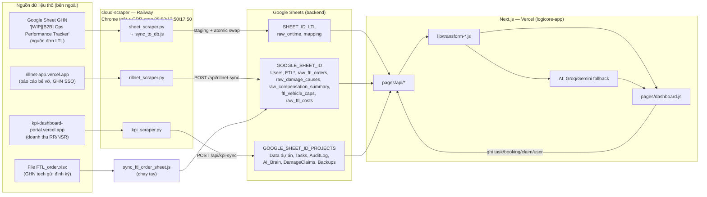

# SD3 Dashboard Điện Máy — Đặc tả toàn hệ thống

> **Mục đích của file này**: đây là TÀI LIỆU DUY NHẤT cần đọc để hiểu dự án đang làm gì, đang ở trạng thái nào, và tái tạo lại toàn bộ hệ thống từ đầu — không cần đọc code trước. Viết cho 3 đối tượng: (1) quản lý muốn nắm tiến độ, (2) người mới join team, (3) 1 AI coding agent được giao tiếp quản/build lại hệ thống. Mọi con số, tên sheet, công thức, ngưỡng nghiệp vụ lấy TRỰC TIẾP từ code thật đang chạy production — không suy đoán. Nếu code thay đổi mà file này chưa cập nhật, tin code, không tin file.
>
> - Tạo lần đầu: 2026-09-21 (khảo sát toàn bộ `D:\Điện Máy\nextjs-dashboard`).
> - **Cập nhật lần cuối: 2026-09-26** — sửa lại bản đồ Sheet/scraper cho đúng code, thêm: trạng thái hiện tại (mục 2), danh sách API (mục 9), runbook vận hành (mục 15), sự cố 19-22, lịch sử dự án (mục 17), việc đang mở (mục 18).

---

## Mục lục

1. [Hệ thống này là gì](#1-hệ-thống-này-là-gì-cho-ai-giải-quyết-vấn-đề-gì)
2. [Trạng thái hiện tại (snapshot 26/09/2026)](#2-trạng-thái-hiện-tại-snapshot-26092026)
3. [Kiến trúc tổng thể](#3-kiến-trúc-tổng-thể-data-flow)
4. [3 Google Sheet](#4-3-google-sheet-thật-đang-dùng)
5. [cloud-scraper (Railway)](#5-cloud-scraper--sidecar-cào-dữ-liệu-railway)
6. [Auth & phân quyền](#6-auth--phân-quyền)
7. [Danh mục tính năng](#7-danh-mục-tính-năng-đầy-đủ)
8. [AI Assistant "Tiểu Đệ SD3"](#8-ai-assistant--tiểu-đệ-sd3)
9. [Danh sách API](#9-danh-sách-api-pagesapi)
10. [Cấu trúc thư mục](#10-cấu-trúc-thư-mục--file-quan-trọng)
11. [Luật nghiệp vụ & công thức](#11-luật-nghiệp-vụ--công-thức--chép-nguyên-văn)
12. [Cache & hiệu năng](#12-cache--hiệu-năng)
13. [Biến môi trường](#13-biến-môi-trường-chỉ-tên)
14. [Triển khai](#14-triển-khai-deployment)
15. [Runbook vận hành](#15-runbook-vận-hành--làm-gì-khi-)
16. [Sự cố thật đã gặp](#16-sự-cố-thật-đã-gặp--lý-do-hệ-thống-làm-việc-theo-cách-này)
17. [Lịch sử dự án](#17-lịch-sử-dự-án-timeline)
18. [Việc đang mở / backlog](#18-việc-đang-mở--backlog)
19. [Dự án anh em: booking-ftl-tool](#19-dự-án-anh-em-booking-ftl-tool)
20. [Nếu build lại từ đầu](#20-nếu-build-lại-từ-đầu--thứ-tự-nên-làm)

---

## 1. Hệ thống này là gì, cho ai, giải quyết vấn đề gì

**Tên**: "SD3 - Dashboard Điện Máy" (Vercel project: `logicore-app`, URL production `https://logicore-app.vercel.app`). Tagline trang login: *"Your loads. Our roads." / "Giao Hàng Nặng — Kênh Bán Lẻ Toàn Quốc."*

**Cho ai**: đội **SD3 (Solution Điện Máy) của GHN (Giao Hàng Nhanh)** — quản lý vận hành logistics cho các khách bán lẻ điện máy (Samsung, LG, Aqua, Casper, Hisense, PSD, Nguyễn Kim, AUX, DigiWorld...) gồm cả **LTL** (hàng lẻ) lẫn **FTL** (nguyên chuyến xe tải). Chủ dự án: Nguyễn Thành Tân (manager SD3).

**Giải quyết 5 vấn đề chính:**
1. Theo dõi KPI on-time / hư hỏng / doanh thu theo từng dự án khách hàng, từ dữ liệu thô đồng bộ vào Google Sheets.
2. Theo dõi chuyến FTL + lên kế hoạch năng lực xe (loại xe nào, bao nhiêu xe/ngày, đi tỉnh nào).
3. Quản lý task/deadline nội bộ đội SD3 + pipeline onboarding dự án mới.
4. Truy vết nguyên nhân gốc hư hỏng/bể vỡ (từ Rillnet).
5. Trợ lý AI chat ("Tiểu Đệ SD3") trả lời câu hỏi vận hành/doanh thu dựa trên đúng dữ liệu thật, cấm tự suy đoán số liệu.

**Stack**: Next.js 16 (Pages Router, Turbopack) + React 19 + Tailwind CSS 4 + Chart.js 4 (`react-chartjs-2`, `chartjs-plugin-datalabels`), deploy Vercel. **KHÔNG có SQL database** — Google Sheets là backend thật duy nhất, truy cập qua service account (`googleapis`). Sidecar cào dữ liệu `cloud-scraper/` chạy riêng trên Railway (Python + Node 20 + Chrome thật điều khiển qua CDP).

**Quy mô code**: ~18.300 dòng JS (lib + components + pages). File lớn nhất: `components/TabFTL.js` (2.335 dòng), `lib/transform-ltl.js` (1.203), `components/TabTachTrip.js` (848), `lib/transform-ftl-live.js` (833). 204 commit git (30/06 → 27/08/2026).

> ⚠️ Lưu ý `AGENTS.md` trong repo: *"This is NOT the Next.js you know"* — phiên bản Next.js này có breaking changes so với kiến thức phổ thông, đọc `node_modules/next/dist/docs/` trước khi viết code mới.

---

## 2. Trạng thái hiện tại (snapshot 26/09/2026)

### 2.1 Sức khoẻ từng nguồn dữ liệu

| Nguồn / thành phần | Trạng thái | Chi tiết (kiểm tra trực tiếp 26/09) |
|---|---|---|
| Web app (Vercel) | 🟢 Ổn | `/api/data` ~1,4MB, 0,4–0,8s khi cache ấm (trước 17/09: 25MB / 12s). |
| Pipeline `raw_ontime` (LTL) | 🟢 Chạy đều | Cron 3 lần/ngày thành công liên tục từ 17/09. Lần sync 26/09 08:50: 170.818 dòng trong DB sheet. |
| **Nguồn GHN của `raw_ontime`** | 🟠 **Nghi đứng từ ~25/09** | Số dòng đọc từ sheet nguồn giữ nguyên **126.220** qua 3 lần chạy liên tiếp (25/09 12:50 → 26/09 08:50). Dashboard: 24/09 = 1.044 đơn, **25/09 = 1 đơn, 26/09 = 0 đơn**. Pipeline của mình vẫn chạy đúng — nghi sheet nguồn phía GHN ngừng cập nhật, cần hỏi bên sở hữu sheet "[WIP][B2B] Ops Performance Tracker". |
| Rillnet (bể vỡ) | 🔴 **Lỗi từ 24/09 12:50** | Phiên GHN SSO trên `rillnet-app.vercel.app` hết hạn (~7 ngày sau lần đăng nhập lại 17/09). Cần đăng nhập lại qua noVNC (mục 15.2). |
| KPI portal (doanh thu 28 dự án) | 🔴 Lỗi từ 17/09 — **PENDING theo chỉ đạo user** | `kpi_scraper.py` parse 0 khách hàng mỗi lần chạy ("không tìm thấy nút RADAR"). User yêu cầu tạm để pending (17/09). |
| FTL `raw_ftl_orders` | 🔴 **Đứng từ 27/08** | `lastSyncedAt = 2026-08-27T06:02Z`, 1.609 đơn. Từ 27/08 phải nạp tay bằng file `FTL_order.xlsx` do GHN tech gửi — chưa ai nạp lại. Tab FTL đang hiện số liệu cũ ~1 tháng. |
| Git vs production | 🟠 Lệch | Commit cuối 27/08. Mọi thay đổi sau đó **đã deploy production bằng `vercel --prod` nhưng CHƯA commit** (xem 2.3). |

### 2.2 Vấn đề số liệu đã phát hiện, chưa xử lý

- **"Tất cả" ≠ tổng các tháng (phát hiện 22/09)**: tổng đơn "Tất cả" = 31.793 nhưng T7+T8+T9 = 30.721 → lệch **1.072 đơn**. Nguyên nhân: 1.072 đơn không có `pickup_time` (trạng thái `ready_to_pick` — tạo đơn nhưng chưa lấy hàng, có đơn tạo từ 13-14/08). Chi tiết mục 16 sự cố #21. Đang chờ user chọn hướng xử lý (hiển thị riêng / loại khỏi tổng / chỉ báo vận hành).
  - Theo khách: PSD Miền Nam 226, Nguyễn Kim Miền Bắc 222, Casper 129, Nguyễn Kim Miền Nam 120, Aqua B2C 111, AUX 89, LG LTL 58, Nguyễn Kim DC10 Bình Dương 42, DigiWorld 37, còn lại lẻ tẻ.

### 2.3 Thay đổi đã deploy nhưng chưa commit git

| File | Thay đổi | Ngày |
|---|---|---|
| `components/ftl/DailyVehicleTypeChart.js` (mới) | Biểu đồ cột chồng "Số xe cần chuẩn bị theo ngày, theo loại xe" | 28/08 |
| `components/TabFTL.js` | Banner "chuyến FTL đang chạy hôm nay", bảng xe theo dự án tách *đã xác nhận* vs *khách đặt*, gắn chart trên | 26–28/08 |
| `pages/api/data.js` | Bỏ `filteredRows` khỏi response, thêm nhánh `?province=` | 17/09 |
| `pages/dashboard.js` | `fetchProvinceOrders()` gọi on-demand | 17/09 |
| `components/ltl/LTLDashboard.js` | Modal tỉnh fetch on-demand + trạng thái "Đang tải..." | 17/09 |
| `lib/ftl-vehicle-specs.js`, `pages/api/ftl-bookings-import.js` | Sửa trong phiên làm booking FTL (cuối 08) | ~30/08 |
| `SYSTEM_SPEC.md` | File này | 21/09, 26/09 |

File rác nên xoá/không commit: `_tmp_populate_specs.mjs`, `test_groq_fail.js`, `test_groq_full.js`, `scripts/dump_0.csv`, `scripts/scraper_log.txt`.

---

## 3. Kiến trúc tổng thể (data flow)



**Luồng 1 request điển hình (LTL Dashboard):** `dashboard.js` gọi `GET /api/data?months=&projects=&filterMode=&dateFrom=&dateTo=...` → check session → cache full-response → nếu miss: `fetchSheet("raw_ontime", SHEET_ID_LTL)` + `mapping` + `raw_damage_causes` + `raw_compensation_summary` → lọc (khách Điện Máy + từ 07/2026 + chỉ LTL) → join damage theo `order_code` → lọc theo role/viewAs → lọc khoảng ngày → `transformLTL()` → tách AI insights / tách chuyến / overview (cache riêng theo scope) → trả JSON.

**Backup**: `/api/cron/backup` (08:00 VN hằng ngày) snapshot `Data dự án`/`Users`/`Tasks` thành JSON, append vào tab `Backups`, giữ 30 ngày — service account không có quota Drive để copy file thật.

---

## 4. 3 Google Sheet thật đang dùng

(Chỉ ghi TÊN biến môi trường, không ghi ID thật. **Không tin ID trong các file `.env*` ở máy local — đã lệch so với Vercel/Railway**, lấy giá trị thật bằng `vercel env pull` / `railway variables`.)

| Biến môi trường | Vai trò | Các tab (đã đối chiếu code 26/09) |
|---|---|---|
| `GOOGLE_SHEET_ID` | Sheet chính — cũng là **sheet mặc định** của `fetchSheet()` khi không truyền ID | `Users`, `FTLBookings`, `ftl_vehicle_caps`, `FTLDifficultAddresses`, `FTLProductDimensions`, `FTLVehicleSpecs`, `raw_ftl_orders`, `raw_ftl_costs`, `raw_damage_causes`, `raw_compensation_summary` |
| `GOOGLE_SHEET_ID_PROJECTS` (fallback `SHEET_ID_PROJECTS` → `GOOGLE_SHEET_ID`) | Sheet nội bộ SD3 | `Data dự án` (master dự án + RR/NSR do KPI sync ghi), `Tasks`, `AuditLog`, `AI_Brain`, `DamageClaims`, `Backups` |
| `SHEET_ID_LTL` | DB sheet đơn LTL | `raw_ontime` (nguồn đơn LTL chính — app Vercel chỉ ĐỌC, việc ghi do `sync_to_db.js` trên Railway đảm nhận), `mapping` (client → PIC) |

- `GOOGLE_SHEET_ID_FTL` có trong file env local nhưng **không file code nào dùng** — biến chết.
- Trên Railway, `sync_to_db.js` và `sync_ftl_order_sheet.js` đọc `process.env.GOOGLE_SHEET_ID` **của container Railway** — giá trị đó phải trỏ đúng DB sheet tương ứng bên Vercel (đừng nhầm với `GOOGLE_SHEET_ID` bên Vercel).
- Tất cả đọc/ghi qua `lib/sheets.js` (service-account JWT), KHÔNG dùng public CSV export.

---

## 5. cloud-scraper — sidecar cào dữ liệu (Railway)

**Vì sao tồn tại**: trước đây các script cào chạy trên laptop của user bằng Windows Task Scheduler (`scripts/run_scraper.bat`) — user phải mở máy mỗi sáng. Tháng 08 chuyển lên container luôn bật trên Railway.

**Railway**: project `sd3-cloud-scraper`, service `sd3-cloud-scraper`, region `sfo`, volume `/data` (4,9GB, dùng ~1,3GB) chứa Chrome profile + log. Deploy bằng `railway up` từ thư mục `cloud-scraper/` (Dockerfile, KHÔNG deploy theo git push).

**Công nghệ container** (`Dockerfile`, `entrypoint.sh`):
- Ubuntu 22.04, `TZ=Asia/Ho_Chi_Minh`.
- **Google Chrome thật** (không phải Chromium) chạy `--remote-debugging-port=9222`, profile ở `/data/chrome-profile` (sống qua các lần redeploy).
- Xvfb (màn hình ảo `:99`) + x11vnc + **noVNC** (websockify, cổng `$PORT`) → mở `https://sd3-cloud-scraper-production.up.railway.app/vnc_auto.html` từ trình duyệt bất kỳ để **người thật** đăng nhập các site (mật khẩu VNC = biến `VNC_PASSWORD`).
- Python 3 (`requests`, `websocket-client`) điều khiển Chrome qua **CDP websocket thô** (`Runtime.evaluate` với `awaitPromise: true`), không dùng Puppeteer/Selenium.
- Node 20 + `googleapis` cho các script ghi Sheet.
- `cron -f` cài từ file `crontab`; `entrypoint.sh` dump env ra `/app/env.sh` (có `printf %q` — không quote là JSON service account bị cắt).

**Lịch chạy** (`crontab`): `50 8`, `50 12`, `50 17` mỗi ngày → `run_scrapers.sh` chạy tuần tự:

| Bước | Script | Làm gì | Ghi vào |
|---|---|---|---|
| 1 | `kpi_scraper.py` | Vào kpi-dashboard-portal → màn SEN → Radar → Client Breakdown, parse doanh thu từng khách | `POST /api/kpi-sync` (secret `KPI_SYNC_SECRET`) → `Data dự án` |
| 2 | `sheet_scraper.py` | Mượn phiên Google của Chrome, `fetch()` export CSV tab `raw_ontime` từ sheet nguồn GHN, ghi `/app/dump_0.csv` rồi gọi `sync_to_db.js` | `raw_ontime` — merge theo `order_code` (giữ lịch sử) vào tab staging rồi **atomic swap** |
| 3 | `rillnet_scraper.py` | Vào rillnet-app → "Báo cáo bể vỡ" → "Mở hết", đọc bảng case; sang "Đền bù / Truy thu" đọc tổng hợp | `POST /api/rillnet-sync` (secret `RILLNET_SYNC_SECRET`) → `raw_damage_causes` (merge theo `order_code`), `raw_compensation_summary` |

- Mỗi bước bọc `timeout 600`; toàn bộ dùng chung lock `flock -w 1500 /tmp/chrome_scraper.lock` (1 Chrome, 1 cổng CDP — chạy chồng là giành quyền điều khiển trình duyệt).
- Log: `/data/scraper_log.txt` (stdout của cron KHÔNG hiện trong `railway logs` — phải `railway ssh` đọc file này).
- Có ping Telegram khi 1 bước lỗi, **chỉ khi đã set** `TELEGRAM_BOT_TOKEN` + `TELEGRAM_CHAT_ID` (thực tế đợt lỗi 29/08→17/09 không ai được báo → nên kiểm tra lại 2 biến này).
- Bước 2 bình thường mất **4–6 phút** (export ~126k dòng + staging ~170k dòng theo lô 5.000) — nhìn log đứng yên vài phút là bình thường, đừng kill.

**Đã tắt từ 27/08/2026** (theo chỉ đạo user — bị team tech GHN nhắc nhở vì cào portal nội bộ): `ftl_scraper.py` (cào portal.ghn.vn mỗi 30 phút), `ftl_enrich_vehicle.py` (lấy biển số/tải trọng qua API nội bộ `ft-portal-bff.ghn.vn`), `check_and_run_sync.sh` (nút "Đồng bộ ngay"). Code vẫn còn trong thư mục nhưng dòng cron đã comment. **Không được bật lại, không được tự vào portal.ghn.vn bằng browser automation.**

**Điểm yếu cố hữu**: các phiên đăng nhập trong Chrome profile tự hết hạn (Google, GHN SSO của Rillnet, KPI portal — mỗi site 1 phiên riêng, thời hạn khác nhau; Rillnet đo được ~7 ngày). Khi hết hạn, script không crash mà chỉ "không tìm thấy nút"/"Failed to fetch" → dữ liệu âm thầm đứng. Không thể tự đăng nhập lại (có 2FA, và AI không được nhập mật khẩu thay người) → cần người vào noVNC (mục 15.2).

---

## 6. Auth & phân quyền

**Đăng nhập**: GHN SSO v2 (OpenID Connect) — tự viết bằng `iron-session` + `jose`, KHÔNG dùng `next-auth` (có cài nhưng không dùng).
- Flow: `pages/api/auth/sso-login.js` (tạo authorization URL, niêm phong `state`/`nonce` vào cookie `sso_flow`) → GHN SSO → `pages/api/auth/sso-callback.js` (đổi code lấy token, verify ID token qua JWKS của GHN, gọi `resolveSSOUser`).
- Session: cookie `logi_session`, hết hạn 8 giờ, mã hoá bằng `SESSION_SECRET`.
- `verifyIdToken` CỐ Ý không check claim `aud` (token thật của GHN luôn `aud` rỗng) — chống replay bằng khớp `nonce`.
- Logout gọi thêm RP-Initiated Logout phía GHN SSO nếu có cấu hình.
- Lịch sử các cách đăng nhập đã thử: Google OAuth (07) → username/password (01/08) → passwordless @ghn.vn (02/08) → **GHN SSO v2 (05/08, hiện tại)**.

**Danh tính & vai trò** (tab `Users`): định danh theo `EmployeeId` (claim `sub`) sau lần đăng nhập đầu. Manager có thể "cấp quyền trước" bằng họ tên đầy đủ (cột `Name`) — lần SSO đầu tự điền `EmployeeId`.

Vai trò: `pending`, `manager`, `sd3` ("Chuyên viên SD"), `cs`. (Code `data.js` còn nhánh `client` — tàn dư, không cấp được qua UI.)
- `ALL_TABS = ["ltl", "operations", "tachtrip", "ftl"]`.
- `manager`, `sd3` → mọi tab; `cs` mặc định chỉ `["ltl"]`; `pending` → không tab nào. Manager chỉnh tab riêng từng user được.
- `cs`: bị chặn server-side (403) AI chat/alert; bị strip server-side các field nội bộ FTL (`dailyVehicleStats*`); không thấy doanh thu.
- "Điểm giao theo khách" (FTL `destinationBreakdown`) chỉ `manager`/`sd3` — strip ở `/api/ftl-data`.
- Doanh thu (`revenue`, `plan`, RR/NSR) chỉ `manager`/`sd3`; staff chỉ thấy doanh thu dự án mình phụ trách.

**PIC directory** (`lib/pic-directory.js`) — cứng 4 người: `tutd@ghn.vn`→"Duy Tú", `diennk@giaohangnhanh.vn`→"Kim Diện", `datnt2@ghn.vn`→"Nguyễn Thành Đạt", `vidt4@giaohangnhanh.vn`→"Thúy Vi". `lib/pic-aliases.js` đối chiếu email cũ trong data với email SSO thật.

`pages/api/admin-users.js` (chỉ manager): GET/POST/DELETE gán role/tab/PIC, mọi thay đổi ghi Audit Log.

---

## 7. Danh mục tính năng đầy đủ

### 7.1 LTL Dashboard (tab chính)
`components/ltl/LTLDashboard.js`, `lib/transform-ltl.js`, `pages/api/data.js`, `components/FilterBar.js`.
- 4 KPI card: Tổng đơn (lấy hàng), GTC trong kỳ (theo ngày giao thực tế), Đơn late (+ % late), Ca hư hỏng (Rillnet) + số đền bù.
- Bản đồ Việt Nam phân bố giao hàng theo tỉnh (`VietnamMap.js` + `prov-paths.json`/`centroids.json`), 4 chế độ tô màu: số đơn / tải trọng / tỷ lệ ontime / ca hư hỏng. Màu dùng CSS variable theo theme (sửa 28/08 — trước đó neon chói ở giao diện sáng).
- Bấm 1 tỉnh → modal "Chi tiết đơn hàng" — **tải on-demand** qua `/api/data?...&province=X` (từ 17/09).
- Biểu đồ Ontime/Late theo tháng (hoặc theo tuần khi chọn 1 tháng) + % ontime + delta % so kỳ trước; biểu đồ theo dự án (đơn, tải trọng, ontime); rủi ro kho.
- So sánh cùng kỳ (MTD / block 1-3 tuần), cảnh báo sụt giảm liên tiếp.
- Bảng chi tiết ca hư hỏng (tìm kiếm, lọc, workflow claim).
- Xuất CSV tổng hợp theo dự án.
- Bộ lọc: Ngày lấy / Ngày giao; tháng; dự án; điểm lấy hàng; nhanh (Hôm nay/3 ngày/7 ngày/Tháng này/Tất cả); khoảng ngày tuỳ chọn. Nút "Đồng bộ Google Sheet" = `force=true` (xả cache).

### 7.2 AI Insights (rule-based ở tầng tính toán)
`lib/transform-ai-insights.js`, `components/TabAIInsights.js`.
- Tầng 1: cảnh báo tỷ lệ hư hỏng theo tuyến (+ narrative AI).
- Tầng 2: gợi ý "gần đầy xe 5T" khi khối lượng chờ gần đủ 1 xe.
- Tầng 3: so sánh cùng kỳ + narrative AI (bấm nút mới gọi).
- Nguyên nhân hư hỏng từ Rillnet + tổng hợp đền bù/truy thu.

### 7.3 FTL (Full Truck Load)
`components/TabFTL.js`, `lib/transform-ftl-live.js`, `pages/api/ftl-data.js`, `components/ftl/DailyVehicleTypeChart.js`. Chỉ khách Điện Máy (`FTL_PORTAL_DM_CLIENTS` trong `lib/dm-clients.js`). 3 sub-tab:

**a) Tổng quan FTL**
- **Banner "🚚 N chuyến FTL đang chạy hôm nay"**: đơn có ngày tạo = hôm nay (proxy ngày lấy), không tính "Hủy đơn", tính ĐỘC LẬP với bộ lọc khoảng ngày. Mở ra: bảng theo dự án × loại xe, **tách 2 con số**: xanh = GHN đã xác nhận xe thật (đếm theo biển số, từ `vehicle_capacity`), vàng trong ngoặc = khách đặt lúc tạo đơn (`requested_vehicle_type`, GHN chưa gán xe, có thể đổi loại). Kèm danh sách chi tiết từng chuyến.
- Funnel trạng thái, banner quá hạn (sau 20h), banner chưa gán tài xế / đã gán nhưng đứng yên.
- Ma trận Khách hàng × Loại xe (chỉ đơn đã có xe).
- "Dự báo xe cần chuẩn bị theo Miền" (TB xe/ngày toàn hệ thống + theo miền lấy hàng, theo loại xe).
- **Biểu đồ cột chồng "Số xe cần chuẩn bị theo ngày, theo loại xe"** (toàn hệ thống, khoảng đang lọc) — thêm 28/08.
- "Số xe sử dụng theo ngày (theo khách hàng)": TB có xe / TB rải đều / min-max theo loại xe, bấm dòng xem từng ngày, **cap xe/ngày** theo dự án (+ theo tỉnh lấy hàng) do manager cài, tô vượt/đúng/dưới cap; xuất CSV.

**b) Điểm giao theo khách** (manager/sd3): theo khách (tách theo miền lấy hàng nếu khách lấy ở ≥2 miền) → miền giao → top 8 tỉnh (+ "N tỉnh khác") với breakdown loại xe + địa chỉ giao phổ biến nhất; bấm để drill-down đơn.

**c) Booking FTL**: danh sách booking chung thay cho nhiều nhóm Zalo rời rạc. Nhập tay hoặc **upload Excel** — AQUA có parser tất định (nhóm theo DN No., tra kích thước SKU trong `FTLProductDimensions`, tính CBM/kg quy đổi/chiều cao max, đề xuất xe qua `FTLVehicleSpecs`), khách khác fallback AI-parse. Gộp nhiều DN thành 1 booking, trạng thái `Mới → Đã xác nhận xe → Đã lên đơn GHN → Hoàn tất / Huỷ`, ghi nhận thời điểm phản hồi, cảnh báo địa chỉ khó giao, xuất CSV. (Phần booking chuyên sâu hiện phát triển tiếp ở dự án riêng — mục 19.)

**Chuẩn hoá tên khách FTL**: `canonicalFTLPortalClientName()` gộp các biến thể ("AQUA B2B" → "SF | AQUA B2B", "Pantos | LG FTL" → "Công Ty Tnhh LX Pantos Việt Nam") ngay lúc nạp.

### 7.4 Tách Chuyến / Map
`components/TabTachTrip.js`, `lib/transform-tach-trip.js`, `/api/tachtrip` (tải lazy khi mở tab). Tìm lane (hub lấy → kho giao) đáng gộp thành chuyến FTL riêng, tính LIVE từ `raw_ontime` (cửa sổ trượt 30 ngày).

### 7.5 Vận hành SD3 (Operations)
`components/operations/*`, `/api/projects`, `/api/tasks`, `/api/operations`.
- **Project pipeline**: trạng thái onboarding (Recap onsite → Viết SOP → Kick off onboard), doanh thu kỳ vọng vs thực tế (RR/NSR từ KPI portal), sửa trực tiếp ghi ngược vào Sheet, cột SOP/edit cố định.
- **Task & Deadline**: giao task theo PIC (nhiều người/1 task), tạo event Google Calendar, ghi chú hoàn thành, phát hiện quá hạn, panel ontime%/doanh thu theo PIC; chỉ người được giao + manager thấy task.

### 7.6 Damage Claims
`lib/damage-claims.js`, `/api/damage-claims` — workflow khiếu nại (trạng thái/người phụ trách/ghi chú) theo `order_code`, tách khỏi dữ liệu nguyên nhân thô.

### 7.7 Admin / Users / Audit / AI Brain
- `components/TabUsers.js` — chỉ manager.
- `components/TabAuditLog.js` — lịch sử append-only (ai/cái gì/khi nào).
- `components/TabBrain.js` — xem/sửa bộ nhớ AI.

### 7.8 Giao diện
Theme sáng/tối (`ThemeToggle.js`, CSS variable trong `styles/globals.css`, giao diện sáng theo tông cam GHN), loader xe tải (`TruckLoader.js`), **watchdog script** tự reload 1 lần nếu trang kẹt loading 8 giây.

---

## 8. AI Assistant — "Tiểu Đệ SD3"

**Persona**: xưng "Tiểu Đệ", gọi user "Đại Ca" — nhất quán trong `ai-chat.js`, `ai-alert.js`, `ai-narrative.js`. UI: `components/AIChatDrawer.js` (ẩn với `cs`).

**Chuỗi provider fallback** (`lib/ai-providers.js`, free-tier):
1. Groq `openai/gpt-oss-120b`
2. Gemini `gemini-2.5-flash`
3. Groq `openai/gpt-oss-20b`
4. Gemini `gemini-3.5-flash-lite` (model THẬT khác #2)

`generateFast()` = chuỗi nhẹ (Groq 20b → Gemini Flash Lite → Gemini Flash) cho phân loại/trích xuất.

**Tool AI gọi được** (`lib/ai-agent-tools.js`): `queryOrders`, `getProjectPerformance`, `getDamageAndRiskReport`, `createTaskForStaff` (tạo task + event Calendar thật, TỪ CHỐI đoán PIC nếu tên chưa rõ), `predictRevenueTarget`.

**Kiến trúc `/api/ai-chat`**: (1) Router Agent (`generateFast`) phân loại intent `DAMAGE_QUERY | TASK_CREATION | PREDICTION | DATA_QUERY | CHITCHAT` → (2) Expert step lấy data theo intent → (3) Synthesizer (`generateWithFallback`) viết câu trả lời tiếng Việt từ `statsContext` JSON **nén** (không indent — vượt 8.000 TPM của Groq nếu pretty-print).

**`lib/ai-brain.js`** — bộ nhớ bền vững, tab `AI_Brain` (Timestamp, Type, Topic, Insight, Source, Confidence, UsedCount, LastUsed). Sau mỗi lượt chat trích ≤3 insight (`user_preference`/`business_insight`/`correction`/`faq`/`pattern`); lượt sau nạp top 30 (confidence ≥ 0,5). Có `generateWeeklySummary()`.

**`/api/ai-alert`** — tự chạy khi mở drawer: `thisMo===0 && target>0` → critical; `kpiGap<-20` → warning; `momChange<-30%` → watch.

**`lib/ai-narrative.js`** — biến JSON rule-based thành narrative ngắn, emoji cố định (🆕/🔴⚠️/📉/📈/🎉/✅), luật: **"CHỈ được nhắc tới số liệu/tên xuất hiện đúng trong JSON được cung cấp."** Có fallback viết tay nếu mọi provider lỗi. `/api/ai-narrative` chỉ chạy khi bấm nút (kiểm soát chi phí).

**Luật chống ảo giác**: AI KHÔNG BAO GIỜ tự cộng/trừ số liệu theo kỳ — dùng field backend tính sẵn (`soDonThangNayVsThangTruoc`, `soSanhTuanTrongThangHienTai`...). Sinh ra sau sự cố AI tự đoán "tháng 7 ~9.162 đơn", lệch ~475 đơn.

---

## 9. Danh sách API (`pages/api/`)

| Endpoint | Method | Quyền | Chức năng |
|---|---|---|---|
| `/api/auth/sso-login`, `/api/auth/sso-callback` | GET | public | Luồng GHN SSO OIDC |
| `/api/logout` | GET/POST | session | Xoá session + RP logout |
| `/api/data` | GET | session | Dữ liệu LTL Dashboard (+ tachTrip, aiInsights, overview). `?province=X` → chỉ trả `{ok, provinceOrders}`. `?force=true` → xả cache |
| `/api/ontime-by-project` | GET | session | Ontime theo dự án (đọc `raw_ontime`) |
| `/api/tachtrip` | GET | session | Dữ liệu tab Tách Chuyến |
| `/api/ftl-data` | GET | session | Dữ liệu tab FTL (strip field theo role) |
| `/api/ftl-caps` | GET/POST/DELETE | manager ghi | Cap xe/ngày theo dự án/tỉnh |
| `/api/ftl-bookings` | GET/POST/PATCH/DELETE | tab `ftl` | Booking FTL (đơn lẻ + bulk) |
| `/api/ftl-bookings-import` | POST | tab `ftl` | Parse Excel booking (AQUA tất định / AI fallback) |
| `/api/ftl-difficult-addresses` | GET/POST | tab `ftl` | Địa chỉ khó giao |
| `/api/ftl-product-dimensions`, `/api/ftl-vehicle-specs` | GET/POST | tab `ftl` | Master kích thước SKU / thông số xe |
| `/api/ftl-cost-sync` | POST | secret | Nhận chi phí FTL |
| `/api/kpi-sync` | POST | `KPI_SYNC_SECRET` | Nhận dữ liệu từ `kpi_scraper.py` |
| `/api/kpi-sync-status` | GET | session | Trạng thái lần KPI sync gần nhất |
| `/api/rillnet-sync` | POST | `RILLNET_SYNC_SECRET` | Nhận dữ liệu từ `rillnet_scraper.py` |
| `/api/projects` | GET/POST/PATCH | session (ghi theo quyền) | Pipeline dự án |
| `/api/operations` | GET | session | Dữ liệu tab Vận hành |
| `/api/tasks` | GET/POST/PATCH/DELETE | session | Task & deadline |
| `/api/damage-claims` | GET/POST/PATCH | session | Workflow khiếu nại hư hỏng |
| `/api/admin-users` | GET/POST/DELETE | manager | Quản lý user/role/tab/PIC |
| `/api/audit-log` | GET | manager | Đọc audit log |
| `/api/ai-chat`, `/api/ai-alert`, `/api/ai-narrative`, `/api/ai-memory` | POST/GET | session, chặn `cs` | AI subsystem |
| `/api/cron/backup`, `/api/cron/cache-refresh` | GET | `CRON_SECRET` | Cron Vercel |
| `/api/hello` | GET | public | Stub mặc định Next.js — có thể xoá |

---

## 10. Cấu trúc thư mục & file quan trọng

```
nextjs-dashboard/
├─ pages/
│  ├─ dashboard.js          # Trang chính: sidebar tab, filter, fetch /api/data, watchdog reload
│  ├─ login.js              # Trang đăng nhập SSO
│  └─ api/                  # Xem mục 9
├─ components/
│  ├─ ltl/                  # LTLDashboard + charts/ cards/ tables/ (Chart.js qua chartUtils.useChart)
│  ├─ ftl/                  # DailyVehicleTypeChart
│  ├─ operations/           # OperationsDashboard + cards/ filters/ modals/ tables/
│  ├─ TabFTL.js             # Toàn bộ tab FTL (3 sub-tab)
│  ├─ TabTachTrip.js, TabAIInsights.js, TabUsers.js, TabAuditLog.js, TabBrain.js, TabOverview.js
│  ├─ VietnamMap.js, FilterBar.js, KpiCard.js, AIChatDrawer.js, ThemeToggle.js, TruckLoader.js
├─ lib/
│  ├─ sheets.js             # Đọc/ghi Google Sheets + cache Map TTL 5 phút (NỀN MÓNG)
│  ├─ auth.js, sso.js       # Session iron-session + GHN SSO
│  ├─ users.js, pic-directory.js, pic-aliases.js
│  ├─ dm-clients.js         # Danh sách khách Điện Máy, isLTLRow, isFromJuly2026, alias tên FTL
│  ├─ transform-ltl.js      # "Bộ não" KPI LTL
│  ├─ transform-ftl-live.js # Tính toán tab FTL
│  ├─ transform-tach-trip.js, transform-ai-insights.js
│  ├─ ftl-*.js              # bookings, caps, vehicle-specs, product-dimensions, difficult-addresses, cost-sync
│  ├─ ai-*.js               # providers, agent-tools, brain, narrative
│  ├─ kpi-sync.js, rillnet-sync.js, tasks.js, damage-claims.js, audit-log.js, backup.js, calendar.js
│  ├─ vn-regions.js, csv-export.js
│  └─ *.json                # prov-paths, centroids (bản đồ); lane-data/tc-data/backup-data/… (dữ liệu tĩnh cũ, phần lớn không còn dùng)
├─ cloud-scraper/           # Sidecar Railway — mục 5
├─ scripts/                 # Script chạy tay/local cũ (scraper Windows, forensics, kiểm tra)
├─ styles/globals.css       # Theme token sáng/tối
├─ vercel.json              # 4 cron
└─ SYSTEM_SPEC.md           # File này
```

---

## 11. Luật nghiệp vụ & công thức — CHÉP NGUYÊN VĂN

Phần QUAN TRỌNG NHẤT nếu muốn tái tạo hệ thống — sai 1 con số ở đây là sai cả hệ thống báo cáo.

**On-time** (comment gốc `lib/transform-ltl.js`, mục 3.2):
> "filter status='delivered' FIRST, then use odr_success flag / % Ontime = count(odr_success='ontime') / count(odr_success IN ['ontime','late'])"

Đơn `status==="delivered"` → outcome theo `odr_success`; đơn CHƯA giao chỉ vào mẫu số nếu đã bị đánh `late` sẵn (đơn đang đi còn đúng giờ thì LOẠI khỏi mẫu số).

**Số đơn / khối lượng** (mục 3.1): `COUNT(order_code)` group theo `month(pickup_time)`. Khối lượng lưu **Gram**, chia 1000 ra kg ở MỌI nơi hiển thị.

> ⚠️ **Hệ quả đã biết (22/09)**: khi KHÔNG lọc tháng, `totalOrders = rows.length` gồm cả đơn `pickup_time` rỗng (vì `isFromJuly2026("")` trả `true`); khi lọc tháng cụ thể, `getMonth("")` trả `null` → đơn bị loại. Vì vậy "Tất cả" luôn lớn hơn tổng các tháng đúng bằng số đơn chưa có ngày lấy. Các chỉ số ontime/late/GTC KHÔNG bị ảnh hưởng (cần ngày giao thật).

**Hư hỏng** (mục 3.3): chia 3 loại "Tình trạng", sub-split theo đền bù (`getCompensationStatusDmg`):
> `so_tien_ket_luan > 0` → "Đền bù"; else nếu `case_status` = "đền bù"/"đã đi tiền" → "Đền bù"; nếu `case_status` = "từ chối" → "Đã xử lý (không đền bù)"; còn lại → "Chưa xử lý".

**Cảnh báo kho** (mục 3.4): mô tả gốc "điểm = đơn trễ + đơn hư hỏng, top 8" — **code thật chấm điểm chỉ theo số hư hỏng, top 10, lọc `broken > 0`** (giữ hành vi code khi tái tạo).

**LTL vs FTL** (`isLTLRow`): ưu tiên `luong_hang` (`"ltl"`/`"ftl"`); rỗng/`#N/A` → fallback `service_type === "lastmile"`. Luôn loại khỏi LTL:
`FTL_ONLY_CLIENTS = {"Aqua B2B", "LG Pantos", "Aqua B2B FTL", "LG Pantos FTL", "Hisense FTL", "Thợ ĐMX FTL"}`

**Cửa sổ dữ liệu**: LTL/on-time CHỈ lấy `pickup_time >= 07/2026` (`isFromJuly2026`; chuỗi rỗng được cho qua) — dữ liệu 03-06/2026 mất do lỗi đồng bộ cũ.

**So sánh cùng kỳ** (`computePeriodComparison`):
- "mtd" (mặc định): đầu tháng → hôm nay trừ đệm 2 ngày, so cùng khoảng tháng trước.
- Block tuần: 1-7/8-14/15-21/22-cuối tháng, tự lùi 1 block nếu block hiện tại chưa qua đệm.
- `PERIOD_BUFFER_DAYS = 2`, `PERIOD_MIN_SAMPLE = 5`, `PERIOD_ONTIME_WARN_POINTS = 5`, `PERIOD_ORDERS_WARN_PCT = 20`, ⚠️ thêm nếu `damageCount >= 3` hoặc hư hỏng mới xuất hiện.

**Sụt giảm liên tiếp**: đúng 3 tuần lịch giảm liên tục (`DECLINE_WEEKS_REQUIRED=3`, `DECLINE_WEEKS_LOOKBACK=4`, tuần chưa hết không tính), tuần đỉnh ≥5 đơn.

**AI Insights**: `TRUCK_5T_KG = 5000`, `SPLIT_THRESHOLD = 0.70`; tải `>=0.9` critical, `>=0.70` warning. Hư hỏng tuyến `>5%` → "Cân nhắc FTL riêng", ngược lại "Kiểm tra đóng gói"; chỉ xét tuyến `total>=5` và `damaged>0`.

**Chọn xe FTL** (`suggestVehicle`): spec NHỎ NHẤT (tăng dần `safeCbm85`) thoả ĐỒNG THỜI
`totalCbm <= safeCbm85 AND maxItemHeightMm <= interiorHeightMm AND totalWeightKg <= payloadKg AND (không có dữ liệu sàn HOẶC totalFloorAreaM2 <= safeFloorArea85)`.
`fits: null` = chưa có dữ liệu spec (khác `false` = vượt thật). `TALL_ITEM_WARNING_MM = 1850`.

**Quy đổi khối lượng AQUA**: `weightKgEquiv = (dài × rộng × cao mm) / 6.000.000` × số lượng. Sàn (xấu nhất): `(dài × rộng / 1.000.000) × số lượng`. "Số tầng" chỉ là ghi chú, **không dùng làm số chia**.

**Trạng thái đơn FTL**: `DONE_STATUSES = {"Giao thành công", "Hoàn thành"}`; `ISSUE_STATUSES = {"Hủy đơn", "Giao thất bại", "Lấy thất bại", "Trả hàng", "Hư hỏng"}`; còn lại → processing. `trip_completed === "true"` LUÔN ghi đè thành "done".

**Xe FTL "đã xác nhận" vs "khách đặt"**: `vehicle_capacity` (+ biển số) = xe GHN điều thật, đếm theo biển số duy nhất; `requested_vehicle_type` = khách đặt lúc tạo đơn, chỉ dùng khi chưa có biển số, hiển thị riêng, KHÔNG gộp làm 1 số.

**"Chuyến đang chạy hôm nay"**: `created_date` (proxy ngày lấy) = hôm nay theo giờ local, bỏ "Hủy đơn", không phụ thuộc bộ lọc ngày.

**Sau 20h chưa giao**: đơn tạo hôm nay chỉ quá hạn sau 20:00 VN; đơn từ hôm trước luôn quá hạn nếu chưa kết thúc; "Đã tạo" tách banner riêng.

**Miền** (`lib/vn-regions.js`): Bắc 25 tỉnh, Trung 20, Nam 24; không khớp → `"Khác"`. (Tây Nguyên như Đắk Lắk/Lâm Đồng/Gia Lai thuộc Miền Trung.)

**Địa chỉ khó giao**: khớp nếu chung ≥3 từ liên tiếp đã chuẩn hoá (`MIN_SHARED_WORDS=3`), fallback chuỗi con khi <3 từ — thiên về dương tính giả.

**Tên khách hư hỏng**: luôn ưu tiên `client_name` của `raw_ontime` khi join `order_code` (Rillnet có thể ghi tên gộp như "PSD").

---

## 12. Cache & hiệu năng

| Tầng | Ở đâu | TTL | Ghi chú |
|---|---|---|---|
| CDN Vercel | `/api/data` header `s-maxage=180, stale-while-revalidate=59` | 3 phút | |
| Full response | `getCached(fullKey)` trong `/api/data` | 5 phút | Key theo role/pic/viewAs + mọi filter. Request có `province` BỎ QUA tầng này |
| Theo scope | tachTrip / aiInsights / damageCauses / overview | 5 phút | Không đổi khi đổi filter tháng/dự án |
| Sheet | `fetchSheet()` Map `sheet:{id}:{name}` | 5 phút | |
| FTL | `/api/ftl-data` cache `raw_ftl_orders` | 3 phút | |
| Cron | `/api/cron/cache-refresh` 09:00/13:00/18:00 VN | — | `clearAllCache()` rồi warm lại `raw_ontime`, `mapping`, `raw_damage_causes`, `raw_compensation_summary` |

- Mọi cache là **in-memory theo từng instance serverless** — instance mới (sau deploy / cold start) luôn chậm lần đầu (~12s cho `/api/data`), lần sau <1s.
- Mọi API ghi dữ liệu tự `invalidateCache()` sau khi ghi.
- **Không bao giờ gửi dữ liệu thô hàng chục nghìn dòng về trình duyệt** — tính sẵn ở server, drill-down thì mở endpoint riêng (bài học sự cố #10).

---

## 13. Biến môi trường (chỉ TÊN)

**Vercel (Next.js app):**
```
GOOGLE_SHEET_ID
GOOGLE_SHEET_ID_PROJECTS
SHEET_ID_PROJECTS            # fallback của cái trên
SHEET_ID_LTL
GOOGLE_SERVICE_ACCOUNT_KEY   # JSON service account (production)
GOOGLE_SERVICE_ACCOUNT_KEY_FILE  # đường dẫn file JSON (dev local)
GOOGLE_CALENDAR_ID
SESSION_SECRET
GHN_SSO_ENV
GHN_SSO_CLIENT_ID
GHN_SSO_CLIENT_SECRET
GHN_SSO_REDIRECT_URI
GEMINI_API_KEY
GROQ_API_KEY
KPI_SYNC_SECRET
RILLNET_SYNC_SECRET
FTL_COST_SYNC_SECRET
CRON_SECRET
NODE_ENV
# GOOGLE_SHEET_ID_FTL — có trong env nhưng code không dùng
```

**Railway (cloud-scraper):**
```
GOOGLE_SHEET_ID              # = DB sheet raw_ontime (tương ứng SHEET_ID_LTL bên Vercel)
GOOGLE_SERVICE_ACCOUNT_KEY
KPI_SYNC_SECRET
RILLNET_SYNC_SECRET
VNC_PASSWORD
CHROME_PROFILE_DIR           # đặt sẵn trong Dockerfile = /data/chrome-profile
TELEGRAM_BOT_TOKEN           # tuỳ chọn — cảnh báo lỗi
TELEGRAM_CHAT_ID             # tuỳ chọn
```

---

## 14. Triển khai (Deployment)

**Next.js app** — Vercel project `logicore-app`, Node 24.x, không có command tuỳ chỉnh. **Deploy bằng CLI** `vercel --prod --yes` từ `nextjs-dashboard/` (production KHÔNG phụ thuộc git push — đó là lý do git đang lệch production, mục 2.3). Có workflow CI build check trong `.github/`.

**`vercel.json`** — 4 cron (giờ UTC):
- `/api/cron/backup` — `0 1 * * *` (08:00 VN)
- `/api/cron/cache-refresh` — `0 2`, `0 6`, `0 11 * * *` (09:00/13:00/18:00 VN)

**cloud-scraper** — Railway, `railway up` từ `cloud-scraper/` (build Docker ~4 phút, restart toàn bộ Chrome/noVNC/cron; volume `/data` giữ nguyên nên phiên đăng nhập không mất vì redeploy).

**FTL**: từ 27/08 `raw_ftl_orders` nạp tay bằng `cloud-scraper/sync_ftl_order_sheet.js` (mục 15.4). Nút "Đồng bộ ngay từ GHN" đã gỡ.

---

## 15. Runbook vận hành — làm gì khi …

### 15.1 Kiểm tra scraper có chạy đúng không
```bash
cd "D:\Điện Máy\nextjs-dashboard\cloud-scraper"
railway ssh "tail -n 80 /data/scraper_log.txt"
```
Dấu hiệu tốt: `Da khop va cap nhat N du an` (KPI), `Successfully synced N rows ... atomic swap` (raw_ontime), `Da dong bo N ca be vo/hu hong!` (Rillnet). Dấu hiệu hết phiên: `Parse duoc 0 khach hang`, `ERROR:Failed to fetch`, `Khong tim thay nut ... co the chua dang nhap`.

### 15.2 Đăng nhập lại các site trong Chrome của scraper (khi hết phiên)
1. Lấy mật khẩu VNC: `railway variables` (biến `VNC_PASSWORD`).
2. Mở `https://sd3-cloud-scraper-production.up.railway.app/vnc_auto.html`, nhập mật khẩu → thấy màn hình Chrome ảo.
3. Tuỳ site bị lỗi:
   - **raw_ontime**: mở sheet nguồn raw_ontime (ID trong `cloud-scraper/sheet_scraper.py`, biến `SHEET_ID`) → đăng nhập Google tài khoản có quyền xem → thấy bảng tính là xong.
   - **Rillnet**: mở `rillnet-app.vercel.app` → "Đăng nhập bằng GHN SSO" → mã NV + mật khẩu (+ OTP) → thấy giao diện chính (tên người dùng góc trên).
   - **KPI**: mở `kpi-dashboard-portal.vercel.app` → đăng nhập.
4. Người thật tự nhập mật khẩu/OTP — AI không được và không thể làm thay.
5. Kích hoạt chạy thử (15.3) rồi đọc log (15.1).

### 15.3 Chạy thử scraper ngay (không chờ cron)
```bash
railway ssh "bash /app/run_scrapers.sh"
```
Không in gì ra terminal (mọi output vào log file), mất ~5-7 phút. Đọc kết quả bằng 15.1.

### 15.4 Nạp dữ liệu FTL mới
1. Xin/tải file `FTL_order.xlsx` mới nhất từ GHN tech.
2. Chạy (cần `GOOGLE_SERVICE_ACCOUNT_KEY_FILE` hoặc `GOOGLE_SERVICE_ACCOUNT_KEY`, và `GOOGLE_SHEET_ID` trỏ đúng sheet chứa `raw_ftl_orders`):
```bash
node cloud-scraper/sync_ftl_order_sheet.js "<đường-dẫn>/FTL_order.xlsx" --live
```
Không có `--live` = chạy thử (dry run). Script merge theo `order_code`, giữ đơn cũ ngoài cửa sổ file, swap nguyên tử. Lưu ý: nguồn này KHÔNG có tên tài xế và `requested_vehicle_type`.

### 15.5 Deploy
```bash
cd "D:\Điện Máy\nextjs-dashboard"
npx next build
vercel --prod --yes
```
Scraper: `cd cloud-scraper && railway up`. Nhớ commit git sau khi deploy để git không lệch production.

### 15.6 Kiểm tra API khi không đăng nhập SSO được (chỉ dành cho người bảo trì)
Tạo cookie session giả bằng `sealData()` của `iron-session` với `SESSION_SECRET` thật, gửi header `Cookie: logi_session=<giá trị>` tới `https://logicore-app.vercel.app/api/*`. Tuyệt đối không commit script chứa secret; xoá script sau khi dùng. Khi service account local bị 403 / lỗi key, cách chắc chắn nhất là deploy tạm 1 endpoint `pages/api/debug-*.js` (chặn `role === "manager"`), gọi xong xoá và deploy lại sạch.

### 15.7 Dashboard hiển thị số cũ dù nguồn đã có số mới
Bấm "Đồng bộ Google Sheet" trên dashboard (gọi `/api/data?force=true`, xả toàn bộ cache instance đó) hoặc chờ tối đa 5 phút.

---

## 16. Sự cố thật đã gặp — LÝ DO hệ thống làm việc theo cách này

Đọc kỹ trước khi "tối ưu lại" bất cứ gì — mỗi luật kỳ lạ ở mục 11 đều bắt nguồn từ 1 sự cố dưới đây.

1. **Mất dữ liệu `raw_ontime` (fix 16/08)**: pipeline cũ xoá sạch rồi ghi đè → đơn rớt khỏi cửa sổ nguồn là MẤT VĨNH VIỄN. Sửa thành merge — cũng là lý do cửa sổ dữ liệu khoá từ 07/2026.
2. **Bug "#N/A" phân loại PSD**: `luong_hang` từ công thức lookup hỏng trả `"#N/A"` → âm thầm loại 2.619 đơn PSD thật khỏi mọi chỉ số LTL. Fix bằng fallback `service_type === "lastmile"`.
3. **Xoá dòng bằng `clear()` (17/08)**: để lại dòng trắng → `values.append()` đoán sai độ rộng bảng, ghi nhầm cột. Lặp lại độc lập ở `lib/tasks.js` và `lib/ftl-bookings.js`.
4. **Bug lookup-key khi duyệt tài khoản (17/08)**: dùng `EmployeeId` mới gõ làm cả khoá tra lẫn giá trị ghi → "Không tìm thấy tài khoản". Tách riêng khoá tra và giá trị mới.
5. **Role `cs` thấy dashboard trống (17/08)**: scope theo tab `mapping` chưa từng cấu hình trên production. Giờ `cs` cố ý không scope, chỉ giới hạn ở UI/API response.
6. **Alias email task chưa xác minh (17/08)**: đoán sai có thể giấu task. Tín hiệu chính giờ là `session.user.pic` qua `resolvePicName()`.
7. **Groq model bị deprecate âm thầm (22/08)**: `llama-3.3-70b-versatile`, `gemma2-9b-it` ngừng → rớt xuống Gemini, mà 3 tier Gemini cùng hardcode `gemini-2.5-flash` chung quota 20 req/ngày → sập cả chuỗi, bot "im lặng".
8. **Groq vượt trần token**: JSON pretty-print ~35 dự án = 9.569 token > 8.000 TPM. Fix bằng JSON nén.
9. **AI tự bịa số liệu**: tự trừ 2 tổng khác kỳ ra "tháng 7 ~9.162 đơn", lệch ~475 → luật cứng cấm tự tính theo kỳ.
10. **Response 22MB (17/09)**: `/api/data` trả nguyên ~23k dòng (`filteredRows`, 22,29MB / 24,74MB, 12 giây) chỉ để phục vụ 1 modal tỉnh ít dùng. Fix: bỏ khỏi response, tách `?province=` on-demand → 1,44MB.
11. **2 script tranh 1 cổng debug Chrome (20-21/08)**: `flock -n` → sync `raw_ontime` bị bỏ qua, dữ liệu cũ 22+ giờ. Fix `flock -w 1500`.
12. **Nhầm `vehicle_capacity` với `requested_vehicle_type` (26/08)**: 2 field khác hẳn (xe GHN thật vs xe khách đặt) từng bị gộp làm 1 số; user phát hiện "đây là số xe khách đặt chứ không phải xe GHN cung cấp". Giờ luôn hiển thị tách 2 màu.
13. **Trạng thái đơn FTL kẹt "Đã tạo"** dù chuyến đã xong → luôn ưu tiên tín hiệu cấp chuyến (`trip_status`/`trip_completed`).
14. **Tên khách FTL phân mảnh (25-26/08)**: cùng 1 tài khoản dưới tới 4 chuỗi `client_name` → bảng tổng hợp tách dòng trùng. Fix alias chuẩn hoá lúc nạp (cả ở `lib/dm-clients.js` lẫn `cloud-scraper/list_ftl_orders_needing_vehicle.js`).
15. **Khoá gom chuyến AQUA (27-29/08)**: `DN No.`/`PO No.` không đủ xác định 1 chuyến; khoá thật suy từ nhãn tự do nhân viên AQUA gõ vào cột "Invoice Date".
16. **Sync hư hỏng xoá-ghi-đè (22/08)**: 1 lần cào hẹp xoá vĩnh viễn case cũ. Fix merge theo `order_code` — cùng loại sự cố #1.
17. **Khoảng trống log đăng nhập**: chỉ có từ 16/08.
18. **Watchdog reload trong `dashboard.js`**: `<script>` inline thuần (không dùng React effect vì chính effect có lúc kẹt) reload 1 lần nếu `<main>` vẫn là placeholder sau 8s, chống lặp bằng sessionStorage — vá bug effect fetch không chạy ở 1 phần nhỏ lượt tải (hay gặp với tài khoản chỉ có tab `ftl`).
19. **Phiên đăng nhập scraper hết hạn âm thầm (29/08 → 17/09, lặp lại 24/09)**: phiên Google trong Chrome Railway hết hạn → tab bị chuyển sang `accounts.google.com` (CSP chặn `fetch`) → `sheet_scraper.py` báo `ERROR:Failed to fetch` mỗi lần chạy suốt ~19 ngày, dashboard LTL đứng ở 29/08 mà không ai được cảnh báo. Rillnet (GHN SSO) cũng hết phiên cùng đợt, rồi hết lại sau ~7 ngày (24/09). Cách sửa duy nhất: người thật đăng nhập qua noVNC. Bài học: kiểm tra `TELEGRAM_*` để có cảnh báo; theo dõi log định kỳ.
20. **Bug cache khi sửa lag (17/09)**: request `?province=` trùng `fullKey` với request thường → bị trả nhầm response đầy đủ đã cache. Fix: request có `province` bỏ qua tầng cache full response.
21. **"Tất cả" ≠ tổng các tháng (22/09)**: 31.793 vs 30.721 — 1.072 đơn `ready_to_pick` không có `pickup_time` lọt qua `isFromJuly2026` (chuỗi rỗng → `true`) nhưng không thuộc tháng nào. **Chưa sửa** — chờ user quyết hướng (mục 18).
22. **"Tưởng treo" khi chạy tay scraper (17/09)**: bước raw_ontime đứng log ~6 phút → thực ra export + staging hàng trăm nghìn dòng. Đừng kill; đọc log sau 5-7 phút.

---

## 17. Lịch sử dự án (timeline)

| Giai đoạn | Nội dung chính |
|---|---|
| **30/06 – 02/07** | Khởi tạo: Next.js + Google Sheets, logic LTL/FTL, tab Bản đồ & Tách Chuyến nối dữ liệu live, AI Insights tầng 1 (hư hỏng theo tuyến + năng lực chờ), GTC theo ngày giao, lọc theo ngày giao, đăng nhập Google OAuth giới hạn @ghn.vn, giao diện glassmorphism + mô phỏng What-If. |
| **01/08** | Làm lại lớn: nạp `raw_ontime`/`raw_damage`, chỉ lấy khách Điện Máy, khoá dữ liệu từ 07/2026, backup tháng 7; thêm tab **Vận hành SD3** (taskboard, pipeline onboarding Recap → SOP → Kick off, ghi ngược Sheet); đổi sang đăng nhập username/password; rebrand GHN "Giao Hàng Nặng" + loader xe tải. |
| **02 – 04/08** | Tự đăng ký @ghn.vn + manager duyệt, phân quyền tab theo user, audit log, bản đồ tỉnh LTL, theme sáng/tối, xuất CSV, workflow damage claims, đổi role thành manager/sd3/cs/client, task lưu vào Sheet + nhiều người/1 task, **pipeline KPI sync** (scraper đẩy dữ liệu portal B2B), backup hằng ngày, CI build check, vá lỗ rò `/api/test-projects`. |
| **05 – 07/08** | **GHN SSO v2 (OIDC)** thay mọi cách đăng nhập cũ; sửa công thức ontime gồm đơn đang đi đã trễ; so sánh cùng kỳ (tuần/MTD) + cảnh báo; sửa đếm nhầm đơn FTL vào LTL; RR/NSR thật từ KPI portal; cache tăng tốc. |
| **09 – 11/08** | Tách component theo module, sửa lệch PIC name/email, khoá doanh thu theo chủ dự án, cảnh báo sụt giảm liên tiếp, **narrative AI** cho so sánh cùng kỳ và cảnh báo tuyến, gỡ secret hardcode. |
| **12 – 14/08** | Trợ lý AI → **"Tiểu Đệ SD3"**: multi-turn, tool (tạo task, dự báo), AI Brain tự học, cảnh báo chủ động, chuỗi Groq/Gemini; tự refresh cache 3 lần/ngày + lọc khoảng ngày; tối ưu CDN (trước đó load ~1 phút); gỡ endpoint backdoor không xác thực; **Rillnet sync** nguyên nhân hư hỏng. Audit ad-hoc của user (raw_ontime chưa tự động, số bể vỡ sai, độ chính xác KPI...). |
| **15 – 20/08** | Chuyển scraper lên **Railway** (hết phụ thuộc laptop); xây tab **FTL** (cào portal, ma trận khách × xe, số xe/ngày, cap xe, quá hạn sau 20h). |
| **21 – 26/08** | Sửa lock scraper, chuẩn hoá tên khách FTL, **Booking FTL** (upload Excel AQUA tất định + AI fallback, địa chỉ khó giao, master SKU/xe), "Điểm giao theo khách", lấy loại xe khách yêu cầu; sự cố FTL đứng 3 ngày do hết phiên portal; màu bản đồ giao diện sáng. |
| **27/08** | **Ngừng cào portal.ghn.vn** theo chỉ đạo (team tech GHN nhắc nhở) → FTL chuyển sang nạp tay file GHN tech. Commit git cuối cùng. |
| **26 – 28/08** | Banner "chuyến FTL đang chạy hôm nay", tách xe *đã xác nhận* vs *khách đặt* theo dự án, biểu đồ số xe theo ngày theo loại xe. |
| **29/08 – 17/09** | ⚠️ Dữ liệu LTL + Rillnet đứng ~19 ngày do scraper hết phiên (không ai được báo). |
| **13/09** | User báo "số liệu chưa cập nhật, web lag". |
| **17/09** | Sửa lag: `/api/data` 25MB/12s → 1,44MB/<1s; user đăng nhập lại Google + Rillnet qua noVNC → raw_ontime (155.621 dòng) + Rillnet chạy lại. KPI scraper hỏng → **user cho pending**. |
| **21/09** | Tạo `SYSTEM_SPEC.md`. |
| **22/09** | Xác nhận LTL cập nhật tới ngày; phát hiện lệch 1.072 đơn "Tất cả" vs tổng tháng → chờ quyết định. |
| **24 – 26/09** | Rillnet hết phiên lại (24/09 12:50); nguồn GHN của raw_ontime nghi ngừng cập nhật từ ~25/09. Cập nhật lại file này (26/09). |

---

## 18. Việc đang mở / backlog

**Cần người vận hành làm (không code):**
- [ ] Đăng nhập lại Rillnet qua noVNC (lỗi từ 24/09) — mục 15.2.
- [ ] Hỏi bên sở hữu sheet nguồn raw_ontime vì sao số dòng đứng ở 126.220 từ 25/09 (25/09 chỉ 1 đơn, 26/09 = 0).
- [ ] Gửi file `FTL_order.xlsx` mới để nạp lại FTL (đứng từ 27/08).
- [ ] KPI portal — **pending theo chỉ đạo user**, khi cần: đăng nhập lại `kpi-dashboard-portal.vercel.app` qua noVNC.

**Chờ user quyết định:**
- [ ] 1.072 đơn không có ngày lấy (`ready_to_pick`): (1) hiển thị riêng "chưa rõ ngày lấy" để tổng khớp, (2) loại khỏi "Tổng đơn", hay (3) giữ nguyên dashboard và xuất danh sách cho vận hành xử lý đơn treo.

**Kỹ thuật nên làm:**
- [ ] Commit toàn bộ thay đổi đã deploy (mục 2.3), dọn file rác, rồi giữ thói quen "deploy xong là commit".
- [ ] Cấu hình/kiểm tra `TELEGRAM_BOT_TOKEN` + `TELEGRAM_CHAT_ID` trên Railway để có cảnh báo khi scraper lỗi (tránh lặp lại 19 ngày đứng âm thầm). Có thể thêm cảnh báo "không có đơn mới trong 24h" ngay trên dashboard.
- [ ] Đồng bộ lại các file `.env*` local với Vercel/Railway (hoặc xoá bớt) — hiện đang lệch, dễ gây nhầm sheet.
- [ ] Xoá biến chết `GOOGLE_SHEET_ID_FTL`, endpoint `/api/hello`, các file JSON tĩnh không còn dùng trong `lib/`.

**Ý tưởng đã nêu, chưa làm (cần chốt phạm vi trước):**
- Đội "Agent AI" tự xử lý lỗi ad-hoc và tự nâng cấp web (từ audit 14/08) — rủi ro cao vì đụng production, cần chốt cơ chế duyệt trước khi làm.

---

## 19. Dự án anh em: booking-ftl-tool

- Thư mục: `D:\Booking FTL Auto,sắp tuyến\booking-ftl-tool` — Next.js App Router + TypeScript, Vercel `booking-ftl-tool.vercel.app`, backend Google Sheets riêng.
- Là "FTL Control Tower": chuẩn hoá booking từng hãng (Aqua/Hisense/DMX/LG/Karofi), engine đề xuất xe, bảng GSVT chốt xe, vận hành hàng ngày, gợi ý ghép chuyến, xe khả dụng, portal NCC, phân quyền.
- Có `SYSTEM_SPEC.md` riêng trong thư mục đó; đang được phát triển ở phiên làm việc khác — **không sửa chéo code** giữa 2 dự án khi chưa phối hợp.
- Liên quan: danh sách tên khách FTL thật của dự án này (`lib/dm-clients.js`) từng được dùng làm chuẩn cho `ftl-order-map.ts` bên đó.

---

## 20. Nếu build lại từ đầu — thứ tự nên làm

1. Đọc mục 1, 3, 4 để hiểu TẠI SAO Google Sheets là backend.
2. Dựng `lib/sheets.js` (đọc/ghi + cache) trước tiên.
3. Dựng auth (`lib/auth.js` + SSO flow, mục 6).
4. Dựng `lib/transform-ltl.js` theo ĐÚNG công thức mục 11 — copy nguyên văn, đừng "cải tiến" khi chưa đọc mục 16.
5. Dựng `pages/api/data.js` + `pages/dashboard.js` (LTL trước). Chỉ trả dữ liệu đã tổng hợp, không trả dòng thô (mục 12).
6. Dựng FTL (`transform-ftl-live.js`, `ftl-vehicle-specs.js`) — công thức chọn xe/quy đổi CBM phải khớp tuyệt đối.
7. Dựng Operations (task/pipeline).
8. Dựng cloud-scraper (mục 5) — nhớ lock có chờ, merge thay vì ghi đè, cảnh báo khi lỗi.
9. Dựng AI subsystem CUỐI CÙNG — chỉ đọc dữ liệu đã tính sẵn.
10. Đọc toàn bộ mục 16 trước khi viết bất kỳ logic ghi Sheet nào — phần lớn sự cố đến từ thao tác ghi (xoá dòng, ghi đè toàn bộ), không phải logic tính toán.

---

*File do Claude khảo sát trực tiếp source code, git log, log scraper Railway và API production thật (21/09 và 26/09/2026). Nếu hệ thống thay đổi, cập nhật file này cùng lúc — đừng để nó lệch khỏi code thật.*
