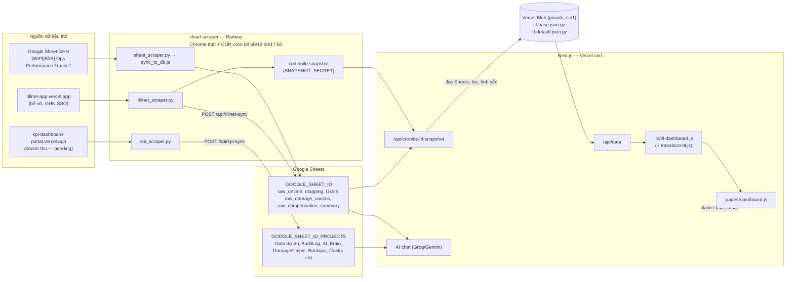

# SD3 Dashboard Điện Máy — Đặc tả toàn hệ thống

> **Mục đích của file này**: đây là TÀI LIỆU DUY NHẤT cần đọc để hiểu dự án đang làm gì, đang ở trạng thái nào, và tái tạo lại toàn bộ hệ thống từ đầu — không cần đọc code trước. Viết cho 3 đối tượng: (1) quản lý muốn nắm tiến độ, (2) người mới join team, (3) 1 AI coding agent được giao tiếp quản/build lại hệ thống. Mọi con số, tên sheet, công thức, ngưỡng nghiệp vụ lấy TRỰC TIẾP từ code thật đang chạy production — không suy đoán. Nếu code thay đổi mà file này chưa cập nhật, tin code, không tin file.
>
> - **File tổng quan (27/09):** `D:/Điện Máy/TONG-QUAN-HE-THONG-SD3-Dashboard-Dien-May.html` — 1 file HTML tự chứa (không cần mạng, in/lưu PDF A4, sáng/tối) tóm tắt cho quản lý: 22 mục (tóm tắt điều hành, **tiến độ từng phân hệ có %**, sơ đồ kiến trúc, dòng thời gian đồng bộ, sơ đồ điều hướng, từng tab, sơ đồ luồng Báo cáo công ty, nguyên tắc UI/UX, phân quyền, chỉ số, kỹ thuật, hiệu năng, bảo mật, kiểm thử, runbook, bài học sự cố, lịch sử, việc đang mở + đề xuất). Nằm NGOÀI repo (thư mục cha), không chứa mật khẩu/secret. Số liệu chụp lúc 20:40 27/09, cập nhật lần 2 lúc 00:40 28/09, lần 3 (viết lại) 00:45 28/09, **lần 4 lúc 13:00 28/09 (định nghĩa % on-time theo cách tính công ty, % bể đền / LTC, bố cục báo cáo 2 tuần, bản chốt W38–W39 12:48), **lần 5 lúc 14:10 28/09** (bộ lọc: bỏ nút nhanh, khoảng ngày dạng ngày/tháng/năm) (nâng cấp UI/UX Tổng quan LTL, cài đặt kênh user đã lưu, tiến độ Dashboard LTL 97%), **phiên bản 6 lúc 18:30 29/09** (lớp Kho trên bản đồ: mục 7, lịch sử, việc đang mở) — **file này là bản tóm tắt; SYSTEM_SPEC.md vẫn là nguồn chuẩn**, khi hệ thống đổi lớn thì cập nhật cả hai (mức % hoàn thành là đánh giá của Claude theo phạm vi đã chốt).
> - Tạo lần đầu: 2026-09-21. Cập nhật lớn: 2026-09-26 (sáng — bổ sung trạng thái/lịch sử/runbook).
> - **Kế hoạch F · phiên F1 XONG (code, 03/10)** — báo cáo giải pháp của Sổ tay có đối soát 2 góc nhìn bể vỡ (cohort / real-time), độ phủ tách tuyến, khoảng trống mở rộng và dòng "Nguồn dữ liệu" (màn hình / In / Copy / Excel / Word) — mục 8.0c, 18, 19. Code commit `7b0f9cc`; **chưa tự kiểm production** (xem mục 19).
> - **Kế hoạch F · phiên F2 XONG (code + deploy, 03/10)** — Tiểu Đệ đa tác tử (Planner + 3 tác tử Số liệu/Hư hỏng/Giải pháp + Aggregator, 1.207 dòng), bộ nhớ AI Brain thêm cột Trạng thái Đề xuất/Đã duyệt/Bỏ, nút "Duyệt câu trả lời" cho Manager, thẻ nguồn SourceChip, StepsPanel — mục 9, 18, 19. Merge commit `63a42a3` vào main.
> - **Phạm vi khách Điện máy tự cập nhật (03/10)** — thêm Komex/Pico/Smartlink (482 đơn bị sót), tab `client_industry` (nhãn ngành Rillnet + quyết định tay), thẻ "Phạm vi khách Điện máy" trên Trạng thái hệ thống: mục 4, 8.4, 10, 12, 17 #37, 19.
> - **Kế hoạch E · phiên 1 XONG (02/10 21:05)** — scraper Rillnet lấy đủ tiền đền cho khách (82/82 ca đã chốt có tiền, 596,5 tr), cột mới `raw_damage_causes` + `raw_compensation_summary`, đối chiếu thẻ Rillnet khớp 100%: mục 6, 17 #36, 19.
> - **Cập nhật lần cuối: 2026-10-03 17:00** — **Kế hoạch F phiên F2 deploy** (merge commit `63a42a3`): Tiểu Đệ đa tác tử XONG. **Bỏ Ca/1.000 đơn + Tiền đền/1.000 đơn khỏi Sổ tay** (commits `5e6c329`, `757b71b`). Trước đó **lớp Kho trên bản đồ cập nhật** (commit `e0e839d`): toạ độ thật 93 kho giao (user), gộp chấm theo khoảng cách ≤ 350 m, khung chi tiết kho có **tổng tải kho giao** (tab mới `KhoGiaoTongTai`) bên cạnh tải Điện máy — mục 8.2, 18, 19. Trước đó **2026-10-02 (khuya) — KẾ HOẠCH E PHIÊN 2 XONG**: tab Hư hỏng có khung 💰 Tiền đền cho khách (kỳ + so kỳ trước + theo dự án/tuyến + đối chiếu Rillnet) và 3 khung phân tích (Ca còn mở · Tuyến/khách tái phát · Chặng nghi vấn theo tuyến); Sổ tay có tiền đền trước/sau, tiền / 1.000 đơn, đối chứng, ước tính tiết kiệm (màn hình/Word/Excel/In/Copy) — mục 8.0c, 8.3, 12, 18, 19. Trước đó 2026-10-02 20:50 — bổ sung lịch sử 29/09–02/10 và luật chạy 2 phiên của Kế hoạch F (F2 worktree riêng, F1 chờ E phiên 2; mục 18, 19). Trước đó 2026-10-02 20:30 — ghi **KẾ HOẠCH F (đã duyệt): Tiểu Đệ đa tác tử + bộ nhớ đã duyệt + thẻ nguồn; đối soát 2 góc nhìn bể vỡ + độ phủ tách tuyến** (mục 19). Trước đó 2026-09-29 21:30 — ghi **KẾ HOẠCH E (đã duyệt): tiền đền bù cho khách + phân tích đơn hư hỏng** (mục 19). Trước đó 2026-09-29 16:35 — Kế hoạch D: nhận tab danh sách kho giao chính thức (93 kho, tên trùng hệ thống, toạ độ thật, tổng tải) → 98% lượt đơn vị trí chắc chắn, tab mới `KhoGiaoTongTai` (mục 19). Trước đó 2026-09-29 18:30 — **KẾ HOẠCH D bước 2a XONG + deploy** (commit `085a4a2`): **lớp Kho trên Bản đồ tỉnh thành** — nút Tỉnh / Kho / Cả hai, 98 chấm kho xám đúng toạ độ (to theo đơn/ngày hoặc tấn/ngày, viền đứt = vị trí ước lượng, nhiều tên cùng vị trí gộp 1 chấm — cụm Xuyên Á 4 tên), bấm/rê → tải kho giao + kho lấy (TB · P90 · ngày cao nhất) ghi "chỉ phần Điện máy", Top 8 kho, khung "Kho chưa hiển thị"; `/api/data` mặc định không đổi (so JSON 9 bộ lọc) — mục 8.2, 10, 11, 18, 19. Trước đó 17:40 — khung dashboard hợp điện thoại: menu ☰ trượt, header 1 hàng, bộ lọc gập, 3 tab hết tràn ngang (mục 8.5, 18, 19). Trước đó 2026-09-29 15:55 — user xác nhận 4 kho còn lại, 98,3% lượt đơn có vị trí kho (mục 19). Trước đó 2026-09-29 15:40 — Kế hoạch D bước 2a: đã ghi tab `Warehouses` (125 kho) + `WarehouseAlias` (349 tên kho, 97,4% lượt đơn có vị trí) + phép chiếu toạ độ (mục 19); lớp Kho trên bản đồ chờ làm. Trước đó 2026-09-29 14:30 — Kế hoạch D: đã đọc file vị trí kho GHN (1.189 kho), kết quả nối tên + lỗi file + kế hoạch bước 2a (mục 19). Trước đó 2026-09-29 13:25 — **KẾ HOẠCH D Phần 1 XONG + deploy** (commit `f55a963`): Bản đồ tỉnh thành bố cục A — bản đồ ~60% cao theo màn hình + đứng yên khi cuộn, dải 4 số phía trên, cột phải điểm nóng + khung chi tiết tỉnh + nút "Xem danh sách đơn" + Top 8; phóng/thu/kéo/chụm, tên tỉnh khi phóng, ⤢ toàn màn hình, chú giải màu; không đổi số (JSON `/api/data` cũ/mới giống từng byte) — mục 8.2, 19. Phần 2 (kho + capacity) vẫn chờ file. Trước đó 12:40 — ghi **KẾ HOẠCH D (đã duyệt): nâng cấp Bản đồ tỉnh thành** — Phần 1 bản đồ to (phương án A) + Phần 2 lớp kho + capacity (mục 19). Sổ tay: danh sách khách thu gọn "+N khách" (commit `addb60f`). Trước đó: 2026-09-28 21:00 — **KẾ HOẠCH A (tăng tốc P1–P7) XONG + deploy** (commit `490cc12`, Railway cron giữ ấm): `/api/data` mặc định 1,15 MB → 0,32 MB (bản đồ tải riêng), báo cáo công ty tab 0,72 MB → 0,03 MB (xem sâu tải khi bấm), danh sách kỳ chốt 1,09s → 0,09s, nhật ký 0,96s → 0,14s, tab đã mở giữ nguyên (quay lại ~0,07s), tải trước khi rảnh, giữ ấm 07:00–20:00; không đổi con số nào (so JSON cũ/mới + script chốt `--dry` exit 0) — mục 13, 19. Trước đó 19:55 — sự cố #35: commit của phiên chính kéo theo code dở của phiên Kế hoạch A (chung thư mục) → 1 bản deploy lỗi, không ai bị ảnh hưởng (mục 17, 19). Trước đó 19:40 — **"Rủi ro theo dự án" tính theo SỐ CA như "Hiệu suất dự án"** (user chốt thống nhất 2 bảng; mục 8.3). Trước đó 19:00 — ghi thêm: 2 bảng % bể vỡ đếm khác nhau (số ca vs số đơn có ca, mục 8.3); phiên Kế hoạch A đang chạy song song (mục 19). Trước đó 18:50 — **Toàn dashboard hiển thị % bể vỡ thay "Ca/1.000 đơn"** (user: đổi luôn cho đồng bộ): bảng Hiệu suất dự án (mục 8.1), Rủi ro theo dự án + ô "Dự án rủi ro cao" (mục 8.3); chỉ đổi cách hiện. Trước đó 18:20 — Sổ tay cải tiến **hiển thị % bể vỡ thay cho "Ca/1.000 đơn"** (user hỏi chỉ số này là gì, chốt đổi sang %; chỉ đổi cách hiện, công thức/luật giữ nguyên — mục 8.0c). Kế hoạch A tách sang phiên mới. Trước đó 17:50 — bổ sung ghi chú kỹ thuật Kế hoạch B (cờ `running`, plugin biểu đồ, mẹo kiểm thử 16.6, dấu vết test ở mục 19). Trước đó 17:30 — **KẾ HOẠCH B ĐÃ LÀM XONG + deploy**: Sổ tay cải tiến thành **giải pháp nhiều giai đoạn** (Trial 1 → Trial 2 → … → Nhân rộng cả nước, baseline chung, chạy song song), nút "➕ Giai đoạn tiếp" trên bảng ngoài + trong chi tiết, bảng so sánh giai đoạn, biểu đồ tuần có vạch mốc, **theo dõi sau thành công** (tháng + tuần, cảnh báo ⚠), **ảnh minh hoạ** (Blob private), **xuất Word .docx** + Excel + In/PDF, ô ngày dd/mm/yyyy; đã gộp 2 dòng PSD thành `GP-260928-3O7D` (Trial 1 giữ nguyên số) — mục 8.0c. Trước đó 14:50 — Kế hoạch B bổ sung lần 2: nút "➕ Giai đoạn tiếp" ngay trên bảng ngoài, **theo dõi sau thành công** (tháng + tuần so kỳ trước, cảnh báo), ô ngày dạng ngày/tháng/năm trong form Sổ tay (mục 19). Trước đó 14:30 — Kế hoạch B (Sổ tay nhiều giai đoạn) bổ sung theo ví dụ thật PSD: nút "➕ Bắt đầu giai đoạn tiếp theo", giai đoạn chạy song song, gộp 2 dòng PSD (mục 19). Trước đó 14:00 — thanh lọc gọn lại: bỏ nút nhanh Hôm nay/3/7 ngày, khoảng ngày dạng ngày/tháng/năm (mục 8). Trước đó 13:30 — ghi **KẾ HOẠCH C (đã duyệt, chưa làm): lấy số GTC từ Rillnet làm mẫu số % bể đền** (mục 19) + chẩn đoán lệch % bể vỡ LG W38 (1,4% vs Rillnet 1,67%). Trước đó 12:55 — **Ontime đổi sang đúng cách tính của báo cáo công ty** (cờ `odr_success` ontime/late, loại đơn hoàn/huỷ; thay quy tắc V2 — mục 12); chốt lại W38–W39 lúc 12:48. Trước đó 11:30 — rà lại mọi chỗ còn mô tả quy tắc cũ (mẫu số GTC, đơn trễ chỉ tính đơn đã giao, % hư hỏng biểu đồ) cho khớp Ontime V2 + % bể đền / LTC. Trước đó 11:20 — **Ontime quy tắc V2 toàn hệ thống** + **% bể đền chia đơn LTC** (mục 12, 8.0b, 8.1); chốt lại W38–W39 lúc 11:17. Trước đó 10:30 — báo cáo 2 tuần **so kỳ này với 2 tuần trước** (bỏ cột tháng; 4 tuần + "2 tuần trước" + "Kỳ này" + ±, mục 8.0b); **chốt bản cuối W38–W39 lúc 10:25** (lịch tự chốt 09:15 bị kẹt, mục 19). Trước đó 02:40 — ghi **2 kế hoạch đã duyệt, chưa làm** ở mục 19: (A) tối ưu tốc độ P1–P7, (B) Sổ tay cải tiến nhiều giai đoạn + ảnh + xuất Word. Mỗi phần làm ở 1 phiên chat mới. Trước đó 02:00 — Sổ tay cải tiến có **Báo cáo đánh giá** (modal chi tiết, Tổng tấn, nhận định tự động 4 mức, xuất Excel + In/PDF; hiệu quả ròng bể vỡ đổi sang so % thay đổi; mục 8.0c). Trước đó 01:20 — tab mới **Sổ tay Cải tiến & Đo lường Giải pháp** (ghi giải pháp trial, đo trước/sau + nhóm đối chứng từ snapshot LTL + Rillnet; mục 8.0c). Trước đó 28/09 00:30 — UI/UX Tổng quan LTL: "Cần can thiệp ngay hôm nay", biểu đồ trục kép (đơn + tấn · on-time + hư hỏng), chạy số KPI, chuyển động nhẹ, màu trạng thái dark, bản đồ hover theo khung hình (mục 8.1/8.2/8.5); user đã lưu cài đặt kênh 20:22 27/09 (mục 19). Trước đó 27/09 — thêm file tổng quan cho người đọc không kỹ thuật (xem ngay dưới); Cài đặt kênh khách hàng (B2B/B2C, dòng riêng, thứ tự) + tăng tốc báo cáo (mục 8.0b); kỳ đang diễn ra hiện trong ô chọn kỳ (số đến hiện tại, mục 8.0b); Ontime + Hàng hoàn: bấm xem đơn trễ/tuyến trễ/đơn hoàn, gợi ý insight, sheet "Đơn trễ" (mục 8.0b); bể vỡ: bấm xem mã đơn/tuyến/ngày tạo, mẫu số GTC, gợi ý insight tự viết (mục 8.0b); chốt tạm W38–W39 + lịch tự chốt 09:15 28/09; kỳ 2 tuần chỉ kết thúc ở tuần lẻ, báo cáo ở tuần chẵn (W40 = W38–W39); kỳ 2 tuần mang tên cả 2 tuần ("W38–W39 (14/09–27/09)", mục 8.0b); chốt lại W37 + tháng 08 lúc 14:22 (bảng "Các kỳ đã chốt", mục 8.0b); tab "Báo cáo công ty" + chọn khách key account (mục 8.0b); sự cố #33 (sheet tự đảo ngày/tháng `case_date` → ghi `RAW`), ghi chú cách gán tuần trong báo cáo Excel, chốt lại W37.
> - Cập nhật 2026-09-26 (chiều) — sau đợt tái cấu trúc "chỉ còn LTL": xoá FTL / Vận hành SD3 / Tách chuyến, dữ liệu chạy qua snapshot Vercel Blob, máy chủ chuyển sang Singapore, giao diện phẳng màu cam GHN, vá lỗ hổng CDN. Sửa lại chỗ ghi sai trước đây về nguồn `raw_ontime` (mục 4).

---

## Mục lục

1. [Hệ thống này là gì](#1-hệ-thống-này-là-gì)
2. [Trạng thái hiện tại](#2-trạng-thái-hiện-tại-26092026)
3. [Kiến trúc tổng thể](#3-kiến-trúc-tổng-thể)
4. [Google Sheets](#4-google-sheets)
5. [Snapshot LTL trên Vercel Blob](#5-snapshot-ltl-trên-vercel-blob)
6. [cloud-scraper (Railway)](#6-cloud-scraper-railway)
7. [Auth & phân quyền](#7-auth--phân-quyền)
8. [Tính năng](#8-tính-năng)
9. [AI Assistant "Tiểu Đệ SD3"](#9-ai-assistant--tiểu-đệ-sd3)
10. [Danh sách API](#10-danh-sách-api)
11. [Cấu trúc thư mục](#11-cấu-trúc-thư-mục)
12. [Luật nghiệp vụ & công thức](#12-luật-nghiệp-vụ--công-thức)
13. [Cache & hiệu năng](#13-cache--hiệu-năng)
14. [Biến môi trường](#14-biến-môi-trường)
15. [Triển khai](#15-triển-khai)
16. [Runbook vận hành](#16-runbook-vận-hành)
17. [Sự cố thật đã gặp](#17-sự-cố-thật-đã-gặp)
18. [Lịch sử dự án](#18-lịch-sử-dự-án)
19. [Việc đang mở](#19-việc-đang-mở)
20. [Dự án anh em: booking-ftl-tool](#20-dự-án-anh-em-booking-ftl-tool)
21. [Nếu build lại từ đầu](#21-nếu-build-lại-từ-đầu)

---

## 1. Hệ thống này là gì

**Tên**: "SD3 - Dashboard Điện Máy" — Vercel project `logicore-app`, production `https://logicore-app.vercel.app`. Tagline trang login: *"Your loads. Our roads." / "Giao Hàng Nặng — Kênh Bán Lẻ Toàn Quốc."*

**Cho ai**: đội **SD3 (Solution Điện Máy) của GHN** — theo dõi vận hành **LTL** (giao hàng lẻ / last-mile) cho các khách bán lẻ điện máy (Samsung, LG, Aqua, Casper, Hisense, PSD, Nguyễn Kim, AUX, DigiWorld...). Chủ dự án: Nguyễn Thành Tân (manager SD3).

**Phạm vi (từ 26/09/2026): CHỈ vận hành LTL.** Các phân hệ FTL, "Vận hành SD3" (pipeline dự án + task) và "Tách chuyến" đã bị xoá theo yêu cầu user; code cũ còn trong git (commit trước `f5cc3a1`). Phần booking/điều xe FTL được phát triển ở dự án riêng (mục 20).

**Giải quyết:**
1. KPI on-time / late / hư hỏng theo dự án, tỉnh, kho, tháng — dữ liệu thô từ Google Sheets.
2. Truy vết hư hỏng/bể vỡ (Rillnet) và workflow khiếu nại.
3. Trợ lý AI chat trả lời câu hỏi vận hành LTL dựa trên số liệu thật, cấm tự suy đoán.

**Stack**: Next.js 16 (Pages Router, Turbopack) + React 19 + Tailwind 4 + Chart.js 4. **Không có SQL** — Google Sheets là nguồn thật; **Vercel Blob (private, `sin1`)** giữ snapshot đã lọc/tính sẵn để phục vụ nhanh. Sidecar `cloud-scraper/` trên Railway (Python + Node 20 + Chrome thật qua CDP) đồng bộ dữ liệu nguồn.

**Quy mô code**: ~10.500 dòng JS (lib + components + pages), 210 commit. File chính: `lib/transform-ltl.js` (1.203 — "bộ não" KPI), `components/ltl/LTLDashboard.js` (573), `pages/dashboard.js` (591), `lib/ltl-dashboard.js` (393), `lib/ltl-snapshot.js` (186).

> ⚠️ `AGENTS.md`: *"This is NOT the Next.js you know"* — đọc `node_modules/next/dist/docs/` trước khi viết code mới.

---

## 2. Trạng thái hiện tại (26/09/2026)

| Thành phần | Trạng thái | Chi tiết |
|---|---|---|
| Web app | 🟢 | Chạy ở **Singapore (`sin1`)**. `/api/data` trả ~80KB (nén), TTFB 0,3–0,6s khi ấm (đường mạng từ VN tới Vercel đã chiếm 0,2–0,4s), ~1,5s khi instance nguội. |
| Snapshot Blob | 🟢 | Dựng lại sau mỗi lần scraper sync (đã test), cron dự phòng 09:00/13:00/18:00, nút "Đồng bộ". ~13s/lần dựng; 686KB gzip. |
| Pipeline `raw_ontime` | 🟢 | Cron 3 lần/ngày chạy đều từ 17/09. |
| Nguồn GHN của `raw_ontime` | 🟠 Theo dõi | 24–25/09 có lúc số dòng nguồn đứng yên; 26/09 dữ liệu tháng 9 đã có 9.722 đơn — cần tiếp tục để ý. |
| Rillnet (bể vỡ) | 🟢 | Đăng nhập lại qua noVNC 26/09 16:10 (hết phiên từ 24/09 12:50); đồng bộ ok, 344 ca. Phiên GHN SSO ~7 ngày → theo dõi tab Trạng thái hệ thống. |
| KPI portal | ⏸️ PENDING | `kpi_scraper.py` lỗi từ 17/09; user yêu cầu để pending. Từ 26/09 không còn phần nào của dashboard dùng dữ liệu KPI/doanh thu (AI chat cũng đã bỏ). |
| Giám sát nguồn dữ liệu | 🟢 | Tab **"Trạng thái hệ thống"** (manager) + heartbeat scraper sau mỗi lần chạy (mục 8.4, 16.1). Test thật 26/09 15:36: raw_ontime ok, Rillnet + KPI `session_expired`. |
| Git | 🟢 | Đã commit và push lên GitHub (`main`); push tự kích hoạt Vercel deploy. |

**Số liệu mốc (26/09, sau khi sửa Hồng Đạt / FRT Digital / nhãn ngành DM):** Tổng đơn "Tất cả" = **33.474** = đúng tổng T7 (9.679) + T8 (13.731) + T9 (10.064), 28 dự án. **1.126 đơn chờ lấy** (1.044 `ready_to_pick` + 81 `picking`, không có ngày lấy) hiển thị riêng, đơn treo lâu nhất từ 06/08.

---

## 3. Kiến trúc tổng thể



**Luồng 1 request LTL:** `dashboard.js` → `GET /api/data?...` → check session (401 nếu không có) → nếu là **bộ lọc mặc định** và bản tính sẵn còn hợp lệ → trả ngay (chỉ gắn thông tin role) → ngược lại đọc snapshot BASE (bộ nhớ instance, kiểm tra ETag Blob mỗi 60s) → cache theo bộ lọc → `computeDashboard()` (join hư hỏng → lọc role/viewAs → lọc ngày → `transformLTL` → AI insights → delta KPI) → JSON.

**Backup**: `/api/cron/backup` (08:00 VN) snapshot `Data dự án`/`Users`/`Tasks` thành JSON vào tab `Backups` (giữ 30 ngày).

---

## 4. Google Sheets

(Chỉ tên biến môi trường. **Không tin ID trong file `.env*` ở máy local — đã lệch so với production.** Biến production là loại *Sensitive*, `vercel env pull` không đọc được giá trị — đúng thiết kế.)

| Biến | Vai trò | Tab |
|---|---|---|
| `GOOGLE_SHEET_ID` | Sheet chính, cũng là mặc định của `fetchSheet()` | **`raw_ontime`**, `mapping`, `Users`, `raw_damage_causes`, `raw_compensation_summary`, **`client_industry`** (03/10, mục 12), `ClientChannels` (mục 8.0b), `ActionTrials` (giai đoạn) + `ActionSolutions` (giải pháp) (mục 8.0c, tự tạo lần lưu đầu) (+ các tab FTL cũ không còn dùng: `raw_ftl_orders`, `FTLBookings`, `ftl_vehicle_caps`...) |
| `GOOGLE_SHEET_ID_PROJECTS` (fallback `SHEET_ID_PROJECTS` → `GOOGLE_SHEET_ID`) | Sheet nội bộ SD3 | `Data dự án` (AI chat đọc doanh thu), `AuditLog`, `AI_Brain`, `DamageClaims`, `Backups`, `Tasks` (không còn ghi) |
| `SHEET_ID_LTL` | **KHÔNG được set trên production** (xác nhận 26/09) | Code vẫn đọc `process.env.SHEET_ID_LTL` cho `raw_ontime`/`mapping`, nhưng vì trống nên rơi về `GOOGLE_SHEET_ID`. Bản spec cũ ghi `raw_ontime` nằm ở `SHEET_ID_LTL` là sai. |

- Trên Railway, `sync_to_db.js` ghi `raw_ontime` vào `GOOGLE_SHEET_ID` **của container Railway** — phải là cùng sheet với `GOOGLE_SHEET_ID` bên Vercel.
- `GOOGLE_SHEET_ID_FTL`, `NEXTAUTH_*`, `USERS_JSON` còn trong env nhưng code không dùng.

---

## 5. Snapshot LTL trên Vercel Blob

`lib/ltl-snapshot.js` + `pages/api/cron/build-snapshot.js`. Store: **`logicore-ltl-snapshot` (`store_iA2UA6agXztJbFo0`), private, region `sin1`**, token `BLOB_READ_WRITE_TOKEN` (tự gắn khi tạo store).

| Blob | Nội dung |
|---|---|
| `snapshots/ltl-base.json.gz` | Các dòng `raw_ontime` đã qua bộ lọc gốc (khách Điện Máy + từ 07/2026 + chỉ LTL — y hệt điều kiện `/api/data` luôn dùng), **chỉ giữ 17 cột mà công thức đọc** (`LTL_COLUMNS`), dạng cột; kèm `mapping`, `raw_damage_causes`, `raw_compensation_summary`, `builtAt`, `sourceRowCount`. ~33.6k dòng, ~686KB gzip. |
| `snapshots/ltl-default.json.gz` | Response đầy đủ của bộ lọc mặc định (Tất cả / ngày lấy / MTD / không viewAs), ~117KB gzip, gắn `__deployment` = mã deploy đã tính nó. |

**Dựng lại** (`buildLtlSnapshot`): xoá cache → đọc Sheets mới → lọc → tính bản mặc định bằng CHÍNH `computeDashboard` → ghi 2 blob. Kích hoạt bởi: scraper Railway sau mỗi lần sync (header `x-snapshot-secret`), Vercel Cron (Bearer `CRON_SECRET`), nút "Đồng bộ Google Sheet" (`/api/data?force=true`).

**Đọc**: mỗi instance giữ snapshot trong bộ nhớ, mỗi 60s kiểm tra lại bằng ETag (304 = không tải lại). Bản mặc định bị bỏ qua (tính trực tiếp) nếu: dựng từ ngày hôm trước (giờ VN — vì so sánh cùng kỳ tính theo "hôm nay") hoặc dựng bởi deploy khác (code có thể đã đổi dạng response).

**Chịu lỗi**: Blob không đọc/ghi được → vẫn phục vụ từ bộ nhớ hoặc tính từ Sheets (chậm nhưng không sập).

**Đã kiểm chứng (26/09)**: kết quả từ snapshot khớp tuyệt đối với đọc thẳng Sheets đủ cột trên 11 tổ hợp bộ lọc; so với bản code cũ, mọi trường `ltl`/`overview` giống hệt ở các bộ lọc tháng/ngày/ngày giao.

> Thêm cột mới vào công thức? **Phải thêm vào `LTL_COLUMNS`** (lib/ltl-snapshot.js), nếu không cột đó sẽ luôn rỗng.

---

## 6. cloud-scraper (Railway)

- Project `sd3-cloud-scraper`, service `sd3-cloud-scraper`, region `sfo`, volume `/data` (Chrome profile + log). Deploy bằng `railway up` trong `cloud-scraper/` (không theo git push).
- Container: Ubuntu 22.04, Google Chrome thật (`--remote-debugging-port=9222`, profile `/data/chrome-profile`), Xvfb + x11vnc + **noVNC** (`https://sd3-cloud-scraper-production.up.railway.app/vnc_auto.html`, mật khẩu = biến `VNC_PASSWORD`), Python 3 điều khiển Chrome qua **CDP websocket** (không Puppeteer), Node 20 cho script ghi Sheet.
- `crontab`: 08:50 / 12:50 / 17:50 → `run_scrapers.sh` chạy tuần tự `kpi_scraper.py` → `sheet_scraper.py` (+`sync_to_db.js`, merge theo `order_code` qua tab staging rồi swap nguyên tử) → `rillnet_scraper.py` → **gọi dựng snapshot** (`curl ... /api/cron/build-snapshot`, nếu có `SNAPSHOT_SECRET`). Mỗi bước `timeout 600`, chung lock `flock -w 1500`.
- **Giữ ấm (Kế hoạch A · P5, 28/09)**: `crontab` thêm `*/5 7-19 * * *` + `0 20 * * *` → `keep_warm.sh`: gọi `?warm=1` + header `x-snapshot-secret` tới `/api/data`, `/api/report/biweekly`, `/api/trials`, `/api/system-health`, `/api/audit-log`, `/dashboard` (song song, bỏ output). Không có `SNAPSHOT_SECRET` → thoát im lặng.
- Log: `/data/scraper_log.txt` (không hiện trong `railway logs`). Ping Telegram khi lỗi chỉ khi đã set `TELEGRAM_BOT_TOKEN` + `TELEGRAM_CHAT_ID`.
- Bước raw_ontime mất 4–6 phút là bình thường.
- **Đã tắt từ 27/08** (bị team tech GHN nhắc nhở): mọi script cào `portal.ghn.vn` (`ftl_scraper.py`, `ftl_enrich_vehicle.py`, `check_and_run_sync.sh`). Không bật lại, không tự vào portal nội bộ GHN bằng browser automation.
- **`rillnet_scraper.py` (cập nhật 02/10, Kế hoạch E)**: mỗi lần chạy quét 01/07 → hôm nay trên trang "📦 Báo cáo bể vỡ" (danh sách ca + cờ `_LB.tt` / `_lbFilt(_lbAllRows())` + thẻ KPI `parse_report_cards`), rồi sang `truythu.html`, **chờ biến `TT`, `BEVO_RAW`, `TAX` tải xong** (`MONEY_READY_JS`, tối đa 45s) mới đọc tiền/nguyên nhân (`MONEY_JS`) và mới mở tab "📊 Tổng hợp" (`parse_compensation_summary`). Không đọc được → gửi `moneyRead=false`, app giữ số cũ. Chạy thử không ghi: `python3 rillnet_scraper.py --dry` (ra `/tmp/rillnet_dry.json`). Không đọc ô `noi_dung` (23% có số điện thoại).
- **Điểm yếu cố hữu**: phiên đăng nhập trong Chrome tự hết hạn (Google, GHN SSO Rillnet ~7 ngày, KPI portal). Script không crash mà âm thầm không lấy được dữ liệu → cần người đăng nhập lại qua noVNC.

---

## 7. Auth & phân quyền

**Đăng nhập**: GHN SSO v2 (OIDC), tự viết bằng `iron-session` + `jose` (không dùng `next-auth`). `sso-login` → GHN → `sso-callback` (verify ID token qua JWKS, **cố ý không check `aud`** vì token GHN luôn `aud` rỗng; chống replay bằng `nonce`). Session: cookie `logi_session`, 8 giờ, mã hoá `SESSION_SECRET`.

**Vai trò** (tab `Users`, định danh theo `EmployeeId` = claim `sub`; manager có thể cấp quyền trước theo họ tên): `pending`, `manager`, `sd3`, `cs`. (`data.js` còn nhánh `client` — tàn dư.)

**Quyền tab**: `ALL_TABS = ["ltl"]` — 1 quyền duy nhất cho cả 3 góc nhìn LTL. Giá trị cũ trong ô `Tabs` (`operations`, `tachtrip`, `ftl`) được **tự quy đổi thành `ltl`** (`lib/users.js::normalizeTabs` + `LEGACY_TABS` trong `dashboard.js`) để tài khoản trước chỉ có tab FTL không bị khoá. `pending` → không vào được.
- Manager-only: Quản lý người dùng, Nhật ký hoạt động, Trạng thái hệ thống, Bộ não Tiểu Đệ, bộ chuyển góc nhìn (viewAs nhân sự/khách).
- `cs`: không AI chat (chặn cả server), không doanh thu.
- `/api/admin-users` (manager): gán role/tab/PIC, ghi Audit Log.

---

## 8. Tính năng

Thanh điều hướng: **Tổng quan LTL · Bản đồ tỉnh thành · Hư hỏng & Rủi ro** (dùng chung 1 lần tải `/api/data`, chuyển tab không gọi lại API) + Quản lý người dùng · Nhật ký · Trạng thái hệ thống · Bộ não Tiểu Đệ (manager). Bộ lọc chung: Ngày lấy / Ngày giao, tháng, dự án, điểm lấy (khi chọn 1 dự án), **khoảng ngày "Từ ngày → Đến ngày" hiện và gõ dạng ngày/tháng/năm** (vd 14/09/2026 hoặc 14/9/26; Enter hoặc rời ô để áp dụng; 📅 mở lịch; ngày sai như 31/02 → viền đỏ, không lọc; ✕ xoá khoảng ngày) — đổi 28/09 theo user: **bỏ dãy nút nhanh** Hôm nay / 3 ngày / 7 ngày / Tháng này / Tất cả (rối mắt) và ô ngày gốc của trình duyệt (hiện mm/dd/yyyy); `DateField` (`components/DateField.js`, dùng chung với Sổ tay), API vẫn nhận yyyy-mm-dd. User chốt giữ ô Tháng + nút Ngày lấy/Ngày giao. Nút "Đồng bộ Google Sheet".

### 8.0 Thanh công cụ chung (cả 3 góc nhìn LTL)
- **Lọc nhanh** (chốt 26/09): **⏰ Đến hạn hôm nay** (đơn đã lấy, chưa giao, hạn giao = hôm nay → mở danh sách `/api/data?dueToday=1`); **⚠ Tuyến rủi ro cao** (chuyển sang tab Hư hỏng, bật "chỉ tuyến rủi ro cao"); **📉 Dự án On-time < 90%** (tự chọn các dự án < 90% với ≥ 20 đơn đã đánh giá trong kỳ đang xem; bấm lần nữa để bỏ).
- **📄 Tạo báo cáo tóm tắt** (`components/ExecutiveReport.js`): trang nền trắng gồm 4 KPI + thay đổi, xu hướng theo tháng, "Điểm cần chú ý" (on-time giảm mạnh, đơn treo, đến hạn hôm nay, chờ lấy, tuyến bể vỡ cao, kho), top 10 dự án. Nút **In / Lưu PDF** (`window.print()`, CSS `@media print` chỉ in `.exec-report`, A4) và **Copy nội dung** (văn bản gạch đầu dòng để dán slide). Theo bộ lọc đang chọn, không gọi thêm API.

### 8.0b Báo cáo chất lượng cho công ty (Excel, 27/09)
**Tab "Báo cáo công ty"** (sidebar, Manager + SD3 — `components/TabCompanyReport.js`, thêm 27/09; nút cũ "📊 Xuất báo cáo" trong Tổng quan LTL giờ chỉ là lối tắt "📊 Báo cáo công ty" sang tab): chọn **loại** + **kỳ** + **khách**, xem trước 3 bảng (Ontime · Bể vỡ · Hàng hoàn) đúng như file Excel, tải Excel, chốt số, chuyển "Số mới nhất / Bản đã chốt", mục **"Số đã đổi kể từ lúc chốt"** (so bản chốt với số mới nhất cùng bộ khách, liệt kê từng ô), danh sách các kỳ đã chốt.
- **Chọn khách key account** (user chốt 27/09: công ty chỉ xem 1 hoặc vài khách, không xem tổng ngành): `&clients=LG LTL|Aqua B2C` → **cả 3 bảng** chỉ hiện các khách đó (B2B trước, B2C sau), bỏ "Khác" và tổng B2B/B2C; dòng cuối **"Tổng khách đã chọn"** chỉ cộng họ — bể vỡ = Σ ca / Σ GTC của chính các khách đó (% từng khách luôn = ca của khách / GTC của chính khách). Không truyền `clients` = **Mẫu đầy đủ** (bố cục báo cáo gốc; dòng tổng bể vỡ cũng mang tên "Tổng khách đã chọn" vì chỉ cộng 7 khách của bảng). Báo cáo trả thêm `selection` + `clientOptions` (mọi khách Điện máy có đơn trong các cột, xếp theo số đơn). **1 kỳ = 1 bản chốt**, lưu kèm bộ khách; chốt lại với bộ khác = ghi đè. Excel ghi "Khách: …" ở phụ đề + ghi chú dòng tổng; sheet Chi tiết lọc theo khách.
- **Cài đặt kênh khách hàng** (user duyệt 27/09 — thay danh sách viết cứng B2B_CLIENTS / B2C_CLIENTS / FD_B2C_CLIENTS): khung "⚙ Cài đặt kênh khách hàng" trong tab Báo cáo công ty (`components/ClientChannelSettings.js`, API `/api/report/client-channels`, `lib/client-channels.js`). Mỗi khách Điện máy: **kênh** B2B LTL / B2C · **dòng riêng ở bảng Ontime** · **dòng riêng ở bảng Hàng hoàn** (bật riêng từng bảng) · **thứ tự** trong kênh. Khách không có dòng riêng cộng vào "Khác" của kênh; Tổng B2B / Tổng B2C / Tổng Điện máy luôn đủ, không sót/trùng. **Manager sửa + Lưu, SD3 chỉ xem** (API: SD3 POST 403, CS 403). Có tìm nhanh, lọc Có dòng riêng / Chưa cấu hình / Cờ B2B/B2C lẫn lộn, số đơn, % đơn B2C trong dữ liệu, nguồn cài đặt (Đã lưu · Mặc định · Chưa cấu hình).
  - **Lưu**: tab `ClientChannels` trên GOOGLE_SHEET_ID (`client_name, channel, own_row_ontime, own_row_fd, order, updated_by, updated_at`), ghi RAW, thay toàn bộ mỗi lần lưu; Nhật ký `report.channels` ghi các khách đổi. Tab tạo lúc kiểm thử 27/09, **hiện trống** (= chưa ai lưu → dùng mặc định).
  - **Thứ tự ưu tiên**: đã lưu → `DEFAULT_CHANNELS` (bố cục báo cáo gốc: LG, Samsung, PSD MN, Hồng Đạt MXT, Hồng Đạt = B2B dòng riêng; Aqua, Casper = B2C dòng riêng; NK Miền Bắc = B2C, dòng riêng CHỈ ở Hàng hoàn) → **đa số `is_B2C` của các đơn** ("Chưa cấu hình"). Sửa lỗi cũ: kênh nhóm Khác lấy theo đơn ĐẦU TIÊN trong kỳ → Cellphones / CellphoneS North (cờ lẫn lộn) vào Khác B2B ở các kỳ có cột tháng 07 (2 tuần W29–W35, tháng 07) nhưng Khác B2C ở kỳ khác; nay luôn B2C (đa số). Các kỳ đã/ sẽ chốt (W37, W39, tháng 08, 09) ra **y hệt** code cũ (đã so JSON trên production cùng snapshot).
  - **Tính lại ngay**: sau khi lưu, tab gửi `&cv=<version>` → mọi instance đọc lại cấu hình (cache cấu hình 60s, có cả khi tab rỗng). Bản đã chốt không đổi; mục "Số đã đổi kể từ lúc chốt" hiện ô bị ảnh hưởng. Báo cáo trả `channelsVersion`.
  - **Tốc độ** (đo production 27/09): trước 1,3–4,4s mỗi lần; nay lần lặp lại ~150–260ms (cache báo cáo `lib/report-cache.js` theo snapshot builtAt + phiên bản cấu hình + tham số + mốc 5 phút, tối đa 40 bản), lần tính mới trên instance ấm ~0,4–0,8s, instance lạnh ~3s (tải snapshot). Tối ưu: gom đơn theo khách + tuần một lần (`byClient`), insight không còn quét toàn bộ 36k đơn cho từng khách (~550 → ~230ms local).
- **Kỳ đang diễn ra** (user 27/09: "dù chưa hết tuần thì cứ hiện số tới thời điểm đó — giữa tuần sếp bất chợt kêu báo cáo thì sao?"): mỗi loại có thêm **kỳ đang chạy ở đầu ô chọn kỳ**, gắn "· đang diễn ra" — Tuần: tuần hiện tại; 2 tuần: kỳ kết thúc tuần lẻ chứa tuần hiện tại (vd T4 30/09 → "Báo cáo W42 · W40–W41"); Tháng: tháng của thứ 2 tuần này (vd 01/10 vẫn là Tháng 09 vì tuần 28/09 thuộc tháng 9). **Mặc định vẫn chọn kỳ đã kết thúc gần nhất.** Báo cáo có `inProgress` (`isInProgress(lastMonday, now)`: tuần cuối chưa qua 24:00 CN giờ VN); tên kỳ thêm "· đang diễn ra"; Excel ghi chú "KỲ ĐANG DIỄN RA: số tính đến … — số còn tăng". Chốt kỳ đang chạy vẫn được (hộp xác nhận nhắc kỳ chưa kết thúc).
- **Bể vỡ — xem sâu + gợi ý insight** (user duyệt 27/09, trả lời 4 câu: "đơn tạo tuần nào? tuyến/kho nào? bấm xem mã đơn? 1 ca 3% thì GTC bao nhiêu?"):
  - **Bấm số ca** trong bảng Bể vỡ của tab (1 ô khách × cột, tên khách = mọi cột, dòng tổng = mọi khách) → khung danh sách ca: mã đơn, ngày/tuần phát hiện, **ngày + tuần tạo** (`created_time`), tuần giao, trạng thái, **kho lấy (tỉnh) → kho giao (tỉnh)**, chặng nghi vấn, kho phát hiện, kg, đền bù/truy thu; dòng tóm tắt (đơn tạo tuần nào · kho lấy chính · chặng · số đơn hoàn) + nút copy mã đơn. Số ca liệt kê luôn = số trong ô (đã kiểm 212/212 ô trên 6 loại/kỳ). Ô tháng dùng `details.damageCasesMonthOnly` (ca chỉ thuộc cột tháng trước). Bản chốt cũ (chưa có `monday`/tuyến) vẫn tra theo ngày phát hiện, báo rõ khi thiếu danh sách ca.
  - **Mẫu số dưới mỗi %** (từ 28/09 là **LTC**): mỗi ô % trên tab hiện kèm `ca/LTC`; LTC < 50 tô xám (có ca thì ⚠). Excel: bảng Bể vỡ có khối **"# đơn LTC (đơn lấy thành công — mẫu số)"** bên phải (sau khối %). Bản chốt trước 28/09 vẫn mang `gtc` → tab/Excel hiện đúng chữ "ca/GTC", "# GTC". (27/09–28/09 sáng: mẫu số GTC = đơn giao thành công theo tuần giao.)
  - **Gợi ý insight** (`report.insights.damage`, hàm `damageInsights` trong `lib/biweekly-report.js`): **viết theo mẫu câu cố định từ số đã tính, KHÔNG dùng AI** (tránh bịa số — sự cố #9, #30). Kỳ trọng tâm: 2 tuần (2 tuần cuối vs 2 tuần trước), tuần (tuần cuối vs tuần trước), tháng (tháng chọn vs tháng trước). Mỗi khách có ca: số ca + % trên GTC, so kỳ trước, đơn tạo tuần nào (đánh dấu đơn tạo trước kỳ = phát hiện muộn), kho lấy, tuyến lặp lại (≥ 2 ca), kho phát hiện, chặng nghi vấn, số đơn đã hoàn, đền bù/truy thu, cảnh báo mẫu số nhỏ (GTC < 50). Hiện trên tab (nút copy) và **điền sẵn vào sheet Insight** mục "Bể vỡ và đền bù" với dòng "Gợi ý của hệ thống … kiểm tra, sửa hoặc xoá trước khi gửi"; ô trống "Nhận định của bạn" vẫn giữ.
  - **Excel sheet Chi tiết**: 19 cột — thêm Ngày tạo, Tuần tạo, Kho lấy, Tỉnh lấy, Kho giao, Tỉnh giao, Kg; xếp theo khách rồi tuần.
  - Lưu ý code (lỗi bắt được khi tự test 27/09, trước khi deploy): ô đang chọn gắn với đúng báo cáo lúc bấm (`pickState.report === shown`). Không lưu chỉ số dòng/cột trơn — đổi Tháng (7 cột) → 2 tuần (4 cột) sẽ trỏ vào cột không tồn tại và làm treo tab.
- **Ontime + Hàng hoàn — xem sâu + gợi ý insight** (user duyệt 27/09, 4 điểm):
  - **Bấm số ô Ontime** (khách × cột; tên khách = các tuần của kỳ; dòng "Khác"/tổng gộp đúng các khách gốc) → % ontime, trễ 1 / 2 / ≥ 3 ngày, **bảng tuyến** kho lấy → kho giao (đơn được tính / trễ / % ontime), **danh sách đơn TRỄ** (không liệt kê mọi đơn): mã đơn, ngày lấy, hạn giao (`deadline_plus`), ngày giao, số ngày trễ (= ngày giao − hạn, tối thiểu 1; đơn chưa giao = hôm nay − hạn; đơn mất/hư hỏng để trống), **loại trễ** (Giao trễ / Chưa giao, quá hạn / Mất / hư hỏng — từ 28/09; đơn hoàn/huỷ không còn trong danh sách vì bị loại khỏi ontime; trước 28/09 danh sách chỉ có đơn đã giao trễ), tuyến, tỉnh giao, kg; copy mã đơn. Bảng tuyến và gợi ý insight Ontime cũng tính theo cùng cách (gợi ý thêm dòng "Đơn trễ gồm: … giao trễ, … chưa giao đã quá hạn[, … mất / hư hỏng]"); sheet Excel "Đơn trễ" thêm cột "Loại trễ".
  - **Tuyến trễ nổi bật** (tô đỏ + nêu trong gợi ý) = **≥ 3 đơn trễ VÀ % ontime thấp hơn % chung của chính khách/dòng đó ≥ 5 điểm** (`LATE_ROUTE_MIN`, `LATE_ROUTE_GAP`).
  - **Bấm số ô Hàng hoàn** → danh sách đơn hoàn: mã, ngày lấy, trạng thái, tuyến, tỉnh giao, kg, **có ca bể Rillnet không**; tóm tắt kho giao hoàn nhiều + x/y có ca bể.
  - Danh sách đơn chỉ có cho các **cột tuần** của kỳ (và cột tháng của chính kỳ Tháng); cột tháng trước không lưu (quá nhiều đơn) → khung báo "chọn loại Tháng". Dữ liệu: `details.lateOrders`, `details.fdOrders` (thêm tuyến + `has_damage`), `details.ontimeRoutes[client][monday][route] = [đơn được tính, trễ]`; mỗi dòng Ontime/FD có `clients` (khách gốc), dòng Ontime có thêm `late`, `evaluated`. Đã kiểm: số đơn liệt kê = số trong bảng ở mọi ô (549 ô local, 400 ô production), bảng tuyến cộng lại = số đơn được tính.
  - **Gợi ý insight** (`insights.ontime`, `insights.fd`, hàm `flowInsights`) — cùng nguyên tắc mẫu câu cố định, không AI; viết cho **khách có tên + dòng tổng** ("Khác" chỉ góp vào tổng). Kỳ trọng tâm như Bể vỡ; kỳ so sánh tính thẳng từ dữ liệu (vd 2 tuần: W36–W37 dù bảng không có cột W36). Ontime: % ontime + chênh điểm, số trễ, trễ bao lâu, tuyến trễ nổi bật (hoặc ghi "không có" kèm luật). Hàng hoàn: số + % hoàn so kỳ trước, theo tuần lấy, kho giao / tỉnh hoàn nhiều, x/y có ca bể Rillnet; ghi rõ **nguồn không có lý do hoàn**. Tuần chưa chín → dòng "⏳ … còn N đơn chưa giao xong — % còn thay đổi".
  - **Excel**: sheet mới **"Đơn trễ"** (sheet thứ 7, cuối file; trễ ≥ 3 ngày tô đỏ); Chi tiết FD 11 cột (thêm Kho lấy, Tỉnh lấy, Kho giao, Tỉnh giao, Kg, Có ca bể); sheet Insight điền gợi ý cho cả 3 mục Ontime LTL / Bể vỡ / Hàng hoàn. Script tự chốt kiểm 7 sheet.
  - JSON báo cáo lớn hơn (2 tuần ~525 KB, tháng ~890 KB chưa nén) do danh sách đơn trễ + bảng tuyến.
- API: `/api/report/biweekly?type=week|biweekly|month&period=2026-W38|2026-08` trả `.xlsx` (`&format=json` để xem/đối chiếu).
- **Tuần**: 4 tuần ISO gần nhất (tuần chọn là cuối) + cột **±** so tuần trước (số đơn: % thay đổi; tỷ lệ: điểm, xanh = tốt / đỏ = xấu).
- **2 tuần** (đổi 28/09 theo user — "đang view theo tuần thì không cần so với tháng trước vì số liệu chênh không thể so sánh"): cả 3 bảng Ontime · Bể vỡ · Hàng hoàn = **4 tuần** (vd W36 · W37 · W38 · W39) + **"2 tuần trước"** (W36–W37) + **"Kỳ này"** (W38–W39) + cột **± Kỳ này vs 2 tuần trước**. Cột gộp (`kind: "span"`, `sub`, `mondays` = 2 tuần, `spanCol()` trong `plan()`) = cộng số đơn/ca/GTC của 2 tuần, **% tính lại trên tổng** (không trung bình 2 tuần); ± như báo cáo tuần/tháng: số đơn/ca theo % thay đổi, tỷ lệ theo điểm (xanh tốt / đỏ xấu, on-time tăng là tốt, bể vỡ/FD tăng là xấu); `delta: [4, 5]`. Màn hình: cột gộp có tên trên + tuần dưới, vạch đứt trước cột gộp, "Kỳ này" in đậm; Excel: tiêu đề "2 tuần trước\n(W36–W37)", ghi chú cách tính ở cả 3 sheet. Bấm xem sâu cột gộp liệt kê đơn/ca của cả 2 tuần; gợi ý insight không đổi (vẫn so 2 tuần cuối với 2 tuần trước — `focusSpans` chỉ lấy cột tuần). Bản chốt cũ (W36–W37, tháng 08) giữ bố cục cũ; "Số đã đổi kể từ lúc chốt" nay so cột theo **mã cột** (`key`) thay vì vị trí. Đã kiểm 28/09: so với code cũ trên cùng snapshot — báo cáo tuần/tháng y hệt, báo cáo 2 tuần mọi ô tuần y hệt, cột gộp = tổng 2 tuần, insight y hệt; Excel đọc lại 476 ô khớp; script tự chốt thêm kiểm tra bố cục + cột gộp. (Trước 28/09: tháng trước + 3 tuần cho Ontime/Hàng hoàn, 4 tuần cho Bể vỡ, không có ±.) Kỳ mang tên **cả 2 tuần** nó báo cáo (đổi 27/09 theo user): kỳ `2026-W39` = "Kỳ 2 tuần W38–W39 (14/09–27/09)" ở ô chọn kỳ, phụ đề Excel và sheet Insight. Bản chốt W37 tạo trước đó vẫn giữ tên cũ "Kỳ 2 tuần đến W37". **Lịch kỳ (user chốt 27/09): báo cáo 2 tuần gửi ở TUẦN CHẴN, gồm số 2 tuần liền trước → kỳ luôn kết thúc ở tuần LẺ** (báo cáo W30 = W28–W29, …, báo cáo W40 = W38–W39). Ô chọn kỳ chỉ liệt kê kỳ tuần lẻ, dạng "Báo cáo W40 · W38–W39 (14/09 – 27/09)", bỏ kỳ trước 07/2026; kỳ mới xuất hiện từ 00:00 thứ 2 (giờ VN) của tuần báo cáo. API trả 400 nếu kỳ 2 tuần kết thúc ở tuần chẵn (`isBiweeklyEnd`); kỳ mặc định = kỳ lẻ gần nhất đã hết. Tên kỳ trong Excel: "Kỳ 2 tuần W38–W39 (14/09–27/09) · báo cáo W40". Loại Tuần/Tháng không bị giới hạn. ⚠️ Cuối năm 2026 có W53 (lẻ) và 2027-W01 cũng lẻ → hai kỳ liền nhau chồng 1 tuần; cần user chốt cách xử lý trước kỳ báo cáo cuối 12/2026. Chỉ đổi chữ hiển thị — mã kỳ (`period=2026-W39`), các cột và số không đổi; loại Tuần/Tháng giữ tên cũ. Code: `plan()` trong `lib/biweekly-report.js` (`periodLabel`) + `twoWeekName()` trong `components/TabCompanyReport.js` (ô chọn kỳ, dòng trạng thái, danh sách kỳ đã chốt). Đã kiểm tra cả kỳ vắt năm (W53–W1).
- **Tháng**: 3 tháng gần nhất (bỏ tháng trước 07/2026 — ngoài phạm vi dữ liệu) + các tuần của tháng chọn + cột ± so tháng trước. Mặc định = tháng gần nhất đã hết tuần.
- **Chốt số** (`POST` cùng tham số, `lib/report-locks.js`): lưu nguyên báo cáo vào Blob private `reports/{type}/{period}.json` (kèm người chốt, giờ chốt, ghi Nhật ký). Tải lại bằng `&version=locked` — file ghi "SỐ ĐÃ CHỐT lúc …", tên file có hậu tố `-da-chot`. Chốt lại = ghi đè (có xác nhận). `?list=1` liệt kê kỳ đã chốt. Lý do: số tuần gần nhất còn đổi (đơn giao/hoàn muộn, ca bể vỡ nhập muộn) — đối chiếu 27/09: W36 khớp gần hết báo cáo cũ, W37 lệch ở ontime/FD/bể vỡ vì báo cáo cũ chốt 14/09. Code: `lib/biweekly-report.js` (tính) + `lib/biweekly-xlsx.js` (exceljs). 6 sheet: **Ontime LTL** (tháng + 3 tuần) · **Bể vỡ** (4 tuần, kèm mục ghi chú **"CÁCH GÁN TUẦN"** — thêm 27/09 theo yêu cầu user: # đơn LTC theo ngày lấy, GTC theo ngày giao, ca bể theo ngày phát hiện; ví dụ "lấy W37, giao W38, phát hiện W38 → ca tính W38"; % bể là tỷ lệ tham chiếu theo tuần, không phải tỷ lệ bể của đúng các đơn giao tuần đó) · **Hàng hoàn** (tháng + 3 tuần) · **FTL** (khung trống, user tự điền — chưa có nguồn có hạn giao) · **Insight** (ô trống) · **Chi tiết** (ca bể vỡ + đơn FD; mỗi ca bể có **Tuần phát hiện · Tuần lấy · Tuần giao · Trạng thái đơn** để đối chiếu khi bị hỏi — W34–W37: 33/68 ca phát hiện ngay tuần lấy, 35 ca muộn 1–5 tuần; 34/68 ca là đơn hoàn, không nằm trong GTC). Tuần < 7 ngày sau khi kết thúc gắn `*` (chưa chốt).
- **Các kỳ đã chốt (tính đến 28/09):**
  | Kỳ | Chốt lúc (giờ VN) | Bộ khách | Ghi chú |
  |---|---|---|---|
  | 2 tuần W37 (07–13/09) | **14:22 27/09** | Mẫu đầy đủ | Lần 3. Lần 1 (13:27) sai Aqua W37 = 5 do lỗi đảo ngày (sự cố #33); lần 2 (13:48) đúng số (tổng bể vỡ W34–W37 = 24/21/8/15) nhưng dòng tổng còn tên cũ "Tổng Điện máy". Lần 3 chỉ đổi tên dòng tổng thành "Tổng khách đã chọn" + thêm ghi chú mới — số giữ nguyên. |
  | Tháng 08/2026 (W32–W36) | **14:22 27/09** | Mẫu đầy đủ | Lần 2. Lần 1 (14:01) đúng số, dòng tổng còn tên cũ. Lần 2 chỉ đổi tên + ghi chú — số giữ nguyên (bể vỡ tháng 07/08 = 30/85). |
  | 2 tuần W38–W39 (14–27/09, báo cáo W40) | **12:48 28/09 (bản cuối, chốt lại lần 2)** | Mẫu đầy đủ | **Chốt lại 12:48 theo cách tính Ontime của báo cáo công ty** (loại đơn hoàn/huỷ): Ontime Tổng Điện máy W36–W39 = 92,3 / 86,5 / 91,5 / 92,4%, 2 tuần trước 88,3% → kỳ này 92,0% (+3,7 điểm); bể vỡ / LTC không đổi (2 tuần trước 0,50% → kỳ này 0,37%); mọi kiểm tra đạt (tính lại độc lập theo cách tính công ty). Người chốt ghi "(chốt lại theo cách tính Ontime của báo cáo công ty 28/09)". Bản 11:17 trước đó — **chốt lại theo quy tắc mới** (Ontime V2 + % bể đền / LTC, user duyệt "giữ các kỳ cũ, chốt lại W38–W39"): Ontime Tổng Điện máy W36–W39 = 90,6 / 85,6 / 90,8 / 92,2%, 2 tuần trước 87,2% → kỳ này 91,5% (+4,3 điểm); bể vỡ % = 0,6 / 0,5 / 0,8 / 0,1%, 2 tuần trước 0,50% → kỳ này 0,37%; 27/27 kiểm tra đạt (thêm: mẫu số LTC, Ontime V2 tính lại độc lập 6 cột). Người chốt ghi "(chốt lại theo quy tắc Ontime V2 + bể vỡ/LTC 28/09)". Bản 10:25 trước đó (quy tắc cũ): **Bố cục mới** (4 tuần + 2 tuần trước + Kỳ này + ±), dữ liệu đồng bộ 08:55, snapshot 09:50 28/09; 23 mục kiểm tra đạt (có kiểm cột gộp, tính lại độc lập 102 ô, Excel 516 ô). Số chính: bể vỡ Tổng khách đã chọn W36–W39 = 8/15/16/2, 2 tuần trước 23 → kỳ này 18 (−22%, 0,6% → 0,4%); LG 11 → 9 ca; Ontime Tổng Điện máy 88,4% → 94,1% (+5,7 điểm), đơn 5.515 → 6.556; Hàng hoàn 139 → 68 (2,5% → 1,0%). W39 còn `*` (ca bể nhập muộn). File: `D:/Điện Máy/.claude/report-lock/out/Bao-cao-Dien-may-biweekly-2026-W39-da-chot.xlsx`. Người chốt ghi "(tự chốt theo lịch)" do script, thực tế Claude chạy tay lúc 10:25 vì phiên lịch bị kẹt. Bản tạm trước đó: 14:54 27/09 (dữ liệu đến 13:58). Kế hoạch cũ: lịch tự chốt 09:15 T2 28/09 (scheduled task `chot-so-w38-w39`, script `D:/Điện Máy/.claude/report-lock/lock_and_verify.cjs`): chờ lần đồng bộ 08:50 xanh → chốt đè bản tạm → tự kiểm tra (bản chốt = số mới nhất, tổng/% tự khớp, tính lại độc lập từ snapshot, đọc lại từng ô Excel) → báo user. Không đè nếu user đã tự chốt sau 08:45 28/09; dữ liệu chưa về thì không chốt. |
  Kiểm tra mỗi lần chốt lại: số Ontime/Bể vỡ/Hàng hoàn + danh sách ca trong Chi tiết giống hệt bản trước, đọc lại file Excel khớp từng ô.

Định nghĩa — dò ngược từ báo cáo W35–W37 của user và đã khớp số thật:
- Tuần = ISO (T2–CN). Cột **"Tháng"** = các tuần ISO có **thứ 2 thuộc tháng** (2026-08 = W32–W36) → khớp tuyệt đối 7 khách. Tháng = tháng trước tháng của tuần kết thúc.
- **# đơn LTC** = đơn theo tuần của `pickup_time` (khớp tuyệt đối LG/Samsung/Aqua/Casper/PSD). **% ontime** = cách tính của báo cáo công ty (mục 12, từ 28/09: cờ `odr_success` ontime / (ontime + late), loại đơn hoàn/huỷ; trước đó chỉ đơn đã giao, rồi V2 vài giờ).
- Dòng **Khác** = khách không có dòng riêng, chia B2B/B2C theo **"Cài đặt kênh khách hàng"** (từ 27/09; khách chưa cài đặt → đa số `is_B2C` của các đơn — trước 27/09 lấy theo đơn đầu tiên, đã sửa). Snapshot có thêm cột `is_B2C`, `deliver_type`. Mặc định bảng Hàng hoàn tách riêng **Nguyễn Kim Miền Bắc** ở nhóm B2C (giống báo cáo gốc) — nay là cài đặt "dòng riêng ở Hàng hoàn" của khách này.
- **FD** = `deliver_type = return` theo tuần lấy; % FD = FD / # đơn LTC.
- **Bể vỡ** = `countedDamage` theo tuần của **ngày phát hiện** (`case_date`, khớp "Báo cáo bể vỡ" Rillnet); **% bể đền = ca / # đơn LTC (đơn lấy thành công, theo tuần lấy)** — user chốt 28/09 (⚠ khác % trên Rillnet: Rillnet chia cho số GTC riêng của nó — LG W38: mình 9/657 = 1,4%, Rillnet 9/≈539 = 1,67%; sẽ chuyển sang GTC Rillnet theo KẾ HOẠCH C, mục 19) (trước đó mẫu số là GTC = đơn đã giao theo tuần giao). Trường `ltc` (bản chốt cũ còn `gtc`, tab/Excel tự nhận ra và ghi đúng chữ GTC); tab hiện "ca/LTC", Excel khối "# đơn LTC (đơn lấy thành công — mẫu số)" + ghi chú "CÁCH GÁN TUẦN" viết lại. Đường "% hư hỏng" trên biểu đồ Tổng quan đổi cùng mẫu số (ca / đơn lấy). Số 28/09 (Tổng khách đã chọn): W36 8/1.330 · W37 15/3.243 · W38 16/1.984 · W39 2/2.846; 2 tuần trước 23/4.573 = 0,50% → kỳ này 18/4.830 = 0,37%. — thống nhất cho mọi khách (báo cáo cũ có vài ô PSD/Casper/Digiworld không khớp mẫu số nào).
- Nguồn FTL đã xét: `raw_ftl_orders` ngừng từ 27/08; `ftl_order_history` (sheet Booking, Apps Script mỗi 2h) đếm được số đơn khớp báo cáo (bỏ "Hủy đơn", DGW tách cùng tỉnh/khác tỉnh) nhưng **không có hạn giao** → không tính ontime.

### 8.0c Sổ tay Cải tiến & Đo lường Giải pháp (28/09)
> **KẾ HOẠCH F · PHIÊN F1 (02/10–03/10): ĐỐI SOÁT 2 GÓC NHÌN BỂ VỠ + ĐỘ PHỦ TÁCH TUYẾN + KHOẢNG TRỐNG + NGUỒN DỮ LIỆU** — chỉ THÊM trường, **không đổi số ca, % bể vỡ, on-time, nhận định tự động (vẫn theo cohort), tiền đền**. Code: `lib/solution-reconcile.js` (mới) gọi từ `computeSolutionReport(base, sol, today, { allSolutions, lite })` → `phases[i].reconcile`, `phases[i].coverage`, `coverage`, `gaps` (chỉ khi truyền `allSolutions`), `sources`; `lite: true` (danh sách ngoài) bỏ qua các phần này. Màn hình: `components/TrialsReconcile.js` (khung ⚖ trong từng giai đoạn; 🧭 độ phủ + 🧩 khoảng trống sau biểu đồ tuần; dòng Nguồn dữ liệu cuối); In (`ReconcilePrint`/`CoveragePrint`/`SourcesPrint`), Copy tóm tắt (`reconcileCopyLines`), Excel (khối "Đối soát 2 góc nhìn" trong sheet "<GĐ> - Đánh giá" + sheet mới "Độ phủ & khoảng trống" + nguồn ở sheet đầu), Word (khối đối soát từng giai đoạn + mục "Độ phủ tách tuyến & khoảng trống mở rộng" + nguồn cuối).
> - **Đối soát**: COHORT = ca của đơn lấy trong kỳ (cùng mẫu số, khớp `computeTrialImpact`); REAL-TIME = ca có `case_date` Rillnet trong kỳ, thuộc đơn nằm trong phạm vi giai đoạn (mọi ngày lấy) ÷ đơn lấy trong cùng kỳ — **chỉ tham khảo** (tử/mẫu khác bản chất). Ma trận 3×3 (đơn lấy trong Baseline / Sau / ngoài 2 kỳ × ghi nhận trong Baseline / Sau / ngoài 2 kỳ hoặc chưa có ngày), chú thích TỰ SINH có mã đơn, độ trễ ghi nhận (trung vị, 75% = hạng gần nhất, lâu nhất), "số chưa chín" (đơn lấy 7 ngày gần nhất), ca tập trung vài ngày lấy (≤ 5 ngày). **⚠ khác hướng** khi 2 góc nhìn lệch hướng theo luật nhận định (±10% của % bể vỡ; một bên giảm/tăng, bên kia không; tổng < 5 ca ở 2 kỳ → không so hướng, ghi lý do).
> - **Độ phủ** = đơn/tấn thuộc phạm vi giải pháp ÷ tổng đơn/tấn điện máy xuất từ KHO NGUỒN cùng kỳ (mọi khách, **gộp cụm kho cùng toạ độ** bằng `WarehouseAlias`: KA WH HCM + KGHN HCM + B2B Đức Hòa) + dòng phụ "trong khách áp dụng". Từng giai đoạn tính từ ngày bắt đầu của nó; **cả giải pháp = gộp phạm vi mọi giai đoạn từ ngày bắt đầu giai đoạn đầu, không đếm trùng**. ⚠ Không có cờ đơn thật sự đi qua tuyến tách → mọi nơi ghi "độ phủ = phần đơn thuộc PHẠM VI áp dụng, không phải xác nhận đã vận hành".
> - **Khoảng trống** = sản lượng kho nguồn không nằm trong phạm vi (khách × kho lấy × kho giao × tỉnh) của BẤT KỲ giai đoạn nào của MỌI giải pháp trong Sổ tay (kể cả đã hủy/dừng) — chia theo tỉnh giao / kho giao / khách, hai góc nhìn "Khách áp dụng" và "Mọi khách"; ứng viên "đủ volume" = ≥ 20 đơn HOẶC ≥ 1 tấn MỖI TUẦN (trung bình tuần của kỳ xét = từ ngày bắt đầu giai đoạn đầu đến hết); kèm ca bể 01/07→nay của đúng luồng đó; ghi phần "đã thuộc giải pháp khác" để số cộng khớp.
> - **Nguồn dữ liệu**: Snapshot LTL (giờ dựng), Rillnet Báo cáo bể vỡ (max `synced_at`, vàng nếu > 24 giờ), Sổ tay GP-… (+ các giải pháp đã đối chiếu), Danh sách kho GHN (`cap_nhat`).
> - **Số thật 02/10 (snapshot 20:46, GP-260928-3O7D Trial 1)**: baseline 01–24/08 427 đơn — cohort 11 ca (2,58%), real-time 8 (1,87%); sau 25/08→02/10 238 đơn — cohort 1 (0,42%), real-time 4 (1,68%); 3 ca bị chuyển kỳ (PSD26-CH-03778-1125, -03941-369, -03941-699), độ trễ trung vị 5 / 75% ≤ 7 / lâu nhất 26 ngày, 11 ca baseline từ 3 ngày lấy (08/08: 5, 12/08: 4, 20/08: 2). Cả 2 góc nhìn đều giảm (−83,7% / −10,3%) → không ⚠, nhưng mức giảm lệch xa. Độ phủ: Trial 1 238 đơn = 2,4% tổng điện máy KA HCM (10.103 đơn gộp cụm; 10.090 nếu chỉ tên KA WH HCM), cả giải pháp 319 đơn / 44,1 t = 3,2% / 4,8%, trong khách PSD 32,0% đơn / 56,9% tấn. Khoảng trống PSD (loại trừ cả 3 giải pháp) 332 đơn / 17,9 t — Bình Dương 50, Đồng Nai 25, Tiền Giang 23, Bình Thuận 22, Long An 21, Lâm Đồng 18 (5,1 t), 0 tỉnh đủ volume; 345 đơn đã thuộc GP-260929-L9JS. Nếu chỉ loại trừ chính giải pháp này thì ra 677 đơn: HCM 206 (6,7 t), Đồng Nai 91, Bình Dương 50, BR-VT 44, Cần Thơ 28 (6,2 t). Mọi khách: 4.314 đơn / 450,8 t, 28/60 tỉnh đủ volume (Bình Dương 663 đơn đầu).
> - **Đã tự kiểm 03/10**: code độc lập (jiti, `oracle.cjs` — không gọi lib) khớp cohort/real-time/ma trận/độ trễ/độ phủ từng giai đoạn + cả giải pháp/khoảng trống (tổng, từng hàng, ứng viên, ca bể trước đây) cho **cả 3 giải pháp** (**1.172 phép, 0 lệch**); Excel đọc lại từng ô (1.688 phép, 0 lệch); Word mở bằng Microsoft Word COM (4–6 trang), xem từng trang qua EMF→PNG; báo cáo cũ và mới giống hệt ở mọi trường cũ (so JSON với `lib/solutions.js` của HEAD trước F1); Chrome headless: desktop sáng/tối + điện thoại 375px, tab Khách áp dụng/Mọi khách, In, Copy, 0 lỗi JS, 0 tràn ngang.
> - **Đã biết / chưa làm**: tên sheet Excel của giai đoạn có nhãn dài bị cắt 28 ký tự (có từ trước F1); bảng đối soát trên điện thoại cuộn ngang trong khung. Phiên F2 (Tiểu Đệ) dùng lại các trường mới này.

> **TIỀN ĐỀN CHO KHÁCH trong Sổ tay (Kế hoạch E · phiên 2, 02/10)** — thông tin THÊM, **nhận định tự động giữ nguyên** (chỉ % bể vỡ + on-time):
> - **Số tiền** = tiền đền cho khách CS nhập theo mã đơn (`compAmount()` trong `lib/damage-rules.js`: đọc `comp_amount_latest` nếu có, rồi `comp_amount` — phiên 1 ghi vào đó số MỚI NHẤT: đã chốt > dự kiến sửa sau QC > CS nhập khi tick), gắn **theo đơn** như ca bể (đơn lấy ở giai đoạn nào thì tiền tính vào giai đoạn đó). Luôn kèm câu **"X/Y ca đã chốt đền bù có số tiền"** và nhãn **"số CS nhập, có thể còn cập nhật sau QC"**. **Truy thu** (thu từ nhân viên GHN) KHÔNG giảm thiệt hại → dòng riêng "Truy thu (tham khảo)", chữ nghiêng xám, không trừ vào đâu.
> - **Bảng Trước/Sau** (mỗi giai đoạn, `computeTrialImpact` → `metricRows`): thêm 3 dòng *Tiền đền cho khách* (tổng), *Tiền đền / 1.000 đơn*, *Truy thu (tham khảo)* — kèm đối chứng trước → sau; dòng "/ 1.000 đơn" có **hiệu quả ròng** = % thay đổi của phạm vi − % thay đổi của đối chứng (giống trục bể vỡ). Triệu đồng 1 số lẻ ("65,6 tr").
> - **Ước tính tiết kiệm** (`computeSavings`, hộp "💰 Tiền đền cho khách · ước tính" dưới bảng): thô = (tiền/1.000 đơn trước − sau) × số đơn giai đoạn sau ÷ 1.000; có đối chứng dùng được (≥ 100 đơn mỗi giai đoạn và đối chứng có tiền ở Trước) thì **trừ xu hướng đối chứng**: (trước × (1 + %thay đổi đối chứng) − sau) × đơn sau ÷ 1.000. Âm = "tiền đền tăng thêm ~X". Chưa có số tiền ở cả 2 giai đoạn → câu "Chưa ước tính được". **Luôn ghi "ước tính"**.
> - **Bảng so sánh giai đoạn**: cột *Tiền đền / 1.000 đơn* (baseline → sau) + dòng nhỏ "tiết kiệm ~X tr". **Theo dõi tháng/tuần**: cột *Tiền đền* + *Tiền đền / 1.000 đơn* (baseline + từng kỳ; KHÔNG vào luật cảnh báo ⚠). Danh sách ca bể của giai đoạn: thêm cột Tiền đền + Truy thu. **Word** (`trial-docx.js`): câu 💰 trong kết luận từng giai đoạn, 2 cột trong bảng so sánh, 3 dòng trong bảng trước/sau (+ đối chứng/ròng), hộp tiết kiệm + độ phủ + ghi chú, cột tiền ở bảng theo dõi tháng/tuần, dòng cách tính. **Excel** (`trial-xlsx.js`): sheet "So sánh giai đoạn" 3 cột tiền + dòng ghi chú/tiết kiệm từng giai đoạn; "Theo dõi" 2 cột; sheet "<GĐ> - Đánh giá" 3 dòng tiền (số thật, định dạng `#,##0`) + câu tiết kiệm + độ phủ; "<GĐ> - Ca bể" cột Tiền đền / Truy thu. **In / PDF** + **Copy tóm tắt** cùng nội dung (Copy ghi cả 💰 từng giai đoạn + ghi chú nguồn số).
> - Số thật 02/10 (sheet chưa có tiền mới — phiên 1 chưa chạy trên Railway): Trial 1 PSD trước 427 đơn / 11 ca / truy thu 109,4 tr (8 ca đã chốt đền, **0 ca có tiền đền**), sau 238 đơn / 1 ca → "Chưa ước tính được tiền tiết kiệm" (số tham khảo 29/09: 427/12 và 160 đơn — snapshot mới nên lệch số đơn/ca; nhận định vẫn **Cải thiện xuất sắc**).

> **Hiển thị % bể vỡ (28/09 18:20, user chốt "Đổi sang % bể vỡ")**: mọi chỗ người dùng thấy (bảng trước/sau, so sánh giai đoạn, theo dõi tháng/tuần, biểu đồ tuần, lý do nhận định, câu cảnh báo, Copy tóm tắt, trang in, Excel, Word) hiện **% bể vỡ = ca ÷ đơn lấy × 100** (= Ca/1.000 đơn ÷ 10; cùng công thức "% bể đền" = ca / đơn LTC của báo cáo công ty). VD Trial 1 PSD: 30,40 → 6,67 ca/1.000 đơn nay hiện **3,04% → 0,67%**. **Chỉ đổi cách hiện**: trường dữ liệu vẫn tên `per1k` (ca/1.000), luật nhận định / cảnh báo vẫn xét **% thay đổi tương đối** (±10% / −30%, VD 3,04% → 0,67% = −78,1%) → mọi nhận định giữ nguyên. Cột "Bể vỡ so baseline / so kỳ trước / so GĐ trước" là % thay đổi tương đối; cột "Chênh lệch" ở bảng trước/sau là **điểm %** (−2,37 điểm). Excel: ô là số thật định dạng `0.00%` (giá trị = per1k ÷ 1000), chênh lệch `+0.00" điểm"`. Câu cảnh báo dạng "% bể vỡ 0,50% → 0,68% (+35%)". Mọi mô tả "Ca/1.000 đơn" bên dưới trong mục này hiểu là % bể vỡ × 10.

> **Từ 28/09 17:30 — GIẢI PHÁP NHIỀU GIAI ĐOẠN (Kế hoạch B, mục 19).** Phần "Mỗi giải pháp… / Lưu / Đo hiệu quả / Nhận định" bên dưới vẫn là cách đo **từng giai đoạn** (`computeTrialImpact` + `computeVerdict` không đổi); lớp mới bọc bên ngoài:
- **Mô hình** (`lib/solutions.js`): GIẢI PHÁP (tab mới `ActionSolutions`: `id GP-yymmdd-XXXX, name, clients, base_start, base_end, status, description, created_*, updated_*, deleted_*`) → các GIAI ĐOẠN = dòng trong `ActionTrials` cũ + 4 cột mới `solution_id, phase_no, phase_label, images` (tự thêm cột khi ghi lần đầu, ghi RAW). **1 baseline chung** cho mọi giai đoạn (khách + baseline của giải pháp được chép xuống từng dòng giai đoạn khi lưu). Trạng thái giải pháp: `Đang trial / Đã thành solution chung / Đã hủy`; trạng thái giai đoạn: `Đang trial / Thành công / Dừng` (dòng cũ: "Thành công (Đã nhân rộng)" → Thành công, "Đã hủy" → Dừng). Dòng cũ chưa có `solution_id` hiện như **giải pháp cũ** (`legacy:<id>`, 1 giai đoạn "Trial 1"): bấm Sửa → "Lưu thành giải pháp có giai đoạn" (`adoptPhaseIds`, mô tả giai đoạn được thêm "[Tên gốc: …]").
- **Giai đoạn chạy SONG SONG**: thêm giai đoạn mới không kết thúc giai đoạn trước. Ngày bắt đầu giai đoạn phải **sau** ngày kết thúc baseline chung (kiểm ở server, cả khi gộp).
- **Bảng ngoài** (1 dòng/giải pháp): tên + ⚠ cảnh báo theo dõi (dòng đầu, rê chuột xem hết) · khách · **chip giai đoạn** (✅ thành công · ⏳ đang trial · ⏹ dừng · 📈 đang theo dõi) · thời gian · trạng thái · cập nhật · nút **[Sửa] [➕ Giai đoạn tiếp] [Xoá]** (Xoá chỉ Manager, xoá mềm cả giải pháp + các giai đoạn).
- **"➕ Giai đoạn tiếp"** (bảng ngoài + chi tiết): tên gợi ý Trial N+1 (sửa được, có gợi ý "Nhân rộng cả nước"), **phạm vi chép từ giai đoạn cuối** để sửa, nút "🌏 Cả nước" = bỏ chọn kho/tỉnh (toàn bộ đơn của khách → không có đối chứng), ngày bắt đầu = hôm nay, Ongoing. Giải pháp cũ bấm nút này → mở form lưu thành giải pháp trước.
- **Chi tiết giải pháp** (modal): mô tả chung · cảnh báo · **bảng so sánh giai đoạn** (phạm vi thu gọn, giai đoạn sau, đơn, tấn, on-time, ca/1.000, on-time so baseline (điểm), ca/1.000 so baseline (%), **so GĐ trước** (điểm · %), nhận định) · **biểu đồ theo tuần** (Chart.js, 1 đường/giai đoạn tính trên phạm vi của giai đoạn đó từ đầu baseline, nút Ca/1.000 đơn ↔ % On-time, vạch đứt tại tuần bắt đầu mỗi giai đoạn + "hết baseline" nếu khác tuần) · từng giai đoạn thu/mở: mô tả, "Xem phạm vi chi tiết", bảng trước/sau + đối chứng + nhận định (như cũ), danh sách ca, **theo dõi sau thành công**, **ảnh**; nút Sửa GĐ / Xoá GĐ (Manager, chỉ khi còn ≥ 2 giai đoạn).
- **Theo dõi sau thành công** (giai đoạn "Thành công", hoặc mọi giai đoạn khi giải pháp "Đã thành solution chung"): bảng **Theo tháng / Theo tuần** từ ngày bắt đầu giai đoạn tới hôm nay, trên phạm vi giai đoạn; dòng Baseline trên cùng; mỗi kỳ: đơn, tấn, on-time, ca bể, ca/1.000, **so kỳ liền trước**. Tháng = các tuần có thứ 2 thuộc tháng (như báo cáo công ty); tuần ISO. Kỳ đầu cắt tại ngày bắt đầu; **kỳ đang chạy (`*`) so cùng số ngày đầu của kỳ trước**. **Cảnh báo ⚠** khi ca/1.000 đơn tăng ≥ 10% hoặc on-time giảm ≥ 1 điểm so kỳ trước (ngưỡng `VERDICT_RULES`); tổng ca 2 kỳ < 5 → bỏ trục bể vỡ ("< 5 ca"); tuần < 100 đơn không cảnh báo; tháng luôn xét. Cảnh báo của **kỳ mới nhất** (tháng và tuần) lên bảng ngoài + đầu chi tiết + Word/Excel.
- **Ảnh minh hoạ** (`lib/trial-images.js`): trình duyệt nén ≤ 1.600px JPEG (chất lượng 0,82) → POST data URL (≤ 2,5 MB sau nén, body API 4 MB; chỉ jpg/png/webp) → Vercel Blob **private** `trials/<phaseId>/<ts>-<rand>.<ext>`; danh sách ảnh (path, caption, at, by, bytes) lưu JSON trong cột `images`. Tối đa **10 ảnh/giai đoạn**, chú thích sửa tại chỗ (rời ô là lưu), bấm ảnh xem to. Xem qua `/api/trials?image=<path>` (phải đăng nhập Manager/SD3; path kiểm regex). Manager + SD3 tải lên / sửa chú thích; **chỉ Manager xoá** (xoá cả blob).
- **Xuất**: 📄 **Word** `?solution=<id>&format=docx` (`lib/trial-docx.js`, thư viện `docx` 9.8): thông tin chung · kết luận từng giai đoạn (màu theo mức) · cảnh báo · bảng so sánh · từng giai đoạn (phạm vi — kho giao > 10 thì "và N kho khác", mô tả, nhận định + lý do, bảng trước/sau + đối chứng, cảnh báo dữ liệu, **ảnh + chú thích**, bảng theo dõi tháng + tuần) · cách tính. Ảnh đọc từ Blob lúc xuất; kích thước lấy từ header JPEG/PNG (không dùng sharp). Mở bằng Word / Google Docs. 📥 **Excel** `?solution=<id>&format=xlsx`: sheet "So sánh giai đoạn" (+ cảnh báo), "Theo dõi" (baseline + tháng + tuần của các giai đoạn được theo dõi), mỗi giai đoạn 2 sheet "<tên> - Đánh giá" / "<tên> - Ca bể" (như file đánh giá cũ). 🖨 **In / PDF** (trang A4 trắng có ảnh + bảng theo dõi tháng) · 📋 Copy tóm tắt. File cũ 1 giai đoạn `?impact=<phaseId>&format=xlsx` vẫn dùng được.
- **Form** dùng ô ngày **dd/mm/yyyy** (`components/DateField.js`, tách từ FilterBar, dùng chung). Form giải pháp mới có luôn giai đoạn đầu; gợi ý baseline = cùng số ngày ngay trước giai đoạn đầu.
- **Nhật ký**: `solution.create/update/delete`, `phase.create/update/delete`, `phase.uploadImage` / `phase.captionImage` / `phase.deleteImage`, `trial.export` (Word/Excel).
- **Ghi chú kỹ thuật (dễ vấp khi sửa)**:
  - Mỗi dòng bảng theo dõi có 2 cờ: `running` = kỳ chưa kết thúc (hôm nay nằm trong kỳ) → dấu `*`, chữ "(đang chạy)" và so **cùng số ngày** kỳ trước; `partial` = `running` **hoặc** kỳ đầu bị cắt tại ngày bắt đầu giai đoạn (kỳ đầu cắt KHÔNG gắn `*`). Màn hình / Excel / Word / cảnh báo đều dùng `running` cho dấu `*`.
  - Kỳ trước của kỳ đang chạy cũng bị cắt tại ngày bắt đầu giai đoạn (VD T09 22 ngày so với T08 chỉ có 25/08–06/09 = 13 ngày) — so **tỷ lệ**, không so số đơn tuyệt đối.
  - Biểu đồ tuần: vạch mốc vẽ bằng plugin **tĩnh** `PHASE_MARKERS` đọc `options.plugins.phaseMarkers {keys, marks}` — vì `useChart` cập nhật tại chỗ (`chart.options = …`) mà không thay mảng `plugins`; plugin viết dạng closure sẽ giữ dữ liệu cũ khi đổi giải pháp / chỉ số. Vạch "hết baseline" = tuần chứa ngày sau baseline, bỏ nếu trùng tuần bắt đầu 1 giai đoạn.
  - Tuần hôm nay chưa có đơn (snapshot dựng trước khi có đơn trong ngày) vẫn hiện dòng 0 đơn, không cảnh báo (< 100 đơn).
  - Chuỗi tuần của mỗi giai đoạn tính trên phạm vi của **chính giai đoạn đó** từ đầu baseline (kể cả trước khi áp dụng) → thấy mức trước/sau trên cùng 1 đường.
  - Word: bảng `table(head, rows, {widths, left})` — `left` = các cột căn trái (chữ); ô có thể là `{text, color, bold}` (màu nhận định, ⚠ đỏ). Kho giao > 10 → "và N kho khác" (Excel vẫn đủ danh sách).
- **Dữ liệu thật sau khi gộp (28/09 17:10)**: `GP-260928-3O7D` "Sử dụng CCDC thùng nhựa 220L — PSD Miền Nam", baseline chung 01/08–24/08. **Trial 1** `TR-260928-7HRB` MN → Miền Bắc (KA WH HCM → 50 kho / 19 tỉnh) từ 25/08, Thành công: 329 → 150 đơn, on-time 80,7% → 83,2%, ca/1.000 30,40 → 6,67 → **Cải thiện xuất sắc** (y hệt trước khi gộp — đã so JSON). **Trial 2** `TR-260928-8TA1` MN → Miền Trung (6 kho: Đà Nẵng, Khánh Hòa, Đắk Lắk) từ 01/09, Đang trial: baseline chung 155 đơn on-time 99,4% → 37 đơn 76,7% (−22,7 điểm; so Trial 1 −6,5 điểm), **Cần theo dõi thêm** (mẫu nhỏ). ⚠ Trial 1 tháng 09 (đang chạy): on-time −8,0 điểm so tháng 08 (98 vs 52 đơn — tháng không có ngưỡng số đơn theo luật đã chốt).
- **Đã kiểm 28/09 17:30**: code độc lập (jiti + vòng lặp riêng trên snapshot 13:17) khớp baseline/sau của cả 2 giai đoạn, so baseline, so GĐ trước, 10 tuần biểu đồ × 2 giai đoạn, bảng theo dõi tháng (2 kỳ) + tuần (6 kỳ) gồm kỳ trước cùng số ngày + luật cảnh báo, tháng liền nhau bắt đầu thứ 2; Trial 1 khớp `computeTrialImpact` gốc; Excel đọc lại (6 sheet); Word mở bằng Microsoft Word (3 trang, 6 bảng, ảnh) + xuất PDF xem bố cục; API local + production: quyền (chưa đăng nhập 401, SD3 xoá giải pháp/ảnh 403, SD3 `canDelete=false`), 5 luật kiểm tra đầu vào (không ghi gì khi lỗi — version giữ nguyên); production: tải ảnh test lên Trial 1 → đọc lại 200 image/png → không cookie 401 → SD3 xoá 403 → Manager xoá → 404 (đã dọn); giao diện production: bảng ngoài, chi tiết (biểu đồ vẽ), form "➕ Giai đoạn tiếp" điền sẵn Trial 3 + phạm vi Trial 2 + 28/09/2026 (không lưu).

**Tab sidebar "Sổ tay cải tiến"** (Manager + SD3 — `components/TabTrials.js`, `lib/trials.js`, `/api/trials`): ghi lại các giải pháp cải tiến đang thử (tách tuyến đi thẳng, test CCDC…) và **đo hiệu quả thật** từ snapshot LTL + ca Rillnet, không cần tính tay trên Excel.
- **Mỗi giải pháp**: tên / chiến dịch (VD "[LG-T01] Tách tuyến đi thẳng kho B2B → GXT Tân Bình"), **khách áp dụng** (bắt buộc, chọn nhiều), **kho lấy / kho giao / tỉnh giao** (không bắt buộc, chọn nhiều, để trống = tất cả; danh sách lấy từ dữ liệu thật của các khách đã chọn, kèm số đơn), **ngày bắt đầu → ngày kết thúc hoặc Ongoing**, **Baseline do người tạo tự nhập** (user chốt 28/09; nút "Gợi ý: cùng số ngày, ngay trước"), trạng thái `Đang trial` / `Thành công (Đã nhân rộng)` / `Đã hủy`, mô tả.
- **Kiểm tra khi lưu**: có tên, ≥ 1 khách, có ngày bắt đầu, kết thúc ≥ bắt đầu, có Baseline, Baseline kết thúc **trước** ngày bắt đầu, trạng thái hợp lệ.
- **Quyền** (user chốt): Manager + SD3 tạo / sửa; **chỉ Manager xoá** — xoá mềm (ghi `deleted_at/by`, dòng vẫn còn trong Sheet), ẩn khỏi app. CS / chưa đăng nhập bị chặn ở server. Mọi thao tác ghi Nhật ký: `trial.create` (phạm vi, thời gian, trạng thái) · `trial.update` (liệt kê trường đổi: trạng thái, tên, phạm vi, thời gian, baseline, mô tả) · `trial.delete`.
- **Lưu**: tab `ActionTrials` trên `GOOGLE_SHEET_ID` (tự tạo lần lưu đầu), 1 dòng/giải pháp: `id, name, clients, kho_lay, kho_giao, to_province, base_start, base_end, start_date, end_date, status, description, created_by, created_at, updated_by, updated_at, deleted_at, deleted_by` — danh sách nối bằng ` | `, ngày `yyyy-mm-dd`, ghi **RAW** (mô tả bắt đầu bằng "=" vẫn là chữ — đã kiểm). id dạng `TR-yymmdd-XXXX`. Sửa = ghi đè đúng dòng theo id (đọc lưới mới, không dùng cache), giữ người tạo/giờ tạo. Đọc: cache 60s; `?v=<version vừa lưu>` ép instance khác đọc lại ngay (như `cv` của cài đặt kênh).
- **Đo hiệu quả** (`computeTrialImpact`, bấm 1 dòng → bảng dưới danh sách): 2 giai đoạn **Trước (Baseline)** vs **Sau** (bắt đầu → kết thúc; Ongoing hoặc ngày kết thúc chưa tới → đến hôm nay). Chỉ số: **tổng đơn** (theo **ngày lấy hàng**), **% on-time** = ontime / (ontime + late) qua `getOntimeOutcome` (giống mọi số dashboard), **ca bể vỡ** = `countedDamage` **gắn theo đơn** (user chốt: đơn lấy ở giai đoạn nào thì ca tính vào giai đoạn đó — đo đúng đơn đã chạy theo giải pháp), **Ca / 1.000 đơn** = ca ÷ đơn lấy × 1.000. Mỗi chỉ số có chênh lệch tuyệt đối + % thay đổi (on-time tính bằng điểm), xanh = tốt lên, đỏ = xấu đi (sản lượng trung tính).
- **Nhóm đối chứng** (user chốt "Có"): đơn của **cùng các khách nhưng ngoài phạm vi** giải pháp, cùng 2 giai đoạn. **Hiệu quả ròng** = thay đổi của phạm vi − thay đổi của đối chứng → loại phần do mùa vụ / biến động chung: on-time tính bằng **điểm**; **Ca/1.000 đơn tính bằng % thay đổi của phạm vi − % thay đổi của đối chứng** (user chốt 02:00 28/09 — bản 01:20 dùng chênh lệch tuyệt đối ca/1.000, bị sai lệch khi mức ban đầu 2 nhóm khác nhau: VD phạm vi 4,21 → 0 (−100%) vs đối chứng 5,67 → 0,77 (−86,4%) bị chấm "xấu đi" vì chỉ giảm 4,21 < 4,90; nay ròng −13,6% → cải thiện). Cột "Thay đổi" của đối chứng ở dòng Ca/1.000 đơn cũng hiện % cho khớp. Đối chứng không có ca ở giai đoạn Trước (không tính được %) → trục bể vỡ xét thay đổi thô, có ghi chú. Phạm vi = toàn bộ đơn của khách (không chọn kho/tỉnh) → không có đối chứng, màn hình nói rõ.
- **Cảnh báo tự động**: chưa tới ngày áp dụng · Baseline trước 01/07/2026 (không có dữ liệu) · **mẫu nhỏ** (giai đoạn sau < 14 ngày hoặc < 100 đơn) · **số chưa chín** (giai đoạn sau chạm 7 ngày gần nhất: số đơn chưa có kết quả giao + ca bể có thể còn phát hiện thêm) · Baseline < 100 đơn.
- **Xuất nhanh**: 📋 **Copy bảng (Excel)** (tab-separated, dấu "-" thường để Excel hiểu là số) · 📋 **Copy tóm tắt** (các câu kết quả viết theo mẫu cố định, không AI, kèm phạm vi, 2 giai đoạn, cảnh báo, giờ cập nhật dữ liệu) · nút xem danh sách ca bể vỡ trong phạm vi (giai đoạn, mã đơn, ngày phát hiện, chặng, kho phát hiện).
- **Báo cáo đánh giá** (28/09 02:00, user duyệt): bấm 1 giải pháp — hoặc vừa lưu xong — mở **modal lớn** (Esc / bấm nền / ✕ để đóng): tiêu đề + mã + trạng thái; ô thông tin (khách, kho lấy, kho giao, tỉnh giao, thời gian áp dụng, Baseline, người tạo, cập nhật lần cuối) + **mô tả đầy đủ**; **khung Nhận định tự động**; cảnh báo dữ liệu; bảng Trước & Sau (thêm dòng **Tổng tấn** = tổng `weight` gram ÷ 10⁶, giống thẻ "Khối lượng (tấn)"); số liệu tóm tắt; danh sách ca; cách tính. Nút: ✎ Sửa · 📥 **Xuất báo cáo đánh giá (Excel)** · 🖨 **In / Lưu PDF** · 📋 Copy tóm tắt (kèm kết luận + lý do) · 📋 Copy bảng.
- **Phạm vi thu gọn** (user 28/09): danh sách chỉ hiện 1 tên hoặc số lượng ("Lấy: KA WH Ho Chi Minh · Giao: 50 kho · Tỉnh: 19 tỉnh", rê chuột xem đủ); modal hiện 3 tên đầu + "+47 kho · Xem tất cả" / "Thu gọn"; trang in 5 tên đầu + "(đủ danh sách trong file Excel)"; Copy tóm tắt 3 tên đầu + "+N kho"; **file Excel giữ danh sách đầy đủ**.
- **Nhận định tự động** (`computeVerdict`, luật cố định, không AI; user chốt "đề xuất chuẩn"): 2 trục — **bể vỡ** = % thay đổi Ca/1.000 đơn (ròng nếu có đối chứng dùng được), **on-time** = điểm (ròng nếu có). Xếp hạng mỗi trục: mạnh (bể vỡ ≤ −30% / on-time ≥ +3 điểm) · cải thiện (≤ −10% / ≥ +1) · xấu đi (≥ +10% / ≤ −1) · còn lại gần như không đổi. **Cải thiện xuất sắc** = 1 trục mạnh, trục kia không xấu đi · **Có cải thiện** = ≥ 1 trục cải thiện, không trục nào xấu đi · **Không hiệu quả** = có trục xấu đi, không trục nào cải thiện bù lại · **Cần theo dõi thêm** = còn lại (trái chiều / thay đổi nhỏ). **Chưa đủ dữ liệu** (user chốt): chưa tới ngày áp dụng, hoặc giai đoạn sau < 14 ngày / < 100 đơn → Cần theo dõi thêm; tổng ca bể vỡ 2 giai đoạn **< 5** → bỏ trục bể vỡ (1 → 2 ca đã +100%); 0 ca Trước → ≥ 5 ca Sau = xấu đi; "số chưa chín" chỉ ghi chú, không chặn. Chỉ dùng hiệu quả ròng khi đối chứng có **≥ 100 đơn mỗi giai đoạn** (nhỏ hơn → xét thay đổi thô, có ghi chú). Mỗi kết luận kèm lý do bằng số (VD "Bể vỡ: ca/1.000 đơn 30,40 → 6,67 (−78,1%); đối chứng 5,26 → 8,28 (+57,2%) → ròng −135,3% → cải thiện mạnh"). Lưu ý đọc: ròng là hiệu của 2 tỷ lệ % nên có thể vượt −100%.
- **Xuất Excel** (`lib/trial-xlsx.js`, `GET /api/trials?impact=<id>&format=xlsx`, file `Danh-gia-giai-phap-<id>.xlsx`, ghi Nhật ký `trial.export` kèm kết luận): sheet **"Đánh giá"** = 1. Thông tin giải pháp · 2. Nhận định (ô kết luận tô màu theo mức + lý do + lưu ý) · 3. So sánh Trước & Sau (**ô là số thật** có định dạng: đơn #,##0, tấn #,##0.0, on-time 0.0%, chênh lệch điểm, % thay đổi, ca/1.000 0.00; kèm đối chứng + hiệu quả ròng) · 4. Cảnh báo · 5. Cách tính (có luật nhận định); sheet **"Ca bể vỡ"** = danh sách ca theo giai đoạn. Dựng từ **cùng object** `computeTrialImpact` với màn hình → số file = số màn hình. **In / Lưu PDF**: trang A4 nền trắng (render qua portal vào `<body>`, dùng lại CSS in `.exec-report` của Báo cáo tóm tắt): tiêu đề, thông tin, kết luận, bảng, cảnh báo, ca bể vỡ, cách tính (bảng rộng ~650px < 688px vùng in A4).
- **Tốc độ**: tính trên snapshot đã nằm trong bộ nhớ — 4–16ms/giải pháp (local), API ~0,02s khi ấm; danh sách chọn kho/tỉnh (`?options=1`, ~88 KB) chỉ tải khi mở form. Không đụng `/api/data` hay báo cáo công ty.
- **Đã kiểm 28/09 02:00 (báo cáo đánh giá)**: Tổng tấn khớp code độc lập (phạm vi + đối chứng, 6 giải pháp); giá trị trục bể vỡ khớp tính độc lập; **23 tình huống nhận định** (có biên: −30%/−29,9%, +3/+2,99 điểm, −10%/−9%, +10%/+9%, −1/−0,99 điểm, < 5 ca, 0 → 6 ca, 13 ngày, 99 đơn, ròng triệt tiêu, đối chứng nhỏ, đối chứng 0 ca Trước, chưa bắt đầu, số chưa chín) đúng hết; **Excel đọc lại** khớp từng ô số với màn hình (5 dòng × Trước/Sau/chênh lệch/%/ròng), kết luận, số ca, mô tả nhiều dòng; giao diện local: modal, Esc (đóng trang in trước rồi modal), tải Excel qua nút (12 KB), Copy tóm tắt, trang in portal; quyền CS bị chặn tải Excel; API ~0,02–0,03s, Excel ~0,04–0,05s. Giải pháp thật đầu tiên của user "Sử dụng CCDC thùng nhựa 220L" (PSD Miền Nam, KA WH HCM → 50 kho giao miền Bắc, từ 25/08) → **Cải thiện xuất sắc** (bể vỡ 30,40 → 6,67 ca/1.000 đơn, ròng −135,3%; on-time ròng +3,9 điểm; lưu ý đơn giảm 54% nhưng tấn tăng 74%).
- **Đã kiểm 28/09 01:20**: code độc lập tính lại từ snapshot, khớp 100% (đơn, ontime, late, ca, %, ca/1.000, chênh lệch, hiệu quả ròng) trên 6 tình huống (1 kho giao, toàn bộ khách, 2 khách × 2 tỉnh Ongoing, 2 khách × kho lấy × 2 kho giao, chưa bắt đầu, Baseline trước 07/2026); 10 luật kiểm tra đầu vào; quyền Manager / SD3 / CS / chưa đăng nhập; tạo → sửa (SD3) → xoá (Manager) thật trên giao diện local + đọc lại Sheet + Nhật ký; điện thoại 375px, sáng/tối. Ví dụ LG LTL → kho giao Tân Bình, 01–21/08 vs 22/08–11/09: 177 → 151 đơn, on-time 88,7% → 88,1% (đối chứng −1,8 điểm → ròng +1,1 điểm), ca/1.000 đơn 5,65 → 6,62.

### 8.1 Tổng quan LTL (`view="ltl"`) — bố cục gọn lại 26/09 (khuya)
Thứ tự từ trên xuống:
1. **5 thẻ KPI** (`.grid-5`): Tổng đơn · **Khối lượng (tấn)** (mới, kèm kg/đơn) · On-time · Late · Ca hư hỏng. Mỗi thẻ có delta so kỳ trước (luật mục 12, delta KPI giờ có cả `weight`) và **sparkline 7 ngày** (SVG nhẹ; 7 ngày lấy hàng gần nhất, theo dự án/điểm lấy/viewAs, không theo tháng; on-time/late 2 ngày cuối nét đứt; ca hỏng theo `case_date`). Khi số đổi (đổi bộ lọc), số **chạy tới giá trị mới ~600ms** (`useCountUp` trong `components/KpiCard.js`; bỏ qua lần hiện đầu và khi `prefers-reduced-motion`; khung cuối luôn đúng chuỗi gốc — đã kiểm).
1b. **"Cần can thiệp ngay hôm nay"** (27/09, `lib/exceptions.js` → `exceptions` trong `/api/data`, `components/ltl/cards/ExceptionsPanel.js`; ẩn với role `client`): **tối đa 3 việc xếp theo số đơn bị ảnh hưởng**, mỗi việc có tiêu đề + "vì sao" (số cụ thể) + gợi ý hành động + nút xem danh sách (đơn quá hạn lâu nhất trước, tối đa 60, nhãn "60/192 (lâu nhất)") + copy mã. Luật (user duyệt): **(a) tuyến trễ SLA** = tuyến kho lấy → tỉnh giao có ≥ `ROUTE_MIN` 5 đơn quá hạn (luật đơn treo) + đến hạn hôm nay chưa giao; **(b) khách bể vỡ tăng đột biến** = 7 ngày gần nhất (ca theo ngày phát hiện / đơn giao thành công) ≥ 2× tỷ lệ 28 ngày trước và ≥ 3 ca (28 ngày trước = 0 ca → vẫn tính); **(c) dự án on-time giảm mạnh** = `projectDrops` (số bị ảnh hưởng = số đơn trễ kỳ hiện tại). Phạm vi như hàng Cần chú ý (dự án/điểm lấy/viewAs, không theo tháng). Không có việc → "✓ Hôm nay chưa có việc cần can thiệp" + luật. Đã kiểm độc lập từ snapshot trên 5 bộ lọc: số việc phát hiện + top 3 khớp. ⚠️ Lưu ý khi đọc: (1) đầu ngày mọi đơn "đến hạn hôm nay" đều chưa giao nên nhóm (a) cao vào sáng sớm (vd 00:12 28/09: tuyến KA WH HCM → Hồ Chí Minh 192 = 97 quá hạn + 95 đến hạn); (2) bản mặc định tính sẵn dựng lúc đồng bộ → trong ngày, số "hôm nay" cập nhật theo lần dựng snapshot (08:50/12:50/17:50 + cron); (3) hiện cả 3 ô đều là tuyến (17 tuyến đủ điều kiện, 0 khách bể vỡ đột biến, 3 dự án on-time giảm) — nếu user muốn mỗi loại tối đa 1 ô thì đổi ở `computeExceptions`.
2. **"Cần chú ý"**: 1 hàng 4 ô bấm được — Đến hạn giao hôm nay · Đơn treo quá hạn · Đơn chờ lấy · Dự án on-time giảm mạnh (mở danh sách). Thay cho 3 dải cảnh báo xếp chồng.
3. **Sản lượng & Chất lượng theo tháng/tuần** — **biểu đồ trục kép** (27/09, `VolumeTrendChart`): cột **số đơn** (trục trái) + cột **tấn** nhạt (trục trái phụ) — bỏ nút chuyển Số đơn/Khối lượng; đường **% on-time** (trục phải 0–100%) + **% hư hỏng** (trục phải phụ, thang riêng tự co ~0–3%). **% hư hỏng = ca Rillnet theo ngày phát hiện / đơn lấy thành công (LTC) theo ngày lấy** (định nghĩa báo cáo công ty — đổi mẫu số từ đơn giao sang đơn lấy ngày 28/09; nhãn "% Hư hỏng (ca / đơn lấy)"; trường dữ liệu vẫn tên `gtc`); đường **% on-time** theo cách tính báo cáo công ty (mục 12) — `damageTrend` trong `/api/data` (`computeDamageTrend` ở `lib/ltl-dashboard.js`), chia cột theo tháng dương lịch hoặc tuần trong tháng (1–7/8–14/15–21/22–cuối) như biểu đồ, tính trên **mọi đơn trong phạm vi** (ca tháng 9 của đơn lấy tháng 8 vẫn vào tháng 9), theo dự án/điểm lấy/viewAs + tháng/khoảng ngày. Tooltip đủ 4 số (kèm ca/đơn giao, trễ/đơn được tính). Kỳ đang chạy: cột nhạt + nét đứt, "đến dd/mm", so cùng số ngày kỳ trước (`periodComparison.overall`). Đã kiểm độc lập (vd toàn bộ: T7 30/9.098 = 0,33% · T8 78/13.280 = 0,59% · T9 40/10.768 = 0,37%). (Biểu đồ cũ lấy ontime+late làm "số đơn" và so tháng dở dang với cả tháng trước → từng hiện T9 "−28%".)
4. Bảng tuần theo khách (khi chọn 1 tháng).
5. **Biến động theo khách (so cùng kỳ)**: 4 ô tổng + chọn kỳ + Nhận định AI, rồi **bảng** `ClientChangeTable` với tab Giảm / Tăng / Mới-quay lại / Tất cả: đơn, tấn, kg/đơn, on-time, hư hỏng, ghi chú. Cờ **"🔎 Đơn giảm nhưng KL giữ — kiểm tra gộp đơn"**: đơn ≤ −30%, **kg/đơn tăng ≥ 2 lần**, khách ≥ 50 đơn kỳ trước (chỉ là gợi ý kiểm tra; luật cũ "KL giảm < 15%" bỏ vì sót PSD Miền Nam −16% KL, 28 → 128 kg/đơn). Thay lưới ~20 thẻ và banner khách mới.
6. **Hiệu suất dự án** (`ProjectPerformanceTable`): 1 bảng sắp xếp được (mặc định số đơn giảm dần) — đơn + tỷ trọng, tấn + tỷ trọng, on-time có thanh màu theo ngưỡng và vạch 90%, late, ca hỏng, **% bể vỡ** (= ca hỏng ÷ số đơn × 100, 2 số lẻ; đổi từ "ca/1.000 đơn" 28/09 18:50 cho đồng bộ báo cáo công ty — chỉ đổi cách hiện, cột vẫn sắp theo trường `per1000`). Thay 2 donut và biểu đồ "% Ontime theo dự án".

### 8.2 Bản đồ tỉnh thành (`view="map"`)
`ProvinceMapPanel` + `VietnamMap`: 4 chế độ tô màu (số đơn / tải trọng / ontime / hư hỏng; **không có CBM** vì dữ liệu không có thể tích), **🔥 Top 5 điểm nóng** (27/09, `damageRisk.hotspots`: tỉnh giao có on-time < 85% với ≥ 50 đơn đã đánh giá **hoặc** bể vỡ ≥ 2× TB với ≥ 2 ca; xếp theo số late + số ca hỏng; bấm → viền đỏ trên bản đồ qua lớp `selectedProvince` riêng, không vẽ lại 63 tỉnh), top tỉnh, tuyến lấy→giao khi lọc 1 dự án. Dữ liệu bản đồ tải riêng (`part=map` / `withMap=1`, `mapState` — Kế hoạch A). Hover gom theo **`requestAnimationFrame`** (27/09): rê chuột nhanh qua nhiều tỉnh chỉ vẽ 1 lần/khung hình — đo: 200 sự kiện mouseover liên tiếp tốn 5,6ms (trước đây mỗi sự kiện gây 1 lần vẽ ~9ms), hover → vẽ xong 1–2 khung hình.

**Bố cục A (Kế hoạch D · Phần 1, 29/09, commit `f55a963`)** — trước đó bản đồ bị `maxHeight: 440` trong cột 250px:
- **Dải 4 số** phía trên (on-time tổng + nhãn Tốt/TB/Cảnh báo, tổng tải trọng, đơn ontime/late, ca bể vỡ Rillnet; tên "Toàn bộ dự án LTL" / "Khách hàng: X" + tổng đơn + chip "Lấy tại" khi lọc điểm lấy) — đúng 4 số của khối "Góc nhìn tổng quan" cũ.
- **Lưới `.province-map-layout` 3fr/2fr**: bản đồ trái (~60%), `.province-map-canvas` cao `clamp(640px, 100vh − 150px, 820px)`, `.province-map-sticky` = `position: sticky; top: 8px` trong `<main>` (khung cuộn). Cột phải `.province-map-side`: Top 5 điểm nóng → **khung chi tiết tỉnh** → **Top 8 tỉnh** (đặt trong cột phải để bản đồ vẫn thấy khi rê ô Top 8).
- **Khung chi tiết tỉnh** (thay khung nổi che bản đồ; trên bản đồ chỉ còn chip nhỏ góc trái "Tên · N đơn · on-time %"): hiện tỉnh đang rê, rời bản đồ thì hiện tỉnh **đã chọn** ("Đã chọn" + "✕ Bỏ chọn"); 6 ô đơn giao / tải trọng / on-time / ontime-late / ca hư hỏng / điểm lấy chính, chip **tuyến lấy → giao chính** (3 `topOrigins` đầu), bảng **khách hàng** (`clientDetails`: đơn, tải, on-time, ca hỏng, lấy tại; cuộn trong 210px) + nút **"📋 Xem danh sách đơn giao <tỉnh>"** → modal đơn tải riêng `/api/data?province=` (thoát toàn màn hình trước vì modal nằm ngoài khung). Chưa chọn tỉnh: lời hướng dẫn; khi lọc 1 dự án có thêm "Điểm lấy hàng chính (bấm để lọc)" + "Top tỉnh giao" như cũ.
- **Bấm tỉnh trên bản đồ = chọn** (bấm lại = bỏ chọn), KHÔNG mở modal ngay như trước. Bấm **điểm nóng** hoặc **ô Top 8** = chọn + **phóng tới tỉnh** (khung tỉnh chiếm ~½ khung, mức 2,5–8×).
- **Phóng / kéo** (`VietnamMap`): trạng thái `{cx, cy, k}` (tâm theo đơn vị bản đồ + mức phóng 1–12×), viewBox tính từ kích thước khung đo bằng `ResizeObserver` (không viền thừa); biên toàn quốc x 20–540, y 20–980 (+8). Nút **+ − ⟲ ⤢** góc phải trên (bước 1,6×); **cuộn chuột** phóng quanh con trỏ (listener không passive — riêng khi đã nhỏ nhất mà cuộn xuống thì để trang cuộn); **kéo** (bắt con trỏ chỉ sau khi di > 4px nên bấm tỉnh vẫn trúng; kéo xong không tính là bấm); **chụm 2 ngón** trên cảm ứng; `touch-action: pan-y` khi chưa phóng (vuốt dọc vẫn cuộn trang), `none` khi đã phóng. Không cho kéo nước ra khỏi khung. Phóng ≥ 2,2× hiện **tên tỉnh** (`lib/centroids.json`, chỉ tỉnh trong khung, chữ 11px có viền). Bay tới tỉnh có hiệu ứng 380ms (tắt khi `prefers-reduced-motion`).
- **Hiệu năng giữ nguyên**: lớp 63 tỉnh vẫn `memo`, viền dùng `vector-effect: non-scaling-stroke` nên phóng/kéo chỉ đổi `viewBox`, không đổi thuộc tính path nào (đã kiểm MutationObserver: rê 26 tỉnh + phóng → 0 thay đổi trên lớp 63 tỉnh). Đường tuyến / chấm / mũi tên tính theo px màn hình (÷ px mỗi đơn vị) nên không phình khi phóng. Đo production 29/09: 200 mouseover liên tiếp 4,9–5,2ms; rê 1 tỉnh hoặc 1 nấc phóng → vẽ xong trong 2 khung hình.
- **Chú giải** góc trái dưới (bấm tiêu đề để thu/mở; điện thoại mặc định thu): Số đơn = dải cam `rgba(brand, 0,2 → 0,95)` "ít → <max> đơn"; Tải trọng = dải xanh ngọc `rgba(13,148,136, 0,25 → 0,95)` "ít → <max> tấn"; On-time = ≥ 90% xanh · 80–<90% vàng · < 80% đỏ (`getOntimeColor`); Ca hư hỏng = vàng "Có ca" / xám "Không có ca / không có đơn"; chung: xám = không có đơn, **viền đỏ mảnh = on-time < 90%** (mọi chế độ), tô đỏ = tỉnh đang chọn; lọc 1 dự án thêm "Tuyến lấy → giao (nét dày = nhiều đơn)". Ngưỡng lấy đúng từ `colorMap` (ProvinceMapPanel) + `ProvinceLayer` — sửa màu ở đó thì sửa chú giải `MapLegend` theo.
- **Toàn màn hình ⤢**: Fullscreen API cho cả khung `.province-map-panel` (bản đồ + cột phải); nút chỉ hiện khi `document.fullscreenEnabled` (iPhone Safari không có); trình duyệt từ chối → dòng báo "Trình duyệt không cho phép chế độ toàn màn hình." 4 giây, trang không hỏng.
- **Màn nhỏ**: < 1280px dải 4 số xuống 1 hàng riêng tiêu đề; < 1100px 1 cột, hết sticky, bản đồ cao `clamp(480px, 75vh, 760px)`; < 768px khung đệm 12px, 4 số thành 2×2, bản đồ `clamp(400px, 64vh, 600px)` rộng hết khung, ẩn dòng gợi ý. Khung ngoài dashboard trên điện thoại (menu ☰, 29/09): xem mục 8.5 — ở 375px bản đồ giờ rộng hết màn hình thật, không cần ẩn thanh bên nữa.

**Lớp Kho (Kế hoạch D · bước 2a, 29/09, commit `085a4a2`)** — chưa có capacity (bước 2b):
- **Nút lớp** `🗺️ Tỉnh / 🏭 Kho / Cả hai` trên đầu khung (mặc định Tỉnh; mờ + tooltip nếu snapshot chưa có dữ liệu kho). Kho/Cả hai hiện thêm 2 nút: **vai trò** Giao + lấy · Kho giao · Kho lấy và **đơn vị** Đơn/ngày · Tấn/ngày. Lớp **Kho** tô xám 63 tỉnh + tắt bắt chuột tỉnh (prop `provinceMuted` → `ProvinceLayer` vẽ bản xám riêng), ẩn điểm nóng, Top 8 tỉnh và 4 nút chế độ màu; **Cả hai** giữ nguyên màu tỉnh + chấm kho đè lên.
- **Chấm kho** (`VietnamMap` prop `warehouses`): các tên kho **cách nhau ≤ 0,35 km gộp 1 chấm** (`MERGE_KM`, từ 03/10 — trước đó chỉ gộp khi trùng toạ độ làm tròn 4 số lẻ; đổi vì toạ độ thật của user đặt KGHN Đức Hòa cách KA WH HCM ~200 m, Thuận An cách Độc Lập ~20 m). Tên xếp theo lượt đơn giảm dần, chấm đặt ở **kho nhiều lượt nhất** của cụm (id chấm = toạ độ kho đó). Cụm hiện có (03/10): KCN Xuyên Á = KA WH HCM + KGHN - Hồ Chí Minh + KGHN Đức Hòa + B2B Đức Hòa; **Độc Lập - HCM + Thuận An** (Dĩ An, Bình Dương — Độc Lập KHÔNG ở Tân Phú như bản ước lượng cũ); Cái Răng + Bình Thủy (Cần Thơ). Bán kính **theo px màn hình** `3,5 + 13,5 × √(giá trị ÷ lớn nhất)` px (giá trị = TB/ngày của vai trò + đơn vị đang chọn) → phóng/kéo không phình, phóng vào thì các kho gần nhau tách ra. Màu **xám** `var(--text-secondary)` (xám sáng ở nền tối, xám đậm ở nền sáng); **viền đứt** = có tên trạng thái "ước lượng"; đang chọn = cam. Chấm to vẽ trước, chấm nhỏ đè lên; **vùng bấm trong suốt r + 6px vẽ DƯỚI mọi chấm** (trước đó vùng bấm của chấm nhỏ đè chấm to → bấm Xuyên Á ra Thủ Dầu Một, đã sửa trước khi deploy). Phóng ≥ 4× hiện **tên kho** (rút gọn "KGHN …", "KA WH …", "B2B …", cụm "+N"), đặt theo thứ tự chấm to trước, tên nào đè tên đã đặt thì ẩn (phóng sâu hơn để thấy).
- **Khung chi tiết kho** (cùng khung chi tiết tỉnh ở cột phải; ưu tiên: rê kho > rê tỉnh > kho đã chọn > tỉnh đã chọn; bấm kho = chọn, bấm lại = bỏ; chọn kho bỏ chọn tỉnh và ngược lại): tiêu đề (tên hoặc "Cụm N kho cùng vị trí") + loại kho; từng tên gộp: trạng thái vị trí (chắc chắn / user xác nhận / ước lượng + ghi chú), số đơn giao/lấy của riêng tên đó, địa chỉ; cảnh báo vàng **"Chỉ phần Điện máy — chưa phải tổng tải của kho (chưa so capacity)"**; 2 khối **Kho giao** và **Kho lấy**: tổng đơn · tấn, bảng Đơn / Tấn × **TB/ngày · P90 · ngày cao nhất (dd/mm)**, khách chính (5), tuyến chính (kho giao: nhận từ kho lấy nào; kho lấy: giao đi tỉnh nào); chân khung ghi cách tính.
- **Cách tính** (`lib/warehouse-layer.js`): trên đúng các dòng đã lọc của mọi khung khác (`ltlData.filteredRows`: theo tháng/khoảng ngày/dự án/điểm lấy/viewAs, không có đơn chờ lấy); tên kho = `kho_giao || warehouse_giao` / `kho_lay || warehouse_lay`, nối qua tab `WarehouseAlias` (khớp không phân biệt hoa thường/khoảng trắng). Ngày của đơn = **ngày lấy hàng** (bộ lọc "theo ngày giao" → ngày giao). Số ngày = **mọi ngày lịch từ ngày đầu đến ngày cuối có đơn trong bộ lọc, tính cả ngày 0 đơn** (như bảng trong trang kế hoạch: 01/07–28/09 = 90 ngày) → TB = tổng ÷ số ngày; **P90** = hạng gần nhất (giá trị thứ ⌈0,9·N⌉ khi xếp tăng, gồm cả ngày 0); ngày cao nhất = ngày nhiều đơn nhất (tấn tính riêng). Kg = gram ÷ 1000 như mọi chỗ. ⚠️ Ngày cuối thường là hôm nay (chưa hết ngày) → TB hơi thấp.
- **Dòng tóm tắt** dưới dải 4 số: N điểm kho (M tên), % đơn có vị trí kho (giao / lấy), khoảng ngày, "⚠ Chỉ phần Điện máy — chưa phải tổng tải kho". **Top 8 kho** (theo vai trò + đơn vị đang chọn; viền đứt = ước lượng; bấm → chọn + phóng ×6 tới kho — `focusProvince` nhận thêm `{x, y, k, n}`). **Khung "📭 Kho chưa hiển thị trên bản đồ"**: tổng lượt chưa hiện / tổng lượt (% ), chip theo nhóm (Bưu cục — chưa nối · Chưa có vị trí · Tên kho mới — chưa nối · Bỏ qua (kho test) · đơn trống tên kho), bấm mở bảng 40 tên nhiều lượt nhất (giao / lấy). Lượt = đơn có kho đó làm kho giao + làm kho lấy.
- **Chú giải** thêm phần kho: 3 chấm mẫu "Chấm to = nhiều đơn/ngày (TB) · lớn nhất X", Xám: chưa có capacity, Viền đứt: vị trí ước lượng, Kho đang chọn, dòng vàng "Chỉ phần Điện máy…; nhiều tên cùng vị trí = 1 chấm". Lớp Kho chỉ có phần kho; Cả hai có cả màu tỉnh + kho.
- **Dữ liệu đi đường nào**: `ltl.warehouseLayer` là 1 trường bản đồ (`MAP_KEYS` trong `pages/api/data.js`) → chỉ gửi với `part=map` / `withMap=1`, body thường KHÔNG đổi. Bản mặc định tính sẵn (`buildLtlSnapshot` gọi `computeDashboard(..., withWarehouses: true)`) đã có sẵn lớp kho; bộ lọc khác: `computeDashboard` KHÔNG tính (giữ tốc độ), chỉ gắn `__rows` không liệt kê (non-enumerable, không vào JSON) → lần đầu bản đồ cần thì `addWarehouseLayer` tính 1 lần và gắn vào body đang cache (~35–45ms, 98 kho). Bản mặc định tính sẵn cũ (trước 29/09) chưa có trường này → phần bản đồ tính trực tiếp (`staleMap`). Snapshot BASE thêm `rawWarehouses` + `rawWarehouseAlias` (2 tab đọc khi dựng, thiếu tab → `[]` → không có lớp kho); snapshot cũ thiếu 2 trường → `loadLtlBase` đọc thẳng 2 tab 1 lần/instance (thử lại sau 5 phút nếu lỗi) để lớp Kho chạy ngay sau deploy. Chỉ mục tên → điểm (`buildWarehouseIndex`) cache theo `builtAt`. Payload: `part=map` mặc định 694 → 820 KB (+125 KB, gzip ~19 KB).
- **Tổng tải kho giao (03/10)** — tab `KhoGiaoTongTai` (GOOGLE_SHEET_ID, 93 dòng = tab "danh sách kho giao" chính thức user gửi; cột `warehouse_id, vung, kho_giao, tb_so_xe, tb_don_gtc, kg_gtc, tb_don_gtc_moi_xe, tinh, quan_huyen, phuong_xa, tinh_moi, phuong_moi, lat, lng, nguon, cap_nhat`) vào snapshot (`rawKhoGiaoTongTai`), nối vào từng tên kho theo `warehouse_id` rồi theo tên. Khung chi tiết kho có khối **"📊 Tổng tải kho giao (mọi loại hàng)" · nguồn: danh sách kho giao (user)**: Vùng · TB đơn GTC · kg GTC · TB số xe · TB đơn GTC / xe (mỗi kho giao trong cụm 1 dòng). **User chốt 03/10: các số TB là trung bình THEO NGÀY** → nhãn cột: Đơn GTC/ngày (TB) · kg GTC/ngày (TB) · Số xe/ngày (TB) · Đơn GTC/xe (kg GTC cũng hiểu là TB/ngày — cùng nhóm cột; 584 đơn ↔ 21.826 kg ≈ 37 kg/đơn hợp lý). Chưa tính tỷ trọng Điện máy / tổng (chưa có yêu cầu). Ô trống trong tab → "—" (VD B2B Đài Tư để trống cả 4 số). Câu cảnh báo phía dưới đổi thành "Số bên dưới chỉ là phần Điện máy — chưa phải tổng tải của kho". Kho chưa có `warehouse_id` trong `Warehouses` lấy địa chỉ = phường, quận, tỉnh của tab này. VD Tân Bình - HCM: GXT-HCM · 584 đơn GTC · 21.826 kg · 24 xe · 24 đơn/xe, trong khi Điện máy giao ~22,9 đơn/ngày.
- **Sửa vị trí / thêm kho**: sửa tab `WarehouseAlias` (lat, lng, trang_thai) hoặc `Warehouses` rồi bấm "Đồng bộ Google Sheet" (hoặc chờ lần dựng snapshot kế tiếp). Trạng thái `bưu cục — chưa nối` / `chưa có vị trí` / `bỏ qua` hoặc thiếu toạ độ → không vẽ, vào khung "chưa hiển thị"; tên kho mới trong đơn (chưa có dòng alias) → nhóm "Tên kho mới — chưa nối".

### 8.3 Hư hỏng & Rủi ro (`view="damage"`)
Nâng cấp 26/09 (`lib/damage-risk.js`, `components/ltl/damage/RouteRiskMatrix.js`):
- **Ma trận bể vỡ Kho lấy × Miền giao**: mỗi ô = số đơn có ca bể vỡ / số đơn lấy hàng trong kỳ, tô màu theo mức so với trung bình; ⚠ viền đỏ khi **≥ 2× trung bình và ≥ 20 đơn**. Hiện 15 kho nhiều ca nhất. Bấm ô → danh sách **tuyến Kho lấy → Tỉnh giao** (đơn, ca, tỷ lệ, chặng nghi vấn chính); nút "Chỉ tuyến rủi ro cao".
- **Hai bảng % bể vỡ theo dự án THỐNG NHẤT theo số ca (user chốt 28/09 19:40):** "Hiệu suất dự án" (mục 8.1) và "Rủi ro theo dự án" đều = **số ca bể vỡ ÷ số đơn lấy** của dự án — cùng số ca với `projectSummaries[].damageCount` của `transformLTL` (ca Rillnet "Báo cáo bể vỡ" trong kỳ lọc, gắn khách theo mã đơn — cùng định nghĩa báo cáo công ty: ca theo ngày phát hiện / đơn LTC theo ngày lấy). Code: `lib/ltl-dashboard.js` dựng `projectCases {khách → damageCount}` → `computeDamageRisk(rows, damage, { projectCases })` → `byProject[].cases`, `per1000 = cases ÷ orders × 1000` (không làm tròn), `projectCasesTotal`, `projectAvgRate` = % bể vỡ trung bình của bảng dự án = mốc ⚠ ("≥ 2× trung bình, ≥ 20 đơn") cho bảng và ô "Dự án rủi ro cao". **Trước 28/09 19:40** bảng Rủi ro đếm **số đơn có ca** (1 đơn nhiều ca = 1) và chỉ ca gắn với đơn lấy trong kỳ → lệch Hiệu suất (VD tuần 14–20/09: TB 0,29% theo đơn vs 0,59% theo ca). **Vẫn theo "đơn có ca"** (không đổi, vì cần tuyến/kho của đơn): ma trận Kho lấy/Kho giao × Miền, danh sách tuyến rủi ro, điểm nóng bản đồ, và ô "Tỷ lệ bể vỡ trung bình" (ghi rõ "đơn có ca / đơn") — nên ô này có thể khác "trung bình" ghi ở bảng dự án. Cột "Đã chốt đền bù / Truy thu" vẫn đếm theo đơn có ca. Đã kiểm production 7 bộ lọc (mặc định, tháng 9, tháng 8, 1 dự án LG LTL, tuần 14–20/09, theo ngày giao, PSD Miền Nam + tháng 9): **2 bảng khớp 100%** số ca + số đơn từng dự án; tuần 14–20/09 LG LTL = 1,37% (= báo cáo công ty 9/657). Lưu ý local: bản mặc định tính sẵn (`loadDefaultBody`) chỉ tự bỏ theo `VERCEL_DEPLOYMENT_ID` → chạy local sẽ thấy số cũ ở bản mặc định tới lần dựng snapshot sau (production không bị).
- **Rủi ro theo dự án**: **% bể vỡ** = **số ca** bể vỡ ÷ đơn lấy (từ 19:40 28/09, trước đó là đơn có ca; tiêu đề ghi trung bình, VD 0,43%; đổi từ "ca/1.000 đơn" 28/09 18:50 — dữ liệu `per1000` của `lib/damage-risk.js` và luật ⚠ "≥ 2× trung bình, ≥ 20 đơn" giữ nguyên; ô "Dự án rủi ro cao" ghi "% bể vỡ ≥ 2× trung bình"), thanh so sánh, ⚠ khi ≥ 2× trung bình và ≥ 20 đơn. **Widget tiền đền bù tự ẩn** khi mọi ca có số tiền = 0 (tình trạng hiện tại — user chốt "tạm ẩn").
- Đầu tab: **"Tổng quan bể vỡ"** — 4 ô (ca kỳ đang lọc + cùng kỳ, tỷ lệ TB, tuyến rủi ro, dự án rủi ro) + Nhận định AI + nguyên nhân theo chặng. Đã **bỏ** biểu đồ "Top 10 kho" (trộn late, không có mẫu số) và danh sách tuyến cũ của "Cảnh báo bể vỡ theo tuyến" (ngưỡng ≥ 5 đơn quá nhiễu).
- Ma trận có 3 chế độ: **Kho lấy × Miền giao / Kho giao × Miền lấy** (tỷ lệ %) và **Kho phát hiện × Miền giao** (27/09, chỉ **số ca** — kho phát hiện của Rillnet chỉ có ở đơn hỏng nên không có mẫu số); danh sách tuyến có cột **Gợi ý** (> 5% → "Cân nhắc FTL riêng", còn lại → "Kiểm tra đóng gói", chỉ với tuyến rủi ro cao). Tuyến rủi ro cao cần **≥ 2 ca** (`RISK_MIN_CASES = 2`, user chốt 26/09), tính theo bộ lọc đang chọn.
- **💰 Tiền đền cho khách + phân tích ca (Kế hoạch E · phiên 2, 02/10)** — `lib/damage-money.js` (tính), `components/ltl/damage/DamageMoneyPanel.js` + `DamageAnalysis.js` (hiện), `body.damageMoney` / `body.damageAnalysis` trong `/api/data` (chỉ THÊM trường — đã so JSON cũ/mới 15 bộ lọc, giống từng byte; ẩn với role `client`; ~120 KB thô / ~11 KB gzip). Ba khung nằm giữa "Tổng quan bể vỡ" và ma trận:
  - **Khung "💰 Tiền đền cho khách"**: 3 ô — tiền đền kỳ đang lọc + "X/Y ca đã chốt đền bù có số tiền"; **so cùng kỳ ▲▼** (không lọc tháng/ngày: khoảng "So sánh cùng kỳ" theo ngày ghi nhận ca — cùng quy tắc ô "Ca hư hỏng (kỳ đang lọc)", lấy từ `periodComparison.range`; có lọc: "kỳ trước" của thẻ KPI, `moneyPrev`; kỳ trước ngoài dữ liệu → ghi rõ); **truy thu tham khảo** (không trừ). Cảnh báo cam: "Số CS nhập theo mã đơn — có thể còn cập nhật sau khi khách QC … tổng tiền còn thiếu cho tới khi đủ số". Bảng **theo dự án / khách** và **theo tuyến** (kho lấy → kho giao của ĐƠN, 40 tuyến nhiều tiền nhất, tổng số tuyến hiện kèm): ca bể, đã chốt (có tiền), tiền đền, cột kỳ hiện tại / cùng kỳ / ▲▼, truy thu (xám). ▲ đỏ = tiền tăng (xấu), ▼ xanh = giảm.
  - **B5 "🔎 Đối chiếu với các ô của trang Rillnet"** (`reconcileRillnet`, gập mặc định; tiêu đề báo khớp / lệch N chỉ số / chưa đối chiếu được): so ca bể, đơn đã chốt đền bù, truy thu (số đơn + tiền dự tính) theo **khoảng ngày scraper quét** (`range_from..range_to`, `scope`) với số dashboard tính từ cùng sheet (toàn bộ ca của sheet, mọi khách GHN — đúng phạm vi thẻ Rillnet), và 2 ô **Tổng hợp mọi thời gian** (tổng đền dự kiến `total_amount`, đã chốt `total_chot_amount`) với tổng `comp_amount_du_kien` / `comp_amount_chot` của sheet; kèm số Điện máy riêng. Dòng lệch liệt kê (Rillnet · dashboard · chênh). **Ô Rillnet đọc ra 0/trống (hiện tại, tới khi scraper phiên 1 chạy trên Railway) → "chưa đối chiếu được", không báo lệch giả.**
  - **📂 Ca còn mở** (`computeDamageAnalysis().open`): MỌI trạng thái Rillnet TRỪ "Đã chốt — không truy thu" và "Hoàn tất kết luận QLRR" (so chuỗi chuẩn hoá). Không theo bộ lọc tháng/ngày (là danh sách "hiện tại" như Đơn treo) nhưng theo dự án / điểm lấy / viewAs. Hiện: 5 ô (tổng + mở lâu nhất + số ca > 30 ngày; đếm theo **khâu** — Chưa tiếp nhận · CS · KTC/KCT · OM · Chờ duyệt · Đang mở · Khác, suy từ chữ trạng thái bằng `stageOf`, bấm để lọc), bảng (mã đơn, khách, kho lấy → kho giao, ngày ca, **số ngày tồn** = hôm nay − ngày ghi nhận, khâu, trạng thái Rillnet, tiền đền), nút Copy mã đơn, **bấm dòng → mở khung chi tiết ca** (tái dùng `ClaimDrawer` của "Chi tiết ca", qua prop `externalCase` — mở được cả ca ngoài bộ lọc tháng). Cuối khung liệt kê trạng thái → khâu để kiểm tra.
  - **🔁 Tuyến / khách còn tái phát**: chọn 2 / 3 / 4 tuần gần nhất (theo ngày ghi nhận ca) so với toàn bộ giai đoạn trước đó (01/07 → trước khoảng đó); theo tuyến hoặc theo khách; đánh dấu **🔁 Còn tái phát** (có ca trước đó VÀ vẫn phát sinh) · **🆕 Mới phát sinh** · danh sách **✓ Đã ngưng** (≥ 2 ca trước, 0 ca gần đây); cột Ca/tuần (gần đây vs trước, ▲ khi tăng), ca gần nhất, mã đơn gần đây. Không theo bộ lọc tháng/ngày.
  - **🧭 Chặng nghi vấn theo tuyến**: theo kỳ đang lọc — chip tổng theo chặng (Trung chuyển → Kho giao · Kho khác → Kho giao · Tại kho giao · Kho lấy → Kho giao) + bảng tuyến (30 tuyến nhiều ca, ô tô đỏ theo tỷ lệ) với chặng chính + %.
  - **Giới hạn đã biết**: chưa có nguyên nhân chi tiết (đóng gói/bốc xếp) — phiên 1 đã thêm cột `damage_level` / `damage_position` / `comp_reason` nhưng dashboard chưa hiện; "ca còn mở" 89 ca (29/09) / 94 ca (02/10) theo đúng định nghĩa user, lệch số tham khảo "54" ghi ở kế hoạch (số 54 ≈ số ca "Đã chốt — không truy thu", chi tiết 20+35+7+1 trong kế hoạch cũng chỉ cộng 63 — đã báo user); `/api/data` mặc định tính sẵn trong Blob từ trước 02/10 chưa có 2 trường mới → `pages/api/data.js` bỏ qua body cũ thiếu `damageMoney` và tính trực tiếp cho tới lần dựng snapshot kế tiếp.
- **Chi tiết ca hư hỏng + pipeline khiếu nại**: dải 4 bước **Mới phát sinh → Đang xác minh lỗi → Đã chốt đền bù → Đã đóng** có đếm, bấm để lọc. Bấm dòng → **khung chi tiết** (tuyến, tỉnh, ngày lấy, trạng thái đơn, chặng nghi vấn, ngày ghi nhận, nguồn báo, trạng thái Rillnet, người phụ trách, **nhật ký ghi chú**). Lưu ghi thẳng vào tab `DamageClaims` (`/api/damage-claims`, ghi `RAW` để ghi chú không thành công thức). **Chỉ Manager + SD3 được sửa** (chặn ở server), vai trò khác chỉ xem.

### 8.4 Quản trị
Users (`TabUsers`), Audit log (`TabAuditLog`, append-only), AI Brain (`TabBrain`), **Trạng thái hệ thống** (`TabSystemHealth`, manager):
- **Thẻ "Phạm vi khách Điện máy" (03/10)**: liệt kê khách LTL ≥ 20 đơn / 14 ngày chưa được phân ngành (vàng); nút **Là Điện máy / Ngoài Điện máy** → `POST /api/client-industry` rồi tự gọi `/api/data?force=true` để dựng lại snapshot (~20s). Xanh khi không còn khách nào chờ; "chưa có dữ liệu" cho tới lần dựng snapshot đầu sau 03/10. Chi tiết mục 12.
- Nguồn: `/api/system-health` = **heartbeat** (scraper `report_health.py` gửi kết quả từng bước sau mỗi lần chạy → `/api/scraper-heartbeat` → Blob private `health/scraper-status.json`, giữ 30 lần gần nhất) + **độ tươi dữ liệu** (snapshot `builtAt`, ngày lấy hàng mới nhất, `synced_at`/`case_date` Rillnet mới nhất).
- Thẻ: Scraper (đỏ nếu > 16 giờ không báo cáo), raw_ontime (đỏ nếu bước cuối hết phiên/lỗi hoặc lần ok cuối > 24 giờ; **vàng** nếu sheet nguồn GHN đứng yên số dòng ≥ 3 lần chạy trong 24 giờ), Rillnet (đỏ khi hết phiên, kèm "lỗi từ lúc nào"), KPI (hiện "Tạm dừng"), Snapshot (đỏ nếu > 24 giờ). Mỗi thẻ đỏ/vàng có hướng xử lý (link noVNC, nút "Đồng bộ ngay"). Bảng 10 lần chạy gần nhất.
- Phân loại bước trong `report_health.py` dựa trên dòng log thật: ok = `Successfully synced N rows` / `Da dong bo N ca be vo` / `Da khop va cap nhat N du an`; hết phiên = `ERROR:Failed to fetch`, `co the chua dang nhap`, `Parse duoc 0 khach hang`...; exit 124 = timeout 600s.

### 8.5 Giao diện
Phẳng, nền đặc, **màu nhấn cam GHN** (tối: `#f97316`; sáng: `#c2410c`; biến CSS vẫn tên `--cyan` vì lý do lịch sử), `--amber` đẩy về vàng để không lẫn với cam. Không `backdrop-filter`. Lần tải đầu: skeleton; đổi bộ lọc: giữ nội dung + thanh tiến trình mảnh; bỏ qua response cũ khi bấm nhanh. Chart.js tắt animation, cập nhật tại chỗ. Watchdog tự reload 1 lần nếu trang kẹt 8 giây. **Chuyển động (27/09):** `.fade-in` / `.view-enter` = mờ dần + trượt lên 4px 0,22s khi có kết quả bộ lọc và khi đổi góc nhìn (gốc `LTLDashboard` có `key={view}`), các ô "Cần can thiệp" hiện lần lượt (trễ 40ms); tắt hết khi `prefers-reduced-motion`. Chart.js vẫn **không** animation. **Màu trạng thái dark (27/09):** `--green #2dd4bf` (xanh ngọc) · `--amber #fbbf24` (hổ phách) · `--red #fb7185` (hồng đỏ dịu) + glow 16% — tương phản ≥ 5,25:1 trên panel và trên nền nhãn của chính nó (đỏ cũ `#f43f5e` chỉ 4,15:1 trên nhãn, dưới chuẩn AA); light giữ nguyên (`#15803d`/`#a16207`/`#dc2626`, ≥ 4,8:1). Màu biểu đồ Chart.js (`COLORS` trong chartUtils) chưa đổi.

**Khung điện thoại (< 768px, 29/09 — commit `abe80d3` + `857c4fb`):** thanh bên thành **menu ☰ trượt** từ trái (260px, tối đa 85vw, có lớp phủ tối; `visibility: hidden` khi đóng để phím Tab không lọt vào) — đóng khi bấm 1 mục menu, chạm lớp phủ, phím Escape, chọn vai trò ở "Đang xem theo vai trò", hoặc khi màn rộng lên ≥ 768px (`matchMedia`). Trong menu có đủ: các tab, chọn vai trò (Manager), đổi giao diện sáng/tối, Đăng xuất. Header còn **1 hàng ~53px**: ☰ · tiêu đề (cắt "…") · nút **Lọc** (chấm số = số nhóm lọc đang bật: tháng / dự án / khoảng ngày) · 🔄 (chỉ biểu tượng) · chấm LIVE; hàng bộ lọc gập sau nút Lọc, bấm thì hiện full ngang (Tháng/Dự án co giãn, danh sách xổ không vượt màn hình); chip "Xem góc nhìn…" xuống dòng riêng. `<main>` đệm 12px. Code: state `navOpen` / `filtersOpen` + hàm `goTab` trong `pages/dashboard.js`; CSS khối "Dashboard shell" trong `styles/globals.css` — các giá trị desktop cũ (thanh bên 220px, header min-height 60 / đệm 10px 24px / gap 16, main đệm 24) chuyển từ inline sang CSS **cùng giá trị**, lớp bọc mới dùng `display: contents` nên desktop không đổi. Sửa kèm 3 chỗ tràn ngang ở 375px: cụm 3 ô so kỳ (Tổng quan LTL, `TabAIInsights`) cho xuống dòng; ô chọn kho (Hư hỏng, `DetailedDamageTable`) `maxWidth: 100%`; Báo cáo công ty: cột "Kỳ báo cáo" `minWidth: min(100%, 340px)` + bảng "Các kỳ đã chốt" cuộn ngang trong khung. **Đã kiểm 29/09** (Chrome headless, `next start` 3006): 9 tab × 375/1920 × sáng/tối — 375px: vùng nội dung 155 → **375px**, header 200–355 → **53px**, 0 tràn ngang, 0 lỗi JS; 1920px: ảnh trước/sau giống từng pixel ở thanh bên + header (chỗ khác chỉ là giờ "dữ liệu tính đến", dòng Nhật ký mới, số Trạng thái hệ thống); 19/19 bước tương tác (mở/đóng 5 cách, theme, chọn vai trò, Lọc + chọn dự án → chấm 1, danh sách xổ trong màn hình, đổi cỡ ≥ 768 → thanh bên 220px trở lại).

---

## 9. AI Assistant — "Tiểu Đệ SD3"

Persona xưng "Tiểu Đệ", gọi user "Đại Ca". UI: `components/AIChatDrawer.js` (ẩn với `cs`) — chỉ còn khung chat, gợi ý câu hỏi về LTL.

- **Provider fallback** (`lib/ai-providers.js`): Groq `openai/gpt-oss-120b` → Gemini `gemini-2.5-flash` → Groq `openai/gpt-oss-20b` → Gemini `gemini-3.5-flash-lite`. `generateFast()` cho phân loại.
- **`/api/ai-chat` — 100% LTL (viết lại 26/09)**: đọc **cùng snapshot** với dashboard (`loadLtlBase` + bản mặc định tính sẵn / `computeDashboard`), không đọc Sheets trên đường chính. Router phân loại `ORDER_LOOKUP | ROUTE_COMPARE | DAMAGE_QUERY | DATA_QUERY | UNSUPPORTED | CHITCHAT`; công cụ còn tự bật theo tín hiệu cứng (có mã đơn, có tên tỉnh + "tuyến", từ khoá bể vỡ, "tuần"). Synthesizer nhận JSON nén: phạm vi dữ liệu + giờ cập nhật, tổng quan, theo tháng, so sánh cùng kỳ (**kèm `thayDoiDaTinhSan`** để AI không tự tính %), on-time giảm mạnh, đơn treo, đơn chờ lấy, theo dự án, top tuyến, kho cảnh báo; khi câu hỏi nêu tháng/dự án → `computeDashboard(kpiOnly)` đúng bộ lọc đó.
- **`UNSUPPORTED`** (FTL/chuyến xe, doanh thu/NSR/KPI doanh thu, dự báo, tạo/giao task) → câu trả lời cố định, **không gọi LLM**. Đã bỏ `Data dự án`, `PREDICTION`, danh sách PIC, log đăng nhập khỏi AI.
- **Tools** (`lib/ai-agent-tools.js`): `lookupOrders` (tra mã: trạng thái, hạn giao, SLA, số ngày treo, tuyến, kho, ca bể vỡ; không có → `timThay:false`), `compareRoutes` (tuyến giữa các tỉnh nêu trong câu: số đơn, tấn, on-time, late, bể vỡ, khách chính), `damageReport` (nguyên nhân Rillnet theo chặng/khách/kho), cùng `extractMonths`, `matchProjects`, `matchProvinces`. Role `client` bị khoá vào dự án của mình (kể cả tra mã).
- **Luật chống bịa số** (system prompt): chỉ dùng số trong JSON; không tự cộng/trừ/tính %; nêu rõ phạm vi; mã không có → nói không tìm thấy; thiếu → "chưa có số liệu". Hậu xử lý đổi "tôi" → "Tiểu Đệ" (model dự phòng hay lệch vai).
- **`lib/ai-brain.js`**: bộ nhớ tab `AI_Brain`, trích ≤3 insight/lượt, nạp top 30 (confidence ≥ 0,5).
- **`/api/ai-narrative`**: narrative từ JSON tính sẵn, chỉ chạy khi bấm; luật "CHỈ nhắc số liệu có trong JSON".
- **Đã gỡ**: `/api/ai-alert` (cảnh báo doanh thu dự án) và tab "So sánh tháng" trong khung chat.

---

## 10. Danh sách API

| Endpoint | Quyền | Chức năng |
|---|---|---|
| `/api/auth/sso-login`, `/api/auth/sso-callback`, `/api/logout` | — | GHN SSO |
| `/api/data` | session | Dữ liệu 3 góc nhìn LTL (kèm `stuck`, `anomalies`). `?province=X` → `{ok, provinceOrders}`; `?pendingPickup=1` → `{ok, pendingOrders}`; `?stuck=1` → `{ok, stuckOrders}`; `?force=true` → dựng lại snapshot trước. **Từ 28/09 (P6) body thường KHÔNG có dữ liệu bản đồ** (`ltl.provinceStats/provinceDetailsMap/originStats/routeStats`) và không có `aiInsights.periodComparison`, `ltl.originDetailsMap`: `&part=map` → `{ok, dataAsOf, provinceStats, provinceDetailsMap, originStats, routeStats, warehouseLayer}` (`warehouseLayer` từ 29/09 — lớp Kho, mục 8.2; `null` khi chưa có dữ liệu kho); `&withMap=1` → body kèm bản đồ (trang dùng khi đang ở tab Bản đồ). Header `Cache-Control: private, no-store` (BẮT BUỘC). |
| `/api/system-health` | manager | Trạng thái từng nguồn dữ liệu (mục 8.4) |
| `/api/report/client-channels` | GET manager, sd3 · POST **manager** | Cài đặt kênh khách hàng (mục 8.0b) |
| `/api/trials` | **manager, sd3** (xoá giải pháp/giai đoạn/ảnh: **manager**) | Sổ tay cải tiến (mục 8.0c): GET danh sách giải pháp + giai đoạn (nhận định, 📈, cảnh báo) `[?v=]`; `?options=1` khách → kho lấy/kho giao/tỉnh giao; `?solution=<id>` báo cáo giải pháp (`&format=docx` Word có ảnh · `&format=xlsx`); `?impact=<phaseId>` 1 giai đoạn (`&format=xlsx`); `?image=<path>` ảnh private. POST (body ≤ 4 MB) `action`: `saveSolution {solution, firstPhase?, adoptPhaseIds?, adoptLabels?}` · `savePhase {solutionId, phase}` · `deleteSolution` / `deletePhase {id}` · `uploadImage {phaseId, dataUrl, caption}` · `captionImage` · `deleteImage {phaseId, path}` |
| `/api/report/biweekly` | **manager, sd3** | Báo cáo công ty (mục 8.0b): GET `?type&period[&clients=A|B][&version=locked][&format=json]` → xlsx/JSON (`format=json` luôn ĐẦY ĐỦ — script chốt số đọc nó); `&format=json&lite=1` → không `details`, thêm `hasDetails` (tab dùng); `&format=json&part=details` → `{ok, dataAsOf, details}` (tab tải khi bấm xem sâu); `?list=1[&fresh=1]` (cache 5 phút/instance, `fresh=1` đọc thẳng Blob); POST = chốt số (lưu kèm bộ khách) |
| `/api/scraper-heartbeat` | `SNAPSHOT_SECRET` (`x-snapshot-secret`), POST | Nhận kết quả từng bước của scraper |
| `/api/cron/build-snapshot` | `CRON_SECRET` (Bearer) hoặc `SNAPSHOT_SECRET` (`x-snapshot-secret`) | Dựng lại snapshot Blob |
| `/api/cron/backup` | `CRON_SECRET` | Backup hằng ngày |
| `/api/ontime-by-project` | session | Ontime theo dự án (đọc Sheets trực tiếp) |
| `/api/damage-claims` | GET: session có tab LTL; POST: **manager, sd3** | Workflow khiếu nại: `{orderCode, status, assignee, note}` — `note` được **nối thêm** vào nhật ký (`[dd/mm hh:mm · Tên] ...`), đổi trạng thái tự ghi 1 dòng. Trạng thái cũ (Mới/Đang xử lý/Chờ đền bù/Hoàn tất) tự đổi 1-1 khi đọc. |
| `/api/kpi-sync`, `/api/kpi-sync-status` | `KPI_SYNC_SECRET` / session | Nhận & xem KPI sync |
| `/api/rillnet-sync` | `RILLNET_SYNC_SECRET` | Nhận dữ liệu Rillnet (ca, tiền đền, nhãn ngành theo khách → `client_industry`) |
| `/api/client-industry` | manager (POST) | Quyết định tay "Là Điện máy / Ngoài Điện máy" cho 1 khách (thẻ "Phạm vi khách Điện máy"; ghi `client_industry` + nhật ký) |
| `/api/admin-users`, `/api/audit-log` | manager | Quản trị |
| `/api/ai-chat`, `/api/ai-narrative`, `/api/ai-memory` | session, chặn `cs` | AI |
| `?warm=1` + `x-snapshot-secret` | `SNAPSHOT_SECRET` | Giữ ấm (P5, `lib/warm.js`): `/api/data`, `/api/report/biweekly`, `/api/trials`, `/api/system-health`, `/api/audit-log` trả `{ok, warm, ms}` (chỉ nạp snapshot / cấu hình / danh sách chốt / báo cáo mặc định vào bộ nhớ, không trả dữ liệu); `/dashboard?warm=1` nạp Users sheet rồi trả 404. Sai/thiếu khoá → xử lý như request thường (401). |
| `/api/hello` | public | Stub mặc định — có thể xoá |

---

## 11. Cấu trúc thư mục

```
nextjs-dashboard/
├─ pages/
│  ├─ dashboard.js          # Sidebar 3 view LTL + quản trị, filter, fetch (chống response cũ), skeleton
│  ├─ login.js
│  └─ api/                  # Mục 10
├─ components/
│  ├─ ltl/                  # LTLDashboard (view=ltl|map|damage) + charts/ cards/ tables/
│  ├─ KpiCard.js            # Thẻ KPI phẳng + delta + skeleton
│  ├─ VietnamMap.js         # Bản đồ SVG tối ưu (layer memo + overlay hover + phóng/kéo/nhãn tỉnh, 29/09)
│  ├─ TabAIInsights.js      # Các section so sánh cùng kỳ / bể vỡ / khách mới
│  ├─ TabCompanyReport.js   # Tab "Báo cáo công ty": chọn kỳ/khách, 3 bảng, xem sâu, gợi ý insight, chốt số (mục 8.0b)
│  ├─ ClientChannelSettings.js # Cài đặt kênh khách hàng (Manager sửa, SD3 xem)
│  ├─ TabTrials.js          # Tab "Sổ tay cải tiến": bảng giải pháp (chip giai đoạn, ⚠, ➕ Giai đoạn tiếp), form giải pháp/giai đoạn, modal chi tiết (so sánh, biểu đồ tuần, theo dõi, ảnh, Word/Excel/In) (mục 8.0c)
│  ├─ DateField.js          # Ô ngày dd/mm/yyyy dùng chung (FilterBar + Sổ tay)
│  ├─ TabUsers.js, TabAuditLog.js, TabBrain.js, AIChatDrawer.js, FilterBar.js, ThemeToggle.js, TruckLoader.js
├─ lib/
│  ├─ sheets.js             # Đọc/ghi Sheets (googleapis); re-export cache của mem-cache.js
│  ├─ mem-cache.js          # Cache Map 5 phút dùng chung (getCached/setCached) — không kéo googleapis (P5)
│  ├─ warm.js               # isWarmPing/answerWarm cho ping giữ ấm (P5)
│  ├─ prefetch.js           # Trình duyệt: tải trước khi rảnh + getJSON dùng lại (P4)
│  ├─ ltl-snapshot.js       # Snapshot Blob: build/load/default body (+ tab Warehouses/WarehouseAlias)
│  ├─ warehouse-layer.js    # Lớp Kho bản đồ: chiếu lat/lng → SVG, gộp kho cùng toạ độ, tải/ngày TB·P90·max (29/09)
│  ├─ ltl-dashboard.js      # computeDashboard (logic /api/data), đơn chờ lấy, delta KPI
│  ├─ transform-ltl.js      # Công thức KPI LTL
│  ├─ transform-ai-insights.js, dm-clients.js, vn-regions.js, csv-export.js
│  ├─ auth.js, sso.js, users.js, audit-log.js, backup.js, damage-claims.js
│  ├─ ai-*.js, kpi-sync.js, rillnet-sync.js
│  ├─ biweekly-report.js    # computeReport: báo cáo công ty 3 loại + insight + chi tiết (mục 8.0b)
│  ├─ biweekly-xlsx.js      # Xuất Excel 7 sheet
│  ├─ report-locks.js       # Chốt số (Blob private reports/…)
│  ├─ report-cache.js       # Cache báo cáo đã tính theo snapshot + phiên bản cấu hình
│  ├─ client-channels.js    # Cài đặt kênh khách hàng (tab ClientChannels) + mặc định + đa số is_B2C
│  ├─ trials.js             # Sổ tay cải tiến: đọc/ghi tab ActionTrials, kiểm tra đầu vào, computeTrialImpact + computeVerdict (mục 8.0c)
│  ├─ solutions.js          # Giải pháp nhiều giai đoạn: tab ActionSolutions + giai đoạn trong ActionTrials, computeSolutionReport (so sánh, chuỗi tuần, theo dõi tháng/tuần, cảnh báo)
│  ├─ trial-xlsx.js         # Excel đánh giá 1 giai đoạn + buildSolutionWorkbook (so sánh, theo dõi, sheet từng giai đoạn)
│  ├─ trial-docx.js         # Báo cáo Word .docx của giải pháp (có ảnh)
│  ├─ trial-images.js       # Ảnh giai đoạn trên Vercel Blob private trials/<phaseId>/…
│  ├─ damage-rules.js, damage-risk.js
│  ├─ damage-money.js       # Tiền đền cho khách + ca còn mở / tái phát / chặng theo tuyến + đối chiếu Rillnet (Kế hoạch E)
│  └─ prov-paths.json (37KB, 1 chữ số thập phân), centroids.json, backup-data.json (cũ)
├─ cloud-scraper/           # Mục 6 (còn script FTL cũ đã tắt cron); keep_warm.sh = cron giữ ấm
├─ styles/globals.css       # Token sáng/tối, KPI, skeleton, progress
├─ vercel.json              # regions ["sin1"] + 4 cron
└─ SYSTEM_SPEC.md
```

---

## 12. Luật nghiệp vụ & công thức
- **% bể vỡ hiển thị** (28/09): mọi nơi = ca ÷ đơn lấy × 100 (Sổ tay, Hiệu suất dự án, Rủi ro theo dự án — cả 2 bảng dự án theo **số ca**); riêng ma trận / tuyến / điểm nóng / ô "Tỷ lệ bể vỡ trung bình" của tab Hư hỏng = **đơn có ca** ÷ đơn (cần tuyến của đơn). Trường nội bộ vẫn tên `per1000` / `per1k` (ca/1.000).

**On-time — CÁCH TÍNH CỦA BÁO CÁO CÔNG TY (user chốt 28/09 chiều, áp dụng TOÀN HỆ THỐNG: dashboard, báo cáo công ty, Sổ tay cải tiến, AI — một hàm `getOntimeOutcome(r)` trong `lib/transform-ltl.js`):** trên tập đơn Điện máy LTL (tương đương tab "Raw ontime" GHN lọc cột AC = `DM`, AA = `lastmile`), gán tuần theo ngày lấy; **% ontime = số đơn cột V (`odr_success`) = ontime / số đơn cột V = ontime hoặc late**; **loại đơn có cột I (`status`) chứa "return" hoặc "cancel"** (returned, return, return_transporting, waiting_to_return, cancel…); đơn chưa có cờ V (đang giao) chưa tính. **Trễ** = cờ late (giao trễ, hoặc chưa giao mà GHN đã gắn late; đơn lost/damage có cờ late ghi "Mất / hư hỏng"). User đưa công thức này sau khi so với bảng báo cáo công ty; đối chiếu 28/09: trùng **41/41 ô** với công thức tính thẳng từ sheet gốc, khớp chính xác **32/41 ô** bảng công ty (LG/Aqua/Samsung/PSD/Casper gần như trọn; lệch còn: Hồng Đạt / Hồng Đạt MXT W35–W36 + tháng 08 lệch 5–11 điểm — nguồn Hồng Đạt bên công ty khác, cần hỏi; LG W38 93,7 vs 93,9, Casper W36 90,0 vs 90,6, PSD/Casper tháng 08 ±0,1 — nhiều khả năng do thời điểm lấy dữ liệu). Dòng Tổng công ty không tự khớp với các dòng con của chính nó (W39 Tổng B2B 89,5% nhưng các dòng con cộng theo đơn ≈ 94%) → chưa so được dòng Tổng. **Cờ GHN** `odr_success` = ngày giao thành công **cuối cùng** so với `deadline_plus` (kiểm 33.347 đơn đã giao: 100% nhất quán); **không có dữ liệu lần giao đầu**: cột `odr_success_1st_attempt` có trong sheet nhưng TRỐNG ở mọi đơn Điện máy LTL → chưa tính được SLA theo lần giao đầu (khách hẹn lại / từ chối) — cần tech GHN điền cột. Số 28/09 (Tổng Điện máy): W36 92,3% · W37 86,5% · W38 91,5% · W39 92,4%; dashboard tháng 9: 90,1%. **Lịch sử quy tắc:** (1) đến sáng 28/09: chỉ đơn đã giao (báo cáo) / + đơn chưa giao có cờ late (dashboard) → 2 nơi lệch; (2) 10:00–12:45 28/09 "V2": đơn chưa giao quá hạn + đơn hoàn/huỷ không cờ ontime = trễ (W36–W39 = 90,6 / 85,6 / 90,8 / 92,2%) — bỏ vì công ty không tính đơn hoàn; (3) từ 12:45 28/09: cách tính công ty ở trên. Danh sách đơn theo tỉnh: đơn không tính ghi "Hoàn / huỷ" hoặc "Chưa có KQ".

**Số đơn / khối lượng**: `COUNT(order_code)` theo `month(pickup_time)`; khối lượng lưu **gram**, chia 1000 ra kg khi hiển thị.

**Đơn chờ lấy (chưa chốt kỳ)** (chốt 26/09): đơn có `pickup_time` rỗng (thực tế `ready_to_pick`/`picking`). **Không tính** vào Tổng đơn, bản đồ, biểu đồ, danh sách tỉnh → "Tất cả" = tổng các tháng. Nhóm này lọc theo dự án/điểm lấy/viewAs, **không** theo tháng/ngày. **AI Insights vẫn nhận bộ đơn cũ (có cả nhóm này)** để tỉ lệ bể vỡ theo tuyến và logic "hàng chờ gần đầy xe" không đổi — vì vậy ở "Tất cả", tổng đơn trong khối bể vỡ (33.649) lớn hơn Tổng đơn KPI (32.524).

**Đơn treo / cần chú ý** (chốt 26/09, `stuckOverdueDays` trong `lib/ltl-dashboard.js`): có `pickup_time`, `status` ∉ {`delivered`, `returned`, `cancel`, `lost`, `damage`}, và **ngày hôm nay (giờ VN) > ngày `deadline_plus`**. `deadline_plus` chỉ là ngày (`"2026-08-18 0:00:00"`): giao **trong** ngày hạn vẫn là ontime — đã đối chiếu 31.450/31.450 đơn đã giao khớp `odr_success`. Vì vậy đây cũng chính là luật "late" GHN dùng cho đơn chưa giao, nhưng tính theo hôm nay chứ không theo lúc xuất sheet (cột `deadline` luôn trống, không dùng). `lost`/`damage` bị loại (user chốt 26/09: đã có kết cục, xử lý qua khiếu nại — 26 đơn); các trạng thái đang hoàn (`return`, `returning`, `waiting_to_return`...) **vẫn tính** là treo.

**Tuyến / dự án rủi ro bể vỡ** (chốt 26/09, `lib/damage-risk.js`): tỷ lệ = đơn có ca Rillnet (ghép theo mã đơn) / đơn lấy hàng trong bộ lọc — tính theo **đơn**, nên có thể lệch nhẹ so với thẻ "Ca hư hỏng" (lọc theo ngày ghi nhận ca). Rủi ro cao khi `rate ≥ RISK_RATE_MULTIPLIER (2) × trung bình`, `orders ≥ RISK_MIN_ORDERS (20)` và `damaged ≥ RISK_MIN_CASES (2)` — tính theo bộ lọc đang chọn. (Trước khi thêm ≥ 2 ca: 20 tuyến, đa số chỉ 1 ca; sau: 9.)

**Đến hạn hôm nay** (`isDueToday`): có `pickup_time`, trạng thái chưa kết thúc (cùng tập loại trừ với đơn treo), ngày `deadline_plus` = hôm nay (giờ VN).

**On-time giảm mạnh** (chốt 26/09, `projectDrops`): giảm ≥ `ANOMALY_DROP_POINTS=10` điểm, mỗi kỳ ≥ `ANOMALY_MIN_SAMPLE=5` đơn đã đánh giá; "kỳ trước" dùng chung với delta KPI (không lọc → `periodComparison.clients`; có lọc → `kpiOnly` của kỳ trước trả thêm `ontimeByProject`). Tính 1 lần trong `computeComparisons` cùng delta KPI.

**Delta KPI "so với kỳ trước"** (chốt 26/09 — theo bộ lọc đang chọn, `computeComparisons`):
- Không lọc tháng/ngày → dùng khối **So sánh cùng kỳ** (`periodComparison`, MTD hoặc block 1-3 tuần) — thẻ hiện "khoảng hiện tại: giá trị · so cùng kỳ ...".
- Tháng liền nhau → cùng số tháng ngay trước; nếu có tháng hiện tại thì kỳ trước cắt tới cùng ngày trong tháng.
- Khoảng ngày → khoảng cùng độ dài ngay trước.
- Kỳ trước bắt đầu trước 07/2026 → "ngoài phạm vi dữ liệu", không hiện số. Tháng rời nhau, hoặc "ngày giao" + "Tất cả" → không có delta.
- Đơn vị: số đơn / late / hư hỏng = %, on-time = điểm %. Màu: tăng đơn/tăng on-time = tốt; tăng late/tăng hư hỏng = xấu.

**Ca hư hỏng / đền bù / truy thu** (chốt 27/09 — theo đúng "Báo cáo bể vỡ" của Rillnet, `lib/damage-rules.js`): **ca hư hỏng** = ca có trong danh sách báo cáo (`counted = 1`: CS tick 💰 · đơn cũ bù tay · đã chốt tiền) — phiếu kho chưa thành ca (lưu từ giao diện cũ) vẫn ở sheet nhưng không tính; **đã chốt đền bù cho khách** = `_LB.tt[mã].chap_nhan_denbu === true` HOẶC `den_chot` (đúng hàm `_lbCndbRows` của trang); **truy thu** = `_LB.tt[mã].quyet_dinh` co/khong (chưa có = chờ chốt) + `tong_tien` — là tiền thu hồi từ bên gây lỗi, KHÔNG phải tiền đền cho khách (Rillnet chưa ghi tiền đền cho khách, trang "Tổng hợp" đền bù luôn = 0 nên không dùng nữa). Đối chiếu 27/09 (DM, 01/07–26/09): Rillnet 149 / 67 / 65 ca · 465.933.814đ — dashboard 148 / 67 / 65 · 465.933.814đ (lệch 1 ca Aqua `GYXG63UB` lấy hàng 26/06, ngoài phạm vi). Lưu ý tỷ lệ: Rillnet chia cho đơn đã giao/hoàn đúng những ngày có ca (149/8.754 = 1,70%), dashboard chia cho đơn lấy hàng.

**Tiền đền cho khách vs truy thu** (user chốt 29/09, Kế hoạch E): **thiệt hại của GHN = tiền đền cho khách** = số CS nhập theo mã đơn khi đánh dấu "có đền bù" (số dự kiến; CS nhập lại sau khi khách QC → luôn lấy số **mới nhất**: đã chốt > dự kiến sửa sau QC > số CS tick — phiên 1 ghi vào `comp_amount`; đọc bằng `compAmount()` trong `lib/damage-rules.js`). **Truy thu = thu lại từ nhân viên GHN làm sai → KHÔNG giảm thiệt hại**, hiện riêng để tham khảo, không trừ. Mọi chỗ hiện tiền đền ghi "số CS nhập, có thể còn cập nhật sau QC" + "X/Y ca đã chốt đền bù có số tiền"; ước tính tiết kiệm luôn ghi "ước tính" và không đổi nhận định tự động. **"Ca còn mở"** = mọi trạng thái Rillnet trừ "Đã chốt — không truy thu" và "Hoàn tất kết luận QLRR" (`isClosedStatus` trong `lib/damage-money.js`).
  - **Điều chỉnh 03/10:** số truy thu nhân viên hiện KHÔNG hiển thị ở đâu trong dashboard/Sổ tay/Word/Excel (`SHOW_TRUY_THU=false`, `lib/display-flags.js`); thiệt hại bằng tiền = tiền đền dự kiến cho khách. Số liệu để cân nhắc khi bật lại: 154 ca Điện máy — 80 ca truy thu 514,1 tr, 82 ca có tiền đền 596,5 tr; 73/78 ca có cả hai thì hai số trùng từng đồng; 74/154 ca (48%) không có tiền truy thu (47 không truy thu, 21 chưa tiếp nhận, 6 chờ giải trình) nên truy thu KHÔNG phản ánh đủ thiệt hại khách.

**Lịch kỳ báo cáo 2 tuần** (user chốt 27/09, mục 8.0b): báo cáo gửi công ty ở **tuần chẵn**, gồm số **2 tuần liền trước** → kỳ luôn kết thúc ở **tuần lẻ**. Báo cáo W30 = W28–W29 · W32 = W30–W31 · … · W38 = W36–W37 · **W40 = W38–W39 (14/09–27/09)**. Mã kỳ = tuần cuối (`2026-W39`). Hệ thống chỉ cho chọn/tạo kỳ tuần lẻ (`isBiweeklyEnd` trong `lib/biweekly-report.js`; API trả 400 cho kỳ tuần chẵn). Tuần = ISO (T2–CN), mốc giờ VN.

**Ghi ngày vào Google Sheets** (chốt 27/09, sự cố #33): dữ liệu có ngày dạng chuỗi `dd/mm/yyyy` phải ghi bằng `valueInputOption: "RAW"`. `USER_ENTERED` để sheet (locale Mỹ) tự chuyển → ngày ≤ 12 bị đảo ngày/tháng. Mọi code đọc ngày chấp nhận cả `dd/mm/yyyy` lẫn `yyyy-mm-dd`.

**Hư hỏng (cũ, raw_damage)**: `so_tien_ket_luan > 0` → "Đền bù"; `case_status` "đền bù"/"đã đi tiền" → "Đền bù"; "từ chối" → "Đã xử lý (không đền bù)"; còn lại "Chưa xử lý".

**Cảnh báo kho**: code thật chấm theo số hư hỏng, top 10, `broken > 0`.

**Phạm vi khách Điện Máy** (`isDMRow`, chốt 26/09): đơn thuộc Điện Máy nếu **`nganh_hang = "DM"`** (nhãn ngành trong sheet nguồn — chuẩn chính, khách DM mới tự vào) **HOẶC** tên khách khớp danh sách `DM_LIST`/`DM_KEYWORDS` (dự phòng cho dòng `nganh_hang = #N/A`, ví dụ 225 đơn PSD Miền Nam). Các giá trị `nganh_hang` khác: STTP, NHC, Ecom — không thuộc SD3. Đối chiếu 26/09: 30 khách khớp hoàn toàn; Xiaomi/Honor KHÔNG gắn DM nên không tính.
**Phạm vi khách Điện Máy — bổ sung 03/10 (sự cố #37):** `nganh_hang` của sheet nguồn đọc `#N/A` ở 129.476/183.146 dòng nên danh sách tên là chỗ dựa chính → khách mới/khách rơi nhãn biến mất khỏi mọi số. `isDMRow(row, scope)` giờ xét theo thứ tự: **quyết định tay "Ngoài Điện máy" → loại** · `nganh_hang = DM` → vào · khách có ngành **DM trong tab `client_industry`** (nhãn Rillnet gắn từng khách, scraper ghi mỗi lần chạy; quyết định tay "Là Điện máy" thắng Rillnet) → vào · danh sách tên (`DM_LIST` thêm Pico, Smartlink; `DM_KEYWORDS` thêm `komex`) → vào. Nhãn Rillnet khác DM (NHC/STTP/Ecom) **không** loại ai — chỉ nghĩa là "đã biết ngành". Tab `client_industry` (cột `client_name, industry, source = rillnet|manual, updated_at, updated_by`, ghi RAW); `lib/client-industry.js`. Khách LTL ≥ **20 đơn trong 14 ngày** mà không nguồn nào phân loại → snapshot lưu `unclassifiedClients` → thẻ vàng "Phạm vi khách Điện máy" ở Trạng thái hệ thống, bấm 1 lần để quyết định (số liệu tự dựng lại). 3 khách chờ ban đầu (Vua nệm 195 đơn, Vua nệm Miền Nam 116, Ru9 83) — **user chốt 03/10: không phải Điện máy** → ghi `OTHER/manual`; thẻ về xanh (0 khách chờ).

**LTL vs FTL** (`isLTLRow`, sửa 26/09): luôn loại `FTL_ONLY_CLIENTS = {"Aqua B2B","LG Pantos","Aqua B2B FTL","LG Pantos FTL","Hisense FTL","Thợ ĐMX FTL"}`; `luong_hang = "LTL"` → tính; `"FTL"` → loại; **mọi giá trị khác** (trống, `#N/A`, `"PO"`, nhãn lạ sau này) → tính nếu `service_type = "lastmile"`.

**Cửa sổ dữ liệu**: `pickup_time >= 07/2026` (`isFromJuly2026`; chuỗi rỗng được cho qua — chính là nguồn gốc nhóm đơn chờ lấy).

**So sánh cùng kỳ**: MTD (đầu tháng → hôm nay, so cùng khoảng tháng trước) hoặc block 1-7/8-14/15-21/22-cuối. `PERIOD_MIN_SAMPLE=5`, `PERIOD_ONTIME_WARN_POINTS=5`, `PERIOD_ORDERS_WARN_PCT=20`, ⚠️ thêm nếu `damageCount>=3` hoặc hư hỏng mới.

**Sụt giảm liên tiếp**: đúng 3 tuần lịch giảm liên tục (`DECLINE_WEEKS_REQUIRED=3`, `LOOKBACK=4`), tuần đỉnh ≥5 đơn.

**AI Insights**: `TRUCK_5T_KG=5000`, `SPLIT_THRESHOLD=0.70`; bể vỡ tuyến >5% → "Cân nhắc FTL riêng", else "Kiểm tra đóng gói"; chỉ tuyến `total>=5` và `damaged>0`. **Tôn trọng đầy đủ bộ lọc tháng/ngày/điểm lấy** (sửa 26/09).

**Miền** (`vn-regions.js`): Bắc 25, Trung 20 (gồm Tây Nguyên), Nam 24; không khớp → "Khác".

**Tên khách hư hỏng**: ưu tiên `client_name` của `raw_ontime` khi join `order_code`.

---

## 13. Cache & hiệu năng

| Tầng | TTL / cơ chế |
|---|---|
| CDN | **Tắt** (`private, no-store`) — dữ liệu theo phiên, xem sự cố #23 |
| Bản mặc định tính sẵn (Blob) | Hợp lệ trong ngày VN + cùng deploy |
| Snapshot BASE (bộ nhớ instance) | Kiểm tra ETag Blob mỗi 60s |
| Full response theo bộ lọc | 5 phút, khoá có `builtAt` của snapshot |
| aiInsights / damageCauses / overview | 5 phút, khoá có `builtAt` + bộ lọc |
| `fetchSheet()` | 5 phút (chỉ còn dùng khi dựng snapshot, AI chat, ontime-by-project) |
| Danh sách kỳ đã chốt (`listLocks`) | 5 phút/instance; `saveLock` cập nhật tại chỗ; `?list=1&fresh=1` đọc thẳng (tab dùng sau khi chốt / bấm Làm mới). Instance khác có thể trễ tối đa 5 phút |
| Nhật ký (`AuditLog`) | Đọc cả `A:E` 1 lần, cache 30s/instance, ghi xong xoá cache. Không còn `spreadsheets.get` mỗi lần đọc/ghi (chỉ tạo tab khi Sheets báo thiếu) |
| Trình duyệt: tải trước (`lib/prefetch.js`) | 60s; chỉ dùng cho lần mở đầu của tab; nút Làm mới / sau khi lưu luôn gọi server |

Nguyên tắc: **không bao giờ gửi dữ liệu thô hàng chục nghìn dòng về trình duyệt**; drill-down dùng endpoint riêng. Bản đồ: 69 nút SVG, rê chuột ~9ms/lần (27/09 gom theo khung hình: 200 mouseover ~5ms); phóng/kéo chỉ đổi `viewBox` (29/09, mục 8.2). Chart.js không animation.

**Kế hoạch A — tăng tốc (28/09, commit `490cc12`)** — nguyên nhân chính là **khởi động lạnh** Vercel (mỗi route 1 function, nguội khi không ai gọi) + vài chỗ chậm cố định + payload thừa:
- **P1** `listLocks` cache (Blob `list()` ~1s mỗi lần). **P2** Nhật ký bỏ `spreadsheets.get` (~0,5–1s, file 22 tab) + cache 30s.
- **P3** Tab Báo cáo công ty / Sổ tay / Người dùng / Nhật ký / Trạng thái **giữ nguyên khi rời** (ẩn bằng `display:none` trong `pages/dashboard.js`, `KEEP_ALIVE_TABS`) → quay lại không gọi API, giữ cả ô đang xem sâu / modal đang mở. Nút ↻ Làm mới: Báo cáo, Sổ tay, Người dùng (Nhật ký, Trạng thái có sẵn). Bộ Não Tiểu Đệ và 3 góc nhìn LTL giữ như cũ.
- **P4** Khi rảnh (`requestIdleCallback`): tải code các tab theo quyền (manager: 5 tab, sd3: Báo cáo + Sổ tay) + `prefetch()` của tab: danh sách kỳ chốt, báo cáo kỳ 2 tuần mặc định (gọn) + bản chốt nếu có, danh sách giải pháp; và **dữ liệu bản đồ** của bộ lọc đang xem → mở Bản đồ ~0,1s.
- **P5** Giữ ấm 07:00–20:00 (cron Railway, mục 6); `exceljs` nạp động khi xuất Excel báo cáo công ty; `/api/data` không còn nạp `googleapis` lúc khởi động (cache tách ra `lib/mem-cache.js`, `buildLtlSnapshot` nạp `lib/sheets` động) — bundle route đã kiểm không chứa googleapis.
- **P6** `/api/data` không gửi dữ liệu bản đồ trừ khi `part=map` / `withMap=1`; bỏ `aiInsights.periodComparison` (không component nào đọc; chỉ trùng `ltl.periodComparison` ở bộ lọc mặc định) và `ltl.originDetailsMap` (không ai đọc). Khoá dữ liệu bản đồ phía trang = query + `dataAsOf` (Đồng bộ xong không hiện bản đồ cũ).
- **P7** Tab báo cáo công ty tải `&lite=1` (không `details`), `details` tải khi bấm ô xem sâu (1 lần/ báo cáo, dùng chung Ontime/Bể vỡ/Hàng hoàn); nếu `dataAsOf` của details khác bảng (snapshot vừa dựng lại) → tự tải lại bảng. Excel + `format=json` vẫn đầy đủ.
- **Kiểm "không đổi số"**: gọi thẳng handler cũ (`origin/main` trước khi merge) và mới trên cùng snapshot: 9 bộ lọc `/api/data` (body mới + phần bản đồ = body cũ trừ 2 trường không ai đọc), 4 drill-down, 8 báo cáo (tuần/2 tuần/tháng/chọn khách/bản chốt) cả bản đầy đủ + gọn + details, 2 file Excel so từng ô, nhật ký, sổ tay, trạng thái — vai manager/sd3/cs: **giống hệt**. Script `lock_and_verify.cjs --dry` sau deploy: exit 0, 27/27 đạt, mọi dòng số giống lần chạy trước khi sửa. Giao diện thật (Chrome headless qua `next start`): 3 vai, bản đồ, đổi lọc trên bản đồ, xem sâu, quay lại tab, Làm mới, biểu đồ Sổ tay sau khi ẩn/hiện — không lỗi JS.
- **Số đo production** (cùng máy, 28/09):

| Đường | Trước | Sau (ấm) | Sau (lạnh — 20:41, ~13 phút không ai gọi, ngoài giờ giữ ấm) |
|---|---|---|---|
| `/api/data` mặc định | 1.221 KB · 0,45s | **343 KB** · 0,20s | 1,25s |
| `/api/data` phần bản đồ (khi mở Bản đồ / tải trước) | (nằm trong body trên) | 707 KB · 0,25s | 0,15s |
| Danh sách kỳ đã chốt | **1,09s mỗi lần** | **0,09s** | 2,20s |
| Báo cáo 2 tuần tab mở | 778 KB · 0,21s | **33 KB** · 0,18s (+ details 745 KB khi bấm xem sâu) | 22,09s — **1 lần đột biến** (đo lại trên máy chủ mới: 0,5–3,2s; chưa rõ nguyên nhân, nghi Sheets/Blob chậm lúc khởi động) |
| Nhật ký | **0,96s mỗi lần** | **0,14s** | 0,99s |
| Sổ tay danh sách | 0,24s | 0,16s | 3,84s |
| Trang `/dashboard` | — | — | 2,09s |
| Lạnh sau deploy (trước) | `/api/data` 4,3–5,2s · báo cáo 1,4s · trials xlsx 3,7s | | |
| Trình duyệt (`next start` local) | quay lại tab = tải lại từ đầu | quay lại tab **~0,07s, 0 request**; mở Báo cáo lần đầu ~0,14s, Sổ tay ~0,1s, Bản đồ ~0,1s (đã tải trước) | |


---

## 14. Biến môi trường

**Vercel:** `GOOGLE_SHEET_ID`, `GOOGLE_SHEET_ID_PROJECTS`/`SHEET_ID_PROJECTS`, `GOOGLE_SERVICE_ACCOUNT_KEY` (+`_FILE` khi dev), `GOOGLE_CALENDAR_ID` (không còn dùng), `SESSION_SECRET`, `GHN_SSO_ENV`, `GHN_SSO_CLIENT_ID`, `GHN_SSO_CLIENT_SECRET`, `GHN_SSO_REDIRECT_URI`, `GEMINI_API_KEY`, `GROQ_API_KEY`, `KPI_SYNC_SECRET`, `RILLNET_SYNC_SECRET`, `CRON_SECRET`, **`BLOB_READ_WRITE_TOKEN`**, **`SNAPSHOT_SECRET`**. Không set: `SHEET_ID_LTL`. Thừa: `GOOGLE_SHEET_ID_FTL`, `FTL_COST_SYNC_SECRET`, `NEXTAUTH_*`, `USERS_JSON`.

**Railway:** `GOOGLE_SHEET_ID`, `GOOGLE_SERVICE_ACCOUNT_KEY`, `KPI_SYNC_SECRET`, `RILLNET_SYNC_SECRET`, **`SNAPSHOT_SECRET`** (phải trùng Vercel), `VNC_PASSWORD`, `TELEGRAM_BOT_TOKEN`/`TELEGRAM_CHAT_ID` (tuỳ chọn). `CHROME_PROFILE_DIR` đặt sẵn trong Dockerfile.

---

## 15. Triển khai

- **Web**: push `main` → Vercel tự build + deploy production (đang bật Git integration, kiểm 28/09: mỗi commit lên `main` = 1 deployment; build lỗi thì production giữ bản Ready trước). `vercel --prod --yes` vẫn dùng được. Functions chạy **`sin1`** (`vercel.json → regions`). Sau deploy, bản mặc định tính sẵn tự bị bỏ qua cho tới lần dựng snapshot kế tiếp — muốn nhanh ngay thì bấm "Đồng bộ Google Sheet".
- **`vercel.json` cron** (UTC): backup `0 1 * * *`; build-snapshot `0 2`, `0 6`, `0 11 * * *` (= 09:00/13:00/18:00 VN).
- **Scraper**: `railway up` trong `cloud-scraper/` (~4 phút, volume `/data` giữ phiên đăng nhập).
- Deployment Protection đang bật cho URL deploy riêng; **không có** protection bypass token (đã thu hồi 26/09).

---

## 16. Runbook vận hành

### 16.1 Kiểm tra scraper
```bash
cd "D:\Điện Máy\nextjs-dashboard\cloud-scraper"
railway ssh "tail -n 80 /data/scraper_log.txt"
```
**Cách nhanh nhất:** mở tab **"Trạng thái hệ thống"** trên dashboard (manager). Xem log chi tiết khi cần:

Tốt: `Da khop va cap nhat N du an`, `Successfully synced N rows ... atomic swap`, `Da dong bo N ca be vo`, `{"ok":true,"builtAt":...}` (snapshot). Hết phiên: `Parse duoc 0 khach hang`, `ERROR:Failed to fetch`, `Khong tim thay nut ... chua dang nhap`.

### 16.2 Đăng nhập lại site trong Chrome của scraper
1. `railway variables` → lấy `VNC_PASSWORD`.
2. Mở `https://sd3-cloud-scraper-production.up.railway.app/vnc_auto.html`, nhập mật khẩu.
3. Trong Chrome ảo: raw_ontime → mở sheet nguồn (ID trong `sheet_scraper.py`) và đăng nhập Google; Rillnet → `rillnet-app.vercel.app` → "Đăng nhập bằng GHN SSO"; KPI → `kpi-dashboard-portal.vercel.app`.
4. Người thật tự nhập mật khẩu/OTP (AI không làm thay). Sau đó chạy 16.3.

### 16.3 Chạy thử scraper ngay
```bash
railway ssh "bash /app/run_scrapers.sh"
```
Không in ra terminal, mất ~5-7 phút, cuối cùng tự dựng lại snapshot. Xem kết quả bằng 16.1.

### 16.4 Dựng lại snapshot thủ công
Bấm **"Đồng bộ Google Sheet"** trên dashboard (khoảng 15-30 giây), hoặc từ container Railway:
```bash
railway ssh 'source /app/env.sh && curl -s -H "x-snapshot-secret: ${SNAPSHOT_SECRET}" https://logicore-app.vercel.app/api/cron/build-snapshot'
```

### 16.5 Deploy
```bash
cd "D:\Điện Máy\nextjs-dashboard"
npx next build
vercel --prod --yes
```
Deploy xong nên commit git ngay.

### 16.6 Kiểm tra API khi không đăng nhập SSO được (chỉ người bảo trì)
Tạo cookie `logi_session` bằng `sealData()` (iron-session) với `SESSION_SECRET`, gọi `https://logicore-app.vercel.app/api/*`. Không commit script chứa secret. Nếu dùng trong trình duyệt tích hợp, xoá cookie sau khi xong. Tránh `vercel curl` với URL deploy cũ — nó tự tạo protection bypass token.
- `SESSION_SECRET` trong `.env.local` nằm trong dấu ngoặc kép → bỏ ngoặc trước khi `sealData` (không thì cookie bị 401).
- **Windows Git Bash: `curl -d '…tiếng Việt…'` làm hỏng dấu** (API báo "Trạng thái giải pháp không hợp lệ" dù đúng chữ) → gửi JSON bằng `fetch` trong Node (chuỗi UTF-8) hoặc `--data-binary @file.json`. Giao diện không bị (trình duyệt gửi UTF-8).
- **Chạy thẳng lib thật để kiểm số**: `require("<repo>/node_modules/jiti")(__filename)` import được file ESM không đuôi `.js` của `lib/`; nạp `.env.local` vào `process.env` trước → `loadLtlBase()` đọc snapshot Blob, `readSolutions()` đọc Sheet (chỉ đọc). Dùng thay cho bản sao `.mjs` sửa import tay.
- **Kiểm file Word**: mở bằng Microsoft Word qua COM (PowerShell `New-Object -ComObject Word.Application`, `Documents.Open(path, false, true)`, `ComputeStatistics(2)` = số trang, `SaveAs(pdf, 17)`) rồi xem PDF — bắt được lỗi căn lề mà đọc XML không thấy.
- **Cookie kiểm thử giao diện: KHÔNG điền `employeeId`** — SSR `/dashboard` đối chiếu sheet Users theo `employeeId` và ghi đè vai trò/tab vào phiên → trang báo "chưa được cấp quyền" (gặp 29/09). Để `role: "manager"`, không `employeeId` là vào được. Khi đổi bộ lọc, chờ hết lớp `.refreshing` (có `pointer-events: none`) rồi mới thao tác/đo.
- **`.env.production.local` và `.env.local` trỏ 2 `GOOGLE_SHEET_ID` KHÁC NHAU** (gặp 02/10): `next start` local đọc sheet của `.env.production.local` → tab Sổ tay trống (không có giải pháp nào) dù Blob snapshot vẫn đúng. Muốn thử Sổ tay trên máy: `GOOGLE_SHEET_ID=<giá trị trong .env.local> npx next start -p 3006`. Cookie test thì ký bằng `SESSION_SECRET` của `.env.production.local` (server dùng file đó). Component mới của tab Hư hỏng nằm trong `components/ltl/damage/` (`DamageMoneyPanel.js`, `DamageAnalysis.js`).
- Trình duyệt tích hợp: khi khung bị ẩn / đang giả lập kích thước, click theo toạ độ có thể trúng chỗ khác → dùng `element.click()` qua JS để mở modal khi kiểm; trả kích thước về desktop trước khi click theo ref.

---

## 17. Sự cố thật đã gặp

Đọc trước khi "tối ưu lại" bất cứ gì.

1. **Mất dữ liệu `raw_ontime` (fix 16/08)**: pipeline xoá-rồi-ghi → đơn rớt khỏi nguồn là mất vĩnh viễn. Sửa thành merge; cửa sổ dữ liệu khoá từ 07/2026.
2. **"#N/A" phân loại PSD**: loại âm thầm 2.619 đơn PSD. Fallback `service_type === "lastmile"`.
3. **Xoá dòng bằng `clear()` (17/08)**: dòng trắng làm `values.append()` ghi lệch cột.
4. **Lookup-key khi duyệt tài khoản (17/08)**: tách khoá tra và giá trị mới.
5. **`cs` thấy dashboard trống (17/08)**: tab `mapping` chưa cấu hình → `cs` giờ không scope.
6. **Alias email task chưa xác minh (17/08)** — lịch sử (task đã gỡ 26/09).
7. **Groq model bị deprecate (22/08)** + 3 tier Gemini trùng model → sập cả chuỗi AI.
8. **Groq vượt trần token**: JSON pretty-print 9.569 token > 8.000 TPM → dùng JSON nén.
9. **AI tự bịa số liệu** (lệch ~475 đơn) → luật cấm tự tính theo kỳ.
10. **Response 22MB (17/09)**: `/api/data` trả ~23k dòng thô cho 1 modal ít dùng. Tách `?province=`.
11. **2 script tranh 1 cổng Chrome (20-21/08)**: `flock -n` → bỏ qua sync. Dùng `flock -w 1500`.
12. **Nhầm `vehicle_capacity` / `requested_vehicle_type` (26/08)** — lịch sử FTL.
13. **Trạng thái đơn FTL kẹt "Đã tạo"** — lịch sử FTL.
14. **Tên khách FTL phân mảnh (25-26/08)** — lịch sử FTL.
15. **Khoá gom chuyến AQUA (27-29/08)** — lịch sử FTL/booking.
16. **Sync hư hỏng xoá-ghi-đè (22/08)**: sửa merge theo `order_code`.
17. **Log đăng nhập chỉ có từ 16/08.**
18. **Watchdog reload**: script inline reload 1 lần nếu `<main>` kẹt 8s.
19. **Phiên scraper hết hạn âm thầm (29/08 → 17/09, lặp 24/09)**: LTL đứng ~19 ngày, không ai được báo. Chỉ sửa được bằng đăng nhập lại qua noVNC.
20. **Cache nhầm khi tách `?province=` (17/09)**: drill-down bỏ qua cache full response.
21. **"Tất cả" ≠ tổng các tháng (22/09)**: 1.072 → 1.125 đơn không có ngày lấy. **Đã xử lý 26/09** (nhóm "Đơn chờ lấy").
22. **"Tưởng treo" khi chạy tay scraper**: bước raw_ontime mất vài phút là bình thường.
23. **Rò dữ liệu qua CDN (14/08 → 26/09)**: header `s-maxage=180` làm Vercel CDN trả response đã cache TRƯỚC khi kiểm tra đăng nhập — request **không cookie nhận đủ dữ liệu LTL (HTTP 200)**, user `cs` nhận nhầm payload của manager. Vá: `private, no-store`. **Không bao giờ bật cache dùng chung cho API cần đăng nhập.**
24. **Khối bể vỡ không theo bộ lọc tháng (có từ trước, sửa 26/09)**: khoá cache `aiInsights` thiếu tháng/ngày/chế độ lọc/điểm lấy → hiện kết quả của bộ lọc được gọi đầu tiên sau khi instance khởi động (bản cũ tình cờ luôn hiện số tháng 7).
25. **Bản mặc định tính sẵn lỗi thời sau deploy (26/09)**: bản dựng bởi code cũ thiếu trường mới → gắn mã deploy, deploy khác thì bỏ qua.
26. **Hồng Đạt biến mất từ 08/2026 (phát hiện 26/09 nhờ user hỏi)**: nguồn đổi `luong_hang` của Hồng Đạt / Hồng Đạt MXT thành `"PO"`; code cũ loại mọi nhãn lạ → **743 đơn** (T8–T9 = 0 trên dashboard) dù toàn bộ là `lastmile`. Sửa: nhãn lạ xét theo `service_type`. Cùng lúc thêm FRT Digital (182 đơn, nhãn DM 100%, không khớp danh sách tên).
27. **Nhận diện khách bằng tên cứng bỏ sót khách mới (26/09)**: Naduco, Smartlink, Toàn Phát (tháng 9) có `nganh_hang = DM` nhưng không có trong `DM_LIST`. Chuyển sang `isDMRow` (nhãn ngành + tên dự phòng).
28. **`head()` Vercel Blob chậm ~0,5–1s (26/09)**: bản đầu `/api/system-health` gọi `head()` để lấy dung lượng snapshot → 1–4s. Bỏ `head()`, lấy dung lượng từ lần đọc/ghi blob của chính instance (`getBaseBlobBytes`); heartbeat cache 30s → ~0,27s khi ấm.
29. **`case_date` Rillnet đảo ngày/tháng ở dữ liệu cũ (phát hiện 26/09)**: ~17 ca đồng bộ ngày 31/08 lưu dạng ISO với ngày ↔ tháng bị đảo (nguồn "12/08" → `2026-12-08`). **Đã sửa 26/09**: thực tế 14 ca (đồng bộ 31/08, dạng ISO), đảo lại ngày/tháng trực tiếp trên sheet `raw_damage_causes` (khớp mốc giờ ticket trong cột `source`); các dòng ISO đồng bộ 17/08 vốn đúng, không đụng. Trang trạng thái vẫn bỏ qua ngày tương lai để phòng lặp lại. ⚠️ **Sửa tay này không bền — lỗi tái phát, gốc thật ở sự cố #33.**
32. **Đếm sai ca hư hỏng và đền bù (phát hiện 27/09 nhờ user đối chiếu với "Báo cáo bể vỡ")**: dashboard đếm mọi phiếu/ticket trong sheet (203 ca) thay vì ca bể vỡ của Rillnet (149), và lấy "đền bù" từ trang Tổng hợp (luôn 0) thay vì 67 đơn đã chốt. Sửa: scraper đọc thêm cờ từ trạng thái của chính trang (`_lbFilt(_lbAllRows())`, `_LB.tt` — là biến `let` cấp script, KHÔNG có trên `window`, và tải sau bảng nên phải chờ), ghi 6 cột mới `counted, compensated, comp_amount, truy_thu, truy_thu_amount, truy_thu_status`; mỗi lần chạy quét đủ từ 01/07 (`fullScan`) để trạng thái đền bù/truy thu luôn mới và ca rơi khỏi báo cáo bị bỏ `counted`. Nếu không đọc được cờ thì giữ giá trị cũ, không ghi đè bằng 0.
31. **Rillnet đổi giao diện, scraper âm thầm sót ca (~16/09 → phát hiện 27/09 nhờ user hỏi "T9 chỉ có LG?")**: (a) ô mã đơn dính huy hiệu/ngày (`GYYYFF7K16092026`) → không khớp đơn; (b) từ ~22/09 lệch cột → dòng rác (mã đơn = tên kho); (c) **bộ lọc ngày của trang mặc định chỉ HÔM NAY** → mỗi lần chạy chỉ lấy ca của ngày đó, ngày scraper hỏng/hết phiên là mất trắng. Sửa: đọc cột theo **tên tiêu đề**, khách lấy từ dòng nhóm `tr.lb-kgrp`, mã = token đầu ô "MÃ"; đặt khoảng ngày **21 ngày gần nhất** (`#lbFrom/#lbTo`, bộ lọc render chậm 5–12s nên thử tối đa 30s); `rillnet_scraper.py --from YYYY-MM-DD` để chạy bù. Phía app: `normalizeOrderCode` + `isGarbageDamageRow` trong `lib/rillnet-sync.js` tự làm sạch dữ liệu cũ mỗi lần đồng bộ; trang Trạng thái hệ thống báo vàng khi ≥ 2 ca 7 ngày qua sai định dạng. Chạy bù từ 01/07: 344 → **556 dòng**; ca Điện Máy **152 → 203**, T9 **22 → 54** (LG 41, Aqua 6, NK MB 2, PSD MN/MT, Casper, DigiWorld, NK MN mỗi khách 1).
30. **AI tự tính % thay đổi sai (26/09)**: model tự tính "giảm 8,4%" (đúng là −7%). Sửa: đưa sẵn `thayDoiDaTinhSan`, cấm tự tính % trong prompt.
33. **Google Sheet tự đảo ngày/tháng của `case_date` — gốc thật của #29 (phát hiện 27/09 khi soạn Q&A bể vỡ cho báo cáo 2 tuần W37)**: scraper gửi `case_date` dạng chuỗi `dd/mm/yyyy`, nhưng `syncDamageCauses` ghi bằng `valueInputOption: "USER_ENTERED"` → sheet (locale Mỹ) **hiểu mọi ngày ≤ 12 theo kiểu tháng/ngày**: `09/08/2026` (9/8) thành ô ngày 8/9, đọc lại ra `2026-09-08`. Ngày > 12 không đổi được nên giữ nguyên chuỗi → chỉ một phần ca bị lệch, rất khó thấy. Vì sync ghi lại toàn bộ sheet mỗi lần chạy, bản sửa tay ở #29 bị ghi đè ngay lần chạy sau (27/09 còn 15 ca `counted` lệch, vd `GYAMEE7D` ticket 09/08, đơn lấy/giao W32, bị tính vào W37).
    - **Hậu quả:** báo cáo 2 tuần W37 chốt lần đầu (13:27 27/09) có Aqua W37 = 5 (đúng 4), tổng 16 (đúng 15). Dashboard/biểu đồ theo ngày phát hiện cũng lệch ca sang tháng khác.
    - **Sửa (commit `2e4e66d`):** ghi dữ liệu `raw_damage_causes` bằng **`RAW`** (lưu nguyên chuỗi, sheet không tự chuyển kiểu). Chạy lại scraper (quét toàn bộ từ 01/07) → cả 499 ca `counted` về đúng `dd/mm/yyyy`; dựng lại snapshot; **chốt lại W37 lúc 13:48 27/09** (Aqua W37 = 4, khớp báo cáo cũ của user).
    - **Kiểm tra sau sửa:** 0 ca `counted` còn dạng ISO; 0 ca có ngày khớp kiểu đảo so với ngày ticket trong `source`; tính lại độc lập từ sheet gốc + snapshot khớp 100% bảng Bể vỡ (ca + GTC từng khách).
    - **27 dòng ISO còn lại (đã xử lý 27/09):** đều là phiếu "Kho báo" không `counted`, đồng bộ 17/08 bởi scraper đời cũ tự ghi ISO. Kiểm tra: 27 dòng giảm dần liền mạch 16/08 → 08/07 nếu giữ nguyên, còn nếu đảo thì ra ngày sau lần đồng bộ (vd 08/12) hoặc trước 07/2026 → **ngày vốn đúng, chỉ sai định dạng**. Đã đổi sang `dd/mm/yyyy` (ghi `RAW`, chỉ cột `case_date`, các cột khác giữ nguyên) → sheet giờ 556/556 dòng cùng một định dạng. Báo cáo W37, tháng 07, tháng 08 không đổi số.
    - **Không nhầm với:** 24 ca có ngày phát hiện **sau** ngày lập ticket (vd phát hiện 17/08, ticket 26/07) — đó là "ngày phát sinh sự vụ" CS nhập trên Rillnet, không phải lỗi đảo; báo cáo đi theo đúng ngày Rillnet nhóm ca.
    - **Luật rút ra:** ghi ngày/số dạng chuỗi vào Google Sheets **luôn dùng `RAW`**, không dùng `USER_ENTERED` (mục 12).
34. **Lịch tự chốt W38–W39 lúc 09:15 28/09 bị kẹt, không chốt (phát hiện 10:19 28/09)**: scheduled task `chot-so-w38-w39` mở phiên lúc 09:15:40, gọi Bash chạy `lock_and_verify.cjs` lúc 09:15:45 rồi đứng yên (phiên báo "running", không hoạt động tiếp; thư mục `out/` trống, không có bản chốt mới) — nhiều khả năng lệnh chờ user duyệt quyền chạy trong lúc user vắng. Dữ liệu sáng đó đã sẵn sàng (đồng bộ 08:55, snapshot 09:50).
35. **Commit phiên chính kéo theo code dở của phiên song song (28/09 ~19:30)**: phiên Kế hoạch A chạy CHUNG thư mục repo. Phiên chính sửa `lib/ltl-dashboard.js` + `components/ltl/LTLDashboard.js` (thống nhất % bể vỡ theo số ca) rồi `git add` đúng 4 file — nhưng 2 file đó đang chứa sẵn phần sửa dở của phiên A (`import … from "./mem-cache"`, prop `mapState`) → commit `718cbb8` build lỗi trên Vercel (thiếu `lib/mem-cache.js`). Production vẫn chạy bản Ready trước (Vercel không thay bản lỗi); phiên A push `019666e` thêm `lib/mem-cache.js` → build xanh. Kiểm sau: `/api/data` 200, bản đồ bình thường (dashboard.js chưa truyền `mapState` → `!mapState` hiện bản đồ như cũ). Ngoài ra `next build` của phiên chính lúc 18:19 đè `.next` phiên A đang dùng để kiểm cổng 3006. **Bài học**: 2 phiên chung thư mục thì mỗi phiên chỉ sửa file của mình, xem `git diff --cached` trước commit, không build/chạy dev server khi phiên kia đang kiểm; việc lớn song song nên dùng worktree riêng.
    - **Xử lý:** Claude kiểm tra `/api/system-health` + `?list=1` → chưa có bản cuối; deploy bố cục 2 tuần mới (user đã chọn "làm trước 09:15" để bản cuối có cột so sánh) → chạy script `--dry` (đạt) → chốt thật 10:25, 23/23 kiểm tra đạt. Script chống đè: nếu phiên lịch chạy tiếp sẽ thoát 3.
    - **Luật rút ra:** việc tự động không người trực (scheduled task) phải có quyền chạy lệnh được duyệt sẵn, hoặc hẹn giờ khi user có mặt; luôn kiểm tra kết quả lần chạy (`list_task_runs` + thư mục `out/` + `?list=1`) chứ không giả định đã chạy.

36. **Ô "Tổng hợp" đền bù đọc ra 0 + chỉ 5/77 ca đã chốt có tiền (phát hiện 29/09, sửa 02/10 — Kế hoạch E)**: (a) `parse_compensation_summary` mở tab "📊 Tổng hợp" ngay sau khi tải `truythu.html`, lúc dữ liệu (`TT`, `BEVO_RAW`) chưa về nên các thẻ vẽ ra 0; từ ~15/09 nhãn thẻ cũng đổi ("TỔNG TIỀN ĐỀN BÙ" → "TỔNG ĐỀN DỰ KIẾN" + "TỔNG ĐỀN ĐÃ CHỐT") → `raw_compensation_summary` toàn 0/trống. (b) `ENRICH_JS` chỉ lấy `den_chot_tien` (số "Chốt tiền" bằng file Excel, mới 5 ca), bỏ qua số CS điền theo mã đơn (`phieu_ref.den_dk` của bản ghi `truy_thu`, `cs_denbu_sotien` của dòng báo cáo) — các số này **không có** trong `_LB.tt` (bản rút gọn, không `phieu_ref`) nên phải đọc ở trang `truythu.html`. Sửa: đọc cả hai trang, `comp_amount` = số mới nhất. **Luật rút ra:** trang Rillnet vẽ thẻ một lần khi mở tab → luôn chờ dữ liệu xong rồi mới mở/đọc.

37. **Khách Điện máy bị sót vì phạm vi dựa danh sách tên gõ cứng (phát hiện 02/10 khi đối chiếu ca Komex 6,91 tr; sửa 03/10)**: ca `GYY4GMMK` (Komex, đền 6.910.000đ) không nối được đơn vì Komex **330 đơn** (310 ở T9) nằm ngoài phạm vi. Rà toàn bộ bằng nhãn ngành Rillnet (53 khách, mỗi khách đúng 1 ngành): ngoài Komex còn **Smartlink 88 đơn** và **Pico 64 đơn** (cả hai nhãn nguồn `#N/A`; Smartlink từng được sửa ở #27 nhưng nhãn lại rơi) → tổng **482 đơn / ~1,1%** bị thiếu; không có khách nào bị tính thừa (đã kiểm ngược). Số đơn LTL trong snapshot 37.700 → **38.182** (+330 Komex, +152 Pico/Smartlink); thẻ "Tổng đơn (lấy hàng)" = snapshot trừ 1.190 đơn chờ lấy. Đo ở chat có lần nói "43.787 → 44.117" — đó là đếm trước luật "từ 07/2026", **không phải con số trong snapshot**. Sửa gốc: xem mục 12 (tab `client_industry` + thẻ cảnh báo). **Luật rút ra:** không để phạm vi phụ thuộc 1 danh sách tay hay 1 cột công thức; luôn có đối chiếu chéo (Rillnet) và cảnh báo khi có khách mới có khối lượng mà chưa ai phân loại.

---

## 18. Lịch sử dự án

| Giai đoạn | Nội dung |
|---|---|
| 30/06 – 02/07 | Khởi tạo: Next.js + Google Sheets, LTL/FTL, Bản đồ & Tách chuyến, AI Insights tầng 1, Google OAuth. |
| 01/08 | Làm lại lớn: `raw_ontime`/`raw_damage`, chỉ khách Điện Máy, từ 07/2026; tab Vận hành SD3; rebrand GHN. |
| 02 – 04/08 | Đăng ký + duyệt, phân quyền tab, audit log, bản đồ tỉnh, theme sáng/tối, CSV, damage claims, KPI sync, backup, CI. |
| 05 – 07/08 | GHN SSO v2; sửa ontime; so sánh cùng kỳ; loại đơn FTL khỏi LTL; RR/NSR. |
| 09 – 11/08 | Tách component, sửa PIC, khoá doanh thu, cảnh báo sụt giảm, narrative AI. |
| 12 – 14/08 | AI "Tiểu Đệ SD3", AI Brain, cảnh báo chủ động; refresh 3 lần/ngày; CDN cache (→ gây sự cố #23); Rillnet sync. |
| 15 – 27/08 | Scraper lên Railway; xây tab FTL + Booking FTL; 27/08 ngừng cào portal.ghn.vn. |
| 29/08 – 17/09 | ⚠️ LTL + Rillnet đứng ~19 ngày (hết phiên scraper). |
| 17/09 | Sửa lag 25MB→1,44MB; đăng nhập lại scraper; KPI pending. |
| 21 – 22/09 | Tạo SYSTEM_SPEC; phát hiện lệch 1.072 đơn. |
| **26/09 — tái cấu trúc "chỉ LTL"** | Xoá FTL / Vận hành SD3 / Tách chuyến (54 file); vá rò dữ liệu CDN; snapshot Vercel Blob (dựng sau mỗi lần scraper sync); tách "Đơn chờ lấy"; delta KPI theo bộ lọc; sửa khối bể vỡ theo bộ lọc; chuyển sang Singapore; giao diện phẳng cam GHN, skeleton, Chart.js không animation, bản đồ tối ưu. Commit `90df799` → `ad9dca0`. Cuối ngày: sửa Hồng Đạt ("PO"), thêm FRT Digital, nhận diện khách theo `nganh_hang = DM`. |
| 26/09 (khuya) | Tab Hư hỏng: ma trận Kho lấy × Miền giao, tuyến rủi ro, rủi ro theo dự án, pipeline khiếu nại 4 bước + khung chi tiết (Manager/SD3 sửa); lọc nhanh; sparkline 7 ngày; báo cáo tóm tắt in/copy. |
| 27/09 | Sửa gốc lỗi đảo ngày `case_date` (sự cố #33); báo cáo công ty Excel 3 loại + **Chốt số**; tab **Báo cáo công ty** + chọn khách key account; lịch kỳ 2 tuần tuần lẻ / báo cáo tuần chẵn; chốt W37 (2 tuần) + tháng 08.; bể vỡ **xem sâu** (bấm số ca → mã đơn, tuyến, ngày tạo), mẫu số GTC, **gợi ý insight tự viết** (không AI); chốt tạm W38–W39 + lịch tự chốt bản cuối 09:15 28/09.; Ontime + Hàng hoàn xem sâu (đơn trễ, tuyến trễ nổi bật, đơn hoàn + ca bể) + gợi ý insight + sheet "Đơn trễ".; kỳ đang diễn ra hiện trong ô chọn kỳ.; **Cài đặt kênh khách hàng** + tăng tốc /api/report.; file tổng quan toàn hệ thống (HTML, 22 mục) cho quản lý. |
| 28/09 (00:30) | UI/UX Tổng quan LTL: **Cần can thiệp ngay hôm nay** (top 3 tuyến trễ SLA / bể vỡ đột biến / on-time giảm), **biểu đồ trục kép** đơn + tấn · % on-time + % hư hỏng, chạy số thẻ KPI, fade/slide, màu trạng thái dark xanh ngọc / hổ phách / hồng đỏ, bản đồ hover theo `requestAnimationFrame`. Commit `ac04c73`. |
| 28/09 (01:20) | Tab **Sổ tay Cải tiến & Đo lường Giải pháp**: ghi giải pháp trial (khách / kho lấy / kho giao / tỉnh giao, thời gian, Baseline tự nhập, trạng thái), đo trước/sau (đơn, on-time, ca bể vỡ gắn theo đơn, ca/1.000 đơn) + nhóm đối chứng + hiệu quả ròng, copy bảng/tóm tắt; Manager + SD3 sửa, Manager xoá. |
| 28/09 (02:00) | Sổ tay cải tiến — **Báo cáo đánh giá**: modal chi tiết (thông tin + mô tả), dòng Tổng tấn, **nhận định tự động** 4 mức (luật cố định), **xuất Excel** 2 sheet + **In / Lưu PDF**; hiệu quả ròng bể vỡ đổi sang so % thay đổi (user chốt). |
| 28/09 (10:30) | Báo cáo 2 tuần **so kỳ này với 2 tuần trước** (bỏ cột tháng; 4 tuần + 2 cột gộp + ±); chốt bản cuối W38–W39 (báo cáo W40) lúc 10:25 — lịch 09:15 bị kẹt. |
| 28/09 (11:20) | *(đã thay lúc 12:45 bằng cách tính công ty)* **Ontime quy tắc V2 toàn hệ thống** (đơn chưa giao quá hạn + hoàn/huỷ = trễ, đơn chưa giao còn hạn chưa tính) + **% bể đền = ca (ngày phát hiện) / đơn LTC (ngày lấy)**; chốt lại W38–W39 11:17. |
| 28/09 (12:55) | **Ontime = cách tính báo cáo công ty** (cờ `odr_success`, loại đơn hoàn/huỷ) thay V2 — trùng 41/41 ô công thức user, khớp 32/41 ô bảng công ty; chốt lại W38–W39 12:48. Phát hiện `odr_success_1st_attempt` trống → chưa tính được SLA lần giao đầu. |
| 28/09 (13:30) | Chẩn đoán % bể vỡ LG W38 lệch Rillnet (cùng 9 ca, khác mẫu số: LTC 657 vs GTC Rillnet ≈539); duyệt **Kế hoạch C** lấy GTC từ Rillnet (chưa làm, phiên mới). |
| 28/09 (14:00) | Thanh lọc: bỏ nút nhanh Hôm nay/3 ngày/7 ngày/Tháng này/Tất cả; ô Từ ngày → Đến ngày dạng ngày/tháng/năm (gõ được + lịch + ✕ xoá). |
| 28/09 (14:30) | Kế hoạch B bổ sung theo ví dụ PSD (2 dòng CCDC thùng nhựa 220L tạo rời vì chưa có nút đi tiếp giai đoạn): gộp thành 1 giải pháp Trial 1 (MN→MB) + Trial 2 (MN→MT), baseline chung 01/08–24/08, nút "➕ Bắt đầu giai đoạn tiếp theo", giai đoạn chạy song song (chưa làm, phiên mới). |
| 28/09 (14:50) | Kế hoạch B bổ sung lần 2: nút "➕ Giai đoạn tiếp" trên bảng ngoài; theo dõi sau thành công (bảng tháng + tuần so kỳ trước, cảnh báo ca/1.000 +10% / on-time −1 điểm); ô ngày dạng ngày/tháng/năm trong form Sổ tay. |
| 28/09 (19:40) | "Rủi ro theo dự án" tính theo **số ca** như "Hiệu suất dự án" (commit `718cbb8`, user chốt thống nhất); mốc ⚠ = `projectAvgRate`; ma trận/tuyến/điểm nóng vẫn theo đơn có ca. Production 7 bộ lọc: 2 bảng khớp 100%. |
| 28/09 (18:50) | Dashboard LTL: **% bể vỡ** thay "Ca/1.000 đơn" ở Hiệu suất dự án, Rủi ro theo dự án, ô Dự án rủi ro cao (commit `d1776d4`). Đã soát production: Aqua B2C 57/9.984 = 0,57%, LG LTL 50/7.141 = 0,70%, DigiWorld 4/82 = 4,88% ⚠, PSD Miền Nam 28/3.420 = 0,82%; trang không còn chữ "1.000 đơn"; vẫn 1 dự án rủi ro cao như trước. |
| 28/09 (18:20) | Sổ tay: hiển thị **% bể vỡ** thay "Ca/1.000 đơn" (commit `72edf66`; chỉ đổi cách hiện, nhận định giữ nguyên — đã so số + đọc lại Excel/Word + soát màn hình production). Kế hoạch A chuyển sang phiên mới. |
| 28/09 (17:30) | **Kế hoạch B xong + deploy** (commit `513a005`): giải pháp nhiều giai đoạn, nút ➕ Giai đoạn tiếp, so sánh giai đoạn, biểu đồ tuần, theo dõi sau thành công + cảnh báo, ảnh Blob private, Word/Excel/In; gộp 2 dòng PSD → `GP-260928-3O7D` (Trial 1 MN→MB giữ nguyên số, Trial 2 MN→MT đổi sang baseline chung). |
| 28/09 (20:30) | **Kế hoạch A — tăng tốc P1–P7 xong + deploy** (commit `490cc12`, Railway `keep_warm.sh`): cache danh sách chốt + nhật ký, giữ tab đã mở, tải trước khi rảnh, giữ ấm 07:00–20:00, bỏ googleapis/exceljs khỏi lúc khởi động, `/api/data` 1,15 MB → 0,32 MB (bản đồ tải riêng), báo cáo tab 0,72 MB → 0,03 MB (details khi bấm). Không đổi số (so JSON cũ/mới, Excel từng ô, script chốt `--dry` 27/27). Sự cố #35 (commit phiên song song kéo code dở) đã gỡ bằng `019666e`. |
| 29/09 (13:20) | **Kế hoạch D · Phần 1 — Bản đồ tỉnh thành bố cục A** (commit `f55a963`): bản đồ ~60% cao 640–820px, đứng yên khi cuộn; dải 4 số phía trên; cột phải điểm nóng + khung chi tiết tỉnh (thay khung nổi) + nút Xem danh sách đơn + Top 8; phóng/thu/kéo/chụm, tên tỉnh khi phóng, bấm điểm nóng/Top 8 → phóng tới; ⤢ toàn màn hình; chú giải màu 4 chế độ. Không đổi số (JSON `/api/data` 4 bộ lọc giống từng byte); production 31/31 bước kiểm. |
| 29/09 (17:40) | **Khung dashboard hợp điện thoại** (commit `abe80d3` + `857c4fb`): < 768px thanh bên thành menu ☰ trượt + lớp phủ, header 1 hàng (☰ · tiêu đề · Lọc · 🔄 · ●), bộ lọc gập sau nút Lọc, main đệm 12px; sửa 3 chỗ tràn ngang (Tổng quan LTL, Hư hỏng, Báo cáo công ty). 375px: nội dung 155 → 375px, header 200–355 → 53px. Desktop không đổi (so ảnh pixel). Chỉ giao diện, không đổi số. Chi tiết mục 8.5. |
| 29/09 (18:30) | **Kế hoạch D · bước 2a — lớp Kho trên Bản đồ tỉnh thành** (commit `085a4a2`, làm trong git worktree riêng `nextjs-dashboard-wh` để khỏi đụng phiên điện thoại): nút Tỉnh / Kho / Cả hai, 98 chấm kho xám (102 tên, 97,3% lượt kho giao · 99,6% kho lấy có vị trí), to theo đơn/ngày hoặc tấn/ngày, viền đứt = ước lượng, gộp kho cùng toạ độ; bấm/rê → khung chi tiết tải kho giao + kho lấy (TB · P90 · ngày cao nhất) ghi "chỉ phần Điện máy"; Top 8 kho; khung "Kho chưa hiển thị". Không đổi số (JSON 9 bộ lọc cũ/mới: body thường giống từng byte, phần bản đồ = cũ + `warehouseLayer`); Python tính lại độc lập 4 kho khớp 100%; Chrome headless 29/29 bước cả local + production. Chi tiết mục 8.2. |
| 29/09 (16:30) | **Dữ liệu vị trí kho (Kế hoạch D · bước 2a, phần dữ liệu)**: user cung cấp file GHN "Danh sách kho" (1.189 kho) rồi tab "danh sách kho giao" chính thức (93 kho, tên trùng hệ thống, toạ độ thật, tổng tải); Claude đọc bằng phiên user đăng nhập trong khung trình duyệt tích hợp (công ty chặn chia sẻ ra ngoài); ghi tab `Warehouses`, `WarehouseAlias`, `KhoGiaoTongTai` — 98,3% lượt đơn có vị trí (mục 19 Kế hoạch D). |
| 29/09 (21:30) | **Kế hoạch E được duyệt** — tiền đền bù cho khách (thay truy thu) + phân tích đơn hư hỏng (ca còn mở, tuyến/khách tái phát, chặng nghi vấn theo tuyến); phiên 1 = scraper Rillnet, phiên 2 = dashboard (mục 19). |
| 02/10 (khuya) | **Kế hoạch E phiên 2 xong** — dashboard: khung 💰 Tiền đền cho khách (kỳ + ▲▼ + theo dự án/tuyến + đối chiếu Rillnet), 3 khung phân tích ca (còn mở / tái phát / chặng theo tuyến), Sổ tay có tiền đền trước/sau + / 1.000 đơn + đối chứng + ước tính tiết kiệm (màn hình, Word, Excel, In, Copy). Tự kiểm: `/api/data` 15 bộ lọc giống byte; tiền Sổ tay + tiền kỳ tính lại độc lập khớp 100% (số tiền giả lập vì sheet chưa có số mới); ca còn mở / tái phát / chặng khớp; Excel đọc lại, Word mở bằng Microsoft Word; Chrome headless sáng/tối × 1440/375px. Chi tiết mục 8.0c, 8.3. |
| 03/10 | **Kế hoạch F · phiên F1 (Sổ tay) — code xong** (commit `7b0f9cc`): đối soát 2 góc nhìn bể vỡ cohort / real-time (ma trận, chú thích tự sinh, độ trễ, ⚠ khác hướng), độ phủ tách tuyến, khoảng trống mở rộng, dòng Nguồn dữ liệu — màn hình / In / Copy / Excel / Word; tự kiểm bằng code độc lập (1.172 + 1.688 phép, 0 lệch), Word COM, Chrome headless. Chi tiết mục 8.0c. |
| 03/10 (13:45) | **Phạm vi khách Điện máy tự cập nhật** (commit `c5506f2` + `73715ae`, Railway đã deploy): thêm Komex, Pico, Smartlink (+482 đơn, snapshot 38.182); scraper ghi nhãn ngành Rillnet theo khách → tab `client_industry`; `isDMRow(row, scope)`; thẻ "Phạm vi khách Điện máy" (3 khách chờ → user chốt cả 3 ngoài Điện máy, thẻ xanh) + `/api/client-industry`. Sự cố #37. |
| 02/10 (21:00) | **Kế hoạch E · phiên 1 XONG + deploy** (commit `bd82a86`, `railway up`): dò Rillnet (chỉ đọc) → scraper lấy đủ **tiền đền cho khách số mới nhất** cho 82/82 ca đã chốt đền bù (trước: 5/77), tổng 596,5 tr; thêm cột nguồn/thời điểm số, mức độ + vị trí hư hỏng, lý do đền bù/truy thu, tuyến chặng nghi vấn, số ảnh thật; sửa ô Tổng hợp (đọc ra 0 từ ~16/09, sự cố #36). Đối chiếu sheet ↔ thẻ Rillnet khớp 100% (569 ca · 82 đã chốt · truy thu 80 ca 514.086.799đ). Không đổi cách đếm ca/%. Mô tả cột mới ở mục 19 (Kế hoạch E). |
| 02/10 (20:30) | **Kế hoạch F được duyệt toàn bộ theo đề xuất** — Tiểu Đệ đa tác tử (Planner + 3 tác tử module code + Tổng hợp, 2 lần gọi AI), bộ nhớ ngắn hạn 12 tin + ngữ cảnh, `AI_Brain` có trạng thái Đề xuất / Đã duyệt (97 insight cũ → Đề xuất), nút Duyệt câu trả lời, thẻ nguồn do hệ thống gắn; Sổ tay: đối soát cohort / real-time + độ phủ tách tuyến + khoảng trống mở rộng (mục 19). |
| 03/10 (14:30) | **Ẩn số tiền truy thu nhân viên** khỏi giao diện (tab Hư hỏng, báo cáo tóm tắt, Sổ tay, Word, Excel) — user chốt số tiền chỉ là tiền đền dự kiến cho khách (CS nhập); công tắc `lib/display-flags.js`, commit `d3540d1`. |
| 03/10 (15:30) | **Ẩn luôn truy thu ở báo cáo công ty** (tab Báo cáo công ty, câu nhận xét, Excel; báo cáo đã chốt cắt đoạn truy thu lúc hiển thị) — user: "Ẩn luôn ở báo cáo công ty"; commit `9a291d6`. |
| 03/10 (cuối ngày) | **Kế hoạch F · phiên F2 — deploy** (merge commit `63a42a3` vào main): kiến trúc đa tác tử `lib/ai-agents/*` (8 file, 1.207 dòng — Planner, agent-numbers, agent-damage, agent-solutions, aggregator, common, context, index), `lib/ai-brain.js` thêm cột Status/VerifiedBy/VerifiedAt (BRAIN_STATUS Đề xuất/Đã duyệt/Bỏ), API `ai-memory.js` PATCH hỗ trợ approveReply; `AIChatDrawer.js` viết lại (sessionStorage, thẻ nguồn ⚠ vàng khi cũ, StepsPanel, nút Duyệt cho Manager); `TabBrain.js` lọc theo trạng thái + Duyệt/Bỏ từng entry. Chi tiết mục 9. |
| 03/10 (cuối ngày) | **Bỏ Ca/1.000 đơn và Tiền đền/1.000 đơn khỏi Sổ tay** (commits `5e6c329`, `757b71b`): ẩn `compPer1k` khỏi mọi vị trí hiển thị — màn hình, In, Copy, Word (`trial-docx.js`), Excel (`trial-xlsx.js`); giữ nguyên **% Bể vỡ** (`per1k / 10`); đổi nhãn footnote "tiền / 1.000 đơn trước − sau" → "tỷ lệ tiền đền/đơn trước − sau"; `computeSavings()` trong `lib/trials.js` vẫn dùng `compPer1k` nội bộ cho phép tính. Chi tiết mục 8.0c. |
| 03/10 (13:45) | **Lớp Kho cập nhật** (commit `e0e839d`): toạ độ thật 93 kho giao, gộp chấm theo khoảng cách ≤ 350 m (Độc Lập + Thuận An ở Dĩ An, Cái Răng + Bình Thủy), khung chi tiết kho thêm **tổng tải kho giao** (vùng, TB đơn GTC, kg GTC, TB số xe — tab mới `KhoGiaoTongTai`, nhãn trung tính) cạnh tải Điện máy. Không đổi số nào khác (so 9 bộ lọc); Python khớp 100%; 32/32 bước giao diện production. Chi tiết mục 8.2, 19. |
| 26/09 (tối) | Tab **Trạng thái hệ thống** + heartbeat scraper; **Đơn treo / cần chú ý**; **On-time giảm mạnh**; **Tiểu Đệ 100% LTL** đọc snapshot, bỏ doanh thu/FTL/task. Commit `c65ce7f` + Phase C. |

---

## 19. Việc đang mở

**Vận hành (cần người):**
- [ ] KPI portal — **pending theo chỉ đạo user**.
- [ ] Theo dõi sheet nguồn raw_ontime có đứng không (24–25/09 từng có dấu hiệu).
- [ ] Rà 1.125 đơn chờ lấy — có đơn treo từ 06/08 (bên vận hành).

**Kỹ thuật:**
- [ ] Cấu hình `TELEGRAM_BOT_TOKEN` + `TELEGRAM_CHAT_ID` trên Railway để có cảnh báo khi scraper lỗi (tránh lặp sự cố #19).
- [ ] Chuyển `/api/ontime-by-project` sang đọc snapshot (AI chat đã chuyển 26/09).
- [ ] Dọn: script FTL cũ trong `cloud-scraper/`, `/api/hello`, `lib/backup-data.json`, biến env thừa (mục 14), tab Sheets FTL cũ, file rác gốc repo (`_tmp_populate_specs.mjs`, `test_groq_*.js`, `scripts/dump_0.csv`, `scripts/scraper_log.txt`).
- [ ] Đồng bộ lại các file `.env*` local với production (đang lệch).

**Báo cáo công ty (đang theo dõi):**
- [ ] **Xem giao diện bảng 2 tuần mới trên màn hình** (tab "Báo cáo công ty" → Báo cáo W40): tiêu đề 2 dòng của cột "2 tuần trước"/"Kỳ này", vạch đứt, cột ± — số và Excel đã kiểm bằng code, nhưng Claude chưa xem được giao diện vì cửa sổ trình duyệt bị che lúc 10:20 28/09.
- **Script tự chốt — thêm 11:15 28/09:** kiểm "mẫu số % bể = # đơn LTC", tính lại độc lập mẫu số LTC từng khách, **tính lại Ontime bằng code riêng** (dòng Tổng, mọi cột — từ 12:45 theo cách tính công ty: loại status chứa return/cancel, cờ ontime / (ontime + late)), kiểm ghi chú Excel mới; tuỳ chọn `--replace` (chốt đè kỳ đã chốt — chỉ dùng khi user yêu cầu chốt lại) và `--by "…"` (chữ sau tên người chốt).
- **Script tự chốt `lock_and_verify.cjs` (ngoài repo) sửa 28/09 theo bố cục mới:** phần tính lại độc lập cộng theo `mondays` của từng cột (tuần / tháng / cột gộp 2 tuần) thay vì tra theo nhãn cột; thêm kiểm tra "cột 2 tuần trước / Kỳ này = cộng đúng 2 tuần, % tính lại trên tổng, ± = Kỳ này vs 2 tuần trước" cho cả 3 bảng (bố cục 6 cột, `delta` [4,5], đơn/ca/GTC/đơn trễ/đơn được tính cộng đúng, % ontime = (được tính − trễ)/được tính); dòng tóm tắt "LG hai tuần cuối" lấy 2 cột TUẦN cuối (không lấy cột gộp).
- [x] **XONG 10:25 28/09** — ⚠️ lần chạy lịch 09:15 **bị kẹt** ngay bước gọi Bash (phiên `local_e84e8d12…` báo "running" từ 09:15:45, không hoạt động tiếp — nhiều khả năng chờ duyệt quyền chạy lệnh khi user vắng) → không chốt, thư mục out trống. Claude chạy tay script (--dry rồi chốt) sau khi deploy bố cục 2 tuần mới: EXIT 0, mọi kiểm tra đạt. Nếu phiên lịch chạy tiếp, script sẽ thoát 3 (đã có bản chốt sau 08:45) — không đè. Bài học: task tự động cần quyền chạy lệnh được duyệt sẵn (hoặc chạy khi user có mặt). Nội dung cũ: scheduled task `chot-so-w38-w39` tự chốt bản cuối kỳ W38–W39 (báo cáo W40), đè bản tạm 14:54 27/09. Kiểm tra kết quả lần chạy (mục Scheduled trong app); nếu báo "chưa sẵn sàng" (vd scraper hết phiên) → user đăng nhập lại qua noVNC rồi chốt tay. Script: `D:/Điện Máy/.claude/report-lock/lock_and_verify.cjs` (ngoài repo; `--dry` để chạy thử không chốt; thoát 0 = chốt + kiểm tra đạt, 2 = dữ liệu chưa về/không chốt, 3 = đã có người chốt/không đè, 1 = kiểm tra lỗi).
  - Tình trạng lúc 20:23 CN 27/09 (kiểm lần 2): **chưa chạy** (đúng lịch, `nextRunAt` 2026-09-28T02:15Z), 0 lần chạy; W38–W39 chỉ có bản chốt tạm 14:54; thư mục kết quả trống. Script đã chạy thử `--dry` đạt hết sau mỗi đợt sửa code tối 27/09 (xem sâu Ontime/Hàng hoàn, sheet "Đơn trễ" → kiểm 7 sheet, kỳ đang diễn ra, Cài đặt kênh khách hàng — số W39 y hệt trước khi đổi code vì tab ClientChannels còn trống). Kết quả thật của lần chạy nằm ở `D:/Điện Máy/.claude/report-lock/out/` (JSON bản chốt + file Excel `…-da-chot.xlsx`); thư mục đã được dọn file chạy thử để không nhầm. Kiểm tra sau 09:15: lần chạy thành công? giờ chốt ≥ 08:45 28/09? dữ liệu đã qua lần đồng bộ 08:50? số bể vỡ LG W38–W39 so với 9 ca ngày 27/09.

**Nâng cấp UI/UX Tổng quan LTL (user duyệt 27/09 tối) — ĐÃ XONG 28/09 00:30, commit `ac04c73` (chi tiết mục 8.1, 8.2, 8.5):**
- [x] P1 Chuyển động: fade/slide nhẹ khi chuyển tab/đổi bộ lọc (giữ skeleton + thanh tiến trình); chạy số ~600ms trên 5 thẻ KPI chỉ khi số đổi; tắt khi `prefers-reduced-motion`; Chart.js vẫn không animation; bản đồ gom hover theo `requestAnimationFrame` (đo trước/sau, hiện ~9ms/lần).
- [x] P2 Widget **"Cần can thiệp ngay hôm nay"**: tối đa 3 vấn đề xếp theo số đơn bị ảnh hưởng, mỗi vấn đề có "vì sao" + nút mở danh sách. 3 loại: (a) **tuyến trễ vượt SLA** — tuyến kho lấy → tỉnh giao nhiều đơn treo quá hạn + đến hạn hôm nay chưa giao nhất, ≥ 5 đơn; (b) **khách bể vỡ tăng đột biến** — 7 ngày gần nhất (ca theo ngày phát hiện / đơn giao thành công) ≥ 2× trung bình 28 ngày trước và ≥ 3 ca; (c) **dự án on-time giảm mạnh** — luật `projectDrops` hiện có. Phạm vi như hàng "Cần chú ý" (dự án/điểm lấy/viewAs, không theo tháng); tính ở server từ snapshot, không làm chậm `/api/data`.
- [x] P3 **Biểu đồ trục kép** thay `VolumeTrendChart` (giữ chế độ tháng/tuần + cách xử lý kỳ đang chạy): cột đơn (trục trái) + cột tấn nhạt (trục trái phụ); đường % on-time (trục phải) + **% hư hỏng = ca theo ngày phát hiện / đơn giao thành công** (trục phải phụ ~0–3%, cùng định nghĩa báo cáo công ty); tooltip đủ 4 số.
- [x] P4 Màu trạng thái dark mode: xanh ngọc / vàng hổ phách / đỏ trầm-hồng nhẹ qua biến CSS chung, kiểm tương phản WCAG AA.
- Ràng buộc đã giữ: không đổi code tab "Báo cáo công ty"; script tự chốt W39 chạy thử `--dry` exit 0 sau deploy; tốc độ production trước → sau: `/api/data` ấm 0,38 → 0,28–0,46s, tháng 9 0,32 → 0,25s, 1 dự án 0,16 → 0,20s, 2 tuần báo cáo 0,36 → 0,31s; body `/api/data` +~24 KB (chưa nén).
- [ ] Hỏi user: có muốn mỗi loại tối đa 1 ô trong "Cần can thiệp" (hiện cả 3 ô đều là tuyến trễ SLA)?

**Cài đặt kênh khách hàng — user ĐÃ LƯU lúc 20:22 27/09** ("3117379 - Nguyễn Thành Tân", 28 khách): so mặc định — NK Miền Bắc, NK Miền Nam, NK DC10 Bình Dương có dòng riêng ở CẢ Ontime + Hàng hoàn; CellphoneS North, Cellphones, FRT B2C, Điện máy Tân Long có dòng riêng ở Hàng hoàn; Naduco chuyển sang B2C. → Báo cáo Ontime/Hàng hoàn mẫu đầy đủ từ đó có thêm các dòng này (số tổng không đổi). **Bản tự chốt W38–W39 lúc 09:15 28/09 sẽ theo cấu hình này**; 2 bản chốt cũ (W37, tháng 08) không đổi. Bộ kiểm tra cũ `sel_test_prod` báo 6 lỗi "số/tên dòng giống bản chốt" là do nó giả định bố cục mặc định — không phải lỗi hệ thống.

**Sổ tay cải tiến (28/09):**
- [ ] Tab `ActionTrials` đã được tạo lúc kiểm thử 28/09 (local và production dùng chung `GOOGLE_SHEET_ID` — production đọc ra đúng version của lần xoá test). Có 2 giải pháp test đã xoá mềm: "[TEST-T01]…" (`deleted_at` 18:09Z 27/09) và "[TEST-T02]…" (18:42Z 27/09), không hiện trong app; Nhật ký có các dòng `trial.*` của "Test manager"/"Test sd3". Có thể xoá tay 2 dòng này nếu muốn tab sạch. Giải pháp thật đầu tiên của user: `TR-260928-7HRB` "Sử dụng CCDC thùng nhựa 220L".

**KẾ HOẠCH F — Nâng cấp Tiểu Đệ SD3 (đa tác tử, bộ nhớ đã duyệt, thẻ nguồn) + đối soát 2 góc nhìn bể vỡ + độ phủ tách tuyến (user duyệt TOÀN BỘ theo đề xuất 02/10; trang kế hoạch: https://claude.ai/artifact/Fa5bwqUQazCo8brPyrCx1m):**
- **Hiện trạng đã rà (02/10):** `pages/api/ai-chat.js` = router ý định (6 loại, 1 lần gọi AI nhanh) → công cụ tra số xác định (`lib/ai-agent-tools.js`: tra mã đơn, so tuyến, `damageReport`) → 1 lần gọi AI viết lời (4 nhà cung cấp dự phòng trong `lib/ai-providers.js`); `maxDuration` 60s, thực tế 10–15s. Bộ nhớ ngắn hạn = trình duyệt gửi 6 tin gần nhất (`components/AIChatDrawer.js`), mất khi tải lại. Bộ nhớ dài hạn = tab `AI_Brain` (A–H: Timestamp, Type, Topic, Insight, Source, Confidence, UsedCount, LastUsed; ~97 insight) + tab Bộ Não; `extractInsightsFromChat` rút insight từ CHÍNH câu trả lời của AI rồi nạp lại (rủi ro lỗi tự khuếch đại); không có trạng thái "đã duyệt". Sổ tay cải tiến CHƯA nối vào AI. Câu trả lời chưa hiện thẻ nguồn.
- **User chốt (6 điểm, đúng đề xuất):**
  1. **Tác tử chuyên trách = MODULE CODE** (không phải 3 con AI riêng): Planner (1 lần gọi AI nhanh, JSON: phân rã bước + chọn tác tử + ngữ cảnh) → 3 tác tử chạy song song trên snapshot trong bộ nhớ → Tổng hợp (1 lần gọi AI, chỉ chép số do tác tử trả). Vẫn 2 lần gọi AI như hiện nay; tối đa 1 vòng ReAct bổ sung khi Planner thấy thiếu dữ liệu. Tác tử 1 **Số liệu** (đơn, tấn, on-time, tuyến); tác tử 2 **Hư hỏng & rủi ro** (ca Rillnet, chặng nghi vấn, ca còn mở, tiền đền — dùng kết quả Kế hoạch E); tác tử 3 **Giải pháp & mở rộng** (Sổ tay GP-…, cohort/real-time, độ phủ, khoảng trống). Mỗi tác tử trả `{số đã tính, nguồn[]}`. Quy tắc chống bịa số giữ nguyên (AI không tự cộng/trừ). Phân quyền giữ nguyên: khách (client) chỉ dự án của mình; tác tử Giải pháp chỉ Manager + SD3; CS vẫn bị chặn.
  2. **Bộ nhớ dài hạn:** thêm cột `Status` (Đề xuất / Đã duyệt / Bỏ), `VerifiedBy`, `VerifiedAt` vào `AI_Brain`; insight AI tự rút = **"Đề xuất"**, chỉ mục **Đã duyệt** nạp như kiến thức chắc chắn (ưu tiên), "Đề xuất" chỉ top vài mục và gắn nhãn chưa duyệt; **97 insight cũ chuyển hết sang "Đề xuất"** để Manager rà dần; tab Bộ Não có ✓ Duyệt / ✗ Bỏ / sửa.
  3. **"Duyệt câu trả lời"** (nút của Manager dưới mỗi câu trả lời) → lưu mục đã duyệt kèm nguồn + giờ dữ liệu; chỉ dạy CÁCH TRẢ LỜI / định nghĩa / quy tắc, **KHÔNG tái dùng số cũ** (số luôn tính lại từ snapshot mới nhất).
  4. **Báo cáo giải pháp:** nhận định tự động GIỮ NGUYÊN theo **cohort**; **real-time** để đối soát + cảnh báo ⚠ khi 2 góc nhìn cho kết luận ngược hướng.
  5. **Độ phủ:** mẫu số mặc định = mọi đơn điện máy xuất từ kho nguồn (như user nói), kèm dòng phụ "trong khách áp dụng"; **ngưỡng "đủ volume" gợi ý mở rộng = ≥ 20 đơn HOẶC ≥ 1 tấn mỗi tuần tại một tỉnh/kho giao**; xếp thêm theo số ca bể trước đây của tỉnh đó (user duyệt "theo đề xuất").
  6. **Thứ tự:** F2 (Tiểu Đệ) làm NGAY; F1 (Sổ tay) làm SAU Kế hoạch E phiên 2 (cùng sửa `lib/solutions.js`, `TabTrials.js`, `trial-xlsx.js`, `trial-docx.js`).
- **Thẻ nguồn trích dẫn:** do HỆ THỐNG gắn từ metadata của từng tác tử (tên nguồn, phạm vi, giờ dữ liệu — Snapshot LTL, Rillnet Báo cáo bể vỡ, Sổ tay GP-…, Danh sách kho GHN, Bộ nhớ đã duyệt + ai duyệt/ngày), không do AI viết → không bịa được nguồn; nguồn cũ (VD Rillnet > 24 giờ chưa đồng bộ) hiện màu vàng; báo cáo có lời AI (nhận định AI ở các tab, báo cáo tóm tắt, báo cáo giải pháp Word/PDF) có dòng "Nguồn dữ liệu" cuối; khung "Các bước Tiểu Đệ đã làm" bấm mở được.
- **Bộ nhớ ngắn hạn:** 12 tin gần nhất (hiện 6) + "ngữ cảnh đã hiểu" {dự án, kỳ, giải pháp, tỉnh} để câu hỏi bồi ("còn tháng 8?", "so với LG?") biết đang nói gì; lưu trong trình duyệt (sessionStorage) nên tải lại không mất.
- **Đối soát 2 góc nhìn bể vỡ (F1):** (a) **Cohort** = ca của đơn lấy trong kỳ (như hiện tại, cùng mẫu số); (b) **Real-time** = ca có ngày ghi nhận Rillnet trong kỳ, thuộc đơn nằm trong phạm vi giai đoạn (mọi ngày lấy); mỗi giai đoạn (màn hình, Word, Excel, In) có khối: 2 dòng số, ma trận "ca của đơn lấy trong kỳ X được ghi nhận ở kỳ Y", câu chú thích tự sinh, cảnh báo khi ngược hướng. Số thật 02/10 (Trial 1 PSD, GP-260928-3O7D, phạm vi hiện tại): baseline 01–24/08 427 đơn — cohort 11 ca (2,58%), real-time 8 ca (1,87%); sau 25/08→02/10 238 đơn — cohort 1 ca (0,42%), real-time 4 ca (1,68%) (3 ca của đơn lấy 08/08, 20/08 được ghi nhận 25/08 và 15/09: PSD26-CH-03778-1125, -03941-369, -03941-699). Độ trễ ghi nhận ngày lấy → ngày Rillnet ghi: trung vị 5 ngày, 3/4 ca ≤ 7 ngày, lâu nhất 26 ngày → đơn lấy 7 ngày gần nhất chưa chín. 11 ca baseline đến từ chỉ 3 ngày lấy (08/08: 5, 12/08: 4, 20/08: 2) → baseline có thể bị kéo bởi vài lô.
- **Độ phủ tách tuyến + khoảng trống mở rộng (F1):** Độ phủ = đơn/tấn thuộc phạm vi giải pháp ÷ tổng đơn/tấn điện máy xuất từ kho nguồn (gộp cụm kho Xuyên Á bằng tab WarehouseAlias), tính cho từng giai đoạn và cả giải pháp (gộp giai đoạn, không đếm trùng); khoảng trống = sản lượng kho nguồn chưa thuộc GIẢI PHÁP NÀO trong Sổ tay (cả 3 giải pháp: PSD CCDC, Tách tuyến vận chuyển, PSD Miền Trung), chia theo tỉnh/kho giao/khách, xếp theo sản lượng, đánh dấu ứng viên đủ volume. ⚠ Dữ liệu KHÔNG có cờ đơn thật sự đi qua tuyến tách → "độ phủ" = phần đơn thuộc PHẠM VI áp dụng, báo cáo ghi rõ. Số thật (PSD MN, kho KA HCM, 25/08→02/10): 10.090 đơn điện máy xuất kho; PSD 996 đơn / 77,6 tấn; trong phạm vi giải pháp 319 đơn / 44,1 tấn → 3,2% tổng điện máy; 32,0% đơn / 56,8% tấn của khách PSD. Khoảng trống PSD: HCM 206 đơn (6,7 t), Đồng Nai 91 (2,3), Bình Dương 50 (1,8), BR-VT 44 (0,6), Cần Thơ 28 (6,2), Lâm Đồng 18 (5,1).
- [x] **Phiên F2 (Tiểu Đệ) — XONG 03/10 (merge commit `63a42a3` vào main):** `pages/api/ai-chat.js` + file mới `lib/ai-agents/*` (planner, 3 tác tử, aggregator, nguồn — 8 file, 1.207 dòng), `lib/ai-brain.js` (Status/VerifiedBy/VerifiedAt, nạp ưu tiên Đã duyệt > Đề xuất), `components/AIChatDrawer.js` (12 tin, ngữ cảnh prevContext, sessionStorage `td_chat_v2`, thẻ nguồn SourceChip, StepsPanel, nút Duyệt cho Manager), `components/TabBrain.js` (Duyệt/Bỏ/sửa, lọc theo trạng thái); `pages/api/ai-memory.js` (PATCH duyệt + approveReply lưu insights từ reply; GET ?action=raw trả đủ A:K với row); tác tử Giải pháp dùng dữ liệu Sổ tay hiện có (`computeSolutionReport`) và tự lấy cohort/real-time + độ phủ khi F1 xong.
  - ⚠ **Cập nhật 03/10 cho F2:** số truy thu nhân viên đang ẨN (user chưa muốn xem) → Tiểu Đệ KHÔNG nêu số tiền/số ca truy thu: bỏ `truyThuDaDuyet` khỏi ngữ cảnh `buildContext` (`pages/api/ai-chat.js`), bỏ `tongTienTruyThu`/`coTruyThu` ở `damageReport` (`lib/ai-agent-tools.js`), tác tử Hư hỏng chỉ trả tiền đền + ca; dùng `SHOW_TRUY_THU` từ `lib/display-flags.js`. Trạng thái Rillnet vẫn dùng cho "ca còn mở". (Tin nhắn trực tiếp tới phiên F2 không gửi được — phiên không còn kết nối.)
- [x] **Phiên F1 (Sổ tay) — CODE XONG 03/10 (commit `7b0f9cc`; chi tiết mục 8.0c; chờ deploy + kiểm production):** đối soát 2 góc nhìn + độ phủ + khoảng trống ở `lib/solutions.js`, `components/TabTrials.js`, `lib/trial-xlsx.js`, `lib/trial-docx.js` + dòng "Nguồn dữ liệu" trên báo cáo.
- **Luật chạy 2 phiên (ghi 02/10 20:45, theo sự cố #35):** (1) **F2 làm trong git worktree riêng** (nhánh `ai-agents`, VD `D:/Điện Máy/nextjs-dashboard-ai`, `node_modules` chép thật như bước 2a Kế hoạch D) vì Kế hoạch E phiên 2 đang sửa dở CHƯA commit trên thư mục chính: `components/TabTrials.js`, `components/ltl/LTLDashboard.js`, `components/ltl/tables/DetailedDamageTable.js`, `lib/damage-rules.js`, `lib/ltl-dashboard.js`, `lib/solutions.js`, `lib/transform-ltl.js`, `lib/trial-docx.js`, `lib/trial-xlsx.js`, `lib/trials.js`, `pages/api/data.js`, `pages/dashboard.js` — và `pages/api/ai-chat.js` nhập `lib/ltl-dashboard.js`, nên F2 không được `next build` / chạy server ở thư mục chính. (2) **F1 CHỈ bắt đầu sau khi E phiên 2 commit xong** (cùng sửa `lib/solutions.js`, `TabTrials.js`, `trial-xlsx.js`, `trial-docx.js`); phiên F1 tự kiểm điều kiện này và dừng nếu chưa đạt. (3) F2 chừa chỗ cắm cho 2 chỉ số F1 (cohort/real-time, độ phủ) trong tác tử Giải pháp; F1 thêm trường mới vào `computeSolutionReport`, không đổi trường cũ.
- **Trạng thái 02/10 20:45:** E phiên 1 xong (`bd82a86`); E phiên 2, F2 đã bấm chạy; F1 chờ E phiên 2. Việc user còn nợ: (a) file capacity kho (Kế hoạch D bước 2b); (b) trả lời ý nghĩa các cột "tb # xe / tb # đơn gtc / KG gtc" của tab danh sách kho giao (trung bình theo ngày? khoảng thời gian? mọi loại hàng?).

**KẾ HOẠCH E — Tiền đền bù cho khách + phân tích đơn hư hỏng (user duyệt 29/09 tối; trang kế hoạch: https://claude.ai/artifact/EozqqDsxbjVG5r3vDMVrbS):**
- **Dữ liệu thật (snapshot 29/09, `raw_damage_causes` 579 ca mọi khách GHN; Điện máy 155 ca — 155/155 nối được với đơn):** `compensated` 77 ca (bản ghi truy thu `chap_nhan_denbu` HOẶC Ops chốt tiền `den_chot`); **`comp_amount` chỉ 5/77 ca có tiền (71,4 tr; 4 LG + 1 CellphoneS, tháng 7–8)** vì `ENRICH_JS` trong `cloud-scraper/rillnet_scraper.py` chỉ lấy `den_chot_tien` khi `r.den_chot`; `truy_thu_amount` 74 ca đã duyệt = 481,9 tr (quyết định co 74 / khong 66 / cho 382); `raw_compensation_summary` mọi ô = 0 và `total_amount` trống — `parse_compensation_summary` có vẻ hỏng từ khi Rillnet đổi giao diện ~16/09; `photo_count` luôn 0; `severity`, `region` trống; `type` chỉ "Bể vỡ". Dashboard hiện ĐÃ có ô "Đã chốt đền bù cho khách" + "Truy thu (đã duyệt)" ở tab Hư hỏng, cột truy thu theo dự án — không bị ẩn. Sổ tay chưa có tiền.
- **User chốt:** (1) **Đo hiệu quả bằng TIỀN ĐỀN CHO KHÁCH** = số tiền CS điền theo từng mã đơn khi đánh dấu "có đền bù" (số dự kiến; sau khi khách QC lại sản phẩm CS nhập lại số đúng trên Rillnet) → luôn lấy số MỚI NHẤT, ghi rõ là số dự kiến/đã cập nhật. (2) **Truy thu = thu lại từ nhân viên GHN làm sai → KHÔNG giảm thiệt hại cho GHN** → chỉ hiện riêng để tham khảo, KHÔNG trừ vào tiền thiệt hại. (3) **Cho dò Rillnet + sửa scraper** lấy đủ tiền đền. (4) **Không có báo cáo tài chính/bảo hiểm riêng** → đối chiếu với chính các ô/thẻ trang Báo cáo bể vỡ Rillnet cùng khoảng ngày. (5) **Ước tính tiết kiệm** Sổ tay dùng tiền CS điền theo mã đơn: (tiền / 1.000 đơn trước − sau) × số đơn giai đoạn sau, trừ nhóm đối chứng, luôn ghi "ước tính"; nhận định tự động hiện có (% bể vỡ + on-time) GIỮ NGUYÊN, tiền là thông tin thêm. (6) Duyệt thêm 4 mục phân tích ở tab Hư hỏng & Rủi ro: **"Ca còn mở"** (mã đơn chưa xử lý xong, số ngày tồn, đang ở khâu nào CS / OM / KTC…; = mọi trạng thái TRỪ "Đã chốt — không truy thu" và "Hoàn tất kết luận QLRR"), **"Tuyến / khách còn tái phát"** (2–4 tuần gần nhất so với trước), **chặng nghi vấn theo từng tuyến**, **tiền đền theo tuyến / khách**. (7) Làm 2 phiên: phiên 1 = B1 dò + B2 sửa scraper (Railway); phiên 2 = B3–B5 dashboard + phân tích.
- **Điều chỉnh 03/10 (user):** số tiền thiệt hại dùng ĐÚNG là **tiền đền dự kiến cho khách do CS nhập theo mã đơn** (như đã chốt 29/09; Claude từng hiểu nhầm một câu của user thành "chỉ quan tâm truy thu" và đã được user đính chính ngay); số **truy thu nhân viên (nội bộ) "hiện tại chưa muốn xem"** → ẨN khỏi mọi giao diện bằng công tắc `SHOW_TRUY_THU = false` trong `lib/display-flags.js` (commit `d3540d1`, đã deploy + kiểm production). Đã ẩn: tab Hư hỏng (ô "Truy thu (đã duyệt)", khung tiền đền cột/ô truy thu, "Rủi ro theo dự án" dòng + cột, chi tiết ca, dòng đối chiếu Rillnet), báo cáo tóm tắt (`ExecutiveReport`), Sổ tay (dòng trước/sau, cột ở danh sách ca, copy tóm tắt, In, câu ghi chú), Word, Excel. KHÔNG ẩn: dữ liệu (vẫn đồng bộ `truy_thu*` vào `raw_damage_causes`, vẫn nằm trong `computeTrialImpact`/snapshot), trạng thái Rillnet có chữ "truy thu" (VD "Đã chốt — không truy thu" dùng cho "Ca còn mở"), AI Tiểu Đệ (xem Kế hoạch F2). Bật lại = đổi hằng thành `true`.
- **Số tham khảo (155 ca Điện máy):** 54 ca chưa xong (20 chưa tiếp nhận, 35 đợi CS bổ sung mức đền bù, 7 chờ KTC/KCT giải trình, 1 đợi ảnh), mở lâu nhất từ 11/07; chặng nghi vấn 80% "Trung chuyển → Kho giao"; tuyến nhiều ca KA HCM → Tân Tạo 13, Đài Tư nội bộ 7, KA HCM → Đài Tư 7; khách Aqua B2C 57, LG 50, PSD MN 28. Trial 1 PSD (Sổ tay): trước 427 đơn / 12 ca / truy thu 109,4 tr (8 ca, 0 ca có tiền đền); sau 160 đơn / 1 ca / 0 đ.
- [x] **Phiên 1 — B1 + B2 (scraper, Railway) — ✅ XONG 02/10 (commit `bd82a86`, Railway đã deploy, quét thật + snapshot dựng lại 20:47).** Chi tiết:
  - **Rillnet lưu tiền đền ở đâu (B1 dò, chỉ đọc):** trang `truythu.html` có bản ghi `truy_thu` (biến `TT`, 180 bản ghi) với `phieu_ref` (jsonb): `den_dk {tien, at}` = **đền dự kiến — số CS điền khi tick "có đền bù", CS/đội truy thu sửa lại được (sau khi khách QC) → đây là "số mới nhất"**; `den_chot {tien, at}` = số đã đền thật, chỉ vào qua nút "💵 Chốt tiền" (Excel; hiện chỉ 5–7 đơn); `hu_hong {muc_do, vi_tri}`; `cndb {ly_do, txt}` = lý do đền/không đền; `phan_bo_kho[].ly_do_tt` = lý do từng kho bị truy thu. Dòng báo cáo (`_lbAllRows()`) có `cs_denbu_sotien` (số CS gõ lúc tick, 222/5.867 dòng), `den_chot_tien`, `photo` + `file_id`, `zone`, `chang_txt`. Trang tự chọn số hiển thị theo `denDk()`: den_dk > số CS tick > số đã chốt. **Không có lịch sử thay đổi số tiền** (chỉ `sua_log` ghi đổi quyết định/lý do). Trường "nguyên nhân hư hỏng": chỉ có `hu_hong` (mức độ L1.5… + vị trí) và mô tả tự do `noi_dung` (không đọc — 23% chứa số điện thoại).
  - **Quy tắc scraper chọn `comp_amount` (số mới nhất, chỉ ca `compensated`):** đã chốt (`den_chot`) > đền dự kiến đã sửa (`den_dk`) > số CS gõ lúc tick. Số liệu 02/10: 82 ca đã chốt đền bù → **82/82 có tiền** (trước 5/77), tổng **596.457.795đ**; nguồn: 75 dự kiến đã cập nhật, 5 đã chốt, 2 số CS tick. Có 1 ca CS tick 46,95 tr được sửa còn 29,3 tr (chứng tỏ số bị sửa sau — lấy số mới).
  - **Cột mới `raw_damage_causes` (29 cột; A–S giữ nguyên, ghi RAW):** `comp_amount_cs` (số CS gõ lúc tick) · `comp_amount_du_kien` (số "đền dự kiến" theo `denDk()` — **mọi ca** có số, kể cả chưa chốt đền bù: 197 ca chưa chốt = 74,1 tr) · `comp_amount_chot` (số Chốt tiền) · `comp_amount_source` (`chot` / `du_kien` / `cs_tick`) · `comp_amount_at` (thời điểm nhập/sửa số, ISO) · `damage_level` + `damage_position` (95 ca; nhãn `bevo_taxonomy`, vd "L1.5 · Cấn, móp" · "Mặt bên") · `comp_reason` (115 ca, lý do đền/không đền) · `truy_thu_reason` (80 ca) · `suspected_route` (545 ca). `severity` nay điền (Nặng/Vừa/Nhẹ/Chưa gán — hiện 100% "Chưa gán"), `region` vẫn trống (Rillnet không có vùng), `photo_count` điền thật (534/569 ca > 0, trước luôn 0). `comp_amount` giữ nguyên tên/ý nghĩa (số mới nhất) nên app cũ không vỡ. Không đọc được trang tiền → app giữ số cũ (`moneyRead=false`).
  - **`raw_compensation_summary` (18 cột; A–G giữ nguyên):** A–F, H–J = thẻ tab "📊 Tổng hợp" (**mọi khách, mọi thời gian**, trên đơn CS tick 💰): `cs_tick_count` 566 · `ops_unfinalized_count` 450 · `ops_approved/rejected_count` 78/38 · `ops_clawback_count` 80 · `total_amount` = **TỔNG ĐỀN DỰ KIẾN 651.631.316đ** (nghĩa mới, trước luôn 0 — chưa UI nào hiện) · `total_chot_amount` 36.904.000 (2 đơn) · `chot_count` · `dk_from_chot_count`. K–R = thẻ trang Báo cáo bể vỡ cho `range_from..range_to` (mọi khách, `scope=all`): `case_count` 569 · `compensated_count` 82 · `truy_thu_count` 80 · `truy_thu_amount` 514.086.799 · `damage_rate` "1,70%". `lib/damage-money.js::reconcileRillnet` đọc đúng các tên cột này.
  - **Đối chiếu với thẻ Rillnet (01/07–02/10, đọc lại từ sheet sau khi ghi):** ca 569/569 ✅ · đã chốt đền bù 82/82 ✅ · truy thu 80 ca / 514.086.799đ ✅ (khớp từng đồng). Tổng tiền đền ca đã chốt (596,5 tr) **nhỏ hơn** "Tổng đền dự kiến" 651,6 tr vì thẻ đó tính cả 566 ca CS tick, trong đó nhiều ca Ops chưa chấp nhận đền.
  - **Rillnet thật sự chưa nhập:** số "đã chốt" (tiền đền thật) mới 5–7 đơn / 36,9 tr → phần lớn tiền vẫn là **số dự kiến CS điền**, phải ghi rõ nguồn khi hiện. Ca "Đã chốt truy thu – đợi CS bổ sung mức đền bù" (35 ca ngày 29/09) là nơi số còn có thể đổi.
  - **Lưu ý cho phiên 2:** dùng `comp_amount` (số mới nhất) làm "tiền đền"; hiện nguồn bằng `comp_amount_source`; `comp_amount_du_kien` của ca chưa chốt đền bù **không** tính vào thiệt hại. `lib/damage-rules.js::COMP_AMOUNT_FIELDS` (file phiên 2, đang sửa dở) liệt kê `comp_amount_latest` / `cs_comp_amount` — 2 cột này **không có**, tự rơi về `comp_amount` (đúng); nên bỏ 2 tên đó. Truy thu giữ như cũ, không trừ thiệt hại. Đừng dựa vào `severity` / `region`.
  - **Chạy lại bất cứ lúc nào:** `railway ssh "source /app/env.sh && cd /app && python3 rillnet_scraper.py"` rồi dựng snapshot (mục 16.4).
- [x] **Phiên 2 — XONG 02/10 (mô tả thực tế ở mục 8.0c, 8.3) — B3–B5 + phân tích (dashboard):** tiền đền theo kỳ (so cùng kỳ trước), theo dự án/tuyến, "X/Y ca đã chốt có số tiền"; Sổ tay: tiền trước/sau từng giai đoạn + tiền / 1.000 đơn + đối chứng + ước tính tiết kiệm (bảng, so sánh giai đoạn, theo dõi tháng/tuần, Word/Excel/In); 4 mục phân tích; đối chiếu với thẻ trang Rillnet.

**KẾ HOẠCH D — Nâng cấp Bản đồ tỉnh thành (user duyệt 29/09 ~12:30; trang kế hoạch có hình minh hoạ: https://claude.ai/artifact/JxuAG8QckPjF91osKaMrKY):**
- **Phần 1 — bản đồ to, rõ — ✅ ĐÃ LÀM XONG + DEPLOY 29/09 13:20** (commit `f55a963`; mô tả thực tế ở **mục 8.2**). Kế hoạch gốc giữ lại bên dưới. Khác/bổ sung so với kế hoạch: (1) **bấm tỉnh trên bản đồ = chọn** (khung chi tiết giữ tỉnh đó), modal danh sách đơn mở bằng nút trong khung chi tiết — trước đây bấm tỉnh mở modal ngay; (2) **Top 8 nằm cuối cột phải** (không phải dưới cả bản đồ) để bản đồ vẫn thấy khi rê ô Top 8; bấm ô Top 8 cũng phóng tới tỉnh; (3) thêm chụm 2 ngón trên cảm ứng, chip tên tỉnh nhỏ góc bản đồ; (4) chú giải theo đúng ngưỡng code (on-time 3 mức ≥ 90 / 80–90 / < 80, không phải 4 mức như hình minh hoạ).
  - **Tự kiểm 29/09:** so JSON `/api/data` bản cũ (git stash, build lại) và bản mới trên CÙNG snapshot (`dataAsOf` 05:56:18Z): mặc định, `part=map`, `projects=LG LTL`, `part=map&projects=LG LTL` → **giống hệt từng byte**. Chrome headless (`next start` 3006) + production: 31/31 bước — rê 26 tỉnh (lớp 63 tỉnh 0 thay đổi), khung chi tiết đổi, bấm tỉnh giữ chọn, nút xem đơn → modal + request `province=`, điểm nóng → phóng ×7,5 + 11 tên tỉnh, ⟲, + (×1,6), −, cuộn chuột (không cuộn trang), kéo (không tính là bấm), 4 chế độ → chú giải đổi, ⤢ vào/thoát, giả lập trình duyệt từ chối → báo nhẹ, Top 8 → phóng, lọc LG LTL → 19 tuyến, phóng vẫn đúng toạ độ + nét không phình; không lỗi JS; sáng + tối. Ảnh 1920/1440 sáng + tối. Điện thoại 375px (ẩn thanh bên để giả lập): 1 cột, bản đồ 325×520 rộng hết khung, không tràn ngang, chú giải thu, chạm tỉnh → khung chi tiết, + rồi vuốt → kéo được.
  - [x] **XONG 29/09 (commit `abe80d3` + `857c4fb`):** khung ngoài dashboard chưa hợp điện thoại (thanh bên 220px + header nhiều dòng → 375px chỉ còn ~155px) — đã làm menu ☰ trượt dưới 768px, header 1 hàng, bộ lọc gập; mọi tab 375px rộng hết màn, 0 tràn ngang. Chi tiết mục 8.5.
- **Phần 1 — kế hoạch gốc (CHỐT phương án A, làm ở phiên riêng):** hiện `VietnamMap` bị `maxHeight: 440` và cột bản đồ ~26% chiều ngang (≈250px trên màn 1920) trong `.province-map-grid` của `components/ltl/cards/ProvinceMapPanel.js`. Làm: bản đồ trái ~60%, cao theo màn hình (tối thiểu 640px, ~700–800px desktop), sticky khi cuộn; cột phải = Top 5 điểm nóng + **khung chi tiết tỉnh** đang rê/bấm (thay tooltip nổi che bản đồ) + nút "Xem danh sách đơn"; 4 số "Góc nhìn tổng quan" thành dải mảnh phía trên; "Top 8 tỉnh" xuống dưới; **phóng to/thu nhỏ/kéo** (nút + − ⟲, cuộn chuột, kéo; phóng đủ lớn hiện tên tỉnh), **toàn màn hình** (⤢, Fullscreen API, bắt lỗi nếu bị từ chối), **chú giải màu** góc bản đồ đổi theo chế độ (số đơn/tải trọng/on-time/ca hư hỏng), bấm điểm nóng → viền + phóng tới tỉnh; điện thoại: bản đồ rộng hết, khung xếp dưới. **Không đổi con số nào**; giữ cơ chế Kế hoạch A (dữ liệu bản đồ tải riêng `/api/data?part=map` / `withMap=1`, `mapState`), giữ hover gom theo `requestAnimationFrame`.
- **Phần 2 — lớp Kho + capacity (chờ dữ liệu):** mỗi kho 1 chấm đúng toạ độ (chiếu lat/lng lên SVG `viewBox 0 0 560 1000` bằng phép chiếu khớp từ `lib/centroids.json`, không dùng Google Maps), to theo tải, màu theo % sử dụng; bấm kho → tải từng ngày + vạch cap; bảng "Kho gần / vượt capacity". Dữ liệu hiện có (01/07–28/09 Điện máy LTL): 349 tên kho (89 kho lấy, 323 kho giao; có cả bưu cục dạng "(HCM) Đông Thạnh").
  - **User chốt 29/09:** capacity theo **đơn/ngày** và **tấn/ngày** (2 view); mỗi kho có **cap ngày thường** + **cap event**, cho cả **kho giao** và **kho lấy** (sorting); capacity phải so với **TỔNG tải của kho** (điện máy + siêu thị thực phẩm + B2B chung + ecom) — dashboard chỉ có đơn Điện máy → **tạm dùng tải Điện máy**, màn hình/file ghi rõ "chỉ phần Điện máy — chưa phải tổng tải", KHÔNG tô đỏ "quá tải" cho tới khi có nguồn tổng tải (không cào portal GHN); **ngày event theo bảng lịch event** Claude điền sẵn (9.9, 10.10, 11.11, Black Friday, 12.12, Tết…), Manager sửa được — ngày trong lịch so cap event, còn lại so cap thường.
  - **Tạm theo đề xuất (user chưa phản đối):** màu theo P90 ngày thường (ngày event xét từng ngày) + số ngày vượt; ngưỡng < 80% xanh · 80–100% vàng · > 100% đỏ (chỉ bật khi có tổng tải).
  - [x] **File vị trí kho đã nhận 29/09**: Google Sheet GHN "Danh sách kho GHN" `10KkJgZIqEPJy148XpGg7ajTVBA_xw_hkI0PUco2JUpw` (gid=0) — công ty CHẶN chia sẻ ra ngoài (không add được service account) → user đăng nhập email công ty trong khung trình duyệt tích hợp của Claude app (phiên được nhớ), Claude đọc bằng `fetch('/spreadsheets/d/<id>/gviz/tq?tqx=out:csv&gid=0')` trong trang (cùng origin; `/export?format=csv` bị CORS vì chuyển hướng sang googleusercontent). Cột: `warehouse_id, warehouse_name, Địa chỉ, ward_name, district_name, province_name, Vĩ độ, Kinh độ`; 1.189 kho có tên (1.064 bưu cục, 95 KGHN, 27 điểm xử lý, 2 KA WH, 1 kho B2B), 64 tỉnh, không trùng tên/mã, KHÔNG có cột loại kho (suy từ tên).
  - **Lỗi file:** Kho B2B Đài Tư đảo lat↔lng; KGHN Event AHM Phan Văn Trị 0,0; 3 dòng trống toạ độ; 27 dòng "Điểm xử lý hàng" có toạ độ đúng nhưng cột tỉnh + địa chỉ lệch sang dòng khác; "Kho Giao Hàng Nặng HCM" (21122000) ghi tỉnh Long An, toạ độ trùng KA WH HCM (KCN Xuyên Á) = kho tổng, KHÔNG phải kho quận.
  - **Nối tên** (dữ liệu đơn không có mã kho, tên 2 nguồn khác kiểu): 349 tên kho trong đơn → tên trùng 42 kho / 63,8% lượt đơn · khớp khu vực 21 / 5,4% · **khớp theo tỉnh 34 / 26,1% (cần user xác nhận; Tân Thuận - HCM và Độc Lập - HCM máy khớp nhầm vào kho tổng HCM = sai; Tân Bình - Hải Dương nhầm sang Tân Bình-HCM → đúng là KGHN Hải Dương)** · bưu cục "(XXX) tên" 177 / 1,1% · không thấy 75 / 3,6% (lớn nhất: KGHN - Hồ Chí Minh 689, Thuận An 679, Bến Cát 317, Bình Long 193, B2B Đức Hòa 138, B2B Elmich Hà Nam 115). Chi tiết + bảng xác nhận: trang kế hoạch mục "Kết quả đọc file vị trí kho".
  - **Bước 2a (chờ user xác nhận bảng nối tên):** chép file → tab `Warehouses` (Sheet chính, RAW, tự sửa lỗi rõ ràng); tab `WarehouseAlias` (tên đơn ↔ warehouse_id, trạng thái tự động / cần xác nhận / chưa có vị trí; tên mới tự vào "chưa có vị trí"); chiếu lat/lng lên SVG bằng khớp toạ độ TB bưu cục mỗi tỉnh ↔ `lib/centroids.json` (sai số mục tiêu < 5 km, kiểm 10 kho với Google Maps); lớp Kho mặc định KGHN + KA + B2B + bưu cục có đơn, nút bật toàn bộ bưu cục; chấm xám (chưa capacity), bấm xem tải ghi "chỉ phần Điện máy". Cập nhật khi file đổi: user nhắn "cập nhật kho" → Claude chép lại.
  - **Bước 2a — PHẦN DỮ LIỆU XONG 29/09 ~15:30** (user: "Mày làm trước đi"; user xác nhận: Tân Thuận + Độc Lập là 2 kho MỚI chưa có trong file, Độc Lập ở **Tân Phú**, Elmich ở **Duy Tiên**, **Kho B2B Đức Hòa = kho sorting trong cụm KCN Xuyên Á** cùng KA WH HCM + KGHN HCM, KGHN HCM nằm cụm Xuyên Á):
    - Tab **`Warehouses`** (GOOGLE_SHEET_ID, RAW, 125 dòng): 125 kho chính của file (95 KGHN, 27 điểm xử lý, 2 KA, 1 B2B; bưu cục CHƯA chép — 1.064 bưu cục chỉ chiếm ~1,6% lượt đơn). Cột `warehouse_id, warehouse_name, loai_kho, lat, lng, province, district, address, ghi_chu, nguon, cap_nhat`. Đã sửa: Đài Tư đảo lat/lng; AHM Phan Văn Trị 0,0 → trống; 27 điểm xử lý: tỉnh suy từ toạ độ, bỏ địa chỉ lệch dòng; KA HCM → Long An/Đức Hòa, KA HN → Hà Nội/Long Biên (file trống tỉnh). Chuyển dữ liệu từ trang Google: `gviz` CSV trong trình duyệt → trả về qua kết quả JS (fetch ra localhost bị CSP trang chặn; clipboard bị chặn vì trang không focus) → kiểm tổng (số dòng, tổng lat+lng, mã kho, độ dài tên) khớp 100%.
    - Tab **`WarehouseAlias`** (349 dòng = mọi tên kho trong dữ liệu đơn 01/07–28/09): `ten_kho_trong_don, luot_kho_lay, luot_kho_giao, warehouse_id, ten_trong_file_kho, lat, lng, tinh, trang_thai, ghi_chu, cap_nhat`. Trạng thái: **chắc chắn** 82 kho / 88,7% lượt đơn (tên trùng · khớp khu vực · cùng kho đổi tên — địa chỉ file nằm đúng huyện trong tên) · **ước lượng** 15 / 6,5% (tâm bưu cục GHN cùng huyện, viền đứt trên bản đồ: Tân Thuận→Q7, Độc Lập→Tân Phú, Thuận An, Bến Cát, Bình Long, Hải Hậu, Vị Thanh, Ô Môn, Gò Công, Lập Thạch, Mạo Khê→Đông Triều, Yên Khánh, Sa Pa, Ngã Năm, Elmich→Duy Tiên) · **user xác nhận** 1 (B2B Đức Hòa = toạ độ Xuyên Á) · **cần xác nhận** 3 / 2,0% (Nha Trang ↔ KGHN Khánh Hòa địa chỉ Cam Ranh; An Dương ↔ KGHN Hải Phòng địa chỉ Kiến An; Quy Nhơn ↔ KGHN Bình Định địa chỉ Tuy Phước) · **chưa có vị trí** 4 / 1,0% (KGHN - Hồ Chí Minh 689, Ahamove HN…) · **bưu cục — chưa nối** 243 / 1,6% · bỏ qua 1 (kho test). ⇒ **Lên được bản đồ: 101 tên kho = 97,4% lượt đơn.**
    - **Phép chiếu lat/lng → SVG** (viewBox 0 0 560 1000 của `VietnamMap`): affine `x = 72.9142 · -0.4864 · -7436.0419` (hệ số lng · lat · hằng), `y = -0.1348 · -64.1577 · 1537.2989`; ~1.73 km / đơn vị SVG. Cách tìm: bình phương tối thiểu toạ độ TB bưu cục mỗi tỉnh (file) ↔ `lib/centroids.json`, rồi tinh chỉnh để kho rơi trong đúng tỉnh → **85/92 KGHN nằm đúng tỉnh**, 7 kho còn lại lệch ≤ 6,4 km (sai số viền tỉnh giản lược của bản đồ; VD Cần Thơ/Hậu Giang). Thử căn theo 4 điểm cực quốc gia → kém hơn (70/94), bỏ. Vì lệch viền nên **cột tỉnh lấy theo file / tên kho, KHÔNG suy từ viền bản đồ** (trừ điểm xử lý).
    - [x] **Phần hiển thị (lớp Kho trên bản đồ) — ✅ XONG + DEPLOY 29/09 18:30** (commit `085a4a2`; mô tả thực tế ở **mục 8.2 "Lớp Kho"**). Làm trong **git worktree riêng** `D:/Điện Máy/nextjs-dashboard-wh` (nhánh `wh-layer`, `node_modules` chép thật — Turbopack từ chối junction trỏ ra ngoài thư mục; launch config `dashboard-wh` cổng 3007) vì phiên điện thoại vẫn đang sửa file trong thư mục chung; push `wh-layer:main` sau khi rebase lên `63b14aa`. Sau deploy đã bấm dựng lại snapshot (`force=true`, `builtAt` 11:08:47Z): BASE có 125 kho + 349 tên, bản mặc định tính sẵn có lớp kho 98 điểm.
    - **Cập nhật 29/09 ~16:30 — tab "danh sách kho giao" chính thức của user** (cùng file GHN, `gid=64243865`): 93 kho, **tên TRÙNG ĐÚNG tên kho trong dữ liệu đơn**, toạ độ thật, kèm **tổng tải của kho** (mọi loại hàng). Cột: `ID kho, vùng, kho_giao, tb # xe, tb # đơn gtc, KG gtc, tb đơn gtc/ xe, Tỉnh/thành phố, Quận/huyện, Phường/xã, Tỉnh/thành phố mới, Phường mới, Vĩ độ, Kinh độ` (KG dạng "2,073" = 2.073 kg). Vùng: GXT-HCM, GXT-Miền Bắc 1–4, GXT-Miền Trung, GXT-Miền Đông, GXT-Miền Tây, B2B Sorting - HN. Tổng `tb # đơn gtc` 93 kho = 15.781. Chép về máy kiểm tổng khớp 100% (93 dòng, tổng lat+lng, tổng đơn, độ dài tên).
      - Nguồn này được ưu tiên hơn file cũ: `WarehouseAlias` giờ **chắc chắn 100 kho = 98,0% lượt đơn** · user xác nhận 1 (B2B Đức Hòa = Xuyên Á) · ước lượng chỉ còn 2 (Elmich Hà Nam, Ngã Năm; 0,2%) · bưu cục chưa nối 243 (1,6%) · chưa có vị trí 2 · bỏ qua 1 ⇒ lên bản đồ 103 tên kho = 98,3% lượt đơn. **Độc Lập - HCM thật ra ở P. Dĩ An (Bình Dương), sát Thuận An** — bản ước lượng cũ (Tân Phú) đã thay. Cụm Xuyên Á: KA WH HCM + KGHN - Hồ Chí Minh + KGHN - Đức Hòa - Long An + B2B Đức Hòa.
      - TAB MỚI **`KhoGiaoTongTai`** (GOOGLE_SHEET_ID, RAW, 93 dòng): `warehouse_id, vung, kho_giao, tb_so_xe, tb_don_gtc, kg_gtc, tb_don_gtc_moi_xe, tinh, quan_huyen, phuong_xa, tinh_moi, phuong_moi, lat, lng, nguon, cap_nhat` — nguồn **tổng tải** cho Phần 2 (thay cho "tạm dùng tải Điện máy" khi đã rõ ý nghĩa số). [ ] Hỏi user: các số TB tính trên khoảng thời gian nào, có phải /ngày, gồm mọi loại hàng không.
      - Đã nhắn phiên lớp Kho (xong trước khi nhận tin). Đã bấm tương đương "Đồng bộ Google Sheet" (`/api/data?force=true`, dựng lại snapshot 25s) → production `part=map`: 101 điểm kho; kho giao đặt được 35.127/36.118 đơn (97,3%), kho lấy 35.968/36.118 (99,6%); ước lượng chỉ còn Elmich + Ngã Năm; cụm Xuyên Á gộp KA WH HCM + KGHN - Hồ Chí Minh + B2B Đức Hòa (KGHN - Đức Hòa - Long An toạ độ khác ~200 m nên là chấm riêng); Độc Lập hiện ở Dĩ An. [ ] `KhoGiaoTongTai` CHƯA hiện trên màn hình (chưa nối vào lớp Kho) — làm cùng bước 2b.
      - **Tự kiểm:** (1) **Không đổi số** — gọi thẳng handler `/api/data` cũ (thư mục chung, `63b14aa`) và mới (worktree) trên cùng snapshot, 9 bộ lọc (mặc định, `part=map`, `withMap=1`, LG LTL ±map, tháng 9, `part=map` tháng 8, theo ngày giao, 14–20/09): body thường **giống từng byte**, phần bản đồ = cũ + đúng 1 trường `warehouseLayer`. (2) **Python tính lại độc lập** (không dùng chung code) trên snapshot production: Xuyên Á gộp (giao 938 đơn · TB 10,3 · P90 20 · max 40 (29/08); lấy 22.701 · 249,5 · 540 · 861 (24/09) · 19,66 tấn/ngày), B2B Đài Tư (trên snapshot 06:18Z: giao P90 99, max 164 = đúng bảng trang kế hoạch), Liên Chiểu - Đà Nẵng, Tân Bình - HCM (giao 2.084 · 22,9 · 48 · 83) — **đơn, tấn, TB, P90, cao nhất khớp 100%** với API và với chữ trên màn hình production; **tổng các chấm + phần chưa có vị trí = tổng đơn** (giao 35.126 + 992 = 36.118; lấy 35.968 + 150). (3) **Chrome headless 29/29** (local 3007 + production): bấm Kho → 98 chấm, 15 viền đứt, tỉnh xám không bắt chuột, chú giải + tóm tắt + khung chưa hiển thị; Top 8 kho → phóng tới HCM thấy tên "KA WH Ho Chi Minh +3", "KGHN Tân Bình - HCM"…; bấm chấm Xuyên Á → "Cụm 4 kho" + 4 tên, rời bản đồ vẫn giữ chọn; kéo 60px → chấm dời 59,9px; chấm không phình khi phóng; Cả hai + Tấn/ngày + Kho lấy (51 chấm) + chú giải đổi; về Tỉnh → 0 chấm; điện thoại 390px sáng/tối không tràn ngang, chạm chấm → khung chi tiết; 0 lỗi JS. Ảnh 1920 tối, 1440 sáng, điện thoại sáng/tối. (4) Tốc độ: đường không có bản đồ không tính gì thêm (chỉ gắn `__rows`); đo `computeDashboard` cũ/mới trên máy đang bận dao động ±200ms nên không so được chính xác hơn.
      - [x] **Cập nhật 03/10 (commit `e0e839d`)** — theo tin của phiên "Dashboard SD3" (user gửi danh sách kho giao chính thức 93 kho, đã ghi lại `WarehouseAlias`: chắc chắn 100 kho = 98,0% lượt · user xác nhận 1 · ước lượng còn 2 (Elmich, Ngã Năm) · bưu cục chưa nối 243 · chưa có vị trí 2 · bỏ qua 1; thêm tab `KhoGiaoTongTai`): gộp chấm theo khoảng cách ≤ 0,35 km + khối tổng tải kho giao (mục 8.2). Làm trong worktree riêng (thư mục chung đang có code dở của phiên khác). **Tự kiểm:** so handler `/api/data` bản gốc (worktree sạch ở `origin/main`) và bản mới trên cùng snapshot, 9 bộ lọc → mọi thứ ngoài `warehouseLayer` giống từng byte; Python tính lại độc lập (snapshot 03/10 06:18Z, 36.840 đơn): Xuyên Á gộp (giao 957 · TB 10,4 · P90 20 · max 40; lấy 23.137 · 251,5 · 540 · 861), Đài Tư (giao 4.680 · 50,9 · 99 · 164), Liên Chiểu (giao 2.696 · 29,3 · 60 · 97), Tân Bình (giao 2.105 · 22,9 · 47 · 83) — **khớp 100%**; tổng các chấm + phần chưa có vị trí = tổng đơn (giao 35.839 + 1.001, lấy 36.699 + 141 = 36.840); tổng tải 93/93 kho đúng số tab (Đài Tư trống → "—"). Chrome headless **32/32** cả local + production (thêm 2 bước: Tân Bình có khối tổng tải 584 đơn GTC; cụm Xuyên Á có 2 dòng KGHN HCM 245 · KGHN Đức Hòa 155). Đã dựng lại snapshot sau deploy (`builtAt` 06:37:28Z): BASE có 125 kho · 349 tên · 93 dòng tổng tải; bản mặc định có lớp kho 98 điểm.
      - [ ] **Còn mở sau 2a:** (a) **bưu cục chưa lên bản đồ** (229 tên / ~1.100 lượt ≈ 1,6%, chưa chép 1.064 bưu cục vào `Warehouses`) — kế hoạch gốc có "nút bật toàn bộ bưu cục", chưa làm vì dữ liệu chưa có; (b) 2 tên "chưa có vị trí" (sau cập nhật 03/10); (e) ~~ý nghĩa các số TB trong `KhoGiaoTongTai`~~ → user chốt 03/10 là TB theo ngày, đã ghi "/ngày"; (c) bước 2b capacity (chờ file) — lớp này đã sẵn chỗ tô màu (`WH_FILL`) và khung chi tiết để thêm vạch cap; (d) tên kho và tên tỉnh (LabelLayer) có thể chồng nhau khi phóng — chỉ tên kho có luật tránh chồng.
    - [x] **User xác nhận 29/09 (~15:50):** Nha Trang = KGHN Khánh Hòa, An Dương = KGHN Hải Phòng, Quy Nhơn = KGHN Bình Định (địa chỉ trong file cũ; user sẽ báo khi có thay đổi); **KGHN - Hồ Chí Minh = KGHN HCM, cụm KCN Xuyên Á**. Đã ghi lại 2 tab → chắc chắn 88,7% · user xác nhận 5 kho 3,2% · ước lượng 6,5% · bưu cục chưa nối 1,6% · chưa có vị trí 3 kho (18 lượt đơn) ⇒ **lên bản đồ 102 tên kho = 98,3% lượt đơn**.
  - [ ] User gửi **file capacity** (cap thường đơn/ngày, tấn/ngày; cap event đơn/ngày, tấn/ngày; vai trò giao/lấy/cả hai).
  - [ ] Nguồn **tổng tải** theo kho/ngày (file định kỳ hoặc tech GHN đẩy Sheet) — chưa có.
  - Thứ tự: 2a vị trí + tải (chấm xám) khi có file vị trí → 2b capacity + lịch event + bảng kho → 2c thay bằng tổng tải khi có nguồn. Mỗi bước 1 phiên, tự kiểm (đối chiếu 10 kho với Google Maps, code riêng tính lại tải).

**KẾ HOẠCH A — Tối ưu tốc độ (user duyệt 28/09 02:40) — ✅ ĐÃ LÀM XONG + DEPLOY 28/09 20:30** (phiên riêng, chung thư mục repo; commit `490cc12` + Railway). Mô tả thực tế + bảng số đo ở **mục 13**. Kế hoạch gốc + chẩn đoán giữ lại để tra:
- ⚠️ **Hai phiên chung thư mục → luật (sau sự cố #35, vẫn áp dụng cho lần sau):** phiên khác KHÔNG chạy `next build` / dev server trong repo (`.next` dùng chung, đè bản build phiên A đang kiểm ở cổng 3006); không sửa file phiên A đang sửa dở (pages/dashboard.js, pages/api/{data,audit-log,system-health,trials}.js, pages/api/report/biweekly.js, lib/{audit-log,report-locks,sheets,ltl-snapshot,prefetch,warm,mem-cache}.js, components/{TabCompanyReport,TabTrials,TabUsers}.js, components/ltl/LTLDashboard.js, cloud-scraper/{crontab,Dockerfile,keep_warm.sh}); trước mỗi commit xem `git diff --cached` từng file (git add đúng tên file vẫn kéo theo phần sửa dở của phiên kia nếu cùng file).
- ⚠️ Trong lúc phiên A chạy, phiên chính đã push lên `main`: `72edf66` (Sổ tay % bể vỡ), `d1776d4` (`components/ltl/tables/ProjectPerformanceTable.js`, `components/ltl/damage/RouteRiskMatrix.js`, `components/ltl/LTLDashboard.js` — chỉ đổi chữ/hiển thị % bể vỡ) + các commit SPEC. Phiên A phải cập nhật từ `main` trước khi merge; nếu P6 tách dữ liệu bản đồ / đổi `/api/data` thì giữ nguyên thay đổi hiển thị này. Khi xong, phiên A đánh dấu các mục P1–P7 bên dưới.
Chẩn đoán đo thật 28/09 (production + `next start` local, launch config `dashboard-prod` cổng 3006; cookie test phải ký bằng SESSION_SECRET của `.env.production.local`):
- Trình duyệt **không** phải nút thắt: chuyển 3 góc nhìn LTL 0,07–0,2s, long task ≤ 92ms.
- **Nguyên nhân chính = khởi động lạnh Vercel**: mỗi API route là 1 function riêng, nguội sau khi không ai gọi → lần bấm đầu 1–5s (sau deploy `/api/data` 4,3–5,2s; báo cáo 1,4s; trials xlsx 3,7s). Nạp snapshot khi nguội chỉ ~0,13s (gunzip 50ms + parse 81ms, blob gz ~1 MB) → phần lớn là khởi động function + nạp thư viện (googleapis, exceljs).
- Chậm cố định: `/api/report/biweekly?list=1` ~1,1s MỖI lần (`listLocks` gọi Blob `list()` không cache); `/api/audit-log` ~0,9s MỖI lần (`ensureAuditLogSheet` gọi `spreadsheets.get` + đọc A1:E5000).
- Tab bị huỷ khi rời (`activeTab === … ? <Tab/>`) → quay lại tải lại từ đầu (báo cáo: locks + report + kênh).
- Payload: `/api/data` mặc định 1,20 MB raw / 140 KB gzip — `ltl.provinceStats` 290 KB + `ltl.provinceDetailsMap` 271 KB (chỉ tab Bản đồ cần) + `originStats/originDetailsMap` 178 KB, `periodComparison` 82 KB gửi 2 lần (`ltl` và `aiInsights`); báo cáo công ty JSON 536 KB (chủ yếu `details`).
Việc làm (tất cả, user chọn "P1–P7"):
- [x] **P1** Cache `listLocks` trong bộ nhớ (xoá khi `saveLock`; TTL ngắn cho instance khác) hoặc file chỉ mục `reports/index.json` → 1,1s → ~0. → **XONG**: cache 5 phút/instance, `saveLock` cập nhật tại chỗ, `fresh=1` sau khi chốt: 1,09s → 0,09s.
- [x] **P2** Nhật ký: không gọi `ensureAuditLogSheet` khi đọc (chỉ khi ghi), đọc 300 dòng cuối, cache 30s → 0,9 → ~0,3s. → **XONG**: bỏ `spreadsheets.get` cả khi đọc lẫn ghi (chỉ tạo tab khi thiếu); log chỉ ~600 dòng/140 KB nên đọc cả `A:E` 1 lần (thay A1:E5000 — tránh mất dòng mới khi > 5.000), cache 30s: 0,96s → 0,14s.
- [x] **P3** Giữ tab đã mở: render tab đã từng mở và ẩn bằng CSS thay vì huỷ (Báo cáo công ty, Sổ tay, Nhật ký, Trạng thái, Người dùng) → quay lại tức thì; dữ liệu giữ nguyên, có nút làm mới. → **XONG** + nút ↻ Làm mới cho Báo cáo, Sổ tay, Người dùng.
- [x] **P4** Tải trước ngầm khi dashboard rảnh (`requestIdleCallback`): chunk các tab + dữ liệu nhẹ (danh sách kỳ chốt, danh sách giải pháp) theo quyền. → **XONG**: thêm báo cáo kỳ mặc định + bản chốt và dữ liệu bản đồ.
- [x] **P5** Giữ ấm: cron trên Railway (máy scraper 24/7) gọi nhẹ các API chính mỗi 5 phút 07:00–20:00 giờ VN (endpoint có khoá bí mật, chỉ nạp snapshot, không tính nặng); nạp `exceljs` động chỉ khi xuất file. → **XONG**: `?warm=1` + `SNAPSHOT_SECRET` cho 5 API + trang `/dashboard`; thêm: `/api/data` không nạp googleapis lúc khởi động.
- [x] **P6** Gọn `/api/data`: bỏ `periodComparison` trùng; dữ liệu bản đồ (province/origin stats + details) chỉ trả khi xem tab Bản đồ (hoặc endpoint riêng) → ~1,2 MB → ~0,5 MB. → **XONG**: 1,15 MB → 0,32 MB (bản đồ 0,7 MB tải riêng / tải trước). `aiInsights.periodComparison` thực ra chỉ trùng ở bộ lọc mặc định, nhưng không component nào đọc → bỏ không đổi gì trên màn hình.
- [x] **P7** Báo cáo công ty: `details` (ca bể, đơn trễ, đơn hoàn, tuyến) tải riêng khi bấm xem sâu; Excel vẫn đủ → 536 KB → ~60 KB. → **XONG**: tab 0,72–0,90 MB → 0,01–0,03 MB; details 0,07–0,87 MB tải khi bấm (dùng chung 3 bảng).
Ràng buộc: **không đổi con số nào** — so JSON trước/sau từng endpoint trên cùng snapshot, script tự chốt (`lock_and_verify.cjs --dry`) phải exit 0, đo lại production trước/sau. Báo cáo bằng tiếng Việt. → **Đạt hết** (mục 13).
- [ ] Theo dõi sau Kế hoạch A: (1) giữ ấm chỉ 07:00–20:00 — ngoài giờ lần bấm đầu vẫn lạnh (đo ở mục 13); (2) instance thứ 2 (nhiều người cùng lúc) vẫn có thể khởi động lạnh; (3) danh sách kỳ chốt ở instance khác trễ tối đa 5 phút sau khi chốt (tab người chốt thì thấy ngay); (4) chi phí Vercel tăng nhẹ do ~160 ping/ngày × 6 route.

**KẾ HOẠCH B — Sổ tay cải tiến: nhiều giai đoạn + ảnh + xuất Word (user duyệt 28/09 02:40) — ✅ ĐÃ LÀM XONG 28/09 17:30 (user chọn làm luôn trong phiên, trước kế hoạch A), mô tả thực tế ở mục 8.0c. Khác kế hoạch: trạng thái giai đoạn là Đang trial / Thành công / Dừng; nút đặt tên "➕ Giai đoạn tiếp". Kế hoạch gốc giữ lại để tra:**
- **Mô hình**: GIẢI PHÁP (tên, khách, mô tả chung, trạng thái chung, **1 Baseline chung** — user chốt: mọi giai đoạn so với cùng giai đoạn trước Trial 1) → các GIAI ĐOẠN **Trial 1 → Trial 2 → Trial 3 → Solution chung (nhân rộng)**; mỗi giai đoạn: phạm vi riêng (được mở rộng kho/tỉnh), thời gian, mô tả thay đổi so với giai đoạn trước, ảnh minh hoạ, bảng Trước/Sau + nhận định riêng (luật `computeVerdict` giữ nguyên). Bảng so sánh các giai đoạn có thêm cột "so với giai đoạn trước".
- **Lưu**: tab mới cho cấp giải pháp (hoặc thêm cột `solution_id, phase_no, phase_label` vào `ActionTrials`); dữ liệu cũ tự chuyển: `TR-260928-7HRB` "Sử dụng CCDC thùng nhựa 220L" → Giải pháp + Trial 1, không mất gì.
- **Báo cáo đánh giá**: 1. tổng quan + kết luận chung · 2. bảng so sánh các giai đoạn (đơn, tấn, on-time, ca/1.000, nhận định) · 3. biểu đồ theo tuần xuyên suốt có vạch mốc giai đoạn · 4. chi tiết từng giai đoạn + ảnh.
- **Ảnh**: chọn ảnh → trình duyệt nén ≤ 1.600px JPEG (~300 KB), tối đa 10 ảnh/giai đoạn, có chú thích; lưu Vercel Blob private `trials/<id>/…`, xem qua API có đăng nhập; Manager + SD3 tải lên, Manager xoá.
- **Xuất**: **file Word .docx có ảnh** (user chốt "xuất ra dạng word/docx cho đỡ phiền" — KHÔNG làm Apps Script/Google Doc tự động; .docx mở bằng Google Docs vẫn được) + Excel (thêm sheet so sánh giai đoạn) + In/PDF có ảnh.
- **Bổ sung 28/09 14:30 (user duyệt, ví dụ thật PSD — lý do: team chưa thấy nút đi tiếp giai đoạn nên đã tạo 2 giải pháp rời):**
  - **Hiện trạng production:** `TR-260928-7HRB` "Sử dụng CCDC thùng nhựa 220L (Tuyến Miền Nam - Miền Bắc)" — PSD Miền Nam, KA WH HCM → 50 kho giao / 19 tỉnh, áp dụng 25/08 → Ongoing, baseline 01/08–24/08, trạng thái "Thành công (Đã nhân rộng)" (329 → 150 đơn, ca/1.000 đơn 30,4 → 6,7, Cải thiện xuất sắc); `TR-260928-8TA1` "… (Tuyến Miền Nam - Miền Trung)" — KA WH HCM → 6 kho (Đắk Lắk, Khánh Hòa, Đà Nẵng), áp dụng 01/09 → Ongoing, baseline 01/07–31/08 (KHÁC trial 1), "Đang trial" (216 → 37 đơn, on-time 97,7% → 76,7%, Cần theo dõi thêm — mẫu nhỏ). Hai dòng rời, baseline khác nhau → không so được.
  - **Gộp (user chốt "Đúng"):** 1 GIẢI PHÁP "Sử dụng CCDC thùng nhựa 220L — PSD Miền Nam", **baseline chung 01/08–24/08** (trước Trial 1): **Trial 1** = MN → Miền Bắc (25/08), **Trial 2** = MN → Miền Trung (01/09). Trial 2 đổi sang baseline chung → số "Trước" của nó đổi; tên gốc + mô tả giữ trong mô tả giai đoạn; không mất dữ liệu. Trial 1 phải ra y hệt kết quả hiện tại (cùng baseline) — dùng làm kiểm tra.
  - **Nút "➕ Bắt đầu giai đoạn tiếp theo"** (màn hình chi tiết giải pháp): tên gợi ý Trial 2 → Trial 3 → "Nhân rộng cả nước"; ngày bắt đầu = hôm nay; **chép phạm vi giai đoạn trước để sửa** (thêm/bớt kho, tỉnh; "Cả nước" = toàn bộ đơn của khách → không có đối chứng). **Giai đoạn chạy SONG SONG** (user chốt): giai đoạn trước KHÔNG tự kết thúc; mỗi giai đoạn có ngày kết thúc + trạng thái riêng (Đang chạy / Hoàn thành / Dừng). Trạng thái chung giải pháp: Đang trial / **Đã thành solution chung** / Đã hủy.
  - **Báo cáo giải pháp:** (1) bảng so sánh giai đoạn — mỗi dòng: phạm vi, thời gian, đơn, tấn, on-time, ca/1.000 đơn, % so baseline, nhận định, cột "so với giai đoạn trước"; (2) biểu đồ theo tuần, 1 đường/giai đoạn, vạch mốc bắt đầu; (3) chi tiết từng giai đoạn (bảng trước/sau + nhận định luật cũ + ca bể + ảnh); (4) xuất Word .docx có ảnh + Excel + In/PDF.
- **Bổ sung lần 2 — 28/09 14:50 (user duyệt, sau khi xem form "Sửa giải pháp" + bảng ngoài):**
  - **Nút "➕ Giai đoạn tiếp" ngay trên BẢNG NGOÀI**, cạnh [Sửa] [Xoá] của mỗi giải pháp (không phải mở chi tiết mới thấy); vẫn có trong màn hình chi tiết. Bảng ngoài mỗi giải pháp 1 dòng, hiện các giai đoạn dạng chip (vd "Trial 1 ✅ · Trial 2 ⏳").
  - **"Thành công" KHÔNG phải điểm dừng — vẫn theo dõi performance:** mục **"Theo dõi sau thành công"** cho giai đoạn / giải pháp đã Thành công (hoặc Đã thành solution chung), tính trên phạm vi của giai đoạn đó, từ ngày áp dụng tới nay: **cả bảng THÁNG và bảng TUẦN** (user chốt "cả tháng và tuần", nút chuyển qua lại) — mỗi kỳ 1 dòng: đơn, tấn, on-time, ca bể, ca/1.000 đơn, **so kỳ liền trước** (▲/▼ xanh/đỏ) + 1 dòng baseline để thấy còn giữ mức cải thiện không; kỳ đang chạy so cùng số ngày kỳ trước. **Tháng = các tuần có thứ 2 thuộc tháng** (như báo cáo công ty — user chốt); tuần = ISO. Công thức on-time / ca bể như toàn hệ thống (mục 12).
  - **Cảnh báo** (user chốt "theo luật sẵn có"): kỳ mới xấu hơn kỳ trước khi **ca/1.000 đơn tăng ≥ 10%** hoặc **on-time giảm ≥ 1 điểm** (cùng ngưỡng "Không hiệu quả" của `VERDICT_RULES`; tổng ca 2 kỳ < 5 → bỏ trục bể vỡ) → hiện ⚠ trên bảng ngoài (vd "⚠ T10 ca/1.000 đơn +35%") và trong mục theo dõi. Áp cho cả tháng và tuần (tuần: chỉ cảnh báo khi đủ mẫu — ≥ 100 đơn/tuần, không thì chỉ tô màu).
  - **Form Sổ tay dùng ô ngày dạng ngày/tháng/năm** (`DateField` như thanh lọc 28/09) thay ô ngày gốc đang hiện mm/dd/yyyy — cho ngày bắt đầu/kết thúc và baseline.
  - ~~Làm ở phiên mới~~ → đã làm 28/09 17:30, đủ phạm vi, tự kiểm như mục 8.0c.
- [ ] **Dấu vết kiểm thử Kế hoạch B trên dữ liệu thật (không cần làm gì, ghi để khỏi thắc mắc):** tab `ActionSolutions` được tạo lúc gộp PSD 17:10 28/09 (người ghi "Nguyễn Thành Tân" — cookie kiểm thử mang tên user); Nhật ký có `solution.create` (gộp PSD) + `phase.uploadImage` / `phase.deleteImage` lúc 17:22 (tải ảnh test "TEST — sẽ xoá" lên Trial 1 rồi xoá; blob đã xoá, cột `images` của Trial 1 = rỗng) + 2 dòng `trial.export` (tải thử Word + Excel của giải pháp PSD). Local chỉ đọc + thử lỗi kiểm tra đầu vào (không ghi — version Sheet giữ nguyên).
- [ ] **Sau Kế hoạch B — cần user xem:** (1) Trial 2 đổi sang baseline chung 01/08–24/08 nên số "Trước" đổi từ 216 → 155 đơn, on-time baseline 99,4% (tuyến MT trước đó rất tốt) → Trial 2 hiện −22,7 điểm, mẫu còn nhỏ (37 đơn); (2) cảnh báo tháng không có ngưỡng số đơn (T09 98 đơn vs T08 52 đơn đã ra ⚠ −8 điểm) — nếu thấy nhiễu thì chốt thêm ngưỡng tháng; (3) chưa có ảnh thật nào — team tải ảnh ở từng giai đoạn trong chi tiết.

**Ontime — việc còn mở (28/09):**
- [ ] Hỏi người làm báo cáo công ty: số **Hồng Đạt / Hồng Đạt MXT** W35–W36 + tháng 08 lấy từ đâu (lệch 5–11 điểm); **dòng Tổng** tính thế nào (không khớp các dòng con); xuất dữ liệu lúc nào.
- [ ] Nhờ tech GHN điền cột `odr_success_1st_attempt` (đang trống) nếu muốn tính SLA theo lần giao đầu (khách hẹn lại / từ chối). Khi có dữ liệu, cần user chốt có dùng không.

**KẾ HOẠCH C — Lấy số GTC từ Rillnet làm mẫu số % bể đền (user duyệt 28/09 13:30, CHƯA LÀM — làm ở phiên mới):**
- **Chẩn đoán (28/09):** LG W38 (14–20/09) — số ca KHỚP Rillnet: 9 ca (GYYYFF7K, GYYTDUKN, GYYTD7C7, GYYYFF6U, GYYYFF67, GYYMDPHR, GYYMDPHT, GYYR6UCB, GYYKE647). Chỉ khác MẪU SỐ: báo cáo mình 9 / 657 đơn LTC = 1,37% (hiện 1,4%); Rillnet 1,67% ⇒ mẫu số ≈ 538–540 đơn. Đã thử mọi cách đếm từ `raw_ontime` (LTC 657 · GTC theo ngày giao 688 · lấy+đã giao 650 · lấy+giao cùng tuần 601 · theo ngày tạo 659 · end_delivery_time 691 · is_report · tuần CN–T7 675–676 · gộp LG Pantos) — KHÔNG cách nào ra ~539 (chỉ LTC tuần trước W37 = 537 trùng hợp). ⇒ Rillnet dùng **số GTC riêng** của hệ thống Rillnet; scraper hiện chỉ đọc danh sách ca + đền bù/truy thu (`raw_damage_causes`, `raw_compensation_summary` không có GTC).
- **User chốt:** % bể đền = **ca / GTC Rillnet** (khớp đúng số Rillnet); khách/tuần thiếu số Rillnet (hoặc scraper lỗi) → tạm dùng **LTC + ghi chú rõ** "mẫu số LTC — thiếu số Rillnet".
- **Các bước:**
  - [ ] **B0** — User gửi ảnh chụp chỗ Rillnet hiện 1,67% (LG, 14–20/09) + bộ lọc đang chọn.
  - [ ] **B1 Dò (chỉ đọc):** script dò chạy trên Chrome Railway (phiên user đã đăng nhập qua noVNC; Claude KHÔNG đăng nhập) tại `rillnet-app.vercel.app` → "📦 Báo cáo bể vỡ": tìm chữ "GTC"/"%" trên trang + biến bộ nhớ trang liên quan (cạnh `_LB`, `_lbAllRows()`, `_lbFilt()` mà scraper đang dùng): GTC ở đâu, theo khách? theo ngày? có danh sách đơn GTC không? Rillnet không phải portal nội bộ GHN (được phép — scraper vẫn đọc hằng ngày); vẫn giữ luật không cào portal.ghn.vn.
  - [ ] **B2** — Báo user Rillnet đếm GTC thế nào; nếu có danh sách đơn → đối chiếu từng mã với đơn GHN (vì sao 539 ≠ 657/688). ⛔ Chờ user duyệt.
  - [ ] **B3** — Mở rộng `cloud-scraper/rillnet_scraper.py`: mỗi lần chạy (08:50/12:50/17:50) đọc GTC theo **khách × tuần ISO** từ 07/2026 (đặt bộ lọc #lbFrom/#lbTo từng tuần nếu Rillnet chỉ tính theo khoảng ngày; tính thời gian chạy thêm). Deploy `railway up`.
  - [ ] **B4** — `/api/rillnet-sync` nhận thêm `gtc` → tab mới `raw_rillnet_gtc` (client, week_monday, gtc, synced_at; ghi RAW) → thêm vào snapshot (`lib/ltl-snapshot.js`).
  - [ ] **B5** — Báo cáo công ty (`lib/biweekly-report.js`): mẫu số bể vỡ = GTC Rillnet theo khách × tuần (cột gộp 2 tuần = cộng 2 tuần), ô thiếu → LTC + cờ; tab hiện "ca/GTC Rillnet" (ô dùng LTC đánh dấu); Excel khối mẫu số ghi nguồn; script chốt kiểm "khớp số Rillnet" + đếm ô phải dùng LTC. Biểu đồ Tổng quan % hư hỏng: quyết khi làm (hỏi user).
  - [ ] **B6 Tự kiểm:** LG W38 = 9 / ≈539 = 1,67%; so thêm vài khách/tuần với màn hình Rillnet; bản chốt cũ giữ nguyên (tab/Excel nhận ra `gtc`/`ltc`/mới).
- **Rủi ro:** Rillnet đổi giao diện → mất số GTC (báo cáo tự lùi về LTC + ghi chú); đặt bộ lọc từng tuần làm scraper chạy lâu hơn.

**Cần user chốt:**
- [ ] **Kỳ báo cáo 2 tuần cuối năm 2026**: 2026 có 53 tuần ISO; W53 (28/12–03/01) và 2027-W01 (04/01–10/01) đều lẻ → theo luật tuần lẻ thì kỳ W52–W53 và kỳ W53–W1 chồng nhau 1 tuần, và không có "tuần 54" để báo cáo. Hỏi user trước kỳ báo cáo cuối 12/2026.

**Ý tưởng chưa làm:** đội Agent AI tự sửa lỗi/nâng cấp (từ audit 14/08) — cần chốt cơ chế duyệt trước.

---

## 20. Dự án anh em: booking-ftl-tool

`D:\Booking FTL Auto,sắp tuyến\booking-ftl-tool` — Next.js App Router + TypeScript, `booking-ftl-tool.vercel.app`, Google Sheets riêng. "FTL Control Tower": chuẩn hoá booking theo hãng, đề xuất xe, GSVT chốt xe, vận hành hằng ngày, ghép chuyến, xe khả dụng, portal NCC. Có `SYSTEM_SPEC.md` riêng; đang phát triển ở phiên làm việc khác — **không sửa chéo**.

---

## 21. Nếu build lại từ đầu

1. Đọc mục 1, 3, 4, 5.
2. `lib/sheets.js` (đọc/ghi + cache).
3. Auth (mục 7).
4. `lib/transform-ltl.js` đúng từng công thức mục 12 — đọc mục 17 trước khi "cải tiến".
5. `lib/ltl-dashboard.js` + `lib/ltl-snapshot.js` + `/api/data` — chỉ trả dữ liệu đã tổng hợp, `Cache-Control: private, no-store`.
6. `pages/dashboard.js` + `LTLDashboard` (3 view).
7. cloud-scraper (lock có chờ, merge thay vì ghi đè, gọi dựng snapshot, cảnh báo khi lỗi).
8. AI cuối cùng — chỉ đọc số đã tính sẵn.

---

*File do Claude khảo sát trực tiếp source code, git log, log scraper Railway và API production thật. Nếu hệ thống thay đổi, cập nhật file này cùng lúc.*
